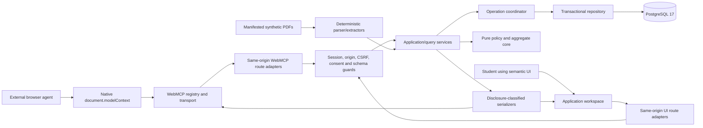
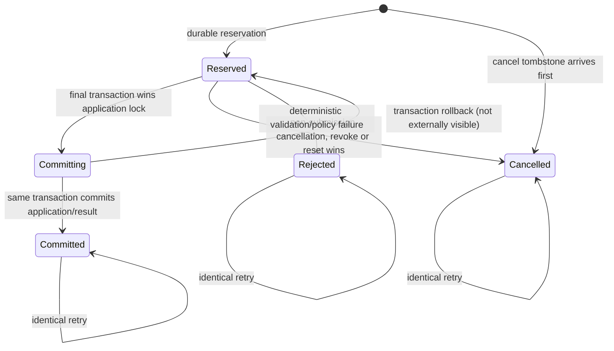

# CiteApply Technical Specification

Status: Failed and superseded; historical G3 design evidence only
Date: 2026-08-27
Product: CiteApply (working codename)
Upstream contract: historical first-pass `prd.md`; not an active implementation contract

> **Do not implement this specification.** G3 rejected it at 75,417 words, 23 HTTP/page surfaces, 15 tables, three portability spikes, and eight race families because it could not fit the quality window. Reopened G1/G2 use the bounded replacement `scope.md`; a new practical specification will replace this file only after the replacement PRD passes.

## Overview

CiteApply is one owned, synthetic education-aid portal. A student and an external browser agent collaborate in the same visible application. The page exposes a small imperative WebMCP contract; the server—not the agent—enforces field policy, evidence provenance, conflicts, optimistic concurrency, declarations, review binding, and submission idempotency.

```ts
const SYNTHETIC_BADGE_COPY_V1 =
  "Synthetic demo — not a real application" as const;
const SYNTHETIC_WARNING_COPY_V1 =
  "Do not enter real personal information or upload real documents." as const;

const LANDING_COPY_V1 = {
  heading: "CiteApply",
  program:
    "Fictional program: Horizon Education Aid — Need-Based Scholarship",
  badge: SYNTHETIC_BADGE_COPY_V1,
  warning: SYNTHETIC_WARNING_COPY_V1,
  explanation:
    "Explore a fictional scholarship application using fixed synthetic documents. CiteApply does not verify identity or document authenticity, decide eligibility, approve funding, or submit to a real program.",
  retention:
    "Demo access lasts up to 24 hours. Active application storage is removed within 48 hours after creation; provider backups and security logs follow the documented retention period.",
  retentionLink: "How this synthetic demo handles data",
  start: "Start synthetic demo",
} as const;

const WEBMCP_FALLBACK_COPY_V1 = {
  apiAbsent: {
    heading: "Assisted access isn’t available here",
    body:
      "This browser or client did not expose CiteApply’s tested WebMCP interface. You can complete the same application manually.",
    primaryAction: "Complete manually",
  },
  setupFailure: {
    status:
      "Assisted access could not start. Your application is unchanged. Complete it manually, or check the tested-client setup and retry.",
    primaryAction: "Complete manually",
    retryAction: "Retry assisted setup",
  },
  rollbackFailure: {
    status:
      "Assisted access could not be reset safely. Your saved application is unchanged. Complete it manually, or reload this page before trying assisted access again.",
    primaryAction: "Complete manually",
    reloadAction: "Reload private demo",
  },
  compatibility:
    "WebMCP compatibility is claimed only for the client/browser versions listed in Tested setup; other clients are unverified.",
} as const;

const PRIVATE_ACCESS_COPY_V1 = {
  serverEndPrefix: "Server access ends by ",
  serverEndSuffix:
    ". This page may close slightly earlier for safety. Save and finish before then.",
  warning30Prefix:
    "This synthetic demo has about 30 minutes of safe page access remaining. Save or discard unsaved changes and finish before ",
  warning5Prefix:
    "This synthetic demo has less than 5 minutes of safe page access remaining. Unsaved changes and access in this tab will end by ",
} as const;

const APPROVAL_EXPIRY_COPY_V1 = {
  warning:
    "Review confirmation expires soon. Submit now, or confirm the unchanged review again later.",
  expired:
    "Review confirmation expired. Your review is unchanged. Confirm it again to submit.",
} as const;
```

`SYNTHETIC_BADGE_COPY_V1` and `SYNTHETIC_WARNING_COPY_V1` are the only global identity/warning source. The landing renders `LANDING_COPY_V1` in that exact normal reading order before a session exists. Every private stage, Review, receipt screen, JSON documentation, print projection, and each source PDF visibly includes the badge; interactive screens also include the warning. Every PDF additionally retains the stronger `SYNTHETIC — NOT VALID` watermark. DOM/PDF-text/print tests reject omission, reordering where order is specified, or the retired combined sentence being used as a substitute; the program/explanation cannot imply identity verification, document authentication, eligibility, approval, funding, or a real submission.

The landing has no placeholder/dead navigation. `LANDING_COPY_V1.retentionLink` is a normal `<a href="#data-handling">` and the adjacent **Tested setup** link is `<a href="#tested-setup">`; both targets exist in the initial no-JavaScript HTML below the Start form. `<section id="data-handling" aria-labelledby="data-handling-title">` has heading **Data handling** and states, in order: this is a synthetic-only demo with fixed PDFs and no arbitrary upload; demo access is at most 24 hours; active application storage is automatically removed within 48 hours after creation; provider backups and security logs may remain only for the provider's documented retention period; CiteApply sends no analytics or advertising telemetry. `<section id="tested-setup" aria-labelledby="tested-setup-title">` has heading **Tested setup**, the exact four-lane matrix below, and the compatibility caveat. Its primary/secondary build cells render only a checked-in compatibility-evidence manifest; until a lane has passed its named gate, the cell says **Verification pending — complete manually**, never a guessed claim. The manual lane is always truthful.

Static/DOM/keyboard tests disable JavaScript, activate both links, require exact unique targets/headings/reading order and visible focus, scan for empty/`#`/missing local targets, and snapshot the 24-hour/48-hour/provider/no-telemetry text. A build fails if compatibility copy names a client/build not present in the reviewed evidence manifest or if an unverified lane loses its pending label.

The implementation is a secure modular monolith: one Next.js application, one same-origin HTTP surface, one pure TypeScript domain core, and one PostgreSQL database. Both the human UI and WebMCP adapters invoke the same application services and transaction coordinator. There is no in-product LLM, separate MCP server, browser extension, OCR service, queue, vector database, object store, or hidden agent-only draft.

The technical differentiator is the controlled commitment chain:

1. deterministic parsing turns only reviewed synthetic PDFs into source claims and exact anchors;
2. an external agent must compose claim-to-field bindings from separate requirements and evidence tools;
3. the portal rejects unsupported, conflicting, stale, cancelled, replayed, or inactive-field mutations atomically;
4. only visible UI actions may declare a value, resolve a conflict, confirm a review, or submit;
5. one immutable receipt is rendered from the exact accepted review snapshot.

This is a production-minded prototype, not a production scholarship system. It does not authenticate people or documents, decide eligibility, protect against an extension with privileged host access, support arbitrary uploads/sites, or provide cryptographic non-repudiation.

## Locked Architectural Decisions

| Decision | Choice | Reason |
|---|---|---|
| Deployment shape | One Node.js modular monolith | Keeps the visible UI, WebMCP lifecycle, authorization, and transactional policy in one auditable boundary. |
| State authority | Server and PostgreSQL | Browser state, WebMCP arguments, hidden inputs, and operation order are untrusted. |
| Domain model | Pure TypeScript aggregate plus explicit ports | The same deterministic reducer and policies serve human and agent paths and are independently testable. |
| Persistence | PostgreSQL 17, local/CI and hosted | Required for row locking, compare-and-swap updates, unique idempotency constraints, and real concurrency tests. |
| Production database | Neon PostgreSQL through its pooled connection URL | Fits a public Vercel deployment while preserving standard PostgreSQL transaction semantics. Provisioning remains unauthorized until Amit approves deployment. |
| Database client | Drizzle ORM with `node-postgres` on the Node runtime | Uses interactive transactions without depending on an HTTP-only transaction API; local, CI, and production use the same driver semantics. |
| Application storage | One versioned JSONB aggregate plus small authority/operation/submission tables | Preserves atomic invariants without inventing a table or event stream for each of ten fixed fields. |
| WebMCP integration | Raw `document.modelContext.registerTool(...)` behind a tiny adapter | It proves the actual emerging browser API and avoids coupling to another experimental React wrapper. |
| Tool result | Plain JSON-serializable object | This is the current registered callback contract. Expected failures are fulfilled typed results; only cancellation and unexpected faults reject. |
| PDF input | Six committed, text-native synthetic PDFs selected from an internal manifest | Proves real parsing while eliminating arbitrary paths, URLs, uploads, OCR, and document-bomb breadth. |
| AI | External browser agent only | CiteApply remains deterministic; the agent reasons over WebMCP results and never becomes the policy authority. |
| UI | Accessible semantic React form and CSS Modules | Ten fields do not justify a state/form/component framework. Native controls and narrowly tested dialog behavior keep the DOM legible to people and agents. |
| Realtime behavior | Same-request response plus a shared page state store; no WebSocket | A successful tool mutation updates the visible form before its callback resolves. Cross-request consistency comes from versions and refresh/reconciliation. |
| Receipt | Semantic HTML, JSON download, and print CSS from one immutable snapshot | Avoids a generated-PDF side quest and makes equality testable and accessible. |

Rejected as unjustified v1 complexity: microservices, CQRS/event sourcing, Redis, workflow engines, background workers, user accounts/OAuth, RBAC, general multitenancy, object storage, OCR, model extraction, embeddings, generated receipt PDFs, cross-origin tool exposure, an admin/policy builder, and a second portal.

## Stack And Version Policy

The resolved package versions below were checked against current primary documentation on 2026-08-27 and will be pinned in `package-lock.json` during the foundation gate. No floating ranges are permitted in the committed manifest. Immediately before installation, the checklist must re-read the official release/security notes, confirm these are still non-vulnerable compatible releases, record any reviewed patch-only change in `build-notes.md`, and run build/audit tests. Major/minor changes reopen G3.

| Layer | Locked choice | Version baseline | Notes |
|---|---|---:|---|
| Runtime | Node.js Active LTS | 24.20.0 locally; `24.x` host engine | The host currently defaults to Node 26.7.0; `.node-version`, CI, Docker, and Vercel must select Node 24 for parity. |
| Package manager | npm | 11.19.0 | Commit the lockfile; `packageManager` is `npm@11.19.0`; CI uses `npm ci`. |
| Web framework | Next.js App Router | 16.3.3 | Current security-patched Active LTS; Node runtime, Server Components for reads, thin Route Handlers for mutations/exports, Turbopack defaults. |
| UI runtime | React / React DOM | 19.2.8 | No experimental React WebMCP hook. |
| Language | TypeScript strict mode | 6.0.2 | TS 7 integration is not selected during this sprint; enable `strict` and `noUncheckedIndexedAccess`, with no build-error bypass. |
| Database | PostgreSQL | 17; local/CI image `postgres:17.11-alpine` | Production uses Neon PostgreSQL 17, not its PG18 preview, after authorization. |
| SQL mapping | `drizzle-orm`, `drizzle-kit`, `pg` | 0.45.2 / 0.31.10 / 8.23.0 | Avoid Drizzle v1 RC; checked-in SQL migrations; `drizzle-orm/node-postgres` interactive transactions. |
| Validation | Zod + checked-in bounded JSON duplicate-key scanner | 4.4.3 / internal v1 | Zod is the runtime shape source. A small shared scanner rejects duplicate decoded object keys before native `JSON.parse`; it is specified/tested below and adds no unreviewed parser dependency. |
| Canonical JSON | `canonicalize` + Node crypto | 4.0.0 | RFC 8785 serialization followed by SHA-256 for internal review identity; never described as a signature. |
| PDF parser | `pdf-parse` | 2.4.5 candidate | Blocking portability/anchor spike on Node 24, `next build`, Linux, and the eventual host. Pinned `pdfjs-dist` 6.2.108 plus `@napi-rs/canvas` is the reviewed fallback, not precomputed answers. |
| PDF fixture authoring | `pdf-lib` | 1.17.1, dev-only | Generates reviewed static fixtures; runtime never generates answers or receipts. |
| Styling | CSS Modules + global design tokens | built into Next 16.3.3 | Local Geist fonts; light, content-first interface; no Tailwind, remote styles, or remote scripts. |
| UI state/forms | React reducer + semantic HTML | React 19.2.8 | No Redux/Zustand/TanStack Query/React Hook Form/component kit. Dialog/focus behavior must pass the named manual assistive-tech matrix. |
| WebMCP types | `webmcp-types` | 0.1.3, dev-only | Types only. Production feature-detects the native API and does not polyfill it. |
| Unit/contract tests | Vitest + `fast-check` | 4.1.10 / 4.9.0, dev-only | Pure domain, serializer, parser, registry, reducer, and named invariant/property tests. React behavior stays in production-build Playwright rather than adding Testing Library. |
| Browser tests | `@playwright/test` + `@axe-core/playwright` | 1.62.1 / 4.13.0, dev-only | Production-build semantic UI flows, security headers, keyboard behavior, and accessibility scans. |
| Formatting/lint | ESLint flat config + Prettier | ESLint 9.39.5 / `eslint-config-next` 16.3.2 / Prettier 3.9.6 | Next's transitive React/import/JSX-a11y plugins currently declare ESLint 9, not 10. ESLint 10 is deferred until every installed peer supports it. Core Web Vitals/TypeScript/React/JSX accessibility rules; no ignored build/lint/peer errors. |
| Type declarations | `@types/node`, `@types/react`, `@types/react-dom`, `@types/pg` | 24.13.3 / 19.2.18 / 19.2.5 / 8.23.1, dev-only | Major versions match the locked Node 24 and React 19 runtimes. |
| TypeScript script runner | `tsx` | 4.23.12, dev-only | Used only for fixture/migration helper scripts; production handlers do not depend on it. |

Three P0 portability decisions must be proved before broad implementation:

- **WebMCP spike:** native registration, discovery, invocation, visible mutation, and cancellation in the exact primary external client. ChatGPT's desktop built-in browser is the intended primary lane; enabled Chrome is secondary. If the primary lane requires a hosted origin, deployment pauses for Amit's explicit authorization.
- **PDF spike:** generate and parse one real fixture, preserve stable page/character anchors, ignore instruction-like noise, and pass Node 24 local, production build, Linux container, and eventual hosted-runtime smoke tests. No parser is accepted merely because it works in a unit test.
- **Receipt streaming/fallback spike:** run the production-build cold/warm incremental raw-byte ordering and deadline barrier defined for `ReceiptView`. Either prove the complete head controller precedes every receipt/RSC value byte, or choose and prove the value-free shell plus authenticated fetch/custom non-RSC fallback before any receipt implementation. An unproved server-rendered receipt is a privacy no-go.

## Architecture



### Module boundaries

- **Presentation:** semantic pages and client state store. It renders authoritative DTOs, preserves dirty user input on stale responses, and never decides readiness.
- **WebMCP adapter:** registers the six fixed tools, owns native API lifecycle/cancellation, injects page-held capabilities outside agent schemas, calls same-origin handlers, applies returned UI state, and returns bounded tool DTOs.
- **HTTP adapters:** perform body-size checks, parse schemas, verify session/origin/CSRF/capability as applicable, map typed domain errors, and emit only allowlisted logs.
- **Application services:** orchestrate use cases, transactions, disclosure policy, idempotency, operation reconciliation, and DTO creation.
- **Domain core:** immutable aggregate transitions, field policies, parsing claim rules, branch activation, validation, conflicts, declarations, review canonicalization, and receipt equality. It imports no React, Next.js, database, clock, random, or network module.
- **Infrastructure:** PostgreSQL repositories/migrations, clock/ID/token/hash implementations, fixture reader/parser, security headers, and allowlisted logger.

The dependency direction points inward: adapters depend on application ports; application services depend on the domain; infrastructure implements ports. UI and WebMCP code never import database schema modules directly.

### Runtime and caching rules

- All application, parser, WebMCP, and receipt routes run on the Node runtime. Edge runtime is prohibited for this slice.
- The public landing route is dynamic Node rendering: a valid active/submitted session redirects without minting, while every admitted token-bearing GET mints a fresh one-use start token and mutates only its bounded fixed-global rate accounting. It explicitly opts out of Next full-route/prerender caching and emits `Cache-Control: private, no-store`; neither a build artifact nor a CDN response may contain a reusable start token.
- Private pages and every state/API response use `Cache-Control: private, no-store`. Next fetch caching is not used for application state.
- Static fonts, icons, and the conspicuously synthetic PDF assets may use content-hashed immutable caching.
- No application values enter URLs, query strings, route segments, analytics, page titles, metadata, or browser storage.
- A small module-scoped PostgreSQL pool may be reused inside one warm Node process; its size, timeouts, and Neon pooled URL are explicit configuration. Transactions never span a response.

## Trust Boundaries

| Boundary | Untrusted material | Enforcement |
|---|---|---|
| External agent to native tool callback | Tool choice, order, arguments, request IDs, inferred values, cancellation timing | Fixed schemas plus mandatory server validation, consent, version checks, idempotency, policy evaluation, and atomic commit. Discovery is never authorization. |
| Browser UI to server | Hidden inputs, client validation, URLs, claimed gestures, stale page state | Session scope, exact origin/host, synchronizer CSRF token, strict schemas, expected version, and server recomputation. |
| Page-held capabilities to server | Stolen, expired, replayed, wrong-tab, old-epoch tokens | Random 256-bit tokens, keyed-digest-only persistence, durable page-generation/application/draft-epoch binding, short expiry, one-use where relevant, current-state recheck. |
| Server to PostgreSQL | Cross-session IDs, transaction races, malformed aggregate payloads | Session-scoped predicates, foreign/unique/check constraints, row locks, compare-and-swap, JSON schema version validation. |
| Fixture bytes to parser/domain | Malformed PDF structure, misleading/instruction-like text, duplicate/missing labels | Internal manifest, hash/size/page/text limits, no external fetch, deterministic label extractors, output schemas, quoted text-only rendering. |
| Application to logs/hosting | Bodies, cookies, tokens, values, snippets, stack traces | Allowlisted structured logger, body-free routes/URLs, safe reference IDs, test sink assertions, no third-party analytics or replay. |
| Visible DOM to privileged extension/client | Any content already rendered and browser actions | Explicitly outside the WebMCP consent guarantee. Product copy states that CiteApply controls its structured tool outputs, not separate host/browser permissions. |

## File Structure

```text
.
├── AGENTS.md
├── LICENSE
├── .devpost-hackathon-state.json
├── .github/
│   └── workflows/ci.yml
├── docs/
│   ├── architecture/
│   │   ├── adr/
│   │   ├── data-retention.md
│   │   ├── threat-model.md
│   │   └── webmcp-contract.md
│   ├── evidence/
│   │   └── scenario-outcomes.md
│   └── hackathon-build/
│       ├── scope.md
│       ├── prd.md
│       ├── spec.md
│       ├── checklist.md
│       ├── status.md
│       ├── build-notes.md
│       └── reviews/
├── fixtures/
│   ├── manifest.ts
│   └── goldens/
├── public/
│   └── synthetic-pdfs/{supported-v1,conflict-v1}/
├── scripts/
│   ├── generate-fixtures.ts
│   ├── verify-fixtures.ts
│   └── cleanup-expired.ts
├── migrations/
├── src/
│   ├── app/
│   │   ├── api/
│   │   │   ├── demo/start/route.ts
│   │   │   ├── application/{commands,source}/route.ts
│   │   │   ├── consent/route.ts
│   │   │   ├── page-session/route.ts
│   │   │   ├── review/{confirm,cancel}/route.ts
│   │   │   ├── submission/{reconciliation,intent,commit,status}/route.ts
│   │   │   ├── internal/cleanup/route.ts
│   │   │   ├── receipt/route.ts
│   │   │   └── webmcp/{state,requirements,evidence,apply,issues,review,cancel}/route.ts
│   │   ├── application/page.tsx
│   │   ├── receipt/page.tsx
│   │   ├── error.tsx
│   │   ├── global-error.tsx
│   │   ├── layout.tsx
│   │   └── page.tsx
│   ├── components/
│   │   ├── application/
│   │   ├── evidence/
│   │   ├── review/
│   │   ├── receipt/
│   │   └── ui/
│   ├── features/
│   │   ├── application/
│   │   │   ├── domain/
│   │   │   ├── services/
│   │   │   ├── ports/
│   │   │   └── dto/
│   │   ├── evidence/{domain,parser,parser-worker}/
│   │   ├── review/
│   │   ├── retention/
│   │   └── submission/
│   ├── infrastructure/
│   │   ├── db/{client,repositories,schema}/
│   │   ├── security/
│   │   ├── observability/
│   │   └── fixtures/
│   ├── webmcp/{contracts,registry,transport,types}/
│   └── test-support/
├── tests/
│   ├── unit/
│   ├── integration/
│   ├── contract/
│   ├── security/
│   ├── accessibility/
│   ├── e2e/
│   └── external-client/
├── compose.yaml
├── drizzle.config.ts
├── next.config.ts
├── proxy.ts
├── package.json
├── package-lock.json
└── README.md
```

`LICENSE` is a required planned top-level artifact, but this specification does not choose or create it. G4 must schedule an explicit Amit decision among eligible OSI-compatible licenses, with no inferred default; G6 cannot pass and no public repository push may occur until Amit has ratified the exact text and the top-level file plus repository-page detection have been verified. `test-support` contains injected clocks, IDs, barriers, repositories, and a standards-shaped native API fake. It is excluded from production entry points. There is no public test-only route and no alternate answer map.

## Domain And Persistence Model

### Version vocabulary

- `draftEpoch` is a random UUID created with the draft and rotated whenever an unsubmitted draft is destructively reset or its packet is replaced. It is a public concurrency coordinate, not a secret. Every request and response that can mutate, authorize, parse, reconcile, or replace UI state carries the caller's exact epoch. Every claim handle, cursor, consent grant, protected execution, operation, review, approval, and parser attempt is epoch-bound.
- `applicationVersion` is the optimistic-concurrency version for readiness-relevant content or the separately represented review-notice policy. It begins at 0 and increments exactly once for packet setup, each terminal parsed/failed document result, field/binding edits, branch clearing, declarations, conflict resolutions, and the one explicit v1→v2 review-notice policy-bundle migration. Merely claiming or recovering a parser lease or performing a same-version redeploy does not change it.
- `stateRevision` increments for persisted non-content workflow changes such as `pending -> parsing`, parser lease recovery, the first server-authorized release of a new tool-disclosure class, review preparation/invalidation, application-wide approval creation/replacement/removal, and submission-operation state. It prevents UI cache ambiguity. Cardinality is transaction-scoped: an application-row transaction that commits one or more workflow changes increments `stateRevision` **exactly once**, even when that transaction also invalidates a review, revokes approvals, records multiple newly released disclosure classes, replaces the approval singleton, or advances submission generation; a transaction with no workflow change does not increment it. `applicationVersion` retains its independent content-mutation rule, so one transaction may increment both coordinates once. Content mutations such as evidence apply do not use `stateRevision` as a precondition; review preparation and the visible Return-to-edit command require the caller's exact current revision because they change review/workflow state without necessarily changing content.
- `submissionGeneration` is a nonnegative safe integer initialized to 0 and monotonically advanced under the application lock whenever an intent is reserved or one of the closed non-submission terminalizers proves/fences no submission: `/api/submission/status` (also used by `check_pending`), page bootstrap's status-equivalent pending-intent recovery, or current-page approval cancel. Those terminalizers call the same coordinator and generation-CAS implementation; no ordinary command/error may advance it. Commit consumes the already-reserved successor generation without another increment. Every intent/reconciliation tuple is bound to its captured predecessor generation, so one tab cannot re-enable Submit while a delayed intent from another tab can still acquire authority. It resets only with a new `draftEpoch`.
- `csrfEpoch` is a random page-request epoch bound into the synchronizer token. Reset and packet replacement rotate it with `draftEpoch`; old pages cannot authorize commands in the new draft.
- `evidenceBundleVersion`, `policyBundleVersion`, `policyVersion`, `packetVersion`, `parserVersion`, `declarationPolicyVersion`, and `reviewNoticeVersion` are immutable version strings. `evidenceBundleVersion` identifies the reviewed packet-manifest/parser/extractor registry entry pinned for one draft epoch. `policyBundleVersion` is exactly one key of `POLICY_BUNDLE_REGISTRY_V1`; both checked-in entries retain identical `horizon_aid_fields_v1`, declaration-v1, and conflict-v1 semantics and differ only in the represented review-notice version/text. The exact component versions and notice remain recorded in reviews and receipts.
- A prepared review is valid only for one `draftEpoch`, `applicationVersion`, evidence/policy set, and canonical hash.

The server never substitutes the database's current epoch for a caller-supplied epoch. UI commands, parser claim/finalize calls, page bootstrap, consent grant/revoke, source reads, review confirmation, submission intent/commit/status, and WebMCP protected calls all prove `expectedDraftEpoch`. SQL mutations predicate on `(session_id, application_id, draft_epoch)` plus `expectedApplicationVersion` where content is involved. Every authoritative **UI or submission-protocol** snapshot includes `(draftEpoch, applicationVersion, stateRevision, submissionGeneration)`. Within one epoch the UI reducer accepts a snapshot only when all three numeric coordinates are componentwise nondecreasing from the last accepted snapshot; an identical triple is an idempotent no-op, and any lower coordinate is discarded while dirty inputs remain. Consented agent DTOs deliberately expose only epoch/application version/state revision, which is sufficient for apply/prepare and reveals no submission-attempt counter; public DTOs expose none. Every generation advance also advances `stateRevision`. A successful reset/replacement acknowledgement carries predecessor `replacesDraftEpoch` plus a successor epoch hint but no snapshot/page authority: only when the predecessor equals the reducer's current epoch does it clear old dirty/reconciliation/authority state and enter loading. A subsequent successful page install may carry the same predecessor and is the **only** event that adopts the authoritative successor snapshot/page authority. A page install discovering another tab's replacement follows that same predecessor check. The reducer announces the replacement and drops every later old-epoch response.

### Application aggregate

`ApplicationAggregate` is a schema-versioned JSON object stored with searchable relational columns. It contains only the mutable state of this fixed portal:

- selected packet and references to per-document `pending | parsing | parsed | failed` records; parsing records carry a lease/attempt ID but never a partially accepted claim;
- the ten fixed field entries and their `empty | unbound | claim_bound | proposed | declared` binding kind;
- derived active branch, validation/status codes, corroboration, conflict history, and human resolutions;
- declaration records tied to exact field/value/creation version/session/policy;
- current review reference or one closed invalidation reason (`content_changed | review_notice_changed | returned_to_editing`); the machine reason is persisted until a new review is successfully prepared or the epoch is reset, and is never inferred from browser history;
- lifecycle and expiry metadata.

The current epoch retains at most 12 immutable conflict-resolution entries. A thirteenth distinct resolution is rejected before mutation with the UI-command code `history_limit_reached`; the visible recovery is the same explicit destructive reset/new-packet action used for a closed operation ledger. An identical idempotent replay does not add an entry. The aggregate's canonical UTF-8 JSON is capped at 128 KiB by both application schema and a database `octet_length` check; a command that would exceed it is rejected atomically with UI-command code `application_size_limit_reached` and the same visible reset recovery. A tool-reachable size/review ceiling projects only the closed nonretryable `resource_limit_reached` + `reset_draft_in_visible_ui`; the human UI retains the exact local cause. Neither ceiling permits partial history truncation.

The aggregate boundary fixture constructs prospective canonical application JSON of exactly 131,072 UTF-8 bytes and proves a human command and WebMCP apply can each commit it when otherwise valid. Its one-byte-larger sibling must leave aggregate/version/review/approval/disclosure/event state unchanged; only the already-admitted durable operation becomes terminal `rejected`, with UI `application_size_limit_reached` or agent-safe `resource_limit_reached` as appropriate. No field/history/member is partially written or truncated, the database check independently rejects a serializer bypass in the same rolled-back transaction, and an exact request replay returns the same terminal classification without another event/version increment.

```ts
type UiResourceLimitCode =
  | "history_limit_reached"
  | "application_size_limit_reached"
  | "review_limit_reached";
```

Every UI occurrence pairs that exact code with the one visible destructive-reset action; tools receive only the generic mapping above. Boundary-plus-one fixtures snapshot both projections.

Immutable evidence/pages, exact review snapshots, and irreversible records remain relational. The aggregate is parsed from storage with its Zod schema before use. Domain functions never mutate it in place. Every accepted command returns a new validated aggregate and typed result. Derived readiness, active fields, statuses, and conflicts are recomputed from the aggregate plus current immutable claims after every content mutation; callers cannot submit them as authoritative input.

### PostgreSQL tables

`TERMINAL_AUTHORITY_SAFETY` is exactly ten minutes. For ordinary in-session cleanup, a nonce/page/grant/approval/execution row is not eligible before its original `expires_at + INTERVAL '10 minutes'`, even if revoked or terminal earlier; preserving the keyed tombstone through the complete raw-token lifetime prevents replay ambiguity. Full session expiry or destructive epoch reset may delete the graph earlier only after locking, terminalizing, and clearing every live child, because the session/epoch predicate already makes all raw tokens unusable.

| Table | Purpose and key constraints |
|---|---|
| `one_time_nonces` | One-use keyed digest, closed purpose (`demo_start | page_bootstrap`), and issue/use/expiry times, with unique `(purpose, nonce_digest)`. Landing tokens carry a random signed ten-minute nonce and no session/application data. Private page-bootstrap tokens carry a separate random signed two-minute nonce plus keyed session/application/epoch bindings. The row stores no raw token/binding/value and ordinary cleanup removes it only at `expires_at + TERMINAL_AUTHORITY_SAFETY`. Every insert and prune transaction first takes one checked-in fixed PostgreSQL transaction-level advisory-lock key. Before recount/insert, the consumer locks expiry-ordered candidates and deletes up to 512 using its own post-lock database time, then uses a fresh immediately-pre-insert database time for token expiry; this safely enforces a hard 2,048-row ceiling at `READ COMMITTED` without a second table or repairable counter. Only a still-full noneligible table fails closed without consuming or creating page/application authority. |
| `demo_sessions` | Domain-separated keyed digest of a random opaque session token, created/expiry time, and current application relationship. One active session row per cookie. No name, email, IP, or identity claim. |
| `applications` | One row per demo session; server-generated public `DisplayApplicationIdV1`, `evidence_bundle_version` pinned for the current draft epoch, `policy_bundle_version` changed only by the explicit compatible-policy migration below, random `draft_epoch`/`csrf_epoch`, `content_version`, `state_revision`, monotonic `submission_generation`, a six-bit `tool_disclosure_mask`, next value-free activity ordinal, lifecycle, optional pending-submission operation, operation-admission closure flag, schema-versioned aggregate, timestamps, and expiry. The mask records actual server-authorized WebMCP result classes for the current epoch and survives grant pruning; it resets only with the epoch. Canonical aggregate JSON is at most 128 KiB and conflict history at most 12 entries. Unique session/display ID and `(id, draft_epoch)`; checks on the exact ASCII display-ID pattern/octet length, versions/generation/mask/lifecycle/ordinals/size. |
| `page_instances` | Durable lineage fence: session/application/epoch, domain-separated keyed lineage digest, keyed current in-memory document-instance digest, monotonically increasing server page generation, current server-created page-instance UUID/digest, one monotonic page install/renew request fence, and one common monotonic authority-action fence used by consent grant/revoke and review confirm/cancel, plus issue/renew/expiry/revoke times. Unique `(application_id, draft_epoch, lineage_digest)` and current page instance. Same-document install/renew accepts only a request generation greater than the stored page-request fence; a different document-instance digest is an explicit cloned-lineage takeover and resets both per-document fences. Every authority action accepts/stores only a generation greater than the common fence, including a revoke/cancel that finds no current capability. Renewal advances the same lineage row; a missed-expiry recovery creates a fresh lineage. Each accepted install/renew returns a fresh stateless encrypted-and-MACed recovery-only proof bound to the exact session/application/epoch/lineage/page UUID/generation/document digest and application/session expiry; no proof is stored in this table. The table stores no raw document nonce, recovery proof, CSRF token, or application value. At most 192 rows are retained per application; ordinary expired/revoked rows are eligible only at `expires_at + TERMINAL_AUTHORITY_SAFETY`, while destructive epoch reset deletes them after child cancellation. |
| `application_documents` | Manifest identity, application/epoch, pinned evidence-bundle version, kind/class/hash, `pending | parsing | parsed | failed`, active and last-finalized attempt UUID/outcome, active parser-operation FK plus exact prior document state/failure needed for cancellation, active-attempt evidence-bundle version, attempt count, lease expiry, bounded failure code, and timestamps. Unique manifest document per epoch and a partial unique index allowing one `parsing` row per application/epoch. The active operation/attempt fields are cleared together on finalize/cancel; no request body or raw digest is stored here. |
| `document_pages` | The sole authoritative canonical page text and its hash for human source inspection; composite FK to the current document and unique page number. At most three pages/document, nine/application, 64 KiB canonical UTF-8 text/document, and 192 KiB/application. Never included in logs or tool output. |
| `claims` | Immutable normalized typed value, evidence class/type, parser signal, page/start/end, quote hash, document hash, and parser/extractor versions. It does not duplicate quote/context; the UI reconstructs the exact span from `document_pages` and verifies the hash. At most 16/document and 48/application. Composite FK chain to application/document/epoch. |
| `consent_grants` | Keyed digest of a page-memory capability, session/application/epoch, page-instance FK/generation, keyed tab-lineage digest, issue/expiry/revoke times, monotonically assigned local grant epoch, and the current fixed-minute protected-read window/count. The counter is charged in the short application → page → grant preflight before the protected global bucket and is never charged again by execution reservation, so rotating grants cannot create unbounded rate-subject rows. No raw token or exposed value. Ordinary revoked/expired rows retain only scrubbed authority metadata and are eligible only at `expires_at + TERMINAL_AUTHORITY_SAFETY`; destructive epoch reset deletes them after cancellation. |
| `protected_executions` | Server-created execution UUID, session/application/epoch/page generation/grant/tool, `reserved | disclosure_authorized | cancelled | rejected`, a 15-second execution expiry, and bounded timestamps/codes. It stores no protected response body or other result value. Unique per grant/execution UUID; a terminal row is ordinarily eligible only at `execution_expires_at + TERMINAL_AUTHORITY_SAFETY`. |
| `operations` | Mutation/review/parser/submission idempotency and cancellation ledger: application/epoch/kind/request UUID, captured `policy_bundle_version`, domain-separated HMAC operation digest, a separately domain-separated keyed `origin_page_binding_digest`, authority references, optional parser-document FK, `reserved | committing | committed | cancelled | rejected`, bounded value-free result metadata, resulting versions, and timestamps. The origin digest commits to the exact session/application/epoch/lineage/page UUID/generation that admitted the operation and remains after a terminal page FK is cleared, until operation/session/epoch cleanup. It never stores the raw canonical request, browser SHA-256 digest, lineage/page tuple, review hash, field value, reason, email, or claim value. Unique `(application_id, draft_epoch, kind, request_id)`. Every finalizer requires the captured policy bundle still equal the locked application; migration cancels reserved old-policy work. Parser operations bind only the manifest document identity and terminal parsed/failed/cancelled metadata; no extracted value/page text enters the ledger. A live/committed submission operation also stores its captured predecessor `submission_generation`, an approval FK, a keyed/domain-separated review-binding digest, a separate intent-ack HMAC/expiry/consume time, and intent expiry; cancellation/rejection/reset clears those bindings and capability digest. |
| `application_events` | Bounded valueless visible activity: application/epoch activity ordinal allocated under the application lock, event code, operation kind/state, affected-field count, application version, and time. At most one row per committed operation and 1,024/current epoch. Unique `(application_id, draft_epoch, activity_ordinal)`. No free-form request or response data. |
| `reviews` | Immutable canonical review snapshot, RFC 8785 hash, exact application/policy versions, prepare operation, validity/invalidation time. Canonical `ReviewCoreV1` is at most 48 KiB UTF-8; at most 64 rows/current epoch. Every row remains until epoch/session deletion so an exact historical committed prepare can be classified without rerunning domain work; its `reviewId`/hash may be returned only while that review is still current and valid, otherwise replay returns the closed stale/submitted outcome with no historical review values. Reviews are never ordinarily pruned. A sixty-fifth distinct preparation fails visibly with `review_limit_reached`; destructive reset is the safe recovery. Full diff is human-UI-only. |
| `approvals` | Domain-separated keyed digest of a one-use page-memory approval capability; while active, origin page-instance FK/generation/authority-generation, session/application/epoch, and exact review ID/hash/version/policy set; expiry, revoke/reserve/consume times. A durable submission intent may reserve it once. A partial unique constraint permits at most one unreserved active approval per application/epoch/current review, application-wide; at most 128 terminal/active rows are retained. A fresh Confirm locks and scrubs the prior singleton before creating its replacement, so only the newest raw token can submit. On ordinary revoke, content invalidation, expiry, replacement, or successful consumption, the transaction first resolves any reserved submission and then nulls page/review/hash/version/policy bindings, retaining only keyed token digest, session/application/epoch, terminal times/code. An unreferenced row becomes prune-eligible at `expires_at + TERMINAL_AUTHORITY_SAFETY`; the sole approval referenced by a committed submission remains until session cleanup. Destructive epoch reset performs the same scrub then deletes the row. Cancelling only a submission intent may release an otherwise-current approval. Unique token digest, singleton-active constraint, approval, and successful consumption. |
| `submissions` | One immutable accepted review core of at most 48 KiB plus its bounded acceptance envelope; canonical `ReceiptRecordV1` is at most 52 KiB UTF-8. Unique application, submission operation, request ID, and approval. Exact review hash/version and submitted time. No mutable receipt table. |
| `request_buckets` | Atomic fixed-window counters plus fixed cleanup-health minute markers. A dynamic row is keyed only by `(server_resolved_session_application_subject, window_width)` and stores the current fixed-window start plus closed, fixed integer counter columns; crossing a window atomically reuses that row instead of appending one row/activity/window. Grant-local read counters live in the already-bounded grant row. Migrations preseed immutable `dynamic_partition_guard`, `health_partition_guard`, and `health_epoch` fixed rows. A first dynamic-subject insert locks the dynamic guard before prune/count/insert; cleanup takes the same guard before delete. Health-marker insert/delete analogously locks the health guard. Fixed-global scopes, including guards, reserve at most 64 named rows; dynamic subject rows have a hard 2,048-row partition ceiling and health markers a hard 128-row retained ceiling. No attacker-supplied cookie/capability bytes or client IP/proxy header can create a distinct key. Dynamic rows become eligible at their last fixed-window end; health markers older than two hours are eligible. |

Exactly 25 fixed rows are seeded and no runtime path may invent another fixed scope: the three guard/epoch rows; five counters for `landing_issue_hour`, `new_session_hour`, `private_page_issue_minute`, `page_bootstrap_consume_minute`, and `cleanup_hour`; nine authenticated aggregate counters for `private_page_global_ten_seconds`, `public_tool_global_ten_seconds`, `protected_tool_global_ten_seconds`, `source_global_ten_seconds`, `domain_write_global_ten_seconds`, `parser_global_minute`, `submission_write_global_minute`, `submission_status_global_ten_seconds`, and `receipt_global_ten_seconds`; and eight invalid-auth class counters for start, page, ordinary UI, consent/review, public-tool, protected-tool, submission, and receipt traffic. The 64-row constraint leaves migration reserve but is not an open-ended namespace; changing the enum/count reopens capacity review.

All protected child queries include session, application, and the caller's exact epoch in the SQL predicate or join. Content-bearing tables use composite epoch-aware keys. While ordinary terminal authority/tombstone rows remain for their bounded safety/idempotency lifetime, they reference stable `application_id` plus their exact epoch so no rotation can reactivate them; destructive reset cancels/scrubs and deletes the entire old-epoch graph in one transaction. An opaque entity ID is never fetched alone and authorized afterward. Wrong-session, nonexistent, expired, old-epoch, and forged-handle cases share a non-enumerating external error.

Ownership is singular: `document_pages.text` owns source text; `claims` owns normalized values and anchor coordinates/hash; the application aggregate owns mutable field/binding/declaration/resolution state; `reviews.review_core` owns an immutable prepared record; `submissions.review_core` is the immutable accepted copy; operations/events own only value-free coordination metadata, including keyed one-way digests. Reset cancels/scrubs and then deletes the entire old-epoch child graph—claims, pages, documents, reviews, events, page instances, grants, approvals, executions, and operations—in FK-safe order before rotating the epoch. The locked epoch predicate, not a retained tombstone, rejects every delayed old request. Submitted rows are never reset.

Authority/coordination foreign keys are `RESTRICT`, never cascading authority deletion. While a child is live, its grant/approval/page foreign key is non-null by status constraint. Every scheduled or inline authority prune uses one graph-ordered helper. With the application already locked, it first performs only nonlocking indexed discovery of the bounded parent candidates and every page/grant/approval/operation/execution that can reference them; it then locks all discovered pages in lineage/UUID order, grants by primary key, approvals by primary key, operations by `(kind, request_id)`, and protected executions by UUID. Only after that complete lock set is held may it terminalize children, verify that every affected operation already holds its immutable `origin_page_binding_digest`, clear protected execution → grant and terminal operation → grant/approval/page references, scrub and clear grant/approval → page/review references, and delete the eligible parent batch. It never discovers and locks a new higher-order parent after locking a child, and a changed candidate is skipped for the next bounded pass. The origin digest is not an authority FK and survives only with the already-bounded operation row, allowing a later proof-bearing retired-page reconciliation to correlate without retaining the page row. A committed submission retains the one consumed approval row until the application/session graph expires; its immutable accepted review is owned by `submissions`, not reconstructed from that approval. Reset/session deletion performs the same terminalize-and-clear sequence before FK-safe deletion. Thus pruning a page, grant, or approval can neither delete active work nor strand a nullable live authority, and no `ON DELETE CASCADE` can create a hidden cancellation outcome.

Static, reviewed TypeScript/JSON assets—not mutable database tables—hold field policies, packet manifests, expected PDF hashes, parser/extractor versions, and golden claims/anchors.

### Relational transaction contract

All concurrency proofs use real PostgreSQL 17 at `READ COMMITTED`; no in-memory mutex is authoritative. Two coordination tables are deliberately outside the application lock graph:

- each ordinary `request_buckets` increment/check is a committed single-table preflight transaction before application work. A dynamic subject has one reusable row per supported width, and the transaction atomically rolls its closed counter columns to the database-derived current fixed window; it never appends a row per activity or window. Updating an existing subject locks only that row. Creating a distinct subject locks the preseeded dynamic-partition guard, prunes eligible rows, recounts under that guard, and inserts only below 2,048; cleanup uses the same guard, so concurrent distinct first inserts cannot pass one stale count. Health-marker insert/delete uses the separate health guard and rejects marker 129. Guard order is fixed `dynamic → health` whenever maintenance needs both. The same PostgreSQL `clock_timestamp()` derives the fixed window or unique cleanup-health minute; process time cannot choose either. No bucket transaction holds or waits for a session/application/authority row. A later rejected request still consumes the budget, intentionally. The grant-local 30/minute counter is the sole exception to the standalone `request_buckets` table: it is charged once in its own short application → page → grant transaction after the reusable subject bucket and before the protected global bucket, then the later execution reservation revalidates authority/capacity without charging it again. The narrowly defined authority-reduction fallback below may run only after a failed control preflight; it never holds a bucket lock while touching application rows;
- demo start performs the nonlocking valid-cookie classification described below before selecting its bucket. The valid-session resume branch uses a keyed per-session budget and a start-only transaction ordered `one_time_nonces` purpose/digest insert/unique consume → exact demo_session → exact application`; the missing/invalid/expired-cookie branch uses cleanup health plus the fixed new-session budget and the same nonce-first order before inserting a new session/application. Both nonce branches query `clock_timestamp()` immediately after locking/inserting the nonce key and require the signed nonce expiry still in the future. A branch never falls through to the other if cookie state changes after classification;
- page bootstrap validates its private signed token/session/application/epoch bindings, consumes the private-page per-subject bucket, then the `private_page_global_ten_seconds` and separate fixed-global 120/minute bootstrap-consumption budgets in isolated transactions, then consumes its `one_time_nonces` purpose/digest in an isolated committed transaction over that table. The transaction takes the fixed nonce advisory lock, locks up to 512 expiry-ordered candidates, reads a cleanup `clock_timestamp()`, deletes those satisfying expiry-plus-safety, and recounts. It then reads a fresh final `clock_timestamp()` immediately before requiring the presented token unexpired and attempting the unique insert only below 2,048; rollback removes a late/duplicate insert. The two database instants authorize two different transitions—prune and token consume—and neither is reused across intervening work. Only then does it begin the normal session → application → page transaction. A consumed nonce plus failed/ambiguous bootstrap grants nothing; the dirty page obtains another token and reconciles. Demo start reuses only this advisory-lock, bounded-prune, recount, fresh-consume-clock, unique-insert, and 2,048-ceiling **subprotocol inside its one exceptional nonce → exact session → exact application transaction**; it does not reuse page bootstrap's isolated transaction boundary. Thus a failed start transaction rolls back its nonce insert, while a committed start atomically consumes the nonce with the resume or new-session outcome. No ordinary application transaction locks `one_time_nonces`. Scheduled nonce cleanup takes the same advisory lock, while bucket cleanup runs as a separate isolated transaction; both precede session cleanup.

For every session/application-scoped budget the exact preflight is: pure envelope checks → non-locking indexed credential lookup that resolves the one internal session/application rate subject and releases the connection/holds no row lock → isolated bucket transaction keyed from that internal subject → isolated applicable fixed-global authenticated-family bucket → authoritative application transaction that locks and revalidates session, expiry, epoch, and capability. Bucket steps never share a transaction or held row lock, so their fixed order cannot invert application locks; a later global failure may conservatively consume the already-admitted subject count. A forged/expired cookie or capability creates no authenticated-family/per-token bucket row; it may increment only one fixed global invalid-auth counter in the reserved row for that route class. Protected reads additionally charge the grant-local fixed-window counter in a short preflight transaction ordered application → page → grant, after the application/session subject bucket and before the protected global bucket; it inserts no execution and returns no data. The later authoritative reservation revalidates the same grant/page/epoch and does not charge that grant window a second time. A revoke/cancel or exact status reduction fallback is available only after lookup resolved the valid owned subject. The time-of-check gap grants no authority because the final locked transaction repeats every authority check.

Every other transaction that locks more than one row uses only this order:

1. `demo_sessions`;
2. `applications`;
3. `page_instances` by lineage digest;
4. `consent_grants`, then `approvals`, each by primary key;
5. `operations` in `(kind, request_id)` order, then `protected_executions` in execution-UUID order;
6. reviews/submissions/events/documents/pages/claims.

A route may inspect an operation's authority foreign key after the application lock but must lock the caller's page instance and then that authority before locking the operation. Every browser-authorized mutation, protected read, consent action, and confirmation locks/validates the current page generation; an old stateless CSRF proof alone is insufficient. One checked-out `pg` client performs the whole transaction. Mutations use `applications FOR UPDATE`. A protected data-query transaction may use application/page/grant `FOR SHARE`, but both short protected-read reservation and final-disclosure transactions use application `FOR UPDATE`; reservation also uses page/grant `FOR UPDATE`, while final disclosure uses page/grant `FOR SHARE` and locks its execution row. The exclusive application lock makes a first new disclosure class linearizable with review invalidation/confirmation; no protected response body is stored. Reset/revoke/cleanup take the stronger locks. PostgreSQL `lock_timeout` is one second and the ordinary transaction/statement budget is three seconds. Timeout before a write is a typed retry; an ambiguous state-changing result is reconciled, never blindly replayed.

`authoritativeNow` has one exact meaning for each expiry-dependent transition: on the same checked-out client, execute a fresh `SELECT clock_timestamp()` **after every row relevant to that decision is locked and immediately before its compare-and-swap or authorization decision**. A transaction with two genuinely separate transitions, such as opportunistic nonce prune followed by token consume, uses two named instants and never reuses the earlier one across intervening work. The isolated bucket transaction uses its one database instant to derive the fixed window/health minute and atomically increment/insert. Production SQL must not use `now()`, `CURRENT_TIMESTAMP`, `transaction_timestamp()`, an application-process clock, or a timestamp captured at transaction start for nonce, rate/health window, session, page, grant, approval, execution, parser lease, intent, reconciliation, receipt release, or cleanup expiry. Work that can consume meaningful time—especially protected/receipt rebuilding and serialization or commit capability hashing—happens before the applicable final clock read, while locks remain held. Client time may schedule a renewal/clearing display only and grants no authority. Unit tests inject an equivalent clock at the repository seam; real-PostgreSQL tests cross exact nonce/bucket/authority boundaries and a static SQL audit rejects forbidden transaction-time aliases and server-side `Date.now()` authority decisions.

#### Two-phase state-changing operations

`apply_evidence_backed_answers`, review preparation, cancellable UI commands (including parser actions), and submission coordination use a durable operation. The browser computes `clientRequestDigest = SHA-256(RFC8785(canonicalSemanticRequest))` over the complete validated semantic request, including a domain/version tag, `expectedDraftEpoch`, expected version, request ID, and ordered changes, but excluding raw authority tokens. Review preparation and Return to edit additionally bind their required `expectedStateRevision`; no adapter may inject a newer revision than the caller supplied. It sends that 32-byte digest as fixed lowercase hex in a transport header outside the agent schema and retains it only in current-page memory for cancel/reconcile. The server independently reconstructs the canonical request and rejects a mismatch. It stores only `operationDigest = HMAC-SHA-256(OPERATION_DIGEST_KEY, "citeapply-operation-v1\0" || operationKind || "\0" || decodedClientRequestDigest)`. Neither digest nor canonical bytes are logged; the raw client digest is never persisted except for the separately bounded submission reconciliation tuple described below. Parser actions use this common admission/origin/replay ledger but replace the ordinary Phase 2 below with the parser-specific claim/lease/finalize protocol; they never run both finalizers.

At the same admission point the server stores one immutable origin commitment. `originPageBindingDigest = HMAC-SHA-256(OPERATION_ORIGIN_KEY, UTF8(RFC8785({ schemaVersion: "citeapply-operation-origin.v1", sessionId, applicationId, draftEpoch, lineageDigest, pageInstanceId, pageGeneration, operationKind, requestId })))`, where UUIDs are canonical lowercase, `pageGeneration` is a nonnegative safe integer, and `lineageDigest = HMAC-SHA-256(TOKEN_HASH_KEY, "citeapply-page-lineage-v1\0" || decodedLineageId)` encoded as 64 lowercase hex. Exact field names and RFC 8785 ordering are normative; there is no delimiter/parser ambiguity. Phase 1 derives this only from the locked session/application/page row and the admitted operation identity, never from unverified cancel input. It remains unchanged after a terminal operation's page FK is cleared and is deleted only with that bounded operation/session/epoch. Retired cancellation re-derives it from the authenticated recovery-proof tuple plus the requested operation kind/ID and compares all 32 bytes in constant time.

A live submission operation's `reviewBindingDigest` is separately `HMAC-SHA-256(OPERATION_DIGEST_KEY, "citeapply-submission-review-binding-v1\0" || SHA-256(RFC8785({ draftEpoch, applicationVersion, reviewHash, evidenceBundleVersion, policyBundleVersion, fieldPolicyVersion, declarationPolicyVersion, conflictPolicyVersion, reviewNoticeVersion })))`. The raw review hash/policy bundle is never copied into the operation. Cancellation, rejection, reset, and approval release clear this digest and all intent-ack/review/approval bindings; a committed replay derives the accepted identity from the immutable submission row.

An application admits at most 1,024 durable operation keys in its current epoch. Admission is serialized under the application lock. At the ceiling, the application records `operation_admission_closed_at` and returns nonretryable `operation_limit_reached` for every new operation key while continuing exact terminal replays, cancellation/revocation of existing rows, receipt/status reads, and the standalone destructive reset/expiry path. An absent cancel/status needs no tombstone after admission is closed because the same locked flag makes every delayed new reservation/intent impossible. The visible recovery is a destructive, confirmed reset/new packet, which requires no operation row, rotates the epoch, deletes safe old-epoch operations after cancelling non-submission work, and clears the flag/count. This recovery is still subordinate to the submission guard: pending/unknown returns no-mutation `submission_checking`, commit returns `application_submitted`, and only a fresh action after correlated `proven_not_submitted` may reset. A lost reset success is reconciled by predecessor epoch; no old work can cross the rotation.

Pure envelope checks—method, media type, host/origin/fetch metadata, body byte limit, JSON shape, request-ID syntax, and client-digest syntax—run before the transaction. They do not decide application lifecycle, version, authority, or replay outcome.

**Phase 1 — reserve, short transaction**

1. lock session, application, and the exact current page-instance generation; verify cookie/session/page/CSRF scope, logical expiry, application ownership, and exact received epoch. Do **not** yet reject the current lifecycle or expected version;
2. make a non-locking indexed lookup of the operation key only to discover an existing authority foreign key. Lock that existing authority, or the request's authority for a new operation, before inserting/locking the operation in global order;
3. derive and compare the keyed `operationDigest`. Same key/different digest returns non-enumerating `idempotency_key_reused` without any stored result;
4. resolve a matching terminal/tombstone outcome **before** current-version, lifecycle, or domain checks. Return only its bounded value-free terminal metadata unless the currently active disclosure authority independently permits a protected projection; a revoked grant can never replay protected values;
5. only for a new or matching `reserved` operation, validate current authority, lifecycle, expected version, policy, and other deterministic preconditions, then insert or continue `reserved`; a new row captures the locked application's exact `policyBundleVersion`, and an existing reserved row must already match it.

A pre-existing cancellation tombstone is terminal. A deterministic precondition failure may be recorded as `rejected`. A caught transient fault **before** the reserve transaction commits leaves no operation and may return `not_reserved + temporarily_unavailable`. Once `reserved` commits, that classification is forbidden: a caught preparation/infrastructure fault runs one bounded internal terminalizer in the normal session → application → authority → operation order and compare-and-sets `reserved -> cancelled`. Only a proved transition (or observation of the already-cancelled row with the same digest) may return `cancelled + operation_cancelled`. If that terminalizer times out, loses its connection, observes another finalizer, or cannot prove the terminal row, the handler emits no classified mutation wrapper; the browser treats the transport as ambiguous, suppresses the callback, and executes exact cancel/reconciliation until a closed terminal outcome is known. A process crash after reserve is the same ambiguous case. It is impossible to return `not_reserved`, `temporarily_unavailable`, or a durable `rejected` projection for an operation that may remain reserved merely because post-reservation work failed. Bounded parsing/domain preparation may occur after reservation but outside the final transaction; every authoritative fact is rechecked later.

**Phase 2 — ordinary non-parser finalize, short transaction**

These steps apply to apply, review preparation, ordinary human field/declaration/conflict/branch/review commands, and their exact replays. `parse_next` and `retry_document` use the separately locked parser finalizer under **Deterministic Evidence Pipeline**; submission intent/commit uses its own later protocol.

1. lock session, then application `FOR UPDATE`; compare the caller's epoch before interpreting the command;
2. lock/revalidate the current page-instance generation, then any WebMCP grant and every nonterminal approval belonging to the current review in primary-key order. Discover the application's pending pointer and lock its operation together with the caller's operation in `(kind, request_id)` order, followed by the current review row;
3. require the same keyed `operationDigest`, captured `policyBundleVersion` equal to the locked application, and `reserved`, then conditionally set `reserved -> committing` inside this transaction;
4. recheck authority, lifecycle, exact version, handles, policy, branch, and the complete pure command. Submitted always rejects. Any pending submission pointer—live or awaiting expiry reconciliation—rejects a content mutation without changing values and sends the visible client through status/bootstrap recovery; mutation never clears or guesses around that pointer;
5. for every readiness-relevant content mutation, atomically revoke/scrub all locked current-review approvals, invalidate the current review, and clear its aggregate reference before applying the content transition. This is required even for a delayed manual command from another page. Then update the application with an explicit `(session_id, application_id, draft_epoch, content_version)` predicate, increment content/workflow coordinates exactly once as specified by the transition, insert the value-free event, and set `committing -> committed` atomically.

`committing` is never a durable externally visible halfway state: a crash rolls the whole transaction back to `reserved`. The application lock is the commit/cancel linearization point. Cancellation can win after reservation and preparation but before Phase 2 obtains that lock; after Phase 2 obtains it, commit wins. A deterministic domain rejection moves `reserved -> rejected` without a content update. Every invalid batch is all-or-nothing.

For a successful WebMCP-origin apply, Phase 2 also ORs `draft_mutation_results | field_status_and_validation` into the application disclosure mask before its response is authorized; the content mutation already performed the common review/approval invalidation. For successful WebMCP-origin review preparation, it ORs `review_metadata` first, allocates the current prepare event's ordinal and database event time under the application lock, stages that event as part of the eligible activity set, and only then constructs/hashes `ReviewCoreV1` from the updated mask and staged set. That event time is audit content, never the authority clock. After review serialization/hash work, the transaction obtains a separate fresh `clock_timestamp()` immediately before the final expiry/authority CAS. The event, immutable review, aggregate/reference changes, and operation commit are inserted atomically; any failure rolls all of them back. Human UI commands use the same domain operations but do not add tool-disclosure classes, and human review preparation stages no WebMCP event. An exact committed replay cannot add a class/event or rebuild a review that the original commit did not record.

The application lock makes the ordinary-mutation races total. Edit-first invalidates the review before confirm/intent can validate it; confirm-first leaves an approval that edit locks and revokes in the same content commit; intent-first leaves a pointer that makes edit fail without content change; and commit-first leaves Submitted, which edit rejects. All current-review approvals across pages are locked and revoked together, so a second page cannot preserve a stale Confirmed state.

**Cancel/reconcile, fresh non-aborted request**

The adapter-only cancel surface has this exact recursively strict contract; it is not a WebMCP descriptor and none of its results are delivered to an agent:

```ts
type WebMcpMutationOperationKindV1 =
  | "apply_evidence_backed_answers"
  | "prepare_submission_review";

type WebMcpCancelBaseV1 = {
  schemaVersion: "citeapply.webmcp-cancel-request.v1";
  expectedDraftEpoch: string; // lowercase UUID v4
  currentPageInstanceId: string; // lowercase UUID v4
  currentPageGeneration: number; // nonnegative safe integer
  operationKind: WebMcpMutationOperationKindV1;
  requestId: string; // lowercase UUID v4
  clientRequestDigest: string; // 64 lowercase hex, never persisted/logged raw
};

type WebMcpCancelRequestV1 =
  | (WebMcpCancelBaseV1 & {
      mode: "current_page";
      retiredLineageId?: never;
      retiredPageInstanceId?: never;
      retiredPageGeneration?: never;
      retiredPageRecoveryProof?: never;
    })
  | (WebMcpCancelBaseV1 & {
      mode: "retired_page_recovery";
      retiredLineageId: string; // prior random 128-bit base64url
      retiredPageInstanceId: string; // lowercase UUID v4
      retiredPageGeneration: number; // nonnegative safe integer
      retiredPageRecoveryProof: string; // opaque reduction-only proof, <= 1,024 chars
    });

type SubmissionCheckingUiSnapshotV1 = Extract<
  AuthoritativeUiSnapshotV1,
  { workflow: { stage: "submission_checking" } }
>;

type WebMcpCurrentCommittedSnapshotByToolV1 = {
  apply_evidence_backed_answers:
    | RetryParsingUiSnapshotV1
    | DraftUiSnapshotV1
    | ReviewPreparedUiSnapshotV1
    | SubmissionCheckingUiSnapshotV1;
  prepare_submission_review:
    | DraftUiSnapshotWithAnyReviewInvalidationV1
    | ReviewPreparedUiSnapshotV1
    | SubmissionCheckingUiSnapshotV1;
};

type WebMcpCorrelatedCancelResultV1 = {
  [K in WebMcpMutationOperationKindV1]:
    | {
        ok: true;
        schemaVersion: "citeapply.webmcp-cancel-result.v1";
        kind: "cancelled";
        operationKind: K;
        requestId: string;
        clientRequestDigest: string;
        operationState: "cancelled";
        snapshot?: never;
      }
    | {
        ok: true;
        schemaVersion: "citeapply.webmcp-cancel-result.v1";
        kind: "rejected";
        operationKind: K;
        requestId: string;
        clientRequestDigest: string;
        operationState: "rejected";
        snapshot?: never;
      }
    | {
        ok: true;
        schemaVersion: "citeapply.webmcp-cancel-result.v1";
        kind: "committed_ui_projection";
        operationKind: K;
        requestId: string;
        clientRequestDigest: string;
        operationState: "committed";
        snapshot: WebMcpCurrentCommittedSnapshotByToolV1[K];
      }
    | {
        ok: false;
        schemaVersion: "citeapply.webmcp-cancel-result.v1";
        kind: "idempotency_key_reused";
        code: "idempotency_key_reused";
        operationKind: K;
        requestId: string;
        clientRequestDigest: string;
        operationState: "not_reserved";
        nextAction: "retry_with_new_request_id";
        snapshot?: never;
      };
}[WebMcpMutationOperationKindV1];

type WebMcpCancelResultV1 =
  | WebMcpCorrelatedCancelResultV1
  | {
      ok: true;
      schemaVersion: "citeapply.webmcp-cancel-result.v1";
      kind: "application_submitted";
      nextAction: "view_receipt";
      snapshot?: never;
    }
  | {
      ok: true;
      schemaVersion: "citeapply.webmcp-cancel-result.v1";
      kind: "draft_replaced";
      nextAction: "rebootstrap";
      snapshot?: never;
    }
  | {
      ok: false;
      schemaVersion: "citeapply.webmcp-cancel-result.v1";
      kind: "session_expired";
      nextAction: "start_new_demo";
      snapshot?: never;
    }
  | {
      ok: false;
      schemaVersion: "citeapply.webmcp-cancel-result.v1";
      kind: "page_rebootstrap_required";
      nextAction: "rebootstrap";
      snapshot?: never;
    }
  | {
      ok: false;
      schemaVersion: "citeapply.webmcp-cancel-result.v1";
      kind: "invalid_request";
      code: "invalid_request";
      nextAction: "keep_recovery_blocked";
      snapshot?: never;
    }
  | {
      ok: false;
      schemaVersion: "citeapply.webmcp-cancel-result.v1";
      kind: "rate_limited";
      retryAfterSeconds: number; // integer 1..600
      nextAction: "wait_then_retry";
      snapshot?: never;
    }
  | {
      ok: false;
      schemaVersion: "citeapply.webmcp-cancel-result.v1";
      kind: "temporarily_unavailable";
      retryAfterSeconds: number; // integer 1..600
      referenceId: string;
      nextAction: "wait_then_retry";
      snapshot?: never;
    };
```

The route requires session, exact Origin/current-page CSRF, exact epoch/current page generation, operation kind, request UUID, and the in-memory `clientRequestDigest`; it never accepts or returns the stored `operationDigest`. The server validates the raw digest shape, derives the same domain-separated keyed digest, and never logs either. Correlated terminal results echo only the caller's raw request ID/digest and operation kind; before releasing one of the four document permits, the coordinator requires all three to byte-equal that permit's captured request. A response for another concurrent operation cannot terminalize it. Submitted/draft/session/page/rate/availability global branches intentionally carry no correlation and follow their already-terminal global path; a missing/mismatched echo remains blocked and retries exact cancel/recovery.

The correlated committed projection is further restricted by `WebMcpCurrentCommittedSnapshotByToolV1`: apply can reconcile only current **retry** Parsing, Draft, Review-prepared, or SubmissionChecking; prepare can reconcile only Draft, Review-prepared, or SubmissionChecking. An apply commit proves a prior Draft, so initial Parsing is impossible; packet selection is impossible within the same epoch; replacement is the separate `draft_replaced` branch, and a prepare that required all documents parsed can never later reach retry Parsing. For committed/included agent failures the same map applies; `review_confirmation_active` may pair only Review-prepared or SubmissionChecking. Submitted remains value-free. Strict valid kind × ID × digest × code × stage/mode swap canaries—including identical-count initial/retry Parsing bodies—and current/pruned-retired cancel barriers exercise both tools and all four concurrent permit slots.

The cancel service does not require an active consent grant because cancellation only reduces authority. `current_page` locks session → application → current page. `retired_page_recovery` additionally requires the exact prior lineage/page UUID/generation and its raw page-memory recovery proof. Under the session/application/epoch lock, the server decrypts and authenticates that proof with the separately domain-separated `PAGE_RECOVERY_PROOF_KEY`, constant-time compares every binding, and takes a fresh final database clock strictly before requiring `proofExpiresAt` and the session/application unexpired. The proof is accepted only by `recover` and this retired cancel mode: it is never CSRF, consent, review, submission, content, or disclosure authority.

When the retired row still exists, the route proves the **caller's** exact binding is expired, revoked, or superseded and locks that retired row plus the current page in lineage order. When ordinary cleanup already deleted it, the valid caller proof plus the missing exact row is the closed `retired_page_pruned` fact; the caller's old Phase 1 cannot later win because every operation admission requires that page row and generation under lock. Both paths then look up the application/epoch/kind/request-ID key. After authenticating the caller's current or proof-validated retired binding, but before requiring ownership of an occupying operation, the server derives the submitted keyed digest. If an occupying row has a different keyed digest, it returns only the distinct value-free `idempotency_key_reused` branch without reading or disclosing that row's origin, authority, state, or result and without mutating it. This narrow classification is necessary when two valid pages collide on one UUID: the caller's submitted digest definitively cannot ever reserve under the occupied key. It is available for an extant current/retired caller page and a proof-authenticated pruned retired caller page.

Only a matching digest proceeds to the non-locking authority-FK discovery and global authority → operation locks. That path must prove the operation was admitted by the exact caller current or proof-validated retired page before observing or changing its terminal state. If the operation's page FK was cleared, the server derives `origin_page_binding_digest` from the proof-validated tuple and constant-time matches the immutable digest retained on the operation. Every caller-proof/session/epoch/lineage/page/generation mismatch and every matching-digest origin mismatch is non-enumerating.

If a `current_page` request finds no matching row and the epoch/page are current, it inserts a `cancelled` tombstone containing only the keyed digest and the validated page binding; that tombstone blocks a delayed Phase 1 from the same page. A `retired_page_recovery` request with no operation returns the same value-free `cancelled` result **without** inserting a tombstone: an extant retired row or the proof-validated missing-row fence makes every delayed old-page Phase 1 lose. If cleanup encounters a `reserved` operation before deleting its page, cleanup first marks it `cancelled`, preserves its origin digest, and only then clears FKs; committed/rejected/cancelled operations retain their terminal class. If an existing row is `reserved`, cancel marks it `cancelled`; if terminal, it reports only that terminal class. The sole value-bearing branch is `committed_ui_projection`: under the still-current caller page's ordinary **human-UI** authority, the transaction rebuilds the **current** snapshot, serializes it while locks remain held, takes a fresh final database clock, and returns it only while session/application/current page remain active. It does not require or recreate a consent grant. It never returns a historical operation DTO or any `ToolResult`; the cancel controller may install the snapshot in the visible reducer, but the original native callback still ends in `AbortError`. If that current UI projection cannot pass its final page/session/epoch or serialization gate, only the existing value-free page/session/draft/availability branch is returned and recovery repeats; no partial snapshot is emitted. Submitted returns no receipt/snapshot and routes to the independently authenticated receipt surface. Cancelled/rejected, page/session/epoch, rate, availability, and invalid-request branches are structurally value-free. The request is at most 4 KiB UTF-8; a working-snapshot committed UI result is at most 164 KiB, a review-only-snapshot result at most 68 KiB, and every non-snapshot result at most 2 KiB. Strict schema, forbidden-key, stage-aware byte-boundary, wrong-current-page, wrong-retired-page, pruned-page, cross-session, expiry, and takeover tests lock this contract.

Thus cancel-first blocks a delayed request, Phase-2-first reports `committed_ui_projection` and reconciles current visible state, and reset-first returns `draft_replaced`. A valid retired-page cancel is an authority reduction and uses the same exhausted-control-bucket bypass; it cannot create consent, review approval, content, or an agent result. Server-side revoke/reset use their session authority to cancel affected operations directly; they never depend on a now-revoked gated endpoint.

Identical request/digest retries resolve the same durable terminal operation—`committed`, `cancelled`, or the same rejection—without repeating work even when the commit incremented a version or later work advanced state. The HTTP/tool projection is nevertheless rebuilt under current authority and lifecycle: it may safely withhold an old payload or translate the committed terminal into a closed current-state result. Same ID/different digest never discloses a stored result. This terminal replay rule does not authorize protected data after consent is revoked. A submitted application rejects every *new* mutable operation; an exact prior terminal replay still resolves without executing again.

Review preparation has the strictest replay projection. A committed retry returns `operationState: "already_committed"` and the recorded bounded review metadata only while that exact review ID/hash is still the application's current valid review and the current consent authority independently permits the result. If Return to edit, a content/policy change, or a later preparation invalidated/replaced it, the retry returns `stale_application_state` with `refresh_application_state`; if the application is Submitted it returns `application_submitted` with `view_receipt`. The operation remains committed in every case, no historical review is restored or presented as ready, and a new logical preparation requires a new request ID plus current version/revision.

Apply replay is equally current-safe. A committed retry returns `operationState: "already_committed"`, affected field IDs/statuses, branch-change flag, and next action only while the operation's resulting `applicationVersion` and captured `policyBundleVersion` still equal the locked application and current consent/lifecycle independently permit that projection. Any later content mutation or the finite review-notice migration returns committed transport metadata plus the consented `stale_application_state` failure; confirmation returns `review_confirmation_active`, authority loss returns its value-free authority failure, and Submitted returns value-free `application_submitted`. It never serializes historical field statuses or branch advice. Return to edit or a later review preparation alone does not stale apply data when application/policy versions are unchanged, but all normal disclosure-freeze rules still apply. Exact replay after a later apply/edit, review-notice migration, Return to edit, reprepare, confirmation, and submission is mandatory in contract/integration tests.

#### Protected-read disclosure linearization

The review reports data CiteApply **server-authorized for release in successful WebMCP results**, not merely categories the user consented to and not an unverifiable claim that a remote model consumed the bytes. The current epoch owns one monotonic six-bit mask with this closed enum/order:

```ts
type ToolDisclosureClass =
  | "active_branch_and_fields"
  | "field_status_and_validation"
  | "normalized_evidence_values"
  | "synthetic_source_metadata_and_handles"
  | "draft_mutation_results"
  | "review_metadata";

const TOOL_DISCLOSURE_COPY_V1 = {
  active_branch_and_fields: {
    label: "Active branch and fields",
    meaning:
      "Whether the guardian-details branch is active—which reveals the applicant's financial-dependency answer—and which field identifiers or rules apply. It does not include the other applicant field values.",
  },
  field_status_and_validation: {
    label: "Readiness and validation",
    meaning:
      "Field readiness and validation, including declaration and conflict status.",
  },
  normalized_evidence_values: {
    label: "Normalized evidence values",
    meaning: "Normalized values extracted from the fixed synthetic evidence.",
  },
  synthetic_source_metadata_and_handles: {
    label: "Synthetic source references",
    meaning:
      "Synthetic document label, document version, issue date, page, evidence class, and opaque claim or conflict handles.",
  },
  draft_mutation_results: {
    label: "Draft-change results",
    meaning:
      "Which visible draft fields an agent-requested change affected and their resulting status.",
  },
  review_metadata: {
    label: "Review metadata",
    meaning:
      "Review readiness, review ID, hash, version, and counts, but not the full review diff.",
  },
} as const satisfies Record<
  ToolDisclosureClass,
  { label: string; meaning: string }
>;
```

A successful consented state result records the first two classes; active requirements records `active_branch_and_fields`; each nonempty evidence page records normalized values plus source metadata/handles; issues always records field-status/validation and additionally source metadata/handles only when a related handle is serialized; successful WebMCP apply records draft-mutation results plus field-status/validation; successful agent review preparation records review metadata **before** constructing that review. Redacted/static public results, consent alone, failed/cancelled/rejected calls, human UI commands, and empty evidence pages record nothing. Exact snippets and the complete review diff are never WebMCP classes.

In this specification, descriptor text saying **coarse synthetic source metadata** means exactly this closed set and nothing less or more: synthetic document label, document version, issue date, page, and evidence class; an opaque claim/conflict handle may accompany it where that DTO permits one. A compile-time DTO-field → `ToolDisclosureClass` matrix and DOM copy snapshot enumerate every value-bearing result member. Adding, removing, or renaming `documentVersion`, `issuedOn`, or another disclosed member fails both classification completeness and the visible consent/Review/receipt copy tests before a descriptor can ship.

Every read capable of returning values, handles, branch answers, conflict/source metadata, or value-bearing validation uses a server-generated execution UUID outside the agent schema. The browser creates only a fresh 128-bit/22-character base64url request nonce in `X-CiteApply-Read-Nonce`; the server stores its domain-separated `EXECUTION_NONCE_KEY` HMAC with the new execution and returns the execution UUID plus echoed nonce only in the adapter-level `WebMcpHttpResultV1` transport member that is removed before resolving the agent DTO. Public value-free projections need neither. The protocol stores no response body. A grant admits at most four and an application at most eight unexpired `reserved` executions; both caps are checked under the same locks before insert:

1. reserve transaction: session `FOR KEY SHARE` → application `FOR UPDATE` with exact epoch → current page instance `FOR UPDATE` → active grant `FOR UPDATE` → all current-review nonterminal approvals by primary key → up to 64 expiry-ordered terminal execution-prune candidates by UUID. A pending submission pointer or Submitted lifecycle rejects immediately. A first named `cleanupNow` is read only after those prune candidates are locked and authorizes only scrubbing already-expired unreserved approvals plus deletion of terminal executions whose safety horizon is reached; it cannot authorize the new read. Recount while all authority/capacity rows remain locked, stage the insertion, then read a distinct fresh `reserveNow` immediately before the conditional insert. At `reserveNow`, recheck session/application/epoch/page/grant expiry and lifecycle, scrub an approval that expired during cleanup/recount or reject if any approval is still active, require the grant/application active and retained-execution ceilings, and insert `protected_executions.status = reserved` with its bounded expiry. The grant-local fixed-window slot was already consumed by the short preflight and is not charged a second time. A barrier that pauses after `cleanupNow` through any session/page/grant/approval boundary must lose at `reserveNow` with no execution row;
2. query the bounded protected rows and build an in-memory candidate, without sending bytes;
3. final disclosure transaction: lock session/application `FOR UPDATE`/page instance/grant, all current-review nonterminal approvals by primary key, then execution in global order and rebuild/revalidate the current data. A previously terminal execution is always classified from its recorded state/code before any later lifecycle or grant check; in particular, confirmation's stored `rejected + review_confirmation_active` cannot become either `authorization_revoked` or `application_submitted` after the grant is revoked or submission later commits. Only an execution that is still `reserved` can be newly fenced by Submitted as `rejected + application_submitted`, or by a pending submission pointer as `rejected + review_confirmation_active`. Otherwise derive the actual payload's disclosure-mask delta and stage its bounded DTO/UI snapshot. Serialize those candidate bytes while locks remain held, then execute the final `clock_timestamp()`. At that instant, any still-active approval durably proves Confirmed and causes `review_confirmation_active`; expired unreserved approvals are scrubbed. No protected DTO is authorized in either case when confirmation is active, even if all classes were recorded earlier. If a valid unconfirmed review is prepared and the delta is nonempty, atomically mark the execution `rejected` with `new_disclosure_requires_editing`, return no DTO, and change neither mask, revision, review, nor workflow state; the user must visibly **Return to edit**, which invalidates the review, before retrying. A repeated result whose classes are all already recorded remains a read. With no prepared review, a nonempty delta stages only the monotonic audit mask and `stateRevision`; it does not change field content, readiness, active branch, review state, or another user decision. Require session/application/page/grant unexpired plus `protected_executions.status = reserved AND execution_expires_at > authoritativeNow`. In the same compare-and-set, install the staged mask/revision when allowed and set `reserved -> disclosure_authorized`; terminalize by this exact priority and change neither mask nor review: an already-terminal row returns its recorded state/code; otherwise session/application expiry is `cancelled + session_expired`; epoch replacement is `cancelled + draft_replaced`; page expiry/takeover is internally cancelled but externally only the adapter `page_rebootstrap_required` control; Submitted is `rejected + application_submitted`; a pending pointer or active confirmation is `rejected + review_confirmation_active`; otherwise grant revoke/expiry is `cancelled + authorization_revoked`; a still-live invocation at/after `execution_expires_at` is `cancelled + read_cancelled`; a caught classified post-reservation infrastructure fault is `cancelled + temporarily_unavailable`; and the per-tool stale-current-data/new-disclosure fences are `rejected` with only their mapped code;
4. commit, then return exactly those bytes. A serialization failure rolls back and returns no protected body.

An aborted HTTP request performs a best-effort internal session-authorized `reserved -> cancelled` transition; it does not use the mutation cancel endpoint. Unexpired reserved executions alone count toward both concurrency caps. A request or revoke encountering an expired reservation first marks it cancelled. Terminal executions are deleted by bounded cleanup only when `authoritativeNow >= execution_expires_at + TERMINAL_AUTHORITY_SAFETY`; before each new reservation, at most 64 eligible rows are pruned. At the 60/minute application budget, the worst 10-minute-15-second expiry-plus-safety interval intersects 12 fixed minute windows, or at most 720 inserted rows, leaving 48 rows of reserve under the hard 768 ceiling. Active 4/grant or 8/application overflow and retained-row 768 pressure both return value-preserving, retryable `concurrency_limit_reached + wait_then_retry` with a database-derived 1..60-second `retryAfterSeconds`; neither offers Reset. At retained pressure the wait permits eligible cleanup to run, while repeated inability to clean is monitored as an availability fault rather than relabelled as permanent draft exhaustion. Revocation/reduction/status remain available. Expiry is resource recovery, not permission to return a late result.

Revocation first increments the browser's in-memory grant epoch and aborts local invocation/revocation signals. Server-side it locks application → grant → reserved operations in key order → reserved protected executions in UUID order, marks the grant revoked, and cancels every still-reserved child. If final disclosure locked first, revoke classifies that execution as already authorized; if revoke locked first, no protected DTO is returned. Revocation announces completion only after every older execution is `disclosure_authorized`, `cancelled`, or `rejected`.

The mask survives consent revocation and grant/execution pruning because those events cannot undo an earlier server-authorized release. Repeated release of an already-recorded class does not change revision or a prepared review. A first new-class read and review preparation contend on the application lock: disclosure-first records the audit bit and the subsequently prepared review includes it; prepare-first rejects the read without bytes or state change. Because that first result changes future review/receipt state, all four mixed/public-protected read descriptors conservatively declare `readOnlyHint: false`; CiteApply does not hide semantic audit writes behind a read-only annotation. Apply performs its content-driven review invalidation and adds its result classes in the same commit. Agent-driven prepare adds `review_metadata` before hashing; human-driven prepare does not. Confirmation freezes all protected results. The visible review explains the server-authorization/delivery caveat and displays “No value-bearing tool result was released” when the mask is zero.

Immediately before resolving **any of the six native callbacks**—the four read shapes plus state-changing apply and prepare—the bridge verifies the invocation signal is live, its captured local page/grant epoch and capability still equal the current refs when the call used consent, the local page/consent deadline has not fired, the wrapper's echoed nonce constant-time matches the captured request nonce for protected reads, and its server execution/operation identity is valid for that response. It passes only the validated nested `agentResult`; wrapper transport/snapshot fields are never native result bytes. Any failure suppresses the agent DTO and throws `AbortError`. If apply/prepare committed before revoke/expiry won locally, the bridge first reconciles the authoritative returned snapshot into the visible store (subject to normal coordinate rules) and then throws, so the page never hides a committed mutation merely because the agent callback was suppressed. CiteApply truthfully does not claim it can retract bytes already classified as disclosed or data independently read by a privileged extension.

#### Reset and packet-replacement transaction

The transaction locks session → application → current page instances → grants/approvals → reserved operations → reserved protected executions in global order. Before revoking, cancelling, deleting, or rotating anything, it inspects the locked pending-submission pointer and every current-epoch submission operation. A Submitted lifecycle or unique committed submission returns only `application_submitted`; any pending pointer, `reserved`/`committing` submission operation, or inconsistent state that has not been authoritatively proved non-submitted returns only `submission_checking`. Both guards are no-mutation outcomes: reset/replace cannot clear the pointer, cancel an intent, advance `submissionGeneration`, revoke its approval, delete its operation, or rotate either epoch. Once the guard finds no pending/unknown submission, the same lock requires the request's `expectedApplicationVersion`, `expectedStateRevision`, and `expectedSubmissionGeneration` to exactly equal the current aggregate before any destructive work. Because every non-submission terminalizer advances both state revision and submission generation, a reset/replace confirmed before that proof becomes stale even when content version and epoch did not change. The user-visible coordinator must first run the shared status/bootstrap terminalizer; only its receipt or correlated `proven_not_submitted` result closes the watch. A later, separately confirmed reset/replace may begin only from that newly installed terminal snapshot and its successor coordinates.

After the no-submission guard passes, the transaction revokes/cancels only non-submission mutable/parser/protected work, scrubs approval page/review/hash/version/policy and already-terminal non-submission operation bindings, then deletes the complete safe old-epoch child graph in FK-safe order. Every old-epoch submission operation is already terminally proved non-submitted and has had its pointer/ack/review/approval bindings cleared by the shared terminalizer; reset never supplies that proof itself. It creates fresh random `draftEpoch` and `csrfEpoch` values, clears operation admission and the old disclosure mask, resets versions/generations, and writes either the empty or new-packet aggregate. It deliberately creates **no** current-page successor and returns no CSRF/snapshot; the caller must use the normal token GET plus fenced bootstrap to install one. No old tombstone is needed: every delayed request carries the deleted epoch and fails while the same application row is locked. No late old-epoch request can reserve, finalize, authorize disclosure, parse, or update the new draft.

### Canonical review and receipt record

`ReviewCoreV1` is the only substantive record a user confirms. Optional concepts are absent rather than `null` unless the type says otherwise. Canonical timestamps are UTC RFC 3339 with exactly millisecond precision (`YYYY-MM-DDTHH:mm:ss.sssZ`). Array order is normative:

- `packet.documents` uses manifest order; `activeFields` uses the fixed form order; `warnings` and `disclosureSummary.classes` use the enum order printed in the type below;
- every source list uses `SOURCE_ORDER`: manifest index, page, `canonicalStart`, `canonicalEnd`, then lowercase-hex `claimFingerprint`, all ascending. A primary source is selected by the field policy's fixed evidence-class priority then `SOURCE_ORDER`; equal income claims specifically prefer `income_record`, as invariant 5 states. Corroborating sources exclude the primary and retain `SOURCE_ORDER`;
- conflict history uses fixed field order, then resolution `applicationVersion`, `resolvedAt`, and selected fingerprint. Each conflict's candidates use `SOURCE_ORDER`, then normalized numeric value and fingerprint. Duplicate fingerprints are rejected before review creation;
- committed WebMCP activity is ordered and bounded by the explicit ordinal/window rule below, never by timestamp or a database query's incidental order.

```ts
type DisplayApplicationIdV1 = string; // exactly 12 ASCII chars matching ^HEA-[A-Z0-9]{8}$

type FieldProjectionDefinitionV1 = {
  label: FieldLabel;
  uiValueType: "text" | "iso_date" | "whole_number" | "boolean";
  requirementValueType:
    | "text"
    | "iso_date"
    | "email"
    | "boolean"
    | "whole_inr"
    | "integer";
  requiredWhen: "always" | "guardian_dependency_true";
  bindingPolicy: "evidence_required" | "human_declaration_allowed";
  validationRule:
    | "trimmed_text_2_80"
    | "iso_date_1900_before_today"
    | "upper_alnum_hyphen_4_24"
    | "trimmed_text_2_120"
    | "email_max_254"
    | "boolean_yes_no"
    | "whole_inr_0_100000000"
    | "integer_1_20";
  acceptedClaims: readonly {
    claimType: ClaimType;
    evidenceClass: EvidenceClass;
    syntheticDocumentLabel: SyntheticDocumentLabel;
  }[];
};

const FIELD_PROJECTION_V1 = {
  full_legal_name: {
    label: "Full legal name",
    uiValueType: "text",
    requirementValueType: "text",
    requiredWhen: "always",
    bindingPolicy: "evidence_required",
    validationRule: "trimmed_text_2_80",
    acceptedClaims: [{ claimType: "legal_name_claim", evidenceClass: "student_verification", syntheticDocumentLabel: "Student verification and enrollment letter" }],
  },
  date_of_birth: {
    label: "Date of birth",
    uiValueType: "iso_date",
    requirementValueType: "iso_date",
    requiredWhen: "always",
    bindingPolicy: "evidence_required",
    validationRule: "iso_date_1900_before_today",
    acceptedClaims: [{ claimType: "birth_date_claim", evidenceClass: "student_verification", syntheticDocumentLabel: "Student verification and enrollment letter" }],
  },
  student_id: {
    label: "Student ID",
    uiValueType: "text",
    requirementValueType: "text",
    requiredWhen: "always",
    bindingPolicy: "evidence_required",
    validationRule: "upper_alnum_hyphen_4_24",
    acceptedClaims: [{ claimType: "student_identifier_claim", evidenceClass: "student_verification", syntheticDocumentLabel: "Student verification and enrollment letter" }],
  },
  institution: {
    label: "Institution",
    uiValueType: "text",
    requirementValueType: "text",
    requiredWhen: "always",
    bindingPolicy: "evidence_required",
    validationRule: "trimmed_text_2_120",
    acceptedClaims: [{ claimType: "institution_name_claim", evidenceClass: "enrollment_record", syntheticDocumentLabel: "Student verification and enrollment letter" }],
  },
  course_or_program: {
    label: "Course or program",
    uiValueType: "text",
    requirementValueType: "text",
    requiredWhen: "always",
    bindingPolicy: "evidence_required",
    validationRule: "trimmed_text_2_120",
    acceptedClaims: [{ claimType: "program_name_claim", evidenceClass: "enrollment_record", syntheticDocumentLabel: "Student verification and enrollment letter" }],
  },
  preferred_contact_email: {
    label: "Preferred contact email",
    uiValueType: "text",
    requirementValueType: "email",
    requiredWhen: "always",
    bindingPolicy: "human_declaration_allowed",
    validationRule: "email_max_254",
    acceptedClaims: [],
  },
  financially_dependent_on_guardian: {
    label: "Financially dependent on guardian",
    uiValueType: "boolean",
    requirementValueType: "boolean",
    requiredWhen: "always",
    bindingPolicy: "evidence_required",
    validationRule: "boolean_yes_no",
    acceptedClaims: [{ claimType: "guardian_dependency_claim", evidenceClass: "household_record", syntheticDocumentLabel: "Household composition certificate" }],
  },
  annual_household_income: {
    label: "Annual household income",
    uiValueType: "whole_number",
    requirementValueType: "whole_inr",
    requiredWhen: "always",
    bindingPolicy: "evidence_required",
    validationRule: "whole_inr_0_100000000",
    acceptedClaims: [
      { claimType: "household_income_claim", evidenceClass: "income_record", syntheticDocumentLabel: "Income certificate" },
      { claimType: "household_income_claim", evidenceClass: "household_record", syntheticDocumentLabel: "Household composition certificate" },
    ],
  },
  guardian_full_name: {
    label: "Guardian full name",
    uiValueType: "text",
    requirementValueType: "text",
    requiredWhen: "guardian_dependency_true",
    bindingPolicy: "evidence_required",
    validationRule: "trimmed_text_2_80",
    acceptedClaims: [{ claimType: "guardian_name_claim", evidenceClass: "household_record", syntheticDocumentLabel: "Household composition certificate" }],
  },
  household_size: {
    label: "Household size",
    uiValueType: "whole_number",
    requirementValueType: "integer",
    requiredWhen: "guardian_dependency_true",
    bindingPolicy: "evidence_required",
    validationRule: "integer_1_20",
    acceptedClaims: [{ claimType: "household_size_claim", evidenceClass: "household_record", syntheticDocumentLabel: "Household composition certificate" }],
  },
} as const satisfies Record<FieldId, FieldProjectionDefinitionV1>;

type CanonicalValueForUiKindV1<K> = K extends "whole_number"
  ? number
  : K extends "boolean"
    ? boolean
    : string;

type CanonicalValueForFieldV1<K extends FieldId> =
  CanonicalValueForUiKindV1<(typeof FIELD_PROJECTION_V1)[K]["uiValueType"]>;

type ReviewSourceAnchorV1 = {
  claimFingerprint: string; // 64-character lowercase-hex ClaimFingerprintV1
  claimType: ClaimType;
  evidenceClass: EvidenceClass;
  syntheticDocumentLabel: SyntheticDocumentLabel;
  documentVersion: SyntheticDocumentVersionV1; // exact hash-pinned manifest literal
  issuedOn: IsoCalendarDateV1; // exact manifest ISO date, YYYY-MM-DD
  page: number;
  canonicalStart: number;
  canonicalEnd: number;
  quoteHash: string;
  documentHash: string;
  parserSignal: "accepted";
  parserVersion: string;
  extractorVersion: string;
};

type ReviewSourceForFieldV1<K extends ClaimFieldId> = ReviewSourceAnchorV1 & {
  claimType: (typeof FIELD_PROJECTION_V1)[K]["acceptedClaims"][number]["claimType"];
  evidenceClass: (typeof FIELD_PROJECTION_V1)[K]["acceptedClaims"][number]["evidenceClass"];
  syntheticDocumentLabel: (typeof FIELD_PROJECTION_V1)[K]["acceptedClaims"][number]["syntheticDocumentLabel"];
};

type ReviewClaimFieldV1<K extends ClaimFieldId> = {
      fieldId: K;
      label: (typeof FIELD_PROJECTION_V1)[K]["label"];
      initialValue: null;
      value: CanonicalValueForFieldV1<K>;
      status: "source_linked";
      primarySource: ReviewSourceForFieldV1<K>;
      corroboratingSources: ReviewSourceForFieldV1<K>[];
    };

type ReviewFieldV1 =
  | { [K in ClaimFieldId]: ReviewClaimFieldV1<K> }[ClaimFieldId]
  | {
      fieldId: "preferred_contact_email";
      label: (typeof FIELD_PROJECTION_V1)["preferred_contact_email"]["label"];
      initialValue: null;
      value: string;
      status: "user_declared";
      declaration: {
        actor: "visible_applicant_ui";
        declaredAt: string;
        applicationVersion: number;
        declarationPolicyVersion: string;
      };
    };

type ReviewNoticeVersionV1 =
  | "horizon_aid_review_notice_v1"
  | "horizon_aid_review_notice_v2";

const REVIEW_NOTICE_COPY_V1 = {
  horizon_aid_review_notice_v1:
    "Check every answer, source, and declaration before you confirm this synthetic application.",
  horizon_aid_review_notice_v2:
    "The review notice was updated. Check every answer, source, and declaration again before you confirm this synthetic application.",
} as const satisfies Record<ReviewNoticeVersionV1, string>;

const POLICY_BUNDLE_REGISTRY_V1 = {
  horizon_aid_policy_bundle_v1: {
    fieldPolicyVersion: "horizon_aid_fields_v1",
    declarationPolicyVersion: "horizon_aid_declarations_v1",
    conflictPolicyVersion: "horizon_aid_conflicts_v1",
    reviewNoticeVersion: "horizon_aid_review_notice_v1",
  },
  horizon_aid_policy_bundle_v2: {
    fieldPolicyVersion: "horizon_aid_fields_v1",
    declarationPolicyVersion: "horizon_aid_declarations_v1",
    conflictPolicyVersion: "horizon_aid_conflicts_v1",
    reviewNoticeVersion: "horizon_aid_review_notice_v2",
  },
} as const;

type PolicyBundleVersionV1 = keyof typeof POLICY_BUNDLE_REGISTRY_V1;

type PolicyBundleIdentityV1 = {
  [K in PolicyBundleVersionV1]: { policyBundleVersion: K } &
    (typeof POLICY_BUNDLE_REGISTRY_V1)[K];
}[PolicyBundleVersionV1];

type ReviewNoticeV1 = {
  [K in ReviewNoticeVersionV1]: {
    version: K;
    text: (typeof REVIEW_NOTICE_COPY_V1)[K];
  };
}[ReviewNoticeVersionV1];

type ReviewCoreV1 = {
  schemaVersion: "citeapply.review.v1";
  synthetic: true;
  program: {
    id: "horizon_education_aid";
    name: "Horizon Education Aid — Need-Based Scholarship";
    programVersion: string;
  };
  displayApplicationId: DisplayApplicationIdV1;
  draftEpoch: string;
  applicationVersion: number;
  packet: {
    id: "supported_v1" | "conflict_v1";
    evidenceBundleVersion: string;
    packetVersion: string;
    documents: Array<{
      manifestId: string;
      syntheticDocumentLabel: SyntheticDocumentLabel;
      documentVersion: SyntheticDocumentVersionV1;
      issuedOn: IsoCalendarDateV1; // exact YYYY-MM-DD manifest date
      documentHash: string;
      parserVersion: string;
      extractorVersion: string;
    }>;
  };
  policies: PolicyBundleIdentityV1;
  reviewNotice: ReviewNoticeV1;
  activeBranch: {
    financiallyDependentOnGuardian: boolean;
  };
  activeFields: ReviewFieldV1[];
  conflictHistory: Array<{
    fieldId: "annual_household_income";
    candidates: Array<{
      value: number;
      source: ReviewSourceAnchorV1;
    }>;
    resolution: {
      selectedClaimFingerprint: string;
      reason: string;
      resolvedAt: string;
      applicationVersion: number;
      conflictPolicyVersion: string;
    };
  }>;
  disclosureSummary: {
    semantics: "server_authorized_webmcp_result";
    classes: ToolDisclosureClass[];
    deliveryCaveat: "authorization_recorded_before_http_or_callback_delivery";
    exactSourceSnippetsSharedWithTools: false;
    completeReviewDiffSharedWithTools: false;
  };
  webmcpActivity: {
    totalCommittedCount: number;
    omittedEarlierCount: number;
    entries: Array<{
      activityOrdinal: number;
      toolName: "apply_evidence_backed_answers" | "prepare_submission_review";
      outcome: "committed";
      affectedFieldCount: number;
      applicationVersion: number;
      at: string;
    }>;
  };
  warnings: Array<
    | "synthetic_demo"
    | "contains_displayed_synthetic_application_values"
    | "not_identity_or_document_verification"
    | "not_eligibility_decision"
  >;
};

type ReceiptRecordV1 = {
  schemaVersion: "citeapply.receipt.v1";
  synthetic: true;
  reviewId: string;
  reviewHash: string;
  confirmedAt: string;
  submittedAt: string;
  accepted: ReviewCoreV1;
};

type ReceiptAccessControlV1 = {
  accessAuthorizedAt: string; // final database release clock, never part of the receipt/hash/export
  receiptAccessExpiresAt: string; // min(session.expiresAt, application.expiresAt, and current page expiry when page-authorized)
};

type ReceiptDeliveryV1 = {
  receipt: ReceiptRecordV1;
  receiptAccess: ReceiptAccessControlV1;
};

type ReceiptExportFailureV1 =
  | {
      schemaVersion: "citeapply.receipt-export-result.v1";
      ok: false;
      code: "session_expired";
      nextAction: "start_new_demo";
    }
  | {
      schemaVersion: "citeapply.receipt-export-result.v1";
      ok: false;
      code: "export_unavailable";
      nextAction: "retry_export";
    }
  | {
      schemaVersion: "citeapply.receipt-export-result.v1";
      ok: false;
      code: "rate_limited";
      nextAction: "wait_then_retry";
      retryAfterSeconds: number; // integer 1..600
    }
  | {
      schemaVersion: "citeapply.receipt-export-result.v1";
      ok: false;
      code: "temporarily_unavailable";
      nextAction: "wait_then_retry";
      retryAfterSeconds: number; // integer 1..600
      referenceId: string;
    };

type ReceiptExportHttpResultV1 = ReceiptRecordV1 | ReceiptExportFailureV1;
```

`DisplayApplicationIdV1` has one shared runtime schema: exactly 12 single-byte ASCII characters matching `/^HEA-[A-Z0-9]{8}$/`. Application creation generates the eight-character suffix from server randomness and retries the unique constraint; database `octet_length` plus a C-collation pattern check independently enforce it. Review, snapshot, receipt, and export-header serializers all consume that same validated type. Contract/database/header tests reject CR, LF, quotes, separators, lowercase, Unicode confusables, NUL, wrong lengths, and every other attempted filename/header injection before persistence or serialization.

The review hash is `SHA-256(RFC8785(ReviewCoreV1))`. It includes user-visible declaration/resolution/activity times and the monotonic actual-release class set because those are accepted history. It excludes `reviewId`, `preparedAt`, operation/request IDs, database IDs, page/grant/approval material, mere consent-without-release, submission status/time, server diagnostics, and correlation references. The stored review contains the exact core/hash. Submission copies that exact core/hash and adds only the acceptance envelope; it never reconstructs values from the mutable application or pruned grant rows.

`webmcpActivity` is derived only from one event per successfully committed current-epoch `apply_evidence_backed_answers` or `prepare_submission_review` operation whose recorded application version is at or below the review version. Retries never add events. The application lock allocates a strictly increasing `activityOrdinal`. For an agent-origin preparation, the final transaction obtains the current prepare's database `activityAt` and ordinal, stages exactly `{ toolName: "prepare_submission_review", outcome: "committed", affectedFieldCount: 0, applicationVersion, at: activityAt }`, loads/counts the prior eligible committed events in ordinal order, and treats the staged current event as the final member of that one logical ordered set. It computes `totalCommittedCount`, selects the newest 30, serializes the selected window oldest-to-newest, and sets `omittedEarlierCount = totalCommittedCount - entries.length` **before** canonicalizing/hashing the review. Only after serialization does it obtain the distinct immediately-pre-CAS authority clock; `activityAt` cannot authorize expiry. It then atomically inserts that staged event, the exact hashed review, the application review reference/state, and the committed operation. A rollback inserts none; an exact replay reads the stored event/review and allocates nothing. Human-origin preparation has no staged WebMCP event and uses only the prior committed set. No SQL plan, timestamp tie, cancelled/rejected operation, protected read, or public-tool call can change the selection. Contract/real-PostgreSQL tests prove the first agent prepare contains itself, the 29→30 and 30→31 window/omission boundaries retain the current prepare, rollback persists neither event nor review, human prepare adds nothing, exact replay preserves event count/ordinal/review bytes/hash, and confirmed review/receipt canonical bytes remain equal.

`ClaimFingerprintV1` is an integrity identity, not a secrecy claim. It is exactly the 64-character lowercase-hex SHA-256 of UTF-8 RFC 8785 JSON with these keys and no others: `{ schemaVersion: "citeapply.claim-fingerprint.v1", packetVersion, manifestId, documentHash, claimType, evidenceClass, normalizedValue: { type, canonical }, page, canonicalStart, canonicalEnd, quoteHash, parserVersion, extractorVersion }`. `type` is one of `nfc_text | iso_date | base10_integer | boolean`; `canonical` is respectively trimmed Unicode NFC text, `YYYY-MM-DD`, an unpadded optional-minus base-10 integer string, or `true | false`. Hash inputs and hashes are validated lowercase hex where applicable. Database IDs, claim handles, secrets, confidence diagnostics, and display labels are excluded. Human `documentVersion` and `issuedOn` metadata are deliberately not independent fingerprint inputs: the epoch-pinned manifest maps the already-hashed `(packetVersion, manifestId, documentHash)` tuple to exactly one immutable version/date/label triple. Every source/review/receipt serializer re-derives that triple and rejects a supplied mismatch, so display metadata cannot drift outside the checked-in, hash-pinned bundle/manifest contract. The same shared implementation and fixture corpus feed claim persistence, handle HMACs, review construction, and receipt verification. A static forbidden-copy check rejects `signed bundle`, `signed manifest`, or `digitally signed` outside an explicit negation; neither a document hash nor this mapping is represented as authenticity, certification, or a digital signature.

Every active source binding includes the primary anchor and any equal-value corroborating anchors. Every declaration and conflict resolution is explicit. Inactive guardian fields are absent. Full document text/snippets, claim handles, raw capabilities, internal diagnostics, and the submission request ID are absent. The fixed warning set always includes both `synthetic_demo` and `contains_displayed_synthetic_application_values`; screen and print render the latter as “This record contains the displayed synthetic application values,” while JSON retains the exact code and documented meaning. Screen, JSON download, and print all project the same `ReceiptRecordV1`; semantic-normalization tests compare all three to the confirmed review core byte-for-byte after RFC 8785 canonicalization and assert the notice in each projection.

### Closed browser application contract

The value-free `/application` shell does not invent a parallel client model. After page installation, every form stage and every successful UI command consumes the same closed, server-authored snapshot below. Its Zod schema uses `strict()` at every object and tuple/array bounds matching the comments; unknown properties, duplicate field IDs, unlocked ordering, noncanonical strings, unsafe integers, and cross-stage combinations fail before rendering. Canonical JSON obeys the closed stage-aware 160-KiB working / 64-KiB review-only caps below. The client reducer does not persist it and does not derive lifecycle/readiness.

Human evidence controls use a separate, consent-independent opaque handle—not the WebMCP grant-scoped claim handle and never a database ID or raw fingerprint. `uiClaimHandle` is the 43-character base64url HMAC-SHA-256 output of `CLAIM_HANDLE_KEY` over domain `citeapply-human-claim-v1`, server-resolved session/application, current epoch, and exact `ClaimFingerprintV1`. `uiConflictHandle` uses domain `citeapply-human-conflict-v1` over the same scope, field ID, and sorted current candidate fingerprints. The server resolves either by recomputing over the at-most-48 current claims/conflict, constant-time comparing, and then revalidating session, application, epoch, active field, current document hashes, and field/conflict policy. Handles are usable through the semantic human UI without WebMCP consent, survive consent revoke, expire on session/epoch replacement, are never stored, and are kept in component memory rather than DOM attributes.

```ts
type UiCoordinatesV1 = {
  draftEpoch: string; // lowercase UUID v4
  applicationVersion: number; // nonnegative safe integer
  stateRevision: number; // nonnegative safe integer
  submissionGeneration: number; // nonnegative safe integer
};

type UiValueV1 =
  | { type: "text"; value: string }
  | { type: "iso_date"; value: string }
  | { type: "whole_number"; value: number }
  | { type: "boolean"; value: boolean };

type UiDocumentLabelV1 =
  | "student_verification_enrollment"
  | "household_composition_certificate"
  | "income_certificate";

type SyntheticDocumentVersionV1 = string & {
  readonly __brand: "SyntheticDocumentVersionV1";
};
type IsoCalendarDateV1 = string & { readonly __brand: "IsoCalendarDateV1" };

const DOCUMENT_METADATA_CONFLICT_COPY_V1 =
  "These are synthetic document details. Choosing a source records which accepted claim CiteApply used; it does not authenticate either document." as const;

const DOCUMENT_METADATA_VISIBLE_PREFIX_V1 = "Issued " as const;
const DOCUMENT_METADATA_VISIBLE_SEPARATOR_V1 =
  " · Document version " as const;

// Runtime constructors accept only 1..32 ASCII characters matching
// /^[A-Za-z0-9][A-Za-z0-9._-]{0,31}$/ for a document version and one
// canonical, real Gregorian YYYY-MM-DD date from 2000-01-01..2099-12-31.

const UI_DOCUMENT_LABEL_COPY_V1 = {
  student_verification_enrollment:
    "Student verification and enrollment letter",
  household_composition_certificate: "Household composition certificate",
  income_certificate: "Income certificate",
} as const satisfies Record<UiDocumentLabelV1, SyntheticDocumentLabel>;

const PACKET_CHOICE_COPY_V1 = {
  supported_v1: {
    label: "Supported packet",
    description:
      "The household and income certificates agree. Evidence-backed fields can become ready after you declare the contact email.",
    documents: [
      UI_DOCUMENT_LABEL_COPY_V1.student_verification_enrollment,
      UI_DOCUMENT_LABEL_COPY_V1.household_composition_certificate,
      UI_DOCUMENT_LABEL_COPY_V1.income_certificate,
    ],
  },
  conflict_v1: {
    label: "Conflict packet",
    description:
      "Two accepted income claims disagree. You will compare both sources and record which one to use; the other claims remain usable.",
    documents: [
      UI_DOCUMENT_LABEL_COPY_V1.student_verification_enrollment,
      UI_DOCUMENT_LABEL_COPY_V1.household_composition_certificate,
      UI_DOCUMENT_LABEL_COPY_V1.income_certificate,
    ],
  },
  sharedNote: "All three PDFs are synthetic and marked as not valid.",
} as const;

const DOCUMENT_STATE_COPY_V1 = {
  pending: "Waiting to parse",
  parsing: "Parsing synthetic PDF",
  parsed: "Parsed",
  failed: "Could not parse",
} as const;

const DOCUMENT_FAILURE_COPY_V1 = {
  manifest_mismatch:
    "This PDF did not match the reviewed synthetic fixture.",
  parse_timeout:
    "CiteApply stopped parsing this PDF after the safe time limit.",
  parse_format_invalid:
    "CiteApply could not read the expected text structure in this synthetic PDF.",
  claim_limit_exceeded:
    "This PDF produced more claims than the demo safely accepts.",
  text_limit_exceeded:
    "This PDF contains more text than the demo safely accepts.",
} as const satisfies Record<UiDocumentFailureCodeV1, string>;

const DOCUMENT_FAILURE_PRESERVATION_COPY_V1 =
  "Claims from this document are unavailable. Other parsed documents and saved application work were preserved." as const;

type UiDocumentStateBaseV1 = {
  label: UiDocumentLabelV1;
  documentVersion: SyntheticDocumentVersionV1; // exact manifest literal
  issuedOn: IsoCalendarDateV1; // exact manifest ISO date, YYYY-MM-DD
};

type UiDocumentFailureCodeV1 =
  | "manifest_mismatch"
    | "parse_timeout"
    | "parse_format_invalid"
    | "claim_limit_exceeded"
    | "text_limit_exceeded";

type UiDocumentStateV1 = UiDocumentStateBaseV1 &
  (
    | {
        state: "pending" | "parsing";
        pageCount: null;
        failureCode: null;
        retryAvailable: false;
      }
    | {
        state: "parsed";
        pageCount: number; // integer 1..3
        failureCode: null;
        retryAvailable: false;
      }
    | {
        state: "failed";
        pageCount: null;
        failureCode: "parse_timeout";
        retryAvailable: true;
      }
    | {
        state: "failed";
        pageCount: null;
        failureCode: Exclude<UiDocumentFailureCodeV1, "parse_timeout">;
        retryAvailable: false;
      }
  );

type UiSourceChipV1 = {
  uiClaimHandle: string; // exactly 43 base64url characters
  claimType: ClaimType;
  documentLabel: UiDocumentLabelV1;
  documentVersion: SyntheticDocumentVersionV1; // exact hash-pinned manifest literal
  issuedOn: IsoCalendarDateV1; // exact manifest ISO date, YYYY-MM-DD
  evidenceClass: EvidenceClass;
  page: number; // 1..3
  role: "primary" | "corroborating" | "candidate";
  status: "accepted" | "conflicting" | "low_confidence" | "invalid";
};

type UiBoundSourceChipV1 = UiSourceChipV1 & {
  role: "primary" | "corroborating";
  status: "accepted";
};

type UiValueForFieldV1<K extends FieldId> =
  (typeof FIELD_PROJECTION_V1)[K]["uiValueType"] extends "text"
    ? { type: "text"; value: string }
    : (typeof FIELD_PROJECTION_V1)[K]["uiValueType"] extends "iso_date"
      ? { type: "iso_date"; value: string }
      : (typeof FIELD_PROJECTION_V1)[K]["uiValueType"] extends "whole_number"
        ? { type: "whole_number"; value: number }
        : { type: "boolean"; value: boolean };

type UiFieldStateForV1<K extends FieldId> = {
  fieldId: K;
  value: UiValueForFieldV1<K> | null;
  proposal:
    | null
    | {
        kind: "untrusted_prompt_supplied_email";
        value: string; // field email bound, at most 254 characters
      };
  status: FieldStatus;
  sources: UiBoundSourceChipV1[]; // bound provenance only; 0..4, SOURCE_ORDER, at most one primary
  issueCodes: IssueKind[]; // unique enum order, at most 2
};

type UiFieldStateV1 = {
  [K in FieldId]: UiFieldStateForV1<K>;
}[FieldId];

type UiCandidateEligibilityV1 =
  | {
      bindingStatus: "eligible";
      eligibleFieldIds: ClaimFieldId[]; // 1..2, active fields in fixed form order
      blockedFieldIds: [];
    }
  | {
      bindingStatus:
        | "inactive_branch"
        | "conflict_requires_resolution"
        | "low_confidence"
        | "invalid"
        | "policy_disallowed";
      eligibleFieldIds: [];
      blockedFieldIds: ClaimFieldId[]; // 1..2, fixed form order
    };

type UiEvidenceCandidateV1 = {
  claimType: ClaimType;
  value: UiValueV1; // normalized synthetic value for intentional human inspection
  source: UiSourceChipV1 & { role: "candidate" };
  eligibility: UiCandidateEligibilityV1;
  agreement:
    | {
        kind: "single_source";
        equalValueUiClaimHandles: [];
      }
    | {
        kind: "equal_value";
        equalValueUiClaimHandles: string[]; // other 1..3 handles, SOURCE_ORDER
  };
};

const EVIDENCE_CLASS_COPY_V1 = {
  student_verification: "Student verification",
  enrollment_record: "Enrollment record",
  household_record: "Household record",
  income_record: "Income record",
} as const satisfies Record<EvidenceClass, string>;

const SOURCE_ROLE_COPY_V1 = {
  primary: "Used for this field",
  corroborating: "Corroborating source with the same value",
  candidate: "Available source",
} as const satisfies Record<UiSourceChipV1["role"], string>;

const SOURCE_STATUS_COPY_V1 = {
  accepted: "Accepted synthetic claim",
  conflicting: "Conflicts with another accepted source",
  low_confidence: "Parser could not reliably extract this claim",
  invalid: "Value does not meet the required format",
} as const satisfies Record<UiSourceChipV1["status"], string>;

const CANDIDATE_ELIGIBILITY_COPY_V1 = {
  eligible: "This source can be used for the named field.",
  inactive_branch: "Available only when guardian details are required.",
  conflict_requires_resolution:
    "Compare the income sources and record a choice first.",
  low_confidence:
    "This parser result cannot support a required field.",
  invalid: "This extracted value does not meet the field format.",
  policy_disallowed: "This source type is not accepted for this field.",
} as const satisfies Record<
  UiCandidateEligibilityV1["bindingStatus"],
  string
>;

const CANDIDATE_AGREEMENT_COPY_V1 = {
  single_source: "One source reports this value.",
  equal_value:
    "Multiple accepted sources report the same value; CiteApply keeps them as corroborating provenance.",
} as const satisfies Record<UiEvidenceCandidateV1["agreement"]["kind"], string>;

const FIELD_HELP_COPY_V1 = {
  full_legal_name:
    "Required. Select an allowed synthetic source; typing alone cannot satisfy this field’s evidence policy.",
  date_of_birth:
    "Required date. Select an allowed synthetic source; typing alone cannot satisfy this field’s evidence policy.",
  student_id:
    "Required. Select an allowed synthetic student-verification source; typing alone cannot satisfy this field’s evidence policy.",
  institution:
    "Required. Select an allowed synthetic enrollment source; typing alone cannot satisfy this field’s evidence policy.",
  course_or_program:
    "Required. Select an allowed synthetic enrollment source; typing alone cannot satisfy this field’s evidence policy.",
  preferred_contact_email:
    "Enter a valid contact email, save it, then use the visible declaration action. Assisted tools cannot declare it.",
  financially_dependent_on_guardian:
    "Required. Select the allowed household source. Choosing No clears saved or unsaved guardian details only after visible confirmation.",
  annual_household_income:
    "Annual household income in Indian rupees (INR), whole numbers only. Select an allowed synthetic source; typing alone cannot satisfy this field’s evidence policy.",
  guardian_full_name:
    "Required only when financially dependent on a guardian. Select an allowed synthetic source; typing alone cannot satisfy this field’s evidence policy.",
  household_size:
    "Whole number of people in the household. Required only when financially dependent on a guardian; typing alone cannot satisfy this field’s evidence policy.",
} as const satisfies Record<FieldId, string>;

type HumanFormattedValueV1 =
  | { kind: "text"; visibleText: string; accessibleText: string }
  | { kind: "boolean"; visibleText: "Yes" | "No"; accessibleText: "Yes" | "No" }
  | {
      kind: "calendar_date";
      visibleText: string;
      accessibleText: string;
      dateTime: IsoCalendarDateV1;
    }
  | {
      kind: "annual_inr";
      visibleText: string;
      accessibleText: string; // exact visible amount followed by " INR per year"
    }
  | {
      kind: "people";
      visibleText: string; // "1 person" or "<n> people"
      accessibleText: string;
    };

type UiConflictingSourceChipV1 = UiSourceChipV1 & {
  role: "candidate";
  status: "conflicting";
};

type UiActiveConflictV1 = {
  uiConflictHandle: string; // exactly 43 base64url characters
  fieldId: "annual_household_income";
  candidates: Array<{
    value: { type: "whole_number"; value: number };
    source: UiConflictingSourceChipV1;
  }>; // 2..4, SOURCE_ORDER
};

type UiResolvedConflictV1 = {
  fieldId: "annual_household_income";
  candidates: Array<{
    value: { type: "whole_number"; value: number };
    source: UiConflictingSourceChipV1; // handle regenerated from stored fingerprint
  }>; // 2..4
  selectedSource: UiBoundSourceChipV1 & {
    role: "primary";
  };
  reason: string; // trimmed 10..500 characters
  resolvedAt: string; // canonical UTC RFC 3339 milliseconds
  applicationVersion: number;
};

type UiReviewProjectionV1 = {
  reviewId: string; // lowercase UUID v4
  reviewHash: string; // 64 lowercase hex
  preparedAt: string;
  core: ReviewCoreV1; // exact stored core, never client recomputation
  sourceHandles: Array<{
    claimFingerprint: string; // exact distinct fingerprint referenced by core
    uiClaimHandle: string; // regenerated human-only capability
  }>; // 0..48, SOURCE_ORDER; outside core/hash/persistence/receipt
};

type UiWorkflowV1 =
  | { stage: "packet_selection" }
  | {
      stage: "parsing";
      mode: "initial";
      retryDocumentLabel: null;
      terminalDocuments: 0 | 1 | 2;
      failedDocuments: number; // 0..terminalDocuments
    }
  | {
      stage: "parsing";
      mode: "retry";
      retryDocumentLabel: UiDocumentLabelV1;
      terminalDocuments: 2;
      failedDocuments: 0 | 1 | 2;
    }
  | {
      stage: "draft_incomplete";
      blockingIssueCount: number; // 1..11
      firstIssueFieldId: FieldId | null;
    }
  | { stage: "draft_ready" }
  | { stage: "review_prepared"; review: UiReviewProjectionV1 }
  | {
      stage: "submission_checking";
      review: UiReviewProjectionV1;
      retryAfterSeconds: number; // integer 5..15
      intentExpiresAt: string;
    };

type UiSnapshotBaseV1 = UiCoordinatesV1 & {
  schemaVersion: "citeapply.ui-snapshot.v1";
  synthetic: true;
  syntheticBadge: typeof SYNTHETIC_BADGE_COPY_V1;
  syntheticWarning: typeof SYNTHETIC_WARNING_COPY_V1;
  displayApplicationId: DisplayApplicationIdV1;
  applicationExpiresAt: string;
  packet: {
    id: null | "supported_v1" | "conflict_v1";
    packetVersion: string | null;
    documents: UiDocumentStateV1[]; // exactly 0 or manifest-ordered 3
  };
  branch: {
    financiallyDependentOnGuardian: boolean | null;
    activeFieldIds: FieldId[]; // unique locked field order, 0..10
  };
  disclosureClasses: ToolDisclosureClass[]; // unique enum order, actual release mask
};

type ReviewRecoveryCodeV1 =
  | "application_version_changed"
  | "policy_bundle_changed"
  | "review_returned_to_edit";

const REVIEW_INVALIDATION_NOTICE_COPY_V1 = {
  application_version_changed:
    "The application changed. Review the current answers again.",
  policy_bundle_changed:
    "The review notice changed. Review the current answers again.",
  review_returned_to_edit:
    "This review was returned to editing. Prepare and confirm the review again.",
} as const satisfies Record<ReviewRecoveryCodeV1, string>;

type UiReviewInvalidationNoticeV1 = {
  [K in keyof typeof REVIEW_INVALIDATION_NOTICE_COPY_V1]: {
    code: K;
    copy: (typeof REVIEW_INVALIDATION_NOTICE_COPY_V1)[K];
  };
}[keyof typeof REVIEW_INVALIDATION_NOTICE_COPY_V1];

type UiReviewInvalidationProjectionV1<W extends UiWorkflowV1> =
  W extends { stage: "draft_incomplete" | "draft_ready" }
    ? { reviewInvalidationNotice: UiReviewInvalidationNoticeV1 | null }
    : { reviewInvalidationNotice: null };

type UiWorkingCollectionsV1 = {
  fields: UiFieldStateV1[]; // active fields only, unique locked order, 0..10
  evidenceCandidates: UiEvidenceCandidateV1[]; // 0..48, order below
  activeConflicts: UiActiveConflictV1[]; // 0..1
  resolvedConflicts: UiResolvedConflictV1[]; // 0..12, canonical history order
  activity: Array<{
    ordinal: number;
    code:
      | "packet_selected"
      | "document_parsed"
      | "document_failed"
      | "field_changed"
      | "source_bound"
      | "declaration_recorded"
      | "conflict_resolved"
      | "branch_cleared"
      | "review_prepared"
      | "returned_to_editing"
      | "webmcp_apply_committed";
    affectedFieldCount: number; // 0..10
    at: string;
  }>; // newest 30, rendered oldest-to-newest
};

const REVIEW_WARNING_COPY_V1 = {
  synthetic_demo:
    "This is a synthetic demonstration, not a real application.",
  contains_displayed_synthetic_application_values:
    "This review contains the synthetic application values displayed to you.",
  not_identity_or_document_verification:
    "CiteApply does not verify identity, document authenticity, or document ownership.",
  not_eligibility_decision:
    "CiteApply does not decide eligibility, approve funding, or make a scholarship decision.",
} as const satisfies Record<ReviewCoreV1["warnings"][number], string>;

const DISCLOSURE_DELIVERY_CAVEAT_COPY_V1 =
  "Server authorization is recorded before HTTP or callback delivery; this does not prove the external agent received or retained the result." as const;

const UI_ACTIVITY_COPY_V1 = {
  packet_selected: "Synthetic evidence packet selected",
  document_parsed: "Synthetic document checked",
  document_failed: "Synthetic document could not be read",
  field_changed: "Saved field changed",
  source_bound: "Synthetic source used for a field",
  declaration_recorded: "Visible declaration recorded",
  conflict_resolved: "Income source choice recorded",
  branch_cleared: "Guardian details cleared after confirmation",
  review_prepared: "Review prepared",
  returned_to_editing: "Review returned to editing",
  webmcp_apply_committed: "Assisted tool: Apply evidence-backed answers",
} as const satisfies Record<
  UiWorkingCollectionsV1["activity"][number]["code"],
  string
>;

type UiReviewOnlyCollectionsV1 = {
  fields: [];
  evidenceCandidates: [];
  activeConflicts: [];
  resolvedConflicts: [];
  activity: [];
};

type UiSnapshotForWorkflowV1<W extends UiWorkflowV1> =
  UiSnapshotBaseV1 &
  { workflow: W } &
  UiReviewInvalidationProjectionV1<W> &
  (W extends { stage: "review_prepared" | "submission_checking" }
    ? UiReviewOnlyCollectionsV1
    : UiWorkingCollectionsV1);

type AuthoritativeUiSnapshotV1 =
  UiWorkflowV1 extends infer W extends UiWorkflowV1
    ? W extends UiWorkflowV1
      ? UiSnapshotForWorkflowV1<W>
      : never
    : never;
```

```ts
const FIELD_STATUS_ISSUE_CODES_V1 = {
  source_linked: [],
  user_declared: [],
  needs_declaration: ["needs_declaration"],
  missing: ["missing"],
  conflicting: ["conflicting"],
  low_confidence: ["low_confidence"],
  invalid: ["invalid"],
} as const satisfies Record<FieldStatus, readonly IssueKind[]>;
```

`assertCanonicalUiSnapshotV1` is one shared server-constructor/browser-parser refinement, not optional UI validation. It uses `FIELD_PROJECTION_V1`, the epoch-pinned manifest, the field validator, current claims, conflict projector, and validation-issue projector to enforce all of these relations before any value renders or reducer coordinates advance:

- the synthetic constants, `displayApplicationId`, `applicationExpiresAt`, packet identity/version, and all base coordinates equal the locked session/application row; `disclosureClasses` is the exact unique enum-ordered projection of the locked six-bit application mask at Packet selection, both Parsing modes, both Draft states, Review prepared, and SubmissionChecking. Review-stage duplication must additionally equal `workflow.review.core.disclosureSummary.classes`. A value valid for another application, epoch, mask, or expiry is rejected even when every member passes its scalar schema.
- `reviewInvalidationNotice` is always `null` outside the two Draft stages. In Draft it is `null` when no actual current review has been invalidated in this epoch; persisted internal `content_changed`, `review_notice_changed`, and `returned_to_editing` project respectively to the exact `application_version_changed`, `policy_bundle_changed`, and `review_returned_to_edit` mapped member and copy. A transaction that invalidates a current review stores its one cause atomically with clearing the current-review reference; successful review preparation clears it, reset/replacement clears it with the epoch, and ordinary later Draft edits preserve it. Thus a true refresh, bootstrap, consent revoke, or approval cancel can explain the saved Draft without local-history inference. A specific exact-tuple submission recovery must carry the same code as its snapshot notice and may append submission-outcome copy, but may not mutate or suppress the persisted notice in the authoritative snapshot. A never-reviewed Draft always has `null` and may never claim that a review changed.
- packet selection has no packet documents, fields, candidates, conflicts, or review. Parsing has one selected packet and exactly the three unique manifest-ordered documents. Its `terminalDocuments` and `failedDocuments` equal counts from the closed `UiDocumentStateV1` union. `mode: "initial"` is legal only before this epoch has reached a terminal-document Draft, has `retryDocumentLabel: null`, has exactly 0..2 terminal documents and at least one pending/parsing document, and exposes an empty branch plus empty fields/candidates/conflicts/resolutions while parse activity may remain visible. The last initial finalizer atomically emits Draft, never an initial Parsing snapshot with three terminal documents. Once all three are terminal, a failure may produce Draft incomplete with every unaffected accepted claim/work preserved; each failed document deterministically contributes missing/low-confidence issues to dependent requirements. `retry_document` moves only that Draft incomplete snapshot to `mode: "retry"`: `retryDocumentLabel` equals the unique prior `failed + parse_timeout + retryAvailable:true` target that is now `parsing`, the other two documents remain terminal, `terminalDocuments` is exactly 2, and `failedDocuments` equals failures only among those two. The complete prior policy-valid branch/working projection/activity remains read-only. The server reconstructs that projection from current persisted values and claims excluding the unavailable retry target; it never trusts a client-carried prior projection. Retry Parsing admits no ordinary content/apply mutation until finalization recomputes Draft. The mode/target relation is server-authored and cannot be inferred from counts: initial third-document parsing and retry third-document parsing can both have two terminal documents. Draft ready and every Review/confirmation require all three documents `parsed`, never `failed`.
- every document label/version/date is the exact packet-manifest row at that index. Pending/parsing has null pages/failure and no retry; parsed has pages 1..3, null failure, and no retry; failed has null pages and one listed failure, with retry if and only if that failure is enabled `parse_timeout`; every deterministic failure has `retryAvailable:false`. No cartesian state is accepted.
- Packet selection and initial Parsing have exactly `branch: { financiallyDependentOnGuardian: null, activeFieldIds: [] }`. Retry Parsing, both Draft states, Review prepared, and SubmissionChecking instead use the exact fixed `FIELD_PROJECTION_V1` active order: the eight always-required fields plus the two guardian fields only when the dependency is true. Working `fields` has exactly one row for each active ID in that order and none else; retry Parsing has the complete preserved/reprojected Draft working collection described above, while Review stages deliberately omit working fields. Every field row's label is derived at render time from the same map; its `UiValueForFieldV1` scalar kind and canonical validation rule must match that ID. Equal-count initial/retry fixtures swap the valid zero-field and eight/ten-field branches and must fail both directions.
- an evidence-required field permits only `source_linked | missing | low_confidence | invalid`, plus `conflicting` only for annual income. It never has an email proposal/declaration status. `source_linked` has a nonnull policy-valid value, exactly one primary compatible source, zero to three distinct compatible corroborators in `SOURCE_ORDER`, and no issue. Every non-source status has zero bound sources and exactly the tuple in `FIELD_STATUS_ISSUE_CODES_V1`. Each source's claim type/evidence class/human document label/version/date/hash-pinned manifest relation is one ordered allowed claim pair for that field; its claim normalized value equals the field value. Corroborators normalize identically to the primary.
- preferred contact email never has a source. `user_declared` has a canonical nonnull email, no proposal, no issue, and a current exact declaration. `needs_declaration` has the canonical visible email and its sole optional untrusted proposal, when present, equals that exact visible email; its sole issue is `needs_declaration`. `missing` has null value/proposal and sole `missing`; `invalid` has no proposal and sole `invalid`. Email can never be source-linked, conflicting, or low-confidence. A proposal never counts as a declaration or readiness.
- every evidence candidate's claim type/value kind/source tuple resolves to one current claim and one `FIELD_PROJECTION_V1` allowed pair for each named eligible/blocked field; outer `claimType` equals `source.claimType`. Eligibility, agreement group, handles, source status, branch membership, policy disposition, normalized equality, and exact order are recomputed. Active income conflict candidates have distinct handles/fingerprints, at least two distinct canonical values, exact `SOURCE_ORDER`, and equal the domain conflict set; the income field is `conflicting` with no bound source. No other field can own an active conflict.
- each resolved-conflict entry has two to four distinct domain-member candidates in canonical order and at least two values. Its selected source handle/source tuple is exactly one candidate transformed only to primary/accepted presentation, and the selected candidate value is the resolution's selected value. For the latest still-effective resolution, that value and source equal annual income and its primary binding; historical entries revalidate against their immutable recorded fingerprint/version rather than current display coincidence. Duplicate, foreign, missing, or reordered candidates and a selected source/value outside the set fail the whole snapshot.
- working `activity` is the exact current-epoch visible-event projection, not arbitrary audit-flavored text. The server loads the complete eligible committed `application_events` set, orders by its unique activity ordinal, selects the newest `min(30, count)` rows, and renders that window oldest-to-newest with strictly increasing unique ordinals. Each code, committed operation kind/outcome, affected-field count, application version, and canonical database event time must match its one authoritative transition; a rejected, cancelled, rolled-back, exact-replay, wrong-epoch, invented, duplicated, omitted-within-window, or permuted event is impossible. The browser repeats structural enum/count/time/strict-order checks, while the server constructor proves row equality. `ReviewCoreV1.webmcpActivity` is independently narrowed to the WebMCP apply/prepare subset of this same eligible ledger and applies its own newest-30/omission rule; the two projections can never disagree about a shared event.
- the validation projector, not caller numbers, recomputes ordered issues from documents, fields, branch, and conflicts. Draft incomplete's `blockingIssueCount`, `firstIssueFieldId`, every field `issueCodes`, and WebMCP issue summary describe that one sequence; Draft ready has zero. Review stages are ready by the same projector, carry only their exact review, and have no working collections. Review epoch/version equals the outer coordinates. No snapshot says Confirmed or Submitted: Confirmed additionally requires a current page-memory approval, and Submitted exists only through the immutable receipt branch.

The Zod schemas remain strict shape/size boundaries, while this finite semantic refinement prevents individually valid members from forming an impossible product. Server serialization, the browser reducer, WebMCP coherence, review preparation, confirmation, receipt parsing, and property fixtures call the same projection/policy functions. Tests independently swap another field's valid label/value kind/status/proposal/source/issue; document page/failure/retry/mode members; active IDs/counts/first issue/readiness; candidate/conflict membership; application identity/expiry/disclosure mask; and branch/order. Activity tests permute, omit, invent, duplicate, replay, reject, cancel, and cross epochs, then cross-check every shared WebMCP ledger event against the review window. Each syntactically valid swap is rejected before render, callback, review, or coordinate adoption.

The human renderer accepts activity and review-warning codes only through `UI_ACTIVITY_COPY_V1` and `REVIEW_WARNING_COPY_V1`; the review/receipt disclosure section always appends `DISCLOSURE_DELIVERY_CAVEAT_COPY_V1`. An activity row renders the stable label, status **Committed** only for `webmcp_apply_committed`, affected-field text using the exact count (**1 field** or **N fields**), and semantic `<time dateTime={at}>`; the WebMCP row therefore visibly names **Apply evidence-backed answers**, **Committed**, time, and count. Other rows render only their stable human label plus applicable count/time and never a raw enum or internal tool identifier. Review screen, receipt screen, print, and JSON documentation reuse the same warning/caveat semantics; canonical JSON retains closed codes plus documented mappings rather than display strings. Compile-time completeness and DOM/print/receipt snapshots cover every warning/event code, zero/one/30 activity rows, singular/plural counts, times, disclosure zero/all classes, and raw-code canaries.

Review-prepared and SubmissionChecking snapshots deliberately carry empty working collections. The immutable `workflow.review.core` is the sole value/conflict/provenance/activity projection at those stages, preventing a near-48-KiB review from being duplicated beside 48 candidates and 12 conflict-history entries. Return to edit reconstructs a fresh full Draft working snapshot from authoritative rows; the client never tries to recover omitted working collections from the review core. A working snapshot is at most 160 KiB canonical UTF-8 and a review-only snapshot at most 64 KiB. Before **any** transaction—including parser finalization—commits a state transition that could become the next authoritative snapshot, it builds/serializes the correct reachable stage projection under its existing locks and rejects or rolls back atomically with the existing safe size/invariant outcome if the matching stage cap would be exceeded; no unrenderable state is committed. The maximum reachable fixture simultaneously fills 48 candidates, 12 maximum reasons, field provenance/activity, and the 128-KiB aggregate while remaining within the 160-KiB working cap; preparation replaces those collections with a near-48-KiB review core and remains within 64 KiB. The fixture then crosses prepare, confirm, SubmissionChecking/status, approval cancel, UI mutation, and committed-cancel projection through every wrapper. Exact cap bytes pass; one additional byte is rejected before domain commit. These are measured G5 gates, not assumed compression or truncation.

For `review_prepared` and `submission_checking`, the outer `disclosureClasses` array must be byte-for-byte the same unique enum-ordered array as `workflow.review.core.disclosureSummary.classes`. The server constructs both from the one locked aggregate mask; the strict schema/refinement and coordinate reducer reject the complete snapshot before render if a class is missing, extra, duplicated, or reordered. Review/receipt disclosure copy is rendered only from that accepted canonical set. Contract and DOM/a11y canaries exercise zero/all classes plus every missing/extra/reordered cross-pair.

The review projection is an integrity boundary, not merely a shaped object. One `assertCanonicalReviewV1` implementation is called before review persistence, before every Review render/Confirm, before submission copies the core, and on every receipt screen/JSON/print parse. It first computes `SHA-256(RFC8785(core))` and constant-time requires it to equal the supplied review hash, then independently proves semantic canonicality; a self-consistent attacker-changed core plus recomputed hash is still rejected.

The assertion requires the core's exact program/synthetic/warning constants; epoch/version/display application ID; packet ID/version and all three manifest IDs, human labels, document versions, issue dates, hashes, parser/extractor versions, and order; branch boolean and exact active-field ID order; disclosure classes/order; and duplicated outer facts to match the same locked manifest/snapshot/submission identity. It selects the exact `PolicyBundleIdentityV1` registry row and requires the `reviewNotice.version` and literal text to equal that row's `reviewNoticeVersion` and `REVIEW_NOTICE_COPY_V1` entry. Each `ReviewFieldV1` is the exact `FIELD_PROJECTION_V1` mapped member: fixed label and scalar/validation kind, required branch membership, ready status, and either one current declaration for email or one compatible primary plus distinct compatible equal-value corroborators. Every source anchor resolves by fingerprint to the hash-pinned manifest/current accepted claim; claim type/evidence class/document metadata are an allowed pair and the normalized claim equals the field value. No missing, duplicate, foreign, reordered, wrong-type, or inactive field/source is accepted.

Conflict history candidates are distinct/order-valid exact claim members with at least two normalized values; the selected fingerprint occurs exactly once, and its source/value equals the recorded resolution selection. The effective latest income resolution equals the review income field and primary source. Resolution policy/version/time cannot exceed the review application/policy/time envelope. `webmcpActivity.totalCommittedCount`, the newest-at-most-30 window, `omittedEarlierCount`, ordinals, affected counts, operation kinds, application-version bounds, and times are recomputed from the eligible event set including a staged agent prepare; arbitrary count/window/timestamp combinations fail. Warning and disclosure arrays are exact unique enum order, not sets accepted in any order.

The review ID/prepared time must identify the locked current review row, and `sourceHandles` then passes its separate exact fingerprint relation. Confirm captures/uses only a projection that passed the complete assertion and closes its watch if any later accepted snapshot changes it. Receipt validation additionally requires envelope review ID/hash/display application identity to match the immutable submission row, `confirmedAt <= submittedAt`, both times within the session/application envelope, and accepted core/hash equality; it never trusts a filename/header or outer record alone. Tests swap two individually valid review rows/cores/hashes across snapshots, independently change every field label/value kind/allowed source pair, omit/duplicate/reorder fields/sources/warnings/classes/activity, select a conflict source/value outside its candidates, alter counts/times/identity, and then recompute a matching hash after each semantic tamper. Every case is rejected before review render, approval installation, Confirm, receipt value release, print, or export.

`UI_DOCUMENT_LABEL_COPY_V1` is the sole exhaustive renderer for progress, source chips/dialogs, conflicts, review, and accessibility names; raw `UiDocumentLabelV1` machine codes are never user-visible. Its values exactly reuse the three `SyntheticDocumentLabel` literals exposed in bounded agent provenance. Compile-time completeness plus DOM/screen-reader snapshots cover all three mappings and reject raw enum strings.

`evidenceCandidates` is the complete bounded human-only candidate drawer; `fields[].sources` is only already-bound primary/corroborating provenance and can never be overloaded with an unbound candidate. The drawer contains at most the parser ceiling of 48 normalized claims. `UI_CANDIDATE_ORDER` is the minimum relevant field in fixed form order, that field's fixed evidence-class priority, `SOURCE_ORDER`, claim-type enum, then normalized canonical value. It is rebuilt from the locked epoch-pinned claims and current policy for every snapshot; `eligible` names only currently active evidence-required fields that accept the claim. Inactive guardian targets, low-confidence or invalid claims, policy-disallowed claims, and every member of a differing-value income conflict are visible but unbindable with their exact closed blocking disposition. The source status and disposition must agree (`accepted` for eligible/inactive/policy-disallowed, `conflicting`, `low_confidence`, or `invalid` for the same-named block), and Bind is rendered only for `eligible`. Differing income values also appear in `activeConflicts`; equal normalized values remain separate source candidates, carry symmetric `equal_value` handle lists, and become deterministic corroboration when any eligible member is bound. Selecting a candidate sends only its opaque handle; the server resolves the value and repeats every current-claim/branch/policy/conflict check. Exact quote/context remains exclusively behind the human source route. A newly accepted snapshot replaces the candidate collection atomically; any vanished or disposition-changed handle closes its source watch, clears a stale selection without clearing dirty field text, and a delayed bind/source request fails non-enumerating. Contract/property/browser tests cover 0/1/48 candidates, exact snapshot/body boundary plus one with the maximum drawer, ordering, equal-value groups, conflicting-income groups, inactive-branch activation, low-confidence/invalid/policy blocks, stale handles after reparse/reset/policy migration, keyboard-only bind/source-dialog focus restoration, and the complete empty-field supported-packet journey with zero WebMCP calls.

Human candidate/source rendering is closed by `EVIDENCE_CLASS_COPY_V1`, `SOURCE_ROLE_COPY_V1`, `SOURCE_STATUS_COPY_V1`, `CANDIDATE_ELIGIBILITY_COPY_V1`, and `CANDIDATE_AGREEMENT_COPY_V1`; raw evidence-class/status/role/binding/agreement/claim codes are forbidden in text, accessible names, print, or receipt HTML. Each candidate renders one labelled target row for every `eligibleFieldId` or `blockedFieldId` in fixed field order. An eligible row's sole mutation control has the exact accessible/visible label **Use for <field label>**, where the label is `FIELD_PROJECTION_V1[fieldId].label`; if one claim can target two fields it renders two separately correlated buttons, never an ambiguous generic Bind. A blocked row renders the field label plus its exact disposition and no action. The source card then renders agreement, human evidence class, human source role/status, document label, issue date/version, and source-inspection action in the one defined order. DOM/contract tests cover 0/1/48 candidates, one/two target fields, every blocked disposition/class/role/status/agreement, equal-value group symmetry, fixed action order/name, keyboard source-return focus, and raw-enum canaries.

`formatHumanFieldValueV1(fieldId, value)` is the sole non-input human formatter for saved form summaries, candidate target rows, source dialogs, conflict comparison/history, Review, activity-linked summaries, receipt screen, and print. It returns `HumanFormattedValueV1`; transport DTOs and canonical receipt JSON deliberately retain their typed canonical values and never use display strings. Text/email is escaped exact text. Booleans are **Yes**/**No**. Annual household income uses `Intl.NumberFormat("en-IN", { style: "currency", currency: "INR", maximumFractionDigits: 0, minimumFractionDigits: 0 })` and an adjacent accessible suffix **INR per year**. Household size is the canonical integer plus **person**/**people**. ISO dates are first parsed as real Gregorian `{year,month,day}` components, formatted with the checked-in English month-name table as `D Month YYYY`, and emitted in `<time dateTime={canonicalIso}>`; no JavaScript `Date` timezone conversion is allowed. A claim targeting two differently formatted fields is rendered separately per target rather than given one ambiguous raw number. `FIELD_HELP_COPY_V1` supplies every input's stable instruction and makes the evidence/declaration boundary explicit.

Exhaustive formatter tests run every field/value edge, HTML metacharacters, Unicode, zero/maximum income, one/many household members, leap days and invalid dates under at least two host locales and `UTC`, `Asia/Kolkata`, and `America/Los_Angeles`; visible/accessible output is invariant and no date shifts. Screen/print/receipt semantic-parity tests compare each human surface to the canonical typed JSON field-by-field and reject raw `true/false`, ungrouped income, missing INR/year/person semantics, localized-digit drift, or a date without its exact `dateTime`.

Human source inspection remains complete after conflict resolution and review preparation without putting a capability into durable history. `UiResolvedConflictV1` regenerates a current-epoch `uiClaimHandle` for every selected and unselected stored fingerprint when building the working snapshot; no handle is persisted in the aggregate. `UiReviewProjectionV1.sourceHandles` is the exact distinct set of every fingerprint referenced anywhere in `core.activeFields` primary/corroborating anchors or `core.conflictHistory` candidate anchors, and no other claim, ordered by `SOURCE_ORDER`. Under the application/page locks, the serializer resolves each fingerprint to the current epoch-pinned claim, revalidates the complete anchor/document/parser tuple against the immutable core, and regenerates the handle; a missing, duplicate, extra, or mismatched mapping is an invariant failure and no snapshot is released. The mapping remains outside `ReviewCoreV1`, review hash, persistence, submission, receipt, print/JSON, and every agent DTO. Its measured 0/1/48-member bytes are included in the 64-KiB review-only snapshot cap.

For a review-stage human source request, the server resolves the handle against the current locked review and requires its fingerprint to occur in that review's exact `sourceHandles`/core relation before reconstructing the excerpt; in Draft it retains the existing current-claim/field/conflict checks. The source controller captures the current review ID/hash plus fingerprint/handle/trigger in its local watch and renders only while that exact review projection remains accepted. Return to edit, reprepare, policy/content invalidation, reset/replacement, submission checking, page/session expiry, or teardown closes it; delayed success cannot reopen a dialog. Keyboard/browser tests open primary, corroborating, selected-conflict, and unselected-conflict excerpts after resolution, reload, consent revoke, Review preparation, and confirmation; then cross every invalidation/reset and delayed-response barrier. SubmissionChecking disables new source triggers so wait/recheck remains its only action.

The snapshot never contains CSRF/capability material, page/lineage IDs, operation/request IDs, pending-pointer identity, **agent** claim handles, exact snippets, internal IDs, or submission reconciliation material. `uiClaimHandle` values are deliberate same-origin human-UI capabilities and are removed before any nested WebMCP agent result is resolved.

The application command body is this closed discriminated union. Transport injects the current-page CSRF and, for a durable operation, the independently recomputed client digest header. Server-owned actor/time/policy/status/history/hash/attempt/path/row/epoch outputs are deliberately impossible to submit:

```ts
type UiCommandBaseV1 = {
  expectedDraftEpoch: string;
  expectedApplicationVersion: number;
  requestId: string; // fresh lowercase UUID v4
};

type UiApplicationCommandV1 =
  | (UiCommandBaseV1 & {
      action: "select_packet";
      packetId: "supported_v1" | "conflict_v1";
    })
  | (UiCommandBaseV1 & { action: "parse_next" })
  | (UiCommandBaseV1 & {
      action: "retry_document";
      documentLabel: UiDocumentLabelV1;
    })
  | (UiCommandBaseV1 & {
      action: "set_field_value";
      fieldId: FieldId;
      value: string | number | boolean;
    })
  | (UiCommandBaseV1 & {
      action: "clear_field";
      fieldId: FieldId;
    })
  | (UiCommandBaseV1 & {
      action: "bind_visible_source";
      fieldId: ClaimFieldId;
      uiClaimHandle: string; // exactly 43 base64url characters
    })
  | (UiCommandBaseV1 & {
      action: "declare_contact_email";
      fieldId: "preferred_contact_email";
      email: string; // 3..254, field validator applies
      declarationConfirmed: true;
    })
  | (UiCommandBaseV1 & {
      action: "resolve_income_conflict";
      fieldId: "annual_household_income";
      uiConflictHandle: string;
      selectedUiClaimHandle: string;
      reason: string; // trimmed 10..500
    })
  | (UiCommandBaseV1 & {
      action: "close_guardian_branch";
      fieldId: "financially_dependent_on_guardian";
      newValue: false;
      confirmedClear: true;
    })
  | (UiCommandBaseV1 & {
      action: "prepare_review";
      expectedStateRevision: number;
    })
  | (UiCommandBaseV1 & {
      action: "return_to_edit";
      expectedStateRevision: number;
      reviewId: string;
      reviewHash: string;
    })
  | {
      action: "reset_draft";
      expectedDraftEpoch: string;
      expectedApplicationVersion: number;
      expectedStateRevision: number;
      expectedSubmissionGeneration: number;
      confirmedReset: true;
    }
  | {
      action: "replace_packet";
      expectedDraftEpoch: string;
      expectedApplicationVersion: number;
      expectedStateRevision: number;
      expectedSubmissionGeneration: number;
      packetId: "supported_v1" | "conflict_v1";
      confirmedReplacement: true;
    };
```

`declare_contact_email` is the sole declaration producer. The visible declaration panel exists only when `preferred_contact_email` is active, the latest authoritative value is nonnull and canonically valid, its saved status is exactly `needs_declaration`, the field has no dirty/edit-intent entry, and the lifecycle is Draft with no current review or submission pointer. It renders, in order, `CONTACT_EMAIL_DECLARATION_COPY_V1.heading`; `valuePrefix` followed by the exact escaped saved email; `explanation`; `capabilityCaveat`; and the sole declaration action `confirm`. The exact visible text is therefore headed **Declare preferred contact email**, identifies **Preferred contact email: <exact saved value>**, explains the synthetic declaration boundary, and uses **Declare this email**. No proposal, source claim, agent/tool/API result, hidden control, initial load, or field Save can set `declarationConfirmed: true`.

Activation captures the exact displayed email, epoch, application version, state revision, page/watch generation, and local field generation, then sends the captured saved epoch/version/value members defined by the command with literal `declarationConfirmed: true`; state revision remains a response-watch coordinate rather than an undeclared request field. While pending, the panel is inert, its action is disabled, and a second activation sends no request. Under the application lock the server revalidates that the field is still active, valid, saved, declaration-allowed by the locked declaration policy, equal to the captured canonical email, still `needs_declaration`, and not superseded by Review/Submission; it records a declaration bound to that exact value/version/session/policy, increments `applicationVersion` once, and invalidates any raced review/approval through the ordinary content path. Only the exactly correlated accepted Draft snapshot may render `CONTACT_EMAIL_DECLARATION_COPY_V1.success`—**Preferred contact email declared for this saved value.**—in the field status region and retain focus on the action/status context. A stale/wrong-value/wrong-field/wrong-policy/direct/privileged request records nothing, installs only its permitted safe current snapshot, and requires a fresh visible activation after re-review; a delayed success whose watch/value/local generation changed is discarded and cannot create a local declaration badge.

The capability caveat is rendered exactly: **“CiteApply’s WebMCP tools and agent-facing APIs cannot create this declaration. A browser or extension with separate permission may still activate visible page controls.”** This distinguishes absence of a declaration tool from the stronger browser threat model. Schema/domain/HTTP/browser/a11y tests attempt a direct endpoint call, wrong field/value/version/session/policy, omitted/false/extra confirmation member, agent proposal, protected tool schema abuse, dirty same-string email, double click, stale other-tab Save/Review/Submit, and a separately privileged synthetic click. Only one current visible action against the exact displayed saved value can produce one declaration; pending/disabled/focus/live-region behavior and stale races are deterministic.

```ts
type UiCommandErrorCodeV1 =
  | "session_expired"
  | "draft_replaced"
  | "page_rebootstrap_required"
  | "stale_application_version"
  | "stale_application_state"
  | "action_not_available"
  | "parsing_in_progress"
  | "document_not_retryable"
  | "invalid_ui_claim_handle"
  | "inactive_field"
  | "conflict_changed"
  | "requires_user_action"
  | "not_ready"
  | "review_confirmation_active"
  | "submission_checking"
  | "application_submitted"
  | "idempotency_key_reused"
  | "operation_cancelled"
  | "operation_limit_reached"
  | "history_limit_reached"
  | "application_size_limit_reached"
  | "review_limit_reached"
  | "rate_limited"
  | "temporarily_unavailable";

type UiCommandFailureDetailV1 =
  | {
      code: "session_expired";
      retryable: false;
      nextAction: "start_new_demo";
      snapshot: null;
    }
  | {
      code: "draft_replaced" | "page_rebootstrap_required";
      retryable: true;
      nextAction: "reload_private_page";
      snapshot: null;
    }
  | {
      code: "stale_application_version" | "stale_application_state";
      retryable: true;
      nextAction: "refresh_application";
      snapshot: NonCheckingUiSnapshotV1;
    }
  | {
      code:
        | "document_not_retryable"
        | "invalid_ui_claim_handle"
        | "inactive_field"
        | "conflict_changed"
        | "requires_user_action"
        | "not_ready";
      retryable: false;
      nextAction: "inspect_visible_form";
      snapshot: NonCheckingUiSnapshotV1;
    }
  | {
      code: "action_not_available";
      operationState: "rejected";
      currentStage: "packet_selection";
      retryable: false;
      nextAction: "select_packet";
      snapshot: Extract<
        NonCheckingUiSnapshotV1,
        { workflow: { stage: "packet_selection" } }
      >;
    }
  | {
      code: "action_not_available";
      operationState: "rejected";
      currentStage: "parsing_initial";
      retryable: true;
      nextAction: "wait_then_retry";
      retryAfterSeconds: number; // integer 1..15
      snapshot: InitialParsingUiSnapshotV1;
    }
  | {
      code: "action_not_available";
      operationState: "rejected";
      currentStage: "parsing_retry";
      retryable: true;
      nextAction: "wait_then_retry";
      retryAfterSeconds: number; // integer 1..15
      snapshot: RetryParsingUiSnapshotV1;
    }
  | {
      code: "action_not_available";
      operationState: "rejected";
      currentStage: "draft_incomplete";
      retryable: false;
      nextAction: "inspect_visible_form";
      snapshot: DraftIncompleteUiSnapshotV1;
    }
  | {
      code: "action_not_available";
      operationState: "rejected";
      currentStage: "draft_ready";
      retryable: false;
      nextAction: "inspect_visible_form";
      snapshot: DraftReadyUiSnapshotV1;
    }
  | {
      code: "action_not_available";
      operationState: "rejected";
      currentStage: "review_prepared";
      retryable: false;
      nextAction: "inspect_visible_review";
      snapshot: ReviewPreparedUiSnapshotV1;
    }
  | {
      code: "parsing_in_progress";
      operationState: "reserved";
      retryable: true;
      nextAction: "wait_then_retry";
      retryAfterSeconds: number; // integer 1..15
      snapshot: ParsingUiSnapshotV1;
    }
  | {
      code: "parsing_in_progress";
      operationState: "rejected";
      retryable: true;
      nextAction: "retry_with_new_request_id";
      retryAfterSeconds: number; // integer 1..15
      snapshot: ParsingUiSnapshotV1;
    }
  | {
      code: "review_confirmation_active";
      retryable: false;
      nextAction: "inspect_visible_review";
      snapshot: ReviewPreparedUiSnapshotV1;
    }
  | {
      code: "submission_checking";
      retryable: true;
      nextAction: "open_submission_status";
      snapshot: null;
    }
  | {
      code: "application_submitted";
      retryable: false;
      nextAction: "view_receipt";
      snapshot: null;
    }
  | {
      code: "idempotency_key_reused";
      retryable: false;
      nextAction: "retry_with_new_request_id";
      snapshot: null;
    }
  | {
      code: "operation_cancelled";
      retryable: true;
      nextAction: "retry_with_new_request_id";
      snapshot: NonCheckingUiSnapshotV1;
    }
  | {
      code:
        | "operation_limit_reached"
        | "history_limit_reached"
        | "application_size_limit_reached"
        | "review_limit_reached";
      retryable: false;
      nextAction: "reset_draft";
      snapshot: NonCheckingUiSnapshotV1;
    }
  | {
      code: "rate_limited";
      retryable: true;
      nextAction: "wait_then_retry";
      retryAfterSeconds: number; // integer 1..600
      snapshot: null;
    }
  | {
      code: "temporarily_unavailable";
      retryable: true;
      nextAction: "wait_then_retry";
      retryAfterSeconds: number; // integer 1..600
      referenceId: string; // ^err_[A-Za-z0-9_-]{12,64}$
      snapshot: null;
    };

type UiOrdinaryContentActionV1 =
  | "set_field_value"
  | "clear_field"
  | "bind_visible_source"
  | "declare_contact_email"
  | "resolve_income_conflict"
  | "close_guardian_branch";

type UiNewCommitSnapshotByActionV1 = {
  select_packet: InitialParsingUiSnapshotV1;
  parse_next:
    | InitialParsingUiSnapshotV1
    | DraftUiSnapshotWithNullReviewInvalidationV1;
  retry_document: DraftUiSnapshotWithNullReviewInvalidationV1;
  set_field_value: DraftUiSnapshotV1;
  clear_field: DraftUiSnapshotV1;
  bind_visible_source: DraftUiSnapshotV1;
  declare_contact_email: DraftUiSnapshotV1;
  resolve_income_conflict: DraftUiSnapshotV1;
  close_guardian_branch: DraftUiSnapshotV1;
  prepare_review: ReviewPreparedUiSnapshotV1;
  return_to_edit: ReturnToEditDraftSnapshotV1;
};

type UiReplaySnapshotByActionV1 = {
  select_packet:
    | ParsingUiSnapshotV1
    | DraftUiSnapshotV1
    | ReviewPreparedUiSnapshotV1;
  parse_next:
    | ParsingUiSnapshotV1
    | DraftUiSnapshotV1
    | ReviewPreparedUiSnapshotV1;
  retry_document:
    | RetryParsingUiSnapshotV1
    | DraftUiSnapshotV1
    | ReviewPreparedUiSnapshotV1;
  set_field_value:
    | RetryParsingUiSnapshotV1
    | DraftUiSnapshotV1
    | ReviewPreparedUiSnapshotV1;
  clear_field:
    | RetryParsingUiSnapshotV1
    | DraftUiSnapshotV1
    | ReviewPreparedUiSnapshotV1;
  bind_visible_source:
    | RetryParsingUiSnapshotV1
    | DraftUiSnapshotV1
    | ReviewPreparedUiSnapshotV1;
  declare_contact_email:
    | RetryParsingUiSnapshotV1
    | DraftUiSnapshotV1
    | ReviewPreparedUiSnapshotV1;
  resolve_income_conflict:
    | RetryParsingUiSnapshotV1
    | DraftUiSnapshotV1
    | ReviewPreparedUiSnapshotV1;
  close_guardian_branch:
    | RetryParsingUiSnapshotV1
    | DraftUiSnapshotV1
    | ReviewPreparedUiSnapshotV1;
  prepare_review:
    | DraftUiSnapshotWithAnyReviewInvalidationV1
    | ReviewPreparedUiSnapshotV1;
  return_to_edit:
    | DraftUiSnapshotWithAnyReviewInvalidationV1
    | ReviewPreparedUiSnapshotV1;
};

// Contextual runtime refinements remain mandatory in addition to these shapes.

type UiDurableBaseFailureCodeV1 =
  | "session_expired"
  | "draft_replaced"
  | "page_rebootstrap_required"
  | "stale_application_version"
  | "action_not_available"
  | "submission_checking"
  | "application_submitted"
  | "idempotency_key_reused"
  | "operation_cancelled"
  | "operation_limit_reached"
  | "rate_limited"
  | "temporarily_unavailable";

type UiCommandFailureCodeByActionV1 = {
  select_packet: UiDurableBaseFailureCodeV1 | "requires_user_action";
  parse_next:
    | UiDurableBaseFailureCodeV1
    | "parsing_in_progress";
  retry_document:
    | UiDurableBaseFailureCodeV1
    | "parsing_in_progress"
    | "document_not_retryable";
  set_field_value:
    | UiDurableBaseFailureCodeV1
    | "parsing_in_progress"
    | "inactive_field"
    | "requires_user_action"
    | "application_size_limit_reached";
  clear_field:
    | UiDurableBaseFailureCodeV1
    | "parsing_in_progress"
    | "inactive_field"
    | "requires_user_action";
  bind_visible_source:
    | UiDurableBaseFailureCodeV1
    | "parsing_in_progress"
    | "invalid_ui_claim_handle"
    | "inactive_field"
    | "conflict_changed"
    | "application_size_limit_reached";
  declare_contact_email:
    | UiDurableBaseFailureCodeV1
    | "parsing_in_progress"
    | "requires_user_action"
    | "application_size_limit_reached";
  resolve_income_conflict:
    | UiDurableBaseFailureCodeV1
    | "parsing_in_progress"
    | "invalid_ui_claim_handle"
    | "conflict_changed"
    | "history_limit_reached"
    | "application_size_limit_reached";
  close_guardian_branch:
    | UiDurableBaseFailureCodeV1
    | "parsing_in_progress"
    | "requires_user_action";
  prepare_review:
    | UiDurableBaseFailureCodeV1
    | "stale_application_state"
    | "not_ready"
    | "review_confirmation_active"
    | "review_limit_reached";
  return_to_edit:
    | UiDurableBaseFailureCodeV1
    | "stale_application_state";
};

const UI_COMMAND_VALID_STAGE_V1 = {
  select_packet: ["packet_selection"],
  parse_next: ["parsing_initial"],
  retry_document: ["draft_incomplete"],
  set_field_value: ["draft_incomplete", "draft_ready"],
  clear_field: ["draft_incomplete", "draft_ready"],
  bind_visible_source: ["draft_incomplete", "draft_ready"],
  declare_contact_email: ["draft_incomplete", "draft_ready"],
  resolve_income_conflict: ["draft_incomplete", "draft_ready"],
  close_guardian_branch: ["draft_incomplete", "draft_ready"],
  prepare_review: ["draft_ready"],
  return_to_edit: ["review_prepared"],
} as const satisfies Record<
  keyof UiCommandFailureCodeByActionV1,
  readonly (
    | "packet_selection"
    | "parsing_initial"
    | "parsing_retry"
    | "draft_incomplete"
    | "draft_ready"
    | "review_prepared"
  )[]
>;

type UiCommandStageV1 =
  (typeof UI_COMMAND_VALID_STAGE_V1)[keyof typeof UI_COMMAND_VALID_STAGE_V1][number];

type UiDestructiveFailureCodeV1 =
  | "session_expired"
  | "draft_replaced"
  | "page_rebootstrap_required"
  | "stale_application_version"
  | "stale_application_state"
  | "submission_checking"
  | "application_submitted"
  | "rate_limited"
  | "temporarily_unavailable";

type ExplodeUiCommandFailureDetailV1<
  D extends { code: UiCommandErrorCodeV1 },
> = D extends unknown
  ? D["code"] extends infer C extends UiCommandErrorCodeV1
    ? C extends D["code"]
      ? Omit<D, "code"> & { code: C }
      : never
    : never
  : never;

type UiCommandFailureDetailMemberV1 =
  ExplodeUiCommandFailureDetailV1<UiCommandFailureDetailV1>;

type UiCommandFailureDetailForCodeV1<C extends UiCommandErrorCodeV1> =
  Extract<UiCommandFailureDetailMemberV1, { code: C }>;

type UiCommandFailureSnapshotByActionV1 = {
  select_packet:
    | Extract<
        NonCheckingUiSnapshotV1,
        { workflow: { stage: "packet_selection" } }
      >
    | ParsingUiSnapshotV1
    | DraftUiSnapshotV1
    | ReviewPreparedUiSnapshotV1;
  parse_next:
    | ParsingUiSnapshotV1
    | DraftUiSnapshotV1
    | ReviewPreparedUiSnapshotV1;
  retry_document:
    | RetryParsingUiSnapshotV1
    | DraftUiSnapshotV1
    | ReviewPreparedUiSnapshotV1;
  set_field_value:
    | RetryParsingUiSnapshotV1
    | DraftUiSnapshotV1
    | ReviewPreparedUiSnapshotV1;
  clear_field:
    | RetryParsingUiSnapshotV1
    | DraftUiSnapshotV1
    | ReviewPreparedUiSnapshotV1;
  bind_visible_source:
    | RetryParsingUiSnapshotV1
    | DraftUiSnapshotV1
    | ReviewPreparedUiSnapshotV1;
  declare_contact_email:
    | RetryParsingUiSnapshotV1
    | DraftUiSnapshotV1
    | ReviewPreparedUiSnapshotV1;
  resolve_income_conflict:
    | RetryParsingUiSnapshotV1
    | DraftUiSnapshotV1
    | ReviewPreparedUiSnapshotV1;
  close_guardian_branch:
    | RetryParsingUiSnapshotV1
    | DraftUiSnapshotV1
    | ReviewPreparedUiSnapshotV1;
  prepare_review: DraftUiSnapshotV1 | ReviewPreparedUiSnapshotV1;
  return_to_edit: DraftUiSnapshotV1 | ReviewPreparedUiSnapshotV1;
  reset_draft: NonCheckingUiSnapshotV1;
  replace_packet: NonCheckingUiSnapshotV1;
};

type UiCommandFailureSnapshotByCodeV1<C extends UiCommandErrorCodeV1> =
  C extends
    | "session_expired"
    | "draft_replaced"
    | "page_rebootstrap_required"
    | "submission_checking"
    | "application_submitted"
    | "idempotency_key_reused"
    | "rate_limited"
    | "temporarily_unavailable"
    ? null
    : C extends "parsing_in_progress"
        ? ParsingUiSnapshotV1
        : C extends "document_not_retryable" | "not_ready"
          ? DraftIncompleteUiSnapshotV1
          : C extends "requires_user_action"
            ? ParsingUiSnapshotV1 | DraftUiSnapshotV1 | ReviewPreparedUiSnapshotV1
          : C extends
                | "invalid_ui_claim_handle"
                | "inactive_field"
                | "conflict_changed"
            ? DraftUiSnapshotV1
            : C extends "review_confirmation_active"
              ? ReviewPreparedUiSnapshotV1
              : NonCheckingUiSnapshotV1;

type UiParsingProgressOperationStateByActionV1 = {
  parse_next: "reserved" | "rejected";
  retry_document: "reserved" | "rejected";
  set_field_value: "rejected";
  clear_field: "rejected";
  bind_visible_source: "rejected";
  declare_contact_email: "rejected";
  resolve_income_conflict: "rejected";
  close_guardian_branch: "rejected";
};

type UiRequiresUserActionSnapshotByActionV1 = {
  select_packet:
    | ParsingUiSnapshotV1
    | DraftUiSnapshotV1
    | ReviewPreparedUiSnapshotV1;
  set_field_value: DraftUiSnapshotV1;
  clear_field: DraftUiSnapshotV1;
  declare_contact_email: DraftUiSnapshotV1;
  close_guardian_branch: DraftUiSnapshotV1;
};

type RefineUiCommandFailureSnapshotV1<
  A extends keyof UiCommandFailureCodeByActionV1,
  D extends { code: UiCommandErrorCodeV1; snapshot: unknown },
> = Omit<D, "snapshot"> & {
  snapshot: Extract<
    D["snapshot"],
    Extract<
      UiCommandFailureSnapshotByActionV1[A] | null,
      UiCommandFailureSnapshotByCodeV1<D["code"]>
    >
  >;
};

type RefineUiCommandFailureDetailForActionV1<
  A extends keyof UiCommandFailureCodeByActionV1,
  D extends { code: UiCommandErrorCodeV1; snapshot: unknown },
> = D extends unknown
  ? D["code"] extends UiCommandFailureCodeByActionV1[A]
    ? D["code"] extends "action_not_available"
      ? D extends {
          currentStage: Exclude<
            UiCommandStageV1,
            (typeof UI_COMMAND_VALID_STAGE_V1)[A][number]
          >;
        }
        ? D
        : never
      : D["code"] extends "parsing_in_progress"
      ? A extends keyof UiParsingProgressOperationStateByActionV1
        ? D extends {
            operationState: UiParsingProgressOperationStateByActionV1[A];
          }
          ? RefineUiCommandFailureSnapshotV1<A, D>
          : never
        : never
      : D["code"] extends "requires_user_action"
        ? A extends keyof UiRequiresUserActionSnapshotByActionV1
          ? Omit<D, "snapshot"> & {
              snapshot: Extract<
                D["snapshot"],
                UiRequiresUserActionSnapshotByActionV1[A]
              >;
            }
          : never
        : RefineUiCommandFailureSnapshotV1<A, D>
    : never
  : never;

type UiCommandFailureDetailForActionV1<
  A extends keyof UiCommandFailureCodeByActionV1,
> = RefineUiCommandFailureDetailForActionV1<
  A,
  UiCommandFailureDetailMemberV1
>;

type RefineUiDestructiveFailureDetailV1<
  A extends "reset_draft" | "replace_packet",
  D extends { code: UiCommandErrorCodeV1; snapshot: unknown },
> = D extends unknown
  ? D["code"] extends UiDestructiveFailureCodeV1
    ? Omit<D, "snapshot"> & {
        snapshot: Extract<
          D["snapshot"],
          Extract<
            UiCommandFailureSnapshotByActionV1[A] | null,
            UiCommandFailureSnapshotByCodeV1<D["code"]>
          >
        >;
      }
    : never
  : never;

type UiDestructiveFailureDetailV1<
  A extends "reset_draft" | "replace_packet",
> = RefineUiDestructiveFailureDetailV1<
  A,
  UiCommandFailureDetailMemberV1
>;

type UiCommandFailureResultV1 =
  | {
      [A in keyof UiCommandFailureCodeByActionV1]: {
        ok: false;
        schemaVersion: "citeapply.ui-command-result.v1";
        kind: "rejected";
        action: A;
        requestId: string; // exact captured durable-command UUID
        error: UiCommandFailureDetailForActionV1<A>;
      };
    }[keyof UiCommandFailureCodeByActionV1]
  | {
      [A in "reset_draft" | "replace_packet"]: {
        ok: false;
        schemaVersion: "citeapply.ui-command-result.v1";
        kind: "rejected";
        action: A;
        requestId?: never;
        error: UiDestructiveFailureDetailV1<A>;
      };
    }["reset_draft" | "replace_packet"];

type UiTerminalRejectionReplayResultV1 = {
  [A in keyof UiCommandFailureCodeByActionV1]: {
    ok: false;
    schemaVersion: "citeapply.ui-command-result.v1";
    kind: "terminal_rejection_replay";
    action: A;
    requestId: string;
    operationState: "rejected";
    historicalCauseExposed: false;
    error: Omit<
      UiCommandFailureDetailForCodeV1<"stale_application_state">,
      "snapshot"
    > & {
      snapshot: NonCheckingUiSnapshotV1;
    };
  };
}[keyof UiCommandFailureCodeByActionV1];

type UiOperationCommittedResultV1 = {
  [A in keyof UiNewCommitSnapshotByActionV1]:
    | {
        ok: true;
        schemaVersion: "citeapply.ui-command-result.v1";
        kind: "operation_committed";
        action: A;
        requestId: string; // exact captured request UUID v4
        operationState: "committed";
        snapshot: UiNewCommitSnapshotByActionV1[A];
      }
    | {
        ok: true;
        schemaVersion: "citeapply.ui-command-result.v1";
        kind: "operation_committed";
        action: A;
        requestId: string; // exact captured request UUID v4
        operationState: "already_committed";
        snapshot: UiReplaySnapshotByActionV1[A];
      };
}[keyof UiNewCommitSnapshotByActionV1];

type UiCommandResultV1 =
  | UiOperationCommittedResultV1
  | {
      ok: true;
      schemaVersion: "citeapply.ui-command-result.v1";
      kind: "epoch_replaced";
      action: "reset_draft" | "replace_packet";
      replacesDraftEpoch: string;
      nextDraftEpoch: string;
      nextAction: "rebootstrap";
      snapshot?: never;
    }
  | UiCommandFailureResultV1
  | UiTerminalRejectionReplayResultV1;
```

The UI-command response validator is contextual: it receives the still-open captured `DurableUiCommandV1`, requires `action` and `requestId` to equal that request exactly, and selects the snapshot subtype from both captured action and returned operation state. A newly committed select must be initial Parsing; a new `parse_next` may finish in initial Parsing or Draft; a newly **committed** `retry_document` must be Draft because it starts with the other two documents terminal and commits only in its terminal finalizer. While its retry target is Parsing, the operation remains reserved and exact replay returns `parsing_in_progress`, not a committed result. Ordinary content/declaration/conflict/branch work must be Draft; prepare must be Review prepared; Return to edit must be Draft ready. `already_committed` intentionally permits only the broader current-safe stages in `UiReplaySnapshotByActionV1`; it never converts a historical operation into a fresh result. In particular, an ordinary command may have committed in Draft and lost its response before another page starts `retry_document`; its exact terminal replay can return only the current retry-Parsing projection with preserved work, never an initial-Parsing projection that proves no prior Draft existed. A completed retry can likewise replay to retry Parsing only if a later, distinct retry operation is currently active. Prepare/Return cannot replay to Parsing because a review requires all three documents parsed and a parsed document has no retryable failure. A live pointer or Submitted is classified by the higher-priority failure branch before this success union and can never appear as a checking snapshot. The reducer performs this validation before accepting coordinates or clearing the document's sole command permit. Contract tests build individually schema-valid results and swap action, request UUID, committed/replay origin, each reachable stage, and equal-count initial/retry Parsing bodies for every action; all impossible pairs are rejected, while the explicitly listed historical-current projections pass. A reserved-active-versus-committed retry canary rejects committed+Parsing. A real barrier commits each ordinary action, loses its response, starts a failed-document retry elsewhere, and requires `already_committed + retry Parsing` through direct replay and cancel/recovery with zero duplicate transition.

Failures use the same correlation discipline. `UI_COMMAND_VALID_STAGE_V1` is the exhaustive precondition matrix for every authenticated strict valid-shaped durable action. When the current nonchecking stage/mode is outside that row, the server records that exact request ID terminal `rejected + action_not_available` with zero domain mutation. The response member's granular `currentStage` is statically and semantically required to be outside that captured action's row; an individually valid same-action/same-stage body is rejected before installation. Its closed current-stage member says **select a packet**, **wait for parsing**, **inspect the visible form**, or **inspect the visible review** and carries only that actual canonical snapshot. SubmissionChecking and Submitted retain their higher-priority value-free branches. A wrong-stage ID can therefore never become executable after the lifecycle later advances.

Once a valid durable command has been captured, only `UiCommandFailureResultV1` is accepted: action and request UUID must exactly equal that open permit, the code must be a member of `UiCommandFailureCodeByActionV1[action]`, and its snapshot must be the nonempty intersection of the action-stage and code-stage maps. `parsing_in_progress` is one valid Parsing mode and carries an exact durable `operationState`: `reserved + wait_then_retry` means this same parser request still owns the live lease and retains its ID/permit, while `rejected + retry_with_new_request_id` means another parser operation won and this request is terminal. A Draft action that races into retry Parsing can receive only the rejected member. `document_not_retryable` and `not_ready` are Draft incomplete; handle/inactive/conflict failures are Draft; confirmation-active is Review prepared; `requires_user_action` uses its action-specific post-selection/Draft map; stale/cancel/capacity failures use only that action's reachable current-safe stage; and all value-free terminal/rate/availability branches have literal null snapshot. Reset/replace use their separate action-echoing, no-request-ID union and can never parse parser, field, idempotency, operation, or reset-capacity errors.

A persisted rejection cause is never replayed with a historical snapshot. If its immediate cause/snapshot coordinates are still current, exact replay may return that same terminal classification. After any later accepted stage or content change, the server returns only `terminal_rejection_replay + rejected + historicalCauseExposed:false`, translating to `stale_application_state` with the complete current `NonCheckingUiSnapshotV1`, independently of the original action's narrower immediate-failure map; it cannot expose the old competing parser/handle/document cause or rerun the ID. Real-PostgreSQL/browser barriers reject parser B behind A, then advance A through final Parsing, Draft, and Review before delivering/replaying B; each response shows only the current projection and no historical Parsing. The same barrier covers `document_not_retryable`, handle/conflict, and capacity/domain rejections. For every action, tests reject a wrong-stage ID at every invalid stage, advance through every reachable later nonchecking stage—including initial/retry Parsing where reachable—and prove this total replay member is inhabitable while the checking/submitted precedence remains value-free.

Malformed, oversized, duplicate-key, unknown-action/member, or otherwise uncaptured command bodies stay outside `UiCommandResultV1` and receive the existing empty unclassified HTTP 4xx; no response guesses an action or request ID, installs a snapshot, or releases a captured permit. Compile-time/runtime suites enumerate every durable action × Packet selection/initial Parsing/retry Parsing/Draft incomplete/Draft ready/Review prepared cell and require exactly one success or typed zero-mutation outcome, then replay every rejected ID after stage advance. They also generate every individually valid action × code × operation-state × snapshot-stage × request-ID swap, including own-live versus foreign-busy parser results, initial/retry Parsing, select cancel/operation-limit while still pristine Packet selection, and reset-with-operation-limit. Positive fixtures inhabit every exact member, including each null-snapshot base code, while negative assignments omit or add retry timing, reference ID, operation state, or snapshot members. Nothing installs coordinates, clears local state, changes focus, or releases a permit until this validation passes.

`reset_draft` and `replace_packet` never accept a caller-selected new epoch/CSRF, row list, packet path, or preserved value. They use the standalone locked predecessor-epoch transaction. Success returns only `epoch_replaced` with the exact captured `action`, server-created `nextDraftEpoch`, and `rebootstrap`; an action mismatch is rejected before the reducer clears anything. The old page authority is gone, so no snapshot or replacement CSRF is returned by the command. While a pending pointer or unresolved submission operation exists, the same direct route returns `submission_checking` with no snapshot and makes no mutation; if commit already won, it returns `application_submitted`. The visible controller closes competing controls and runs the same pointer-aware bootstrap/status terminalizer used by Submit recovery. It may show the receipt or the resulting `proven_not_submitted` snapshot, but it never automatically resumes the destructive command: after proof of non-submission, the user must make and confirm a fresh reset/replace action against current coordinates. The reducer clears old dirty/authority/reconciliation state only after an accepted `epoch_replaced` success and then obtains a new page token/install result; a lost success response is reconciled by the old epoch through that same path.

The destructive confirmation captures all four current coordinates: epoch, application version, state revision, and submission generation. The server compare-and-sets all four under the application lock after submission precedence and before deletion. `stale_application_version`/`stale_application_state` returns the current safe nonchecking snapshot without rotating anything. In particular, an old confirmed request paused before the lock cannot wake after status/bootstrap/approval-cancel proved non-submission: that proof advanced revision/generation, so the old request is stale and only a newly clicked confirmation with the accepted successor coordinates can proceed.

The visible destructive confirmation is one exact, action-specific contract. It never appears while submission is pending/unknown or after submission; the coordinator first reaches the closed status outcome above, and a later user gesture opens a newly constructed dialog against the installed coordinates.

```ts
const DESTRUCTIVE_DRAFT_DIALOG_COPY_V1 = {
  commonLoss:
    "This permanently clears this draft’s entered values; evidence bindings and claim handles; conflict choices and reasons; prepared review and confirmation; assisted-access consent; and any in-flight non-submission work.",
  retention:
    "This demo is accessible for up to 24 hours. Its active application storage is automatically removed within 48 hours after creation. Provider backups and security logs may remain only for the documented provider retention period.",
  reset_draft: {
    title: "Reset this synthetic application?",
    outcome: "You will start again with no evidence packet selected.",
    confirm: "Reset application",
    cancel: "Keep current draft",
  },
  replace_packet: {
    title: "Switch synthetic evidence packet?",
    outcomePrefix: "The current draft will be cleared and ",
    outcomeSuffix: " will start as a new draft.",
    confirm: "Switch packet and clear draft",
    cancel: "Keep current packet",
  },
} as const;
```

The dialog renders, in order, the action title, `commonLoss`, the exact reset outcome or replacement outcome assembled only as `outcomePrefix + PACKET_CHOICE_COPY_V1[targetPacketId].label + outcomeSuffix`, and `retention`. No raw packet ID is displayed. Initial focus is the safe action-specific cancel button; Escape and that button close without a request or local/server mutation and restore focus to the exact invoking Reset or Switch control. Only direct activation of the exact confirm button may create the literal `confirmedReset: true` or `confirmedReplacement: true` request; while it is pending the dialog is inert, both actions are disabled, and focus remains contained. Accepted reset success reaches a new packet-selection draft; accepted replacement success reaches a new draft containing exactly the chosen packet's three pending manifest documents and no preserved value, binding, resolution, review, consent, approval, dirty input, or non-submission work. A stale/checking/submitted response never presents either outcome as completed.

DOM/a11y/contract tests snapshot every exact line and action label, both human packet labels, semantic dialog name/description/order, initial focus, Tab containment, Escape/cancel focus restoration, and confirmation pending state. Network/database barriers prove cancel/Escape cause zero request and byte-for-byte zero state change; confirm carries the displayed action/target plus the four captured coordinates and produces only its named outcome. They also pause a confirmed request across status proof, packet change, and commit, proving no automatic reopen/retry and requiring a fresh dialog/gesture; replacement never renders a reset outcome and reset never renders a target packet.

`select_packet` is an initial-selection command, never a replacement alias. Under the application lock it succeeds only when the current workflow is `packet_selection`, `packet.id` is `null`, and the epoch contains no document, claim, field value/binding/declaration, conflict history, review, or submission pointer. A selected packet or any content/work returns no-mutation `requires_user_action`; the visible recovery identifies the current packet and offers only the separately confirmed `replace_packet` control. Pending/unknown submission and Submitted retain their stronger `submission_checking`/`application_submitted` precedence. The server never treats reselecting the same packet as harmless. Two initial selections racing the application lock yield exactly one three-document creation/version transition; the loser is stale or requires replacement and cannot append, replace, or clear anything.

The guardian dependency is a destructive-branch boundary. `set_field_value` with `fieldId: financially_dependent_on_guardian` and `value: false`, or `clear_field` for that field, returns no-mutation `requires_user_action` whenever either conditional guardian field has any persisted value, binding, provenance, validation state, or other aggregate presence. The visible controller applies the same rule to unsaved dirty guardian inputs before dispatch. Only `close_guardian_branch` with literal `confirmedClear: true` may atomically set the dependency to false and remove both conditional fields and all their bindings/provenance; the reducer clears their dirty inputs only after that committed snapshot is accepted. If both conditional fields are absent, setting false is ordinary and clearing the dependency is allowed; clearing an already-null, branch-empty dependency is a committed idempotent no-op with unchanged content/workflow coordinates. A database/domain invariant forbids either conditional field from surviving whenever the dependency is not true, so no inactive value can be hidden.

```ts
const GUARDIAN_BRANCH_DIALOG_COPY_V1 = {
  title: "Remove guardian details?",
  body:
    "Changing Financially dependent on guardian to No will permanently clear Guardian full name and Household size, including any saved or unsaved values and source bindings.",
  confirm: "Clear guardian details and choose No",
  cancel: "Keep guardian details",
} as const;
```

When either guardian field has saved/bound/provenance state **or** a dirty local value, the attempted No/clear gesture opens this semantic dialog instead of sending the ordinary command. It renders the four members in order, initially focuses **Keep guardian details**, traps Tab, and lets Escape/cancel close with zero request/local/server mutation and restore focus to the dependency control. Only direct activation of **Clear guardian details and choose No** may dispatch `close_guardian_branch` with literal `confirmedClear: true`; pending makes the dialog inert and both actions disabled. An exactly correlated accepted Draft snapshot must show dependency No and both conditional fields absent before the reducer clears both local dirty values, closes the dialog, announces **Guardian details cleared; Financially dependent on guardian is No.**, and focuses the dependency control. A stale/rejected/ambiguous response preserves every saved and dirty guardian value; it never silently reopens or retries, and a new dialog requires a fresh user gesture against the current snapshot.

DOM/a11y/network/property/barrier tests cover guardian name only, household size only, both, saved-only, dirty-only, saved-plus-dirty, source-bound values, cancel/Escape, pending double activation, stale version, other-tab branch edit, and accepted clear. They assert exact copy/name/description/focus/order, zero cancel traffic, one confirm request, atomic server removal, no premature dirty clear, and the inactive-branch invariant after every outcome.

All other actions are durable UI commands. One document-local UI-command permit is acquired before dispatch and disables every competing command/review/authority/Submit control until the response is accepted or the exact operation is terminally reconciled. The coordinator retains the complete already-validated `DurableUiCommandV1`, its request ID/digest, origin page proof, and a monotonic command-watch generation in page memory; a second UI command cannot dispatch. On a missing, partial, wrong-envelope, or otherwise ambiguous response, the coordinator reissues **the exact same body, request ID, and digest** to `/api/application/commands` under the current page transport. This is continuation of the user's one logical command, never a fresh semantic action or a new ID: an extant `reserved` operation may resume preparation/finalization, and a terminal row resolves without repeating its transition. If page recovery installed a new page, bootstrap first cancels every reserved operation admitted by the retired page; the exact replay therefore observes that cancellation, a prior commit/rejection, or—only when the original request never reserved—may admit the still-identical user command against its captured expected coordinates. Concurrent state change makes that admission stale rather than silently retargeting it. Terminal replay rebuilds only the current authorized snapshot and never exposes a historical value/review.

A server-authenticated `page_rebootstrap_required` response proves that request was rejected before operation admission, so it is not auto-executed after recovery; the visible user may choose a fresh command after the new snapshot loads. An unclassified transport fault has no such proof and retains the correlation through page recovery. The UI permit and correlation clear only after an accepted exact terminal result, epoch/session termination, or private-document teardown; navigation does not claim an outcome, and bootstrap supplies authoritative current state. `reset_draft`/`replace_packet` remain outside this replay protocol because predecessor-epoch bootstrap is their total reconciliation path after success. Their `submission_checking` guard is not a reset reconciliation result and cannot be converted into epoch replacement: it opens the shared submission watch, whose terminal result requires a new explicit destructive action. Declaration accepts only the email plus literal confirmation; the server supplies actor/time/policy/status. Conflict resolution accepts only current opaque selectors and reason; the server reconstructs candidates/value/history. Parser commands accept no attempt ID, hash, path, lease, claim, or status. Review preparation accepts no review core/hash/readiness/disclosure mask. The first-epoch new `parse_next` terminal Draft and its reachable timeout-retry final Draft have `reviewInvalidationNotice: null` because no review can exist before all three documents parsed; a new Return to edit must carry the exact nonnull `review_returned_to_edit` notice. A committed prepare/Return replay that now projects Draft, and a committed WebMCP prepare cancel projection that now projects Draft, require the current authoritative nonnull invalidation notice; they never invent, clear, or replay an old reason. Historical parser replay remains broad because later legitimate work may have installed or cleared a notice before the current projection is rebuilt. `UiCommandFailureDetailV1` is the exhaustive code/action/payload map; compile-time and snapshot tests reject an unsafe pairing. Contract tests snapshot every action at valid, byte-boundary, unknown-key, wrong-type, stale page/epoch/version/state, cancellation, and replay cases; swap null/application/policy/Return notice members across every new-commit/replay/tool projection; and run real-page barriers across exact page expiry, same-lineage takeover, and response loss, including a content command and Return to edit whose first response is lost before takeover. Each proves one logical transition, current-snapshot reconciliation, exact notice persistence, and no dead-page retry or indefinitely blocked command.

Direct-route/property tests call `select_packet` after same-packet selection, different-packet selection, parsing, manual work, review, pending intent, and submission; none can replace/reselect/clear work or bypass the reset/submission guard. They race both packet choices from the pristine state and prove exactly one manifest triplet. They also exercise dependency clear/set-false with each guardian field independently and together populated/bound/dirty, require `requires_user_action` with a byte-for-byte unchanged aggregate, then prove only confirmed close clears both atomically. Generated aggregates assert the inactive-branch absence invariant after every command and replay.

The human source route has one equally closed body plus session/current-page CSRF transport. Manual bind and conflict resolution consume only `uiClaimHandle`/`uiConflictHandle` and never accept the displayed value back from the browser. Its complete request/result contract is:

```ts
type UiSourceRequestV1 = {
  expectedDraftEpoch: string;
  uiClaimHandle: string; // exactly 43 base64url characters
};

type UiSourceResultV1 =
  | {
      ok: true;
      schemaVersion: "citeapply.ui-source-result.v1";
      draftEpoch: string;
      data: {
        documentLabel: UiDocumentLabelV1;
        documentVersion: SyntheticDocumentVersionV1; // exact hash-pinned manifest literal
        issuedOn: IsoCalendarDateV1; // exact manifest ISO date, YYYY-MM-DD
        evidenceClass: EvidenceClass;
        page: number; // integer 1..3
        quote: string;
        contextBefore: string;
        contextAfter: string;
        quoteHash: string; // 64 lowercase hex
        documentHash: string; // 64 lowercase hex
        synthetic: true;
      };
    }
  | {
      ok: false;
      schemaVersion: "citeapply.ui-source-result.v1";
      error:
        | { code: "session_expired"; nextAction: "start_new_demo" }
        | {
            code: "invalid_request" | "draft_replaced" | "page_rebootstrap_required";
            nextAction: "reload_private_page";
          }
        | {
            code: "invalid_ui_claim_handle" | "source_unavailable";
            nextAction: "refresh_application";
          }
        | {
            code: "rate_limited";
            nextAction: "wait_then_retry";
            retryAfterSeconds: number; // integer 1..600
          }
        | {
            code: "temporarily_unavailable";
            nextAction: "wait_then_retry";
            retryAfterSeconds: number;
            referenceId: string;
          };
      data?: never;
    };
```

Success is at most 4 KiB UTF-8 and is built only after reconstructing the current canonical slice and rechecking page/document/quote hashes. A malformed, nonexistent, cross-session, wrong-field, stale-branch, or otherwise invalid handle collapses to the one non-enumerating `invalid_ui_claim_handle`; old epoch/page/session conditions use only their higher-priority value-free branch. `source_unavailable` is reserved for a current valid handle whose canonical synthetic source cannot presently be read, while a hash/reconstruction/size invariant becomes `temporarily_unavailable` with no quote/context. Every object is recursively strict, so only the successful `data` branch can contain `quote`, `contextBefore`, `contextAfter`, document metadata, or hashes. The source controller captures `(draftEpoch, uiClaimHandle, triggerIdentity, localSourceRequestGeneration)` before dispatch and renders success only when its returned epoch equals the current installed epoch, that generation is still the newest open source watch, and the same trigger/handle still exists in the accepted snapshot. Dialog close, source rebind/removal, page/epoch replacement, teardown, and rebootstrap synchronously abort and permanently close the watch; no late response may reopen the dialog or populate a cache. Contract and HTTP byte-canary tests exercise malformed/cross-session/old-epoch/expired-page/rate/availability/integrity failures and reject those keys or source canaries anywhere in their serialized bodies. Browser barriers delay a successfully serialized source response across reset/packet replacement and across same-epoch rebind, then prove it is discarded. Keyboard tests open the source drawer from every chip, move focus to its labelled heading, close back to the exact trigger, and cover stale handle, rate retry, integrity failure, and page rebootstrap without losing dirty input.

Page bootstrap and submission recovery share the following total result types. Only a receipt branch contains `ReceiptRecordV1`; only a proven-not-submitted branch names a recovery reason/successor coordinates; checking contains only bounded retry timing; expired/rebootstrap/availability failures contain no application value, review, receipt, page authority, or foreign identifier.

```ts
type PageAuthorityV1 = {
  pageInstanceId: string; // lowercase UUID v4, page memory only
  pageGeneration: number;
  acceptedPageRequestGeneration: number;
  authorityRequestGeneration: number; // durable fence adopted by this page
  csrfToken: string; // exactly 43 base64url characters, page memory only
  recoveryProof: string; // opaque reduction-only proof, <= 1,024 chars, page memory only
  accessAuthorizedAt: string; // final database install/release clock
  privateAccessExpiresAt: string; // min(session.expiresAt, application.expiresAt)
  pageExpiresAt: string;
};

type SubmissionRecoveryCodeV1 =
  | "intent_cancelled"
  | "intent_expired"
  | "approval_expired"
  | "request_rejected"
  | "idempotency_key_reused";

type SubmissionStatusResultV1 =
  | {
      kind: "submission_checking";
      retryAfterSeconds: number; // integer 5..15
      intentExpiresAt: string;
    }
  | ExactTupleSubmissionRecoveryV1
  | ({
      kind: "submitted";
      coordinates: UiCoordinatesV1;
    } & ReceiptDeliveryV1)
  | {
      kind: "session_expired";
      nextAction: "start_new_demo";
    }
  | {
      kind: "rebootstrap_required";
      nextAction: "reload_private_page";
    }
  | {
      kind: "invalid_reconciliation";
      nextAction: "reload_private_page";
    }
  | {
      kind: "rate_limited";
      retryAfterSeconds: number; // integer 1..600
    }
  | {
      kind: "temporarily_unavailable";
      retryAfterSeconds: number; // integer 1..600
      referenceId: string;
    };

type ReviewPreparedUiSnapshotV1 = Extract<
  AuthoritativeUiSnapshotV1,
  { workflow: { stage: "review_prepared" } }
>;

type DraftUiSnapshotV1 =
  | Extract<
      AuthoritativeUiSnapshotV1,
      { workflow: { stage: "draft_incomplete" } }
    >
  | Extract<
      AuthoritativeUiSnapshotV1,
      { workflow: { stage: "draft_ready" } }
    >;

type DraftIncompleteUiSnapshotV1 = Extract<
  DraftUiSnapshotV1,
  { workflow: { stage: "draft_incomplete" } }
>;

type DraftReadyUiSnapshotV1 = Extract<
  DraftUiSnapshotV1,
  { workflow: { stage: "draft_ready" } }
>;

type DraftUiSnapshotWithNullReviewInvalidationV1 = DraftUiSnapshotV1 & {
  reviewInvalidationNotice: null;
};

type DraftUiSnapshotWithAnyReviewInvalidationV1 = DraftUiSnapshotV1 & {
  reviewInvalidationNotice: UiReviewInvalidationNoticeV1;
};

type ReturnToEditDraftSnapshotV1 = DraftReadyUiSnapshotV1 & {
  reviewInvalidationNotice: {
    code: "review_returned_to_edit";
    copy: (typeof REVIEW_INVALIDATION_NOTICE_COPY_V1)["review_returned_to_edit"];
  };
};

type NonCheckingUiSnapshotV1 = Exclude<
  AuthoritativeUiSnapshotV1,
  { workflow: { stage: "submission_checking" } }
>;

type ParsingUiSnapshotV1 = Extract<
  AuthoritativeUiSnapshotV1,
  { workflow: { stage: "parsing" } }
>;

type InitialParsingUiSnapshotV1 = Extract<
  ParsingUiSnapshotV1,
  { workflow: { stage: "parsing"; mode: "initial" } }
>;

type RetryParsingUiSnapshotV1 = Extract<
  ParsingUiSnapshotV1,
  { workflow: { stage: "parsing"; mode: "retry" } }
>;

type DraftUiSnapshotWithReviewInvalidationV1<
  C extends ReviewRecoveryCodeV1,
> = DraftUiSnapshotV1 & {
  reviewInvalidationNotice: {
    code: C;
    copy: (typeof REVIEW_INVALIDATION_NOTICE_COPY_V1)[C];
  };
};

type OrdinaryDraftReviewRecoveryV1 =
  | {
      reviewRecoveryCode: "application_version_changed";
      snapshot: DraftUiSnapshotWithReviewInvalidationV1<"application_version_changed">;
    }
  | {
      reviewRecoveryCode: "review_returned_to_edit";
      snapshot: DraftReadyUiSnapshotV1 &
        DraftUiSnapshotWithReviewInvalidationV1<"review_returned_to_edit">;
    };

type PolicyBundleChangedDraftRecoveryV1 = {
  reviewRecoveryCode: "policy_bundle_changed";
  snapshot: DraftUiSnapshotWithReviewInvalidationV1<"policy_bundle_changed">;
};

type DraftReviewRecoveryV1 =
  | OrdinaryDraftReviewRecoveryV1
  | PolicyBundleChangedDraftRecoveryV1;

type ExactTupleSubmissionRecoveryV1 =
  | {
      kind: "proven_not_submitted";
      recoveryCode:
        | "intent_cancelled"
        | "request_rejected"
        | "idempotency_key_reused";
      recovery: "confirmed";
      snapshot: ReviewPreparedUiSnapshotV1;
      reviewRecoveryCode?: never;
    }
  | {
      kind: "proven_not_submitted";
      recoveryCode: SubmissionRecoveryCodeV1;
      recovery: "review_prepared";
      snapshot: ReviewPreparedUiSnapshotV1;
      reviewRecoveryCode?: never;
    }
  | ({
      kind: "proven_not_submitted";
      recoveryCode: SubmissionRecoveryCodeV1;
      recovery: "draft";
    } & OrdinaryDraftReviewRecoveryV1)
  | ({
      kind: "proven_not_submitted";
      recoveryCode: "request_rejected";
      recovery: "draft";
    } & PolicyBundleChangedDraftRecoveryV1);

type PointerAgnosticSubmissionRecoveryV1 =
  | {
      kind: "proven_not_submitted";
      recoveryCode: "intent_cancelled" | "intent_expired" | "approval_expired";
      recovery: "review_prepared";
      snapshot: ReviewPreparedUiSnapshotV1;
      reviewRecoveryCode?: never;
    }
  | ({
      kind: "proven_not_submitted";
      recoveryCode: "intent_cancelled" | "intent_expired" | "approval_expired";
      recovery: "draft";
    } & OrdinaryDraftReviewRecoveryV1);

type IntentCancelledSubmissionRecoveryV1 = {
  kind: "proven_not_submitted";
  recoveryCode: "intent_cancelled";
  recovery: "review_prepared";
  snapshot: ReviewPreparedUiSnapshotV1;
  reviewRecoveryCode?: never;
};

type ApprovalCancelledUiSnapshotV1 =
  | DraftUiSnapshotV1
  | ReviewPreparedUiSnapshotV1
  | Extract<
      AuthoritativeUiSnapshotV1,
      { workflow: { stage: "submission_checking" } }
    >;

type SubmissionReconciliationTupleV1 = {
  draftEpoch: string;
  predecessorSubmissionGeneration: number; // nonnegative safe integer
  requestId: string; // lowercase UUID v4
  requestDigest: string; // 64 lowercase hex
  reconciliationToken: string; // rec1 envelope, at most 1,024 characters
};

type SubmissionReconciliationRequestV1 = {
  schemaVersion: "citeapply.submission-reconciliation-request.v1";
  expectedDraftEpoch: string;
  expectedApplicationVersion: number; // nonnegative safe integer
  predecessorSubmissionGeneration: number; // captured from current snapshot
  reviewId: string; // lowercase UUID v4
  reviewHash: string; // 64 lowercase hex
  requestId: string; // fresh lowercase UUID v4
  requestDigest: string; // digest of the exact canonical preimage below
};

type SubmissionReconciliationFailureV1 =
  | { code: "session_expired"; nextAction: "start_new_demo" }
  | {
      code: "invalid_request" | "draft_replaced" | "rebootstrap_required";
      nextAction: "reload_private_page";
    }
  | {
      code:
        | "stale_application_version"
        | "stale_application_state"
        | "review_changed";
      nextAction: "refresh_application";
    }
  | {
      code: "submission_checking";
      nextAction: "check_pending_submission";
    }
  | { code: "application_submitted"; nextAction: "view_receipt" }
  | {
      code: "rate_limited";
      nextAction: "wait_then_retry";
      retryAfterSeconds: number; // integer 1..600
    }
  | {
      code: "temporarily_unavailable";
      nextAction: "wait_then_retry";
      retryAfterSeconds: number; // integer 1..600
      referenceId: string;
    };

type SubmissionReconciliationResultV1 =
  | ({
      ok: true;
      schemaVersion: "citeapply.submission-reconciliation-result.v1";
      kind: "ready";
    } & SubmissionReconciliationTupleV1)
  | {
      ok: false;
      schemaVersion: "citeapply.submission-reconciliation-result.v1";
      kind: "rejected";
      error: SubmissionReconciliationFailureV1;
      reconciliationToken?: never;
    };

type SubmissionIntentRequestV1 = {
  schemaVersion: "citeapply.submission-intent-request.v1";
} & SubmissionReconciliationTupleV1;

type SubmissionStatusRequiredDetailV1 =
  | {
      cause: "outcome_unknown";
      retryAfterSeconds?: never;
      referenceId?: never;
    }
  | {
      cause: "rate_limited";
      retryAfterSeconds: number; // integer 1..600; HTTP Retry-After must match
      referenceId?: never;
    }
  | {
      cause: "temporarily_unavailable";
      retryAfterSeconds: number; // integer 1..600
      referenceId: string;
    };

type SubmissionIntentResultV1 =
  | {
      schemaVersion: "citeapply.submission-intent-result.v1";
      kind: "intent_acknowledged";
      coordinates: UiCoordinatesV1; // current successor generation
      predecessorSubmissionGeneration: number;
      requestId: string;
      requestDigest: string;
      expiresAt: string;
      commitCapability: string; // exactly 43 base64url, page memory only
      receipt?: never;
    }
  | ({
      schemaVersion: "citeapply.submission-intent-result.v1";
      kind: "submitted";
      coordinates: UiCoordinatesV1;
      commitCapability?: never;
    } & ReceiptDeliveryV1)
  | ({
      schemaVersion: "citeapply.submission-intent-result.v1";
      kind: "status_required";
      nextAction: "reconcile_submission";
      commitCapability?: never;
      receipt?: never;
      coordinates?: never;
    } & SubmissionStatusRequiredDetailV1);

type SubmissionCommitRequestV1 = {
  schemaVersion: "citeapply.submission-commit-request.v1";
} & SubmissionReconciliationTupleV1;

type SubmissionCommitResultV1 =
  | ({
      schemaVersion: "citeapply.submission-commit-result.v1";
      kind: "submitted";
      coordinates: UiCoordinatesV1;
    } & ReceiptDeliveryV1)
  | ({
      schemaVersion: "citeapply.submission-commit-result.v1";
      kind: "status_required";
      nextAction: "reconcile_submission";
      receipt?: never;
      coordinates?: never;
    } & SubmissionStatusRequiredDetailV1);

type SubmissionStatusRequestV1 = {
  schemaVersion: "citeapply.submission-status-request.v1";
} & SubmissionReconciliationTupleV1;

type PageTokenResultV1 =
  | {
      ok: true;
      schemaVersion: "citeapply.page-token.v1";
      expectedDraftEpoch: string;
      bootstrapToken: string; // page memory only, at most 1,024 characters
      tokenExpiresAt: string;
    }
  | {
      ok: false;
      schemaVersion: "citeapply.page-token.v1";
      code: "session_expired";
      retryAfterSeconds?: never;
      referenceId?: never;
    }
  | {
      ok: false;
      schemaVersion: "citeapply.page-token.v1";
      code: "rate_limited";
      retryAfterSeconds: number; // integer 1..600
      referenceId?: never;
    }
  | {
      ok: false;
      schemaVersion: "citeapply.page-token.v1";
      code: "temporarily_unavailable";
      retryAfterSeconds: number; // integer 1..600
      referenceId: string;
    };

type PageSessionPostRequestV1 =
  | {
      action: "bootstrap";
      expectedDraftEpoch: string;
      previousDraftEpoch: string | null;
      bootstrapToken: string;
      lineageId: string; // random 128-bit base64url, nonsecret
      documentInstanceNonce: string; // random 128-bit base64url, page memory
      pageRequestGeneration: number; // integer 1..2^31-1
    }
  | {
      action: "recover";
      expectedDraftEpoch: string;
      bootstrapToken: string;
      retiredLineageId: string; // prior random 128-bit base64url
      retiredPageInstanceId: string; // prior lowercase UUID v4
      retiredPageGeneration: number; // prior nonnegative safe integer
      retiredPageRecoveryProof: string; // proof issued with that prior binding
      lineageId: string; // fresh random 128-bit base64url, distinct from retired
      documentInstanceNonce: string; // current document's random 128-bit nonce
      pageRequestGeneration: number; // integer 1..2^31-1 for fresh lineage
    }
  | {
      action: "renew";
      expectedDraftEpoch: string;
      pageInstanceId: string;
      pageGeneration: number;
      documentInstanceNonce: string;
      pageRequestGeneration: number; // strictly greater for this document
    }
  | {
      action: "check_pending";
      expectedDraftEpoch: string;
      pageInstanceId: string;
      pageGeneration: number;
    };

type PageInstallFailureV1 =
  | { code: "session_expired"; nextAction: "start_new_demo" }
  | {
      code:
        | "invalid_bootstrap_token"
        | "bootstrap_token_used"
        | "draft_replaced"
        | "stale_page_request"
        | "rebootstrap_required";
      nextAction: "reload_private_page";
    }
  | {
      code: "page_limit_reached" | "rate_limited";
      nextAction: "wait_then_retry";
      retryAfterSeconds: number; // integer 1..600
    }
  | {
      code: "temporarily_unavailable";
      nextAction: "wait_then_retry";
      retryAfterSeconds: number;
      referenceId: string;
    };

type PageInstallCorrelationV1 =
  | {
      requestAction: "bootstrap";
      recoveryDisposition: null;
      replacesDraftEpoch: string | null;
    }
  | {
      requestAction: "renew";
      recoveryDisposition: null;
      replacesDraftEpoch: null;
    }
  | {
      requestAction: "recover";
      recoveryDisposition: "retired_existing" | "retired_page_pruned";
      replacesDraftEpoch: null;
    };

type PageInstallResultV1 =
  | (PageInstallCorrelationV1 & {
      ok: true;
      schemaVersion: "citeapply.page-session-result.v1";
      kind: "active";
      page: PageAuthorityV1;
      snapshot: NonCheckingUiSnapshotV1;
    })
  | (PageInstallCorrelationV1 & {
      ok: true;
      schemaVersion: "citeapply.page-session-result.v1";
      kind: "submission_checking";
      page: PageAuthorityV1;
      status: Extract<SubmissionStatusResultV1, { kind: "submission_checking" }>;
    })
  | (PageInstallCorrelationV1 & {
      ok: true;
      schemaVersion: "citeapply.page-session-result.v1";
      kind: "proven_not_submitted";
      page: PageAuthorityV1;
      status: PointerAgnosticSubmissionRecoveryV1;
    })
  | (PageInstallCorrelationV1 & {
      ok: true;
      schemaVersion: "citeapply.page-session-result.v1";
      kind: "submitted";
      page: PageAuthorityV1;
      status: Extract<SubmissionStatusResultV1, { kind: "submitted" }>;
    })
  | {
      ok: false;
      schemaVersion: "citeapply.page-session-result.v1";
      error: PageInstallFailureV1;
      page?: never;
      snapshot?: never;
      status?: never;
    };

type PageCheckPendingResultV1 =
  | Extract<SubmissionStatusResultV1, { kind: "submission_checking" }>
  | PointerAgnosticSubmissionRecoveryV1
  | Extract<SubmissionStatusResultV1, { kind: "submitted" }>
  | Extract<SubmissionStatusResultV1, { kind: "session_expired" }>
  | Extract<SubmissionStatusResultV1, { kind: "rebootstrap_required" }>
  | Extract<SubmissionStatusResultV1, { kind: "rate_limited" }>
  | Extract<SubmissionStatusResultV1, { kind: "temporarily_unavailable" }>;

// Contextual validation is additionally required as specified below.

type ConsentActionRequestV1 =
  | {
      action: "grant";
      expectedDraftEpoch: string;
      pageInstanceId: string;
      pageGeneration: number;
      authorityRequestGeneration: number; // strictly greater than page fence
      acknowledgedDisclosureCopyVersion: string;
    }
  | {
      action: "revoke";
      expectedDraftEpoch: string;
      pageInstanceId: string;
      pageGeneration: number;
      authorityRequestGeneration: number; // also fences an older paused grant
    };

type ConsentActionFailureV1 =
  | {
      code: "session_expired";
      nextAction: "start_new_demo";
      snapshot: null;
    }
  | {
      code: "invalid_request" | "draft_replaced" | "stale_authority_request";
      nextAction: "reload_private_page";
      snapshot: null;
    }
  | {
      code: "review_confirmation_active";
      nextAction: "inspect_visible_review";
      snapshot: ReviewPreparedUiSnapshotV1;
    }
  | {
      code: "submission_checking";
      nextAction: "open_submission_status";
      snapshot: null;
    }
  | {
      code: "application_submitted";
      nextAction: "view_receipt";
      snapshot: null;
    }
  | {
      code: "grant_limit_reached";
      nextAction: "revoke_other_assisted_tab_or_wait";
      snapshot: NonCheckingUiSnapshotV1;
    }
  | {
      code: "rate_limited";
      nextAction: "wait_then_retry";
      retryAfterSeconds: number; // integer 1..600
      snapshot: null;
    }
  | {
      code: "temporarily_unavailable";
      nextAction: "wait_then_retry";
      retryAfterSeconds: number;
      referenceId: string;
      snapshot: null;
    };

type ConsentGrantFailureV1 = ConsentActionFailureV1;

type ConsentRevokeFailureV1 = Extract<
  ConsentActionFailureV1,
  {
    code:
      | "session_expired"
      | "invalid_request"
      | "draft_replaced"
      | "stale_authority_request"
      | "temporarily_unavailable";
  }
>;

type ConsentActionFailureByActionV1 = {
  grant: ConsentGrantFailureV1;
  revoke: ConsentRevokeFailureV1;
};

type ConsentActionResultV1 =
  | {
      ok: true;
      schemaVersion: "citeapply.consent-result.v1";
      kind: "granted";
      action: "grant";
      acceptedAuthorityRequestGeneration: number;
      consentCapability: string; // exactly 43 base64url, page memory only
      consentGrantedAt: string; // final database clock used for creation
      consentExpiresAt: string;
      snapshot: NonCheckingUiSnapshotV1;
    }
  | {
      ok: true;
      schemaVersion: "citeapply.consent-result.v1";
      kind: "revoked";
      action: "revoke";
      acceptedAuthorityRequestGeneration: number;
      snapshot: AuthoritativeUiSnapshotV1;
      consentCapability?: never;
    }
  | {
      ok: true;
      schemaVersion: "citeapply.consent-result.v1";
      kind: "revoked";
      action: "revoke";
      acceptedAuthorityRequestGeneration: number;
      snapshot: null;
      applicationState: "submitted";
      nextAction: "view_receipt";
      consentCapability?: never;
    }
  | {
      [A in keyof ConsentActionFailureByActionV1]: {
        ok: false;
        schemaVersion: "citeapply.consent-result.v1";
        kind: "rejected";
        action: A;
        error: ConsentActionFailureByActionV1[A];
        consentCapability?: never;
        consentGrantedAt?: never;
        consentExpiresAt?: never;
      };
    }[keyof ConsentActionFailureByActionV1];

type ConfirmReviewRequestV1 = {
  expectedDraftEpoch: string;
  expectedApplicationVersion: number;
  expectedStateRevision: number;
  pageInstanceId: string;
  pageGeneration: number;
  authorityRequestGeneration: number; // strictly greater than page fence
  reviewId: string;
  reviewHash: string;
};

type ConfirmReviewFailureV1 =
  | {
      code: "session_expired";
      nextAction: "start_new_demo";
      snapshot: null;
    }
  | {
      code: "invalid_request" | "draft_replaced" | "stale_authority_request";
      nextAction: "reload_private_page";
      snapshot: null;
    }
  | {
      code:
        | "stale_application_version"
        | "stale_application_state"
        | "review_changed";
      nextAction: "refresh_application";
      snapshot: DraftUiSnapshotV1 | ReviewPreparedUiSnapshotV1;
    }
  | {
      code: "submission_checking";
      nextAction: "open_submission_status";
      snapshot: null;
    }
  | {
      code: "application_submitted";
      nextAction: "view_receipt";
      snapshot: null;
    }
  | {
      code: "approval_history_limit_reached";
      nextAction: "wait_then_retry";
      retryAfterSeconds: number; // integer 1..600, oldest safe-prune eligibility
      snapshot: ReviewPreparedUiSnapshotV1;
    }
  | {
      code: "rate_limited";
      nextAction: "wait_then_retry";
      retryAfterSeconds: number;
      snapshot: null;
    }
  | {
      code: "temporarily_unavailable";
      nextAction: "wait_then_retry";
      retryAfterSeconds: number;
      referenceId: string;
      snapshot: null;
    };

type ConfirmReviewResultV1 =
  | {
      ok: true;
      schemaVersion: "citeapply.confirm-result.v1";
      kind: "confirmed";
      acceptedAuthorityRequestGeneration: number;
      approvalCapability: string; // exactly 43 base64url, page memory only
      approvalGrantedAt: string;
      approvalExpiresAt: string;
      snapshot: ReviewPreparedUiSnapshotV1;
    }
  | {
      ok: false;
      schemaVersion: "citeapply.confirm-result.v1";
      kind: "rejected";
      error: ConfirmReviewFailureV1;
      approvalCapability?: never;
      approvalGrantedAt?: never;
      approvalExpiresAt?: never;
    };

type CancelReviewRequestBaseV1 = {
  expectedDraftEpoch: string;
  pageInstanceId: string;
  pageGeneration: number;
  authorityRequestGeneration: number; // strictly greater; fences paused confirm
};

type CancelReviewRequestV1 = CancelReviewRequestBaseV1 &
  (
    | {
        cancelMode: "explicit_current_review";
        expectedApplicationVersion: number;
        expectedStateRevision: number;
        reviewId: string;
        reviewHash: string;
      }
    | {
        cancelMode: "exact_local_approval";
        expectedApplicationVersion: number;
        reviewId: string;
        reviewHash: string;
        // Raw capability is supplied only in X-CiteApply-Review-Approval.
      }
    | {
        cancelMode: "ambiguous_create_recovery";
        cancelThroughAuthorityRequestGeneration: number;
      }
  );

type CancelReviewFailureV1 =
  | {
      code: "session_expired";
      nextAction: "start_new_demo";
      snapshot: null;
    }
  | {
      code: "invalid_request" | "draft_replaced" | "stale_authority_request";
      nextAction: "reload_private_page";
      snapshot: null;
    }
  | {
      code: "application_submitted";
      nextAction: "view_receipt";
      snapshot: null;
    }
  | {
      code: "rate_limited";
      nextAction: "wait_then_retry";
      retryAfterSeconds: number;
      snapshot: null;
    }
  | {
      code: "temporarily_unavailable";
      nextAction: "wait_then_retry";
      retryAfterSeconds: number;
      referenceId: string;
      snapshot: null;
    };

type CancelReviewResultV1 =
  | {
      ok: true;
      schemaVersion: "citeapply.cancel-review-result.v1";
      kind: "cancelled";
      cancelMode: CancelReviewRequestV1["cancelMode"];
      acceptedAuthorityRequestGeneration: number;
      snapshot: ApprovalCancelledUiSnapshotV1;
      approvalCapability?: never;
    }
  | {
      ok: true;
      schemaVersion: "citeapply.cancel-review-result.v1";
      kind: "intent_cancelled";
      cancelMode: CancelReviewRequestV1["cancelMode"];
      acceptedAuthorityRequestGeneration: number;
      status: IntentCancelledSubmissionRecoveryV1;
      approvalCapability?: never;
    }
  | {
      ok: false;
      schemaVersion: "citeapply.cancel-review-result.v1";
      kind: "rejected";
      cancelMode: CancelReviewRequestV1["cancelMode"];
      error: CancelReviewFailureV1;
      approvalCapability?: never;
    };
```

For `bootstrap`, `recover`, and `renew`, `PageInstallResultV1` is the complete mutually exclusive response: page authority appears only after installation succeeds; `requestAction` must echo the validated action, and only recover may report `retired_existing` or `retired_page_pruned`; a checking branch includes no snapshot/review/foreign pointer; submitted carries only one paired immutable `ReceiptDeliveryV1` plus public coordinates; failure has neither page authority nor application values. Every page authority schema cross-refines canonical times and requires `accessAuthorizedAt < pageExpiresAt <= privateAccessExpiresAt`, with `privateAccessExpiresAt` exactly equal to the locked session/application access end represented by the response. `kind: active` uses `NonCheckingUiSnapshotV1`; the dedicated `kind: submission_checking` branch is the only install result that may represent that stage and is the only one that starts the pending-status watch. Capability-bearing consent/confirmation branches likewise use their closed nonchecking/review-prepared subtypes. Cross-pair schema and reducer canaries reject wrong stage, wrong review ID/hash/coordinates, detached receipt/access metadata, checking-with-snapshot, and active-with-checking-snapshot before any authority or value is installed.

`check_pending` returns the deliberately narrower `PageCheckPendingResultV1`, while `/api/submission/status` returns the full exact-tuple `SubmissionStatusResultV1`. Status requires the originating page's stored reconciliation tuple; a distinct-lineage `check_pending` is pointer-agnostic and carries only current page authority/epoch. It locks/classifies the application's sole pointer without exposing its identity, allowing tab B to recover after tuple-owning tab A closes. A `confirmed` recovery is legal only when exact-tuple status receives and revalidates that same page's existing raw approval, and never for `approval_expired` or `intent_expired`. Pointer-agnostic bootstrap/checking may return Review prepared when the actual current review remains valid or a correlated Draft branch when a later reachable content or explicit-Return state requires it. Notice migration is impossible after any submission generation/operation/history and therefore cannot appear in this pointer-agnostic union. They can never return `invalid_reconciliation` or a request-specific rejection code. A stale tuple never invalidates or replaces a newer current valid review; that review is projected as Review prepared.

Current-page approval cancel that itself wins against its live reserved intent is deliberately narrower: the pointer proves content/Return-to-edit could not have committed, cancel preserves the exact current review, and `IntentCancelledSubmissionRecoveryV1` can return only Review prepared. A content/status terminalizer winning first clears/fences the pointer, so the later approval cancel takes its ordinary `cancelled` result with the current safe Draft/Review/SubmissionChecking snapshot rather than falsely claiming `intent_cancelled`; the notice-migration seam simply refuses while any submission generation/operation exists. Ordinary cancel still persists its higher page fence after a raced content edit/Return-to-edit, does not cancel or identify another page's live pointer, and never reconstructs an invalidated review or projects Confirmed/Submitted. Contract and real-PostgreSQL barriers swap a Draft body into `intent_cancelled` and race approval-cancel versus refused-migration/content/status in both lock orders; only the closed branch for the actual winner is accepted.

Every Draft recovery states that no submission was created, clears local approval/intent capability, preserves the current authoritative values, bindings, declaration, and conflict history, and disables Submit until a fresh review is prepared and visibly confirmed. Its `reviewRecoveryCode` must exactly equal `snapshot.reviewInvalidationNotice.code`, and the snapshot copy must be the mapped `REVIEW_INVALIDATION_NOTICE_COPY_V1` literal. `application_version_changed` is a reachable content-invalidated review; `policy_bundle_changed` is limited to exact-tuple status for the represented review-notice v1→v2 migration; `review_returned_to_edit` is allowed only with an unchanged content/policy version, no current review, and the exact Draft-ready snapshot produced by visible Return to edit. The submission presentation appends its separate no-submission and preservation sentences; it never reconstructs the old review, reports `invalid_reconciliation`, or tells the user to re-enter preserved data. The linked recovery summary receives focus; for `review_returned_to_edit` its first/only action targets Prepare review, while a recomputed incomplete Draft links the first newly blocking field. Closed-schema and reducer tests reject every recovery/snapshot/copy cross-pairing, every Draft branch without its exact nonnull notice and `reviewRecoveryCode`, every never-reviewed Draft with a notice, every Review/Confirmed branch with one, and every expired-approval/expired-intent Confirmed branch.

A stored reconciliation envelope remains bound to the review state that minted it. If another page Return-to-edit wins before intent reservation, delayed intent cannot acknowledge, and exact status or a pointer-agnostic terminalizer recognizes the state-revision-only invalidation as `review_returned_to_edit` while proving no submission. If a new review is prepared first, recovery returns only that actual current Review-prepared projection and never invalidates or relabels it. Real-PostgreSQL/browser barriers run envelope mint → other-tab Return to edit → delayed intent/status in both lock orders, then repeat with concurrent reprepare; no stale approval, review, tuple, or Submit authority is restored.

`evidenceBundleVersion` and `policyBundleVersion` are authoritative row values, not process-local “current policy” guesses. The compiled evidence registry maps a version to exact packet manifests/hashes and parser/extractor implementations; that version is pinned for the draft epoch. An incompatible packet/parser/extractor change is available only to a new session or the existing confirmed packet-replacement/reset path, which rotates the epoch and makes every old worker/claim/finalizer lose its epoch CAS. It is never lazily migrated inside the same epoch. The finite compiled policy registry has exactly the two entries above. It cannot change field labels/types/requiredness, accepted claims, binding/readiness, declaration, conflict, or source semantics within this scope; the only same-epoch migration is the separately represented review notice.

A deployment may change either default for **new** sessions only after a compatibility deployment has made every still-referenced old version and the new version available on every serving artifact. It may not change semantics under an existing version, and build-time asset hashes plus the fixture corpus enforce that rule. Every transaction dispatches by the locked row's stored versions. A serving artifact that does not recognize either locked version returns only `temporarily_unavailable` and performs no read authorization, mutation, review, parser finalization, or submission transition.

The review-notice migration repository operation and its injected test/admin seam are in G4/G5 implementation scope because the changed-policy refresh path is a locked PRD acceptance case; it is never a public route or request flag. Actually invoking that seam against hosted production is a future external mutation requiring Amit's explicit authorization. It accepts only `horizon_aid_policy_bundle_v1 → horizon_aid_policy_bundle_v2` and only in the six presentation cases enumerated in the state-machine paragraph, with `submissionGeneration === 0`, no submission operation/pointer/history, and no active parser operation or `parsing` document. Retry Parsing, submission/rejection/receipt families, reverse, same-version, unknown, or component-mismatched requests return a closed `migration_not_safe` repository result with zero mutation; production serves the new default only to new sessions instead. The accepted operation locks session → application → affected pages → grants/approvals → non-submission operations/protected executions → current review in global order; cancels reserved non-submission work; revokes/scrubs grants and approvals; invalidates only the then-current old-notice review; stores the v2 bundle; reruns the unchanged field/declaration/conflict projector as an invariant check; increments `applicationVersion` and `stateRevision` exactly once; and never changes `submissionGeneration`. Values, documents, bindings, declarations, conflicts, field statuses, readiness, and evidence remain byte-for-byte unchanged; a subsequent review alone carries the exact v2 notice. Reserved operations capture the policy bundle at admission and therefore become cancelled/stale rather than finalizing under a different notice acknowledgement; a historical committed prepare replay remains committed but projects only stale state.

Migration is permitted only after the compatibility artifact containing both finite registry entries is universal, so an overlapping process either understands v2 or fails closed on the locked row-version check. Real-PostgreSQL deployment barriers pause protected read/apply/prepare/confirm and an intent request strictly before reservation under notice v1, migrate to notice v2, and prove none can authorize/finalize under v1 afterward. Only exact-tuple status for a previously minted pre-reservation reconciliation envelope may carry `reviewRecoveryCode: "policy_bundle_changed"`; ordinary bootstrap/revoke/cancel installs the current Draft with its exact persisted `policy_bundle_changed` invalidation notice but does not manufacture a submission recovery result. The same barrier compares every field/declaration/conflict/evidence/readiness byte exactly. Separate barriers require `migration_not_safe` during any active/retry parser, after any submission-generation/operation activity, and for Submitted. An initial-parser-finalizer/migration race has only two outcomes: an attempt while the parser is live returns no-mutation `migration_not_safe`, or finalizer-first commits once and a later migration may run only after the scheduler is idle and its resulting stage is eligible; no captured-v1 finalizer commits after v2. An evidence-bundle-A worker paused across a compatibility deployment either finalizes against its still-pinned A epoch or loses to an explicit packet replacement/epoch rotation, never silently interprets the draft as bundle B. Same-version redeploys prove no invalidation.

The four submission request/result contracts above are exhaustive and recursively strict. Reconciliation is the only response allowed to mint `reconciliationToken`, and only its `ready` branch may contain one. Intent receives the raw approval only in `X-CiteApply-Review-Approval`; only `intent_acknowledged` may contain `commitCapability`, while a committed replay may return `submitted` through the common receipt-release gate. Commit receives the raw acknowledgement only in `X-CiteApply-Intent-Ack`; only `submitted` may contain a receipt. Status may receive `X-CiteApply-Review-Approval` solely to preserve Confirmed after it has proved non-submission. Every recognized non-acknowledgement/non-receipt intent outcome and every recognized non-receipt commit outcome uses only the value-free `status_required + reconcile_submission` family: `outcome_unknown` is `200`, `rate_limited` is `429` with matching `Retry-After`, and `temporarily_unavailable` is `200` with its bounded safe reference/retry. Raw/body/envelope validation faults retain their mandated empty `4xx`, and timeout/network/proxy faults have no accepted DTO; the browser nevertheless enters the same local SubmissionChecking/status path. Every branch/fault leaves the exact stored tuple intact, exposes no token, capability, receipt, coordinates, review, current generation, or application value, and cannot enable Submit. Schema/HTTP tests reject every forbidden key and status/cause/header mismatch and assert receipt coordinates equal the immutable receipt's accepted epoch/version.

Submission response ordering has a separate local safety fence because `submission_checking` intentionally carries no coordinates. One local submission watch is identified by the exact stored tuple plus a monotonic `submissionWatchGeneration`; each reconciliation, intent, commit, and status dispatch captures that identity, and each status attempt also captures a monotonic `statusRequestGeneration`. Pointer-agnostic bootstrap/check polling uses a distinct current-page watch plus monotonic `pendingPollGeneration`. A checking response is accepted only if its captured watch is still open and it is the newest response for that exact watch. Receipt, proven-not-submitted, session/page terminal, epoch replacement, teardown, or explicit approval cancellation closes the affected watch, increments a terminal barrier, clears its tuple/capability where appropriate, and permanently discards every later reconciliation result, intent acknowledgement, commit result, or checking response captured before that barrier. A delayed intent acknowledgement can therefore never recreate storage or launch commit after cancellation, and a delayed checking response can never overwrite receipt/recovery. Once an authenticated server terminalizer linearizes at or after authoritative intent expiry it never returns checking; an offline or rate-limited client may remain visibly checking until such a result arrives.

Every successful `PageInstallResultV1` is likewise validated against its still-open captured `PageSessionPostRequestV1` before `replacesDraftEpoch` can clear anything or a page/snapshot/status can install. Its `page.acceptedPageRequestGeneration` must equal—not merely exceed or rank above—the captured request's `pageRequestGeneration`; a response with another request's individually valid accepted generation is unclassified. Renew and recover require literal `replacesDraftEpoch: null`; recover never crosses an epoch, and an old-epoch proof/request receives `draft_replaced` followed only by a fresh bootstrap. Bootstrap requires null when captured `previousDraftEpoch` is null or equals captured `expectedDraftEpoch`; otherwise it must echo that exact captured previous epoch. In every branch the installed snapshot, status coordinates, or receipt accepted core binds the token/request's exact successor `expectedDraftEpoch`; no response-selected successor is trusted. A generation/null/wrong-old/wrong-successor/action mismatch is an unclassified install outcome that retains dirty/reconciliation state, installs no page authority/value, and performs fresh-higher recovery. Contract/browser tests cross every action with null, current, wrong-old, and wrong-successor members, including dirty renew/recover and an epoch-replacing bootstrap; they also dispatch A then B and swap same-lineage success bodies at equal and higher accepted generations. Only the exact captured action, generation, epoch, and predecessor tuple can clear the predecessor or install authority.

Consent grant/revoke, confirm, and approval cancel share the one durable `authorityRequestGeneration` fence on the page row. Each request must be strictly greater and atomically stores the accepted value even when revoke/cancel finds no capability row; therefore a paused lower-generation grant/confirm cannot create authority afterward. Every capability-bearing or successful reduction result is validated against its still-open captured request before its generation, snapshot, status, or capability is considered: its `acceptedAuthorityRequestGeneration` must equal—not merely be the highest observed—the captured request's `authorityRequestGeneration`. `ConsentActionResultV1` is also action-correlated: Grant accepts only `action: "grant"` and success `kind: "granted"`; Revoke accepts only `action: "revoke"` and success `kind: "revoked"`; a rejection must echo the captured action and its error must belong to `ConsentActionFailureByActionV1[action]`. Grant owns admission blockers such as grant capacity, Review confirmation, submission checking, Submitted, and rate limits. A schema-valid higher-generation revoke never owns those blockers: against Review/Confirmed, a pending submission, an empty/revoked row, or exhausted grant/rate buckets it still stores the fence and succeeds with the current authoritative snapshot; after Submitted it succeeds with the closed value-free submitted member. Only inability to authenticate the live session/page/epoch/fence or a proved write-availability failure can reject reduction. No revoke-correlated body may contain a consent capability or grant timestamps, regardless of generation. Any generation/action/result mismatch is an unclassified authority outcome: the local grant or confirmation epoch remains reduced, no capability/registration installs, and the coordinator sends only a fresh strictly higher-generation revoke/cancel recovery until an exactly correlated reduction or page/session/epoch terminal result is acknowledged. Cancel encountering its page's reserved submission intent locks and cancels that intent, clears the pointer, advances submission generation/revision, revokes the approval, and returns the exact `intent_cancelled` proven-not-submitted status; commit-first returns only `application_submitted`. The `submitted.coordinates.draftEpoch/applicationVersion` must exactly equal `receipt.accepted.draftEpoch/applicationVersion`; confirmation has only its snapshot coordinates; and every proven-not-submitted coordinate exists only once in its snapshot. Descriptor/schema/reducer tests exhaust grant/revoke × every failure code, plus every discriminant and forbidden key; dispatch authority requests A then B and swap individually valid grant/revoke/confirm/cancel bodies at equal and higher accepted generations; and run Confirmed/pending/Submitted/empty-row/grant-capacity/rate-exhausted revoke barriers. They swap granted/revoked/rejected bodies by action, delay Grant after Revoke, and prove no mismatch or revoke path installs capability or gated registration. Confirm stale-version/state/review failures additionally reject Packet selection or Parsing projections: only the actual current Draft or a newer valid Review-prepared projection is accepted. Both stage-aware snapshot/wrapper boundaries plus one are covered.

### Core invariants

1. A field is `Source linked` only when its current value exactly equals a current allowed claim from the current packet/draft epoch/document hash/parser version and meets the field's confidence/format policy.
2. Directly editing a claim-bound field removes the binding before validation. Re-entering the same string does not recreate provenance.
3. A proposed value never satisfies readiness. A declaration can be created only by the visible UI and only for a declaration-allowed field.
4. The email proposal tool cannot prove that an external model received the value from the current user prompt. It stores the proposal as untrusted and the human declaration is the safety boundary; external-client evals enforce the no-invention behavior.
5. A conflict exists when two current policy-allowed claims normalize to different values. An agent cannot resolve it. Equal normalized income claims select `income_record` as primary and retain `household_record` as corroborating provenance.
6. Only guardian name and household size depend on `financiallyDependentOnGuardian = true`. Annual income is always active and required.
7. Mutations may target only fields active at the request's starting version. A dependency change may open the branch but cannot smuggle newly active guardian changes into that same batch; the client must re-read and make a second versioned call.
8. Closing a populated guardian branch returns `requires_user_action` to WebMCP. Only a visible destructive confirmation clears both conditional fields, increments the version, and records the history.
9. Inactive fields are absent from readiness, WebMCP state, review, submission, receipt, and JSON export.
10. Every content mutation invalidates an existing review and revokes all approvals tied to it.
11. Submission consumes one exact approval and inserts one immutable submission atomically. The receipt always renders from the submission snapshot, never the mutable aggregate.
12. Review/receipt disclosure classes are the monotonic current-epoch set of successful server-authorized WebMCP result classes, not consent scope. Before review, a first new class changes only that audit mask. Once any review is prepared, a new-class read is blocked before bytes until the user visibly returns to edit; after confirmation/intent every protected result is blocked. Revoke/prune cannot erase prior release history.

For PRD E4-AC6, “both source handles remain in conflict history” maps to both durable `ClaimFingerprintV1` identities plus complete review anchors. Raw WebMCP handles are grant-scoped capabilities and are intentionally never persisted in history; while a grant is active, a fresh evidence read deterministically derives current handles for those same claims. Revoke/reset expires the handles without erasing accepted conflict provenance.

## State Machines

### Authoritative and derived application states

```mermaid
stateDiagram-v2
    [*] --> PacketSelection
    PacketSelection --> PacketSelection: review-notice migration
    PacketSelection --> Parsing: select packet
    Parsing --> Parsing: review-notice migration from idle initial Parsing; document states unchanged
    Parsing --> Parsing: one document/claim/lease completes; more work remains
    Parsing --> DraftIncomplete: all documents terminal; requirements still block
    Parsing --> DraftReady: all documents parsed; all requirements pass
    DraftIncomplete --> Parsing: retry the failed timeout document
    DraftIncomplete --> DraftIncomplete: accepted content change or review-notice migration; remains incomplete
    DraftIncomplete --> DraftReady: all active requirements pass
    DraftReady --> DraftIncomplete: edit, conflict, or branch change
    DraftReady --> DraftReady: accepted content change or review-notice migration preserves readiness
    DraftReady --> ReviewPrepared: prepare exact snapshot
    ReviewPrepared --> DraftIncomplete: invalidated; readiness recomputes incomplete
    ReviewPrepared --> DraftReady: invalidated; readiness recomputes ready
    ReviewPrepared --> DraftReady: review-notice migration invalidates review; field readiness unchanged
    ReviewPrepared --> DraftReady: Return to edit; readiness recomputes ready
    ReviewPrepared --> Confirmed: visible UI obtains page-memory approval
    Confirmed --> ReviewPrepared: approval cancelled, expires or page refreshes
    Confirmed --> DraftIncomplete: ordinary content mutation revokes approval; readiness incomplete
    Confirmed --> DraftReady: ordinary content mutation revokes approval; readiness still ready
    Confirmed --> DraftReady: review-notice migration revokes approval; field readiness unchanged
    Confirmed --> DraftReady: Return to edit revokes approval; readiness recomputes ready
    Confirmed --> SubmissionChecking: visible Submit
    SubmissionChecking --> Confirmed: status proves no submission; same page still holds valid approval
    SubmissionChecking --> ReviewPrepared: status/bootstrap/approval-cancel proves no submission; approval unavailable
    SubmissionChecking --> SubmissionRejected: closed terminalizer fences deterministic rejection
    SubmissionRejected --> Confirmed: reason corrected; exact approval still valid
    SubmissionRejected --> ReviewPrepared: approval unavailable; review still current
    SubmissionRejected --> DraftIncomplete: invalidated; readiness recomputes incomplete
    SubmissionRejected --> DraftReady: invalidated; readiness recomputes ready
    SubmissionChecking --> Submitted: unique commit plus validated receipt delivery found
    Submitted --> ReceiptExportUnavailable: validated JSON export attempt fails after receipt installation
    ReceiptExportUnavailable --> Submitted: Retry export succeeds or user dismisses the export error
```



`DraftIncomplete` and `DraftReady` are derived from the aggregate. The diagram's Parsing self-loop represents each nonfinal document/claim/retry lease; the only retry edge is a terminal `parse_timeout` failure back to Parsing, and finalization recomputes either Draft state rather than assuming incompleteness. The two Draft self-loops are the exact accepted-command cases where the derived readiness class does not change. Schema, reducer, and transition-table tests enumerate the same closed command/snapshot map and fail if a diagram edge is absent from that map or a mapped reachable edge has no diagram counterpart. The finite migration seam accepts only Packet selection, idle initial Parsing with no parser operation or `parsing` document, Draft incomplete, Draft ready, Review prepared, or Confirmed, and only before any submission generation/operation exists. Notice-v1→v2 fixtures start separately in those six cases; they require the exact labeled target, `applicationVersion + 1`, `stateRevision + 1`, unchanged `submissionGeneration`, byte-identical field/declaration/conflict/evidence/readiness/document facts, and old review/approval/operation authority unreachable. Retry Parsing, any active parser, SubmissionChecking/Rejected, Submitted, and `ReceiptExportUnavailable` reject migration with zero mutation; new sessions receive the new default instead. Visible `Confirmed` is derived from a current review plus a valid raw approval capability held only in the current page's memory; it is not silently reconstructed on refresh. Separately, the server's assisted-disclosure freeze predicate is durable: current review plus **any** unexpired nonterminal approval row for that review, checked under the application/approval locks and final database time. That row can block consent/protected output but can never enable Submit without the caller's raw approval. Visible Submit always enters `SubmissionChecking` before `/intent`; no intent/commit HTTP error directly proves non-submission. `SubmissionRejected` is a derived presentation state, not a persisted application lifecycle: only the shared non-submission terminalizer invoked by `/status`/`check_pending`, page bootstrap recovery, or current-page approval cancel can return that proof and the fenced successor generation. Commit can persist Submitted, but the browser enters visible `Submitted` only after an authoritative receipt delivery passes the full release/schema/hash/watch gate. A network/proxy/load/serialization failure before that proof remains SubmissionChecking/unknown on the application page or a value-free receipt-load error document; it never says Submitted and never enables resubmission. `ReceiptExportUnavailable` exists only after the immutable receipt is already installed and means a JSON export attempt failed; the displayed receipt and submission identity remain unchanged, Print remains available, and Retry export targets only `/api/receipt`. Browser JavaScript cannot truthfully observe print success, cancellation, or OS failure, so Print never enters a success/failure presentation state. Submit stays disabled until one of the exact terminal outcomes completes. The same page returns to Confirmed only after status revalidates its raw approval and adopts the fenced successor generation; bootstrap/approval cancel or an absent/expired approval returns to Review prepared; a changed version/policy returns to Draft with a new-review requirement. A different payload never loops against a consumed/terminal operation.

### Operation state



Reservation is committed before bounded preparation. For non-submission operations, cancel/reset and finalization then contend through the common application/authority/operation lock order and exactly one terminal outcome wins. A reserved submission is never a reset contender: only commit or a named status-equivalent terminalizer may decide it, and reset/replace cannot start until that terminalizer has proved non-submission and the user has separately reconfirmed a fresh destructive action. The browser adapter never infers cancellation merely because `fetch` aborted: it uses a fresh bounded cancel/reconcile request for the same epoch, operation kind, request ID, and digest. A directly aborted tool caller observes `AbortError`; only a later live retry/reconciliation receives `operation_cancelled`. If commit won, the authoritative form/activity reconcile even though the original callback was discarded.

Submission uses the same ledger with a durable intent. Immediately before visible Submit, the page captures the current generation as `predecessorSubmissionGeneration` and asks `/api/submission/reconciliation` to authenticate the exact non-authorizing request metadata. The server returns the raw request digest plus a short-lived randomized AES-GCM `reconciliationToken`. The page must persist only `{draftEpoch, predecessorSubmissionGeneration, requestId, requestDigest, reconciliationToken}` in `sessionStorage` **before** sending `/intent`; the opaque token hides the review ID/hash/version preimage and contains no authority. If minting or storage fails, Submit remains disabled with data preserved. Intent validates/decrypts the token, binds the raw current approval/review plus that exact predecessor, atomically advances the application's current generation, stores the sole pending-operation pointer, and returns without submitting plus one random 256-bit commit capability and the current `UiCoordinatesV1`. Only its domain-separated `INTENT_ACK_KEY` HMAC/expiry is stored; the raw capability remains in current-page memory and proves the intent response was acknowledged. `/commit` cannot start without it. Commit and status contend on the operation: status cancels `reserved`, invalidates the capability, and advances the generation again, while commit-first consumes it and returns one receipt. An absent-intent status decrypts the stored envelope, then either tombstones/advances the still-current generation or observes that an earlier advance already fenced every delayed request from that generation. The page clears the tuple immediately after observing a committed/cancelled/rejected/expired status, an epoch replacement, or a successful next-bootstrap reconciliation; tab-session destruction also removes it. Server/session expiry makes an orphaned tuple unusable but is not falsely claimed to delete inactive browser storage.

### Reset and packet replacement

Before any destructive work, the locked transaction gives submission state strict precedence: committed/Submitted returns `application_submitted`; any pending, reserved, committing, or otherwise unknown submission outcome returns no-mutation `submission_checking` and invokes only the shared status/bootstrap recovery. It neither rotates an epoch nor clears a pointer/generation/approval/operation. Only a later fresh, explicitly confirmed reset/replace against the correlated `proven_not_submitted` snapshot may proceed. That destructive transaction wipes protected aggregate content and safe old-epoch coordination rows, rotates `draftEpoch` and `csrfEpoch`, clears operation admission, resets content/state/submission versions, cancels only non-submission reserved operations/executions, and invalidates pages/grants/approvals/reviews/handles/cursors. Every late request supplies the deleted old epoch and therefore cannot read into, authorize, mutate, parse, or render over the new draft.

Submitted applications cannot reset, replace packets, or edit. They expose only receipt view, JSON export, and print until expiry.

## Session, CSRF, Consent, And Approval

### Anonymous demo session

```ts
const SESSION_COOKIE_NAME_V1 = {
  production: "__Host-citeapply_session",
  loopbackDevelopment: "citeapply_loopback_session",
} as const;

const SESSION_COOKIE_VALUE_RE_V1 = /^[A-Za-z0-9_-]{43}$/;
```

The session-cookie token is the canonical unpadded base64url encoding of exactly 32 random bytes: it must match `SESSION_COOKIE_VALUE_RE_V1`, decode to 32 bytes, and re-encode byte-for-byte to the received 43 characters. The new-session transaction fixes `sessionCreatedAt = date_trunc('second', clock_timestamp())` and `sessionExpiresAt = sessionCreatedAt + interval '24 hours'`; the database row and cookie use that one expiry. Production emits exactly `Set-Cookie: __Host-citeapply_session=<value>; Path=/; Expires=<IMF-fixdate>; Secure; HttpOnly; SameSite=Strict`, where the IMF-fixdate is the GMT rendering of `sessionExpiresAt`; it emits no `Domain`, `Max-Age`, or other attribute. The only HTTP loopback-development form is exactly `Set-Cookie: citeapply_loopback_session=<value>; Path=/; Expires=<same IMF-fixdate>; HttpOnly; SameSite=Strict`. The loopback name is permitted only when the configured origin is `http://localhost:<port>` or `http://127.0.0.1:<port>` in the explicit development environment; production configuration/build tests reject it, and production always rejects a missing `Secure` attribute or the development name.

Every request uses the one environment-selected literal name and parses the raw `Cookie` header before lookup. Zero matching pairs means missing; exactly one pair is valid only if its value passes the canonical grammar above; two or more matching pairs are `duplicate_session_cookie` and are never resolved by first/last wins, combined, decoded, or queried. A single malformed value follows the already-defined invalid-cookie branch. Duplicate ambiguity releases no session-bound value and cannot create, replace, refresh, or clear a cookie: demo-start maps it to the fixed value-free `400` document, private routes use their generic unauthenticated/session-ended projection, and landing may render only its ordinary value-free start surface. Direct and browser tests cover zero/one/two matching pairs, comma-folded and multi-header inputs, valid/malformed/quoted/padded/percent-escaped values, both exact environment names, forbidden cross-environment names, exact attribute order/absence, and cookie/database expiry equality.

- The public landing GET contains no applicant state and first performs a nonlocking cookie lookup. A valid active/submitted session receives a private no-store redirect to its application/receipt and no start token. Otherwise an isolated fixed-global token-mint bucket obtains PostgreSQL time and admits at most 60 fresh tokens/hour; the force-dynamic Node render sets `Cache-Control: private, no-store`, creates a random nonce with that database issue time and ten-minute expiry, and renders its `START_TOKEN_KEY` HMAC-signed token into **Start synthetic demo** without a nonce row. The route is excluded from Next prerender/full-route caching and CDN reuse.
- `POST /api/demo/start` is the only pre-session mutation. It accepts exactly `Content-Type: application/x-www-form-urlencoded` and an ASCII body of at most 1,100 bytes with the raw grammar `startToken=<token>`—one field, fixed case/order, no duplicate/extra field, percent escape, `+`, empty value, or decoded ambiguity. The signed token is exactly `st1.<base64url canonical payload>.<43-character base64url HMAC>`, at most 1,024 characters; its strict payload contains only schema/domain, a random 256-bit nonce, canonical database issue time, and ten-minute expiry. It requires exact canonical Origin/Host and `Sec-Fetch-Site: same-origin`, then performs one nonlocking indexed cookie classification. A valid active/submitted cookie resolves an internal session subject, consumes a 6/ten-minute per-session resume budget, skips cleanup-health/new-session capacity, and enters the nonce → exact session → exact application transaction. That transaction revalidates ownership/lifecycle/expiry with final database time and redirects to application/receipt; if the session changed/expired, it takes the closed state-changed failure and never creates/replaces a session in that request.
- A missing, invalid, or expired cookie uses only the fixed invalid/new-session subject—never attacker bytes—then requires cleanup health and the isolated 20/fixed-UTC-hour creation budget before its nonce-first transaction creates a 256-bit session token plus random application/`draftEpoch`/`csrfEpoch`, sets the cookie, and returns `303` to `/application`. A later rejection/race still consumes the conservative bucket slot. Only this explicit branch replaces an expired/invalid cookie, preventing silent fixation or accidental active-draft loss. Every accepted POST consumes the purpose-bound nonce exactly once; a unique conflict proves replay.
- The browser receives only the exact environment-selected, host-scoped, path `/`, `HttpOnly`, `SameSite=Strict` cookie above. Production additionally and invariably uses `Secure` and the literal `__Host-citeapply_session` name. The database stores only its domain-separated `TOKEN_HASH_KEY` digest. The token contains no applicant or application data.
- HTTP development uses the literal `citeapply_loopback_session` cookie only on the two named loopback origins. No production response, bundle, fixture, or deployed environment may select that contract.
- Every private response is `no-store`; cookies, session identifiers, and request bodies are never logged.
- Landing, application, conflict, review, receipt, and print persistently render the separate exact `SYNTHETIC_BADGE_COPY_V1` and `SYNTHETIC_WARNING_COPY_V1` strings. The fixed packets and examples are fictional, but free-text controls cannot technically prevent a user from typing real data; all entered text is therefore handled as sensitive under the same storage/log/retention controls.

### Same-origin request proof

An authenticated `/application` server render contains only the persistent synthetic-data warning, semantic loading shell, and inert client bootstrap code. It contains **no** application values, epoch/version coordinates, CSRF material, or one-load token in HTML, RSC/Flight data, hydration scripts, attributes, or serialized props. After load—and after any expired/offline page recovery—the client obtains a random 256-bit, one-load bootstrap token only from read-only `GET /api/page-session`. Exact Host, a still-active Strict session/application, and same-origin fetch metadata are required; the force-dynamic JSON response is `private, no-store`, has no CORS permission, and contains only the signed opaque token plus current public epoch coordinates. The token covers its domain/version, nonce, keyed session/application bindings, `draftEpoch`, `csrfEpoch`, database issue time, and `tokenExpiresAt = min(authoritativeNow + 2 minutes, session.expiresAt, application.expiresAt)` with domain-separated `CSRF_KEY` HMAC-SHA-256. It moves directly from the fetch response into page memory and then the bootstrap request body; it is never rendered or persisted. The shell GET, token GET, and bootstrap POST share the 30/ten-minute session/application private-page counter; token GET alone consumes the 120/fixed-minute global issuance counter. A normal full page load therefore consumes three session units. The Same Origin Policy prevents another origin from reading the token. Token GET advances only bounded rate accounting: it creates no page, authority, operation, nonce row, or application mutation; `bootstrap` separately consumes the nonce digest exactly once before application work and consumes the global bootstrap counter. Only the successful bootstrap response supplies the authoritative application snapshot and page CSRF to memory, after which the form renders. At/after logical session/application expiry, shell/GET/bootstrap returns or redirects only to `session_expired`/start-new-demo and releases no token, state projection, or hydration data.

`POST /api/page-session` is a strict discriminated union with four actions:

- `bootstrap` supplies the one-load token, token-bound exact current epoch, optional previous in-document epoch, nonsecret tab lineage, a fresh random 128-bit in-memory document-instance nonce, and that document's monotonic page-request generation. After signature/binding validation, rate preflight, and isolated one-time nonce consumption, its application transaction locks session → application → that lineage's `page_instances` row and the bounded terminal page-row prune candidates. For the same keyed document nonce it accepts only a generation strictly greater than the stored page-request fence; an older delayed request is rejected before it can revoke a newer page. A different document nonce is an explicit cloned/full-refresh lineage takeover, resets its page/authority request fences, and whichever such transaction commits last is current. The transaction stages a fresh server-created page UUID/generation, then locks/revokes older-generation grants, approvals, reserved operations, and protected executions in global order, sorting operations by `(kind, request_id)` and executions by UUID. Replaying the token on the same or another lineage fails before the application graph. A same-lineage reserved submission intent receives full status-equivalent cancellation under approval → operation locks: clear pointer/intent-ack/review binding, release then revoke/scrub the now-old-page approval, and advance `submissionGeneration`/`stateRevision`. It uses a post-lock cleanup clock only to prune candidates satisfying expiry-plus-safety, then recounts capacity/stages the bounded response. A fresh install clock immediately before the CAS must still find session/application/token active before it stores the request fence and installs the page with `pageExpiresAt = min(installNow + 30 minutes, session.expiresAt, application.expiresAt)`. If the optional previous epoch differs from the token-bound current epoch, success echoes it as `replacesDraftEpoch`; the reducer clears all old dirty/authority/reconciliation state before adopting the new snapshot. If commit already won, bootstrap builds/serializes the receipt under locks and takes a separate final release clock; it returns bytes only while session/application/page remain active. At expiry it may finish orphan terminalization but returns only `session_expired`/start-new-demo—never page CSRF, Review state, receipt, or application values.
- `recover` is the only soft-rebootstrap action for a dead or conservatively expired document. It consumes a fresh one-load bootstrap token and requires the exact prior lineage/page UUID/generation, the recovery proof issued with that binding, and a **different** fresh lineage ID. The proof is a versioned AES-256-GCM token with domain-separated additional data; its encrypted plaintext contains keyed session/application bindings, exact draft epoch, keyed lineage and document-instance digests, page UUID/generation, issue time, and `proofExpiresAt = min(session.expiresAt, application.expiresAt)`. It is at most 1,024 characters. A new independent nonce/token is returned on every accepted install/renew; a prior proof stays valid only for its exact old reduction tuple so a lost renewal/install response remains recoverable. Raw proofs live only in the owning document's memory and request body—never DOM, browser storage, URLs, logs, traces, telemetry, artifacts, tool input/output, or the database.

  The application transaction locks session → application → prior and new lineage rows in digest order. With an extant prior row it accepts only one of three closed facts: that exact page is still current and is retired in this transaction; the lineage has a strictly higher server generation proving takeover; or the exact page is expired/revoked at the fresh post-lock database clock. If the exact row was already deleted by expiry-plus-safety cleanup, the authenticated proof and missing row produce the fourth closed disposition, `retired_page_pruned`; this means there is no live prior page to retire, not that takeover was observed. In either case the transaction performs the same old-page grant/approval/reserved-operation/protected-execution cancellation and pending-submission terminalization as bootstrap, installs a fresh current page in the new lineage, and returns the action-correlated `PageInstallResultV1`. A client-local deadline may therefore retire a still-server-current page without pretending it was already expired. A missing/forged/expired/stale/reordered proof or binding fails value-free and cannot retire another page. If the install response is lost, the document gets a new token and repeats `recover` against the same retired binding/proof and fresh lineage with a higher page-request generation; only the newest acknowledged install is adopted. The proof remains solely reduction/recovery evidence, never page authority. No ambiguous apply/prepare is released from the recovery block until the installed page completes its exact proof-bearing `retired_page_recovery` cancel, even when cleanup already pruned the retired row/FKs.
- Before returning for a distinct-lineage pending pointer, `bootstrap` or `recover` discovers its approval and locks approval → operation. Its final `clock_timestamp()` first checks session/application expiry. If either is expired, it may cancel/scrub the orphan under the held locks but returns only `session_expired`. Otherwise, if intent or approval is expired, it cancels/scrubs the operation and approval, clears the pointer/ack/review binding, advances generation/revision, and returns the exact correlated `proven_not_submitted` Review-prepared-or-Draft branch. If all are still live, it returns only `submission_checking`, a bounded `retryAfterSeconds`, and the safe intent expiry—never the other page/approval/operation identifier.
- `renew` supplies the current page CSRF, same document-instance nonce, and a strictly greater page-request generation, and can run only before page expiry. At 25 minutes the client calls it in the same document. Under the same locks it rejects an older/equal request generation before mutation, then stages the same-lineage generation/UUID and performs the same old-generation grant/approval/work cancellation. Its final `clock_timestamp()` requires the old page, session, and application still active before atomically storing the request fence and setting `pageExpiresAt = min(authoritativeNow + 30 minutes, session.expiresAt, application.expiresAt)`. The reducer keeps the DOM and dirty-field map and may adopt a matching-document success only when its server `acceptedPageRequestGeneration` is greater than the last installed generation **and** no higher-issued request remains ambiguous. An explicit higher request's isolated pre-application `rate_limited` result proves that request stored no page fence and releases the quarantine; a network loss, timeout, `temporarily_unavailable`, used-token result, stale-request result, or any failure that can reflect/survive an install does not. If a higher outcome is ambiguous, the reducer discards/quarantines every lower success and obtains a fresh still-higher token/bootstrap C; only C's acknowledged accepted result can install authority. Adoption visibly returns assisted access and review confirmation to off/prepared and never overwrites a dirty input. At/after session/application expiry the external result is only `session_expired`, with no replacement CSRF/snapshot/receipt.
- `check_pending` supplies current page CSRF, changes no page generation, and applies the same distinct-pointer live/expired classification. A new tab polls it at the returned bounded interval, so a closed original tab can hold the UI in checking only until its at-most-two-minute intent/approval/session expiry. It cannot cancel another page's still-live intent.

Every active-session successful bootstrap/recover/renew response includes its reconciliation classification, accepted page-request generation, `replacesDraftEpoch: string | null`, page UUID/generation, and a separately domain-separated synchronizer token only in current-page memory. Reset/packet replacement invalidates every old page; its value-free acknowledgement sends the document through the normal token GET and fenced bootstrap before any successor snapshot or CSRF exists. All bootstrap, recovery, renewal, pending-check, consent, approval, parser-finalize, intent, commit, status, and cleanup expiry branches use the exact `authoritativeNow` rule.

Every later mutation verifies all of the following:

- exact `Origin` against the configured canonical origin;
- the request `Host` against `APP_ORIGIN`; `Forwarded` and `X-Forwarded-*` are ignored by application authorization unless one exact provider contract is separately verified and allowlisted;
- `Sec-Fetch-Site: same-origin` and a same-origin fetch mode for browser mutations;
- a constant-time-checked synchronizer CSRF token bound to session/application/page/`draftEpoch`/`csrfEpoch`, delivered to page memory and sent in a custom header;
- the valid demo session cookie.

The CSRF token also binds the lineage digest, page-instance UUID, and durable page generation. Every page-authorized route locks the current row after the application and rejects an older UUID/generation even when its stateless HMAC and time are otherwise valid. The CSRF token is separate from the session, consent, and approval authorities. It is never placed in a cookie, URL, storage, log, or agent schema/result. SameSite cookies and Next.js defaults are defense in depth, not substitutes for this check. No wildcard CORS response is emitted.

Every browser-side page, consent, approval, private-document, and receipt expiry uses one shared reduction-only `DualClockDeadlineControllerV1`. Before dispatch it captures `{requestStartMono: performance.now(), requestStartWall: Date.now()}`; after the complete response passes all transport/schema/correlation checks it captures both clocks again. Let `serverLifetime = expiresAt - authorizedAt` from validated canonical server instants and `observedElapsed = max(0, responseMono - requestStartMono, responseWall - requestStartWall)`. A negative/nonfinite clock delta or invalid clock relation fails closed immediately. Otherwise it installs immutable deadlines:

```text
remaining = max(0, serverLifetime - observedElapsed - 1 second)
monoDeadline = responseMono + remaining
wallDeadline = responseWall + remaining
```

The controller retains the last checked monotonic/wall pair. Every timer, capture-phase `focus`, `visibilitychange`-to-visible, `pageshow`, `beforeprint`, export/action dispatch, and immediately-pre-install/callback check terminalizes synchronously if either current clock reaches its deadline, either clock regresses, any value is nonfinite, or the current monotonic/wall relation is otherwise inconsistent with both prior checkpoints. It then applies the surface's existing clear/revoke/dead-shell transition before paint or callback. Forward wall adjustment can only expire early; backward wall adjustment fails closed; macOS-style sleep where `performance.now()` pauses is caught by the advancing wall deadline. Client clocks never authorize or extend server access, and a later response may only shorten both installed deadlines. Tests use independent fake clocks to pause monotonic time across sleep while advancing wall time, jump wall time forward/backward, cross each TTL, and resume through every named guard before any tool, Submit, receipt, print, export, or value render can run. If a target browser cannot maintain these invariants, resume/visibility synchronously installs the value-free dead shell and requires full authenticated reload.

### Page instance and consent capability

1. Each browser tab keeps only a random, nonsecret lineage ID in `sessionStorage`; each loaded document also creates a random nonsecret document-instance nonce and monotonic page/authority request counters in memory. The server assigns and durably fences a fresh page-instance ID/generation on every document load. The document nonce, counters, ID/generation, and CSRF stay only in page memory. The only other stored browser data is the short-lived submission reconciliation tuple defined above; its opaque authenticated-encryption token conceals all server review identity/hash metadata and cannot authorize intent or commit. No plaintext application/review value, authority, session secret, or server entity ID enters browser storage.
2. Page bootstrap includes token-bound `expectedDraftEpoch`, optional in-memory `previousDraftEpoch`, document nonce/request generation, and lineage. It advances the same-lineage generation, revokes prior grants/approvals/operations for older generations, and registers only the two redacting public WebMCP tools. A browser-duplicated tab may clone the lineage but has a different document nonce: whichever takeover commits last is current, every older page fails closed, and assisted access remains off until visible authorization on the current page. Tabs with distinct lineages remain independent. Within one document, the durable request-generation fence prevents an older pre-lock bootstrap/renew from committing after a newer request has been **accepted by the database**. The reducer tracks last installed, every higher issued request, and whether each outcome is an explicit pre-application no-install failure or remains ambiguous. It compares successes by server `acceptedPageRequestGeneration`, but never installs a lower success while any higher-issued outcome is ambiguous: A may install after B returns the exact isolated-preflight `rate_limited` result, while A is discarded and fresh higher C recovery starts if B committed but its response was lost. Once a higher success is acknowledged, a delayed lower success is also discarded. Thus a higher merely issued request does not permanently fence a valid response, yet an unknown higher install can never restore stale page authority. If storage is unavailable, each document load uses a fresh lineage; the 30-per-ten-minute budget and 192-row ceiling bound rows without invalidating the draft, while old grants expire and consent is visibly off.
3. The visible authorization panel is generated from the ordered, exhaustive `TOOL_DISCLOSURE_COPY_V1` map in `ToolDisclosureClass` enum order. Before **Allow assisted access**, it displays all six label/meaning pairs under the exact lead **“Allow an external browser agent to help draft and check this synthetic application?”** It then states: **“Scope: this application in this browser page. Access lasts up to 20 minutes and ends sooner if this page, application, or demo session expires.”** and **“Revoke stops future assisted calls and cancels in-flight work where possible. It cannot retract a result already released or information a privileged browser client or extension already copied.”** The exclusion copy is exact: **“This does not share exact PDF text or snippets, the full review diff, or any confirmation, approval, or submission authority. CiteApply does not authenticate the identity or intent of the external agent.”** The actions are **Allow assisted access** and, only after server acknowledgement, **Revoke assisted access**. The same mapping is the sole renderer for the consent scope, Review/receipt **Released to assisted tools** section, and disclosure summary: consent shows all permitted categories; review/receipt show only mask-set categories in enum order, or **“No value-bearing tool result was released.”** No grouped or hand-written parallel taxonomy is allowed.
4. The server returns a random consent capability once and stores only its domain-separated `TOKEN_HASH_KEY` digest bound to session, application, exact epoch, lineage, page UUID/generation, and `expiresAt = min(grantNow + 20 minutes, page.expiresAt, application.expiresAt, session.expiresAt)`. Grant and revoke carry the page's common monotonic `authorityRequestGeneration`. With the application locked, the transaction nonlockingly discovers the current-page prior grant, up to 64 expiry-plus-safety-eligible retained-grant candidates, their referenced pages, and every dependent operation/execution; it then invokes the graph-ordered authority-prune helper before recounting. It locks the current page, remaining prior grant, and all current-review active approvals in the same global order before affected operations/executions, and rejects a generation at or below the durable fence. A still-active approval (durable Confirmed), any pending submission pointer, or Submitted lifecycle rejects grant/regrant without returning a capability or announcing assisted access. If the only blocker is an authoritatively expired unreserved approval, the transaction scrubs it and returns the visible Review-prepared snapshot; the user must make a fresh Allow action. Otherwise it cancels prior-grant reserved work in global order, revokes/scrubs that grant, stages the replacement, then obtains a fresh `clock_timestamp()` immediately before requiring session/application/page active and inserting with that `grantNow`; no earlier clock authorizes the capability. The accepted authority request generation is stored in the same transaction, including a valid revoke that finds no current grant, so a paused older grant cannot create authority afterward. Thus a lost response followed by a higher-generation retry either gets the replacement capability or leaves the newer durable fence; a delayed older request cannot revoke that reachable capability. The UI adopts only a response carrying its highest accepted authority generation. It admits at most four distinct unexpired active page grants application-wide; granting a fifth distinct page fails visibly with instructions to revoke another assisted tab or wait for its server expiry. Merely closing a tab is not claimed to revoke server authority. Same-lineage bootstrap revocation and only the helper's at-most-64 rows satisfying `authoritativeNow >= expires_at + TERMINAL_AUTHORITY_SAFETY` are pruned before this count. At most 128 grant rows are retained per application; the 30/ten-minute grant-creation budget permits at most 120 creations across the worst 30-minute lifetime-plus-safety boundary, leaving eight rows of concurrency reserve. Cleanup never reactivates a token.
5. The WebMCP bridge captures the raw capability in a closure/ref. It never appears in tool schemas/results, DOM, URL, cookies, local/session storage, console, or logs.
6. Four sensitive tools register as one all-or-nothing group with fresh registration and revocation controllers for each grant. Each execute call combines invocation and revocation signals; protected reads carry only a client request nonce outside the schema, while the server creates the authoritative execution UUID.
7. Explicit revocation synchronously clears the capability/increments the local grant epoch, aborts active browser requests and gated registrations, then sends the higher-generation fenced revoke and waits for the server's linearized classification/cancellation result before announcing completion. Public tools immediately fall back to redacted results.
8. Natural consent expiry is also a first-class client transition. The success response supplies the final database `consentGrantedAt` and `consentExpiresAt`; the shared dual-clock controller installs its conservative deadline from the full observed request/response interval. When either clock deadline or unsafe-clock check fires—and again on `visibilitychange`, `pageshow`, `focus`, and immediately before any callback resolution—it synchronously clears the raw capability, increments the local grant epoch, aborts every invocation/revocation controller, unregisters all four gated tools, announces “Assisted access expired,” and sends a fresh higher-generation server revoke. Timer throttling or OS sleep can therefore delay only an already-hidden cleanup request, not continued tool exposure after the page becomes active. If that early conservative revoke is ambiguous and the page remains active, it enters the same authority-reduction recovery state: no new Grant/Confirm/Submit or protected registration is allowed until a higher-generation revoke is acknowledged or page/session/epoch terminal recovery is installed. Client time may revoke early but never authorizes late use; server database time remains authoritative.
9. Refresh destroys the in-memory capability and page bootstrap revokes that lineage's old grant, as required by E2-AC6. Other distinct-lineage tabs keep only their separately authorized grants; cloned lineages fail closed as described above. The client warns when renewal cannot complete before expiry. If it misses expiry, it preserves its local dirty map, obtains a fresh GET token, bootstraps a **new** lineage in the same document, and reconciles the server snapshot without replacing dirty inputs; it never lets an expired/stale lineage silently take over.

An ambiguous Grant or Confirm outcome is never followed directly by another authority-creating request. The page first clears any local raw token, sends and awaits a strictly higher-generation consent revoke or approval cancel through the control reduction path—even when it believes no row exists—and only after that durable fence is acknowledged may it issue a still-higher-generation Grant/Confirm. If the reduction response is itself ambiguous, it reconciles/retries the reduction and creates nothing. This protects the case where create A is paused before the page lock, create B fails in a separate rate/capacity preflight, and A later resumes: the intervening reduction fence makes A stale. Real-PostgreSQL barriers cover that exact sequence for consent and approval.

The 24-hour private-access deadline is a separate, terminal client lifecycle from the renewable 30-minute page deadline. Every successful page install supplies `accessAuthorizedAt` and `privateAccessExpiresAt = min(session.expiresAt, application.expiresAt)` in `PageAuthorityV1`. The document captures both clocks before dispatch and only after the entire response passes status/header/byte/JSON/schema/correlation validation, then uses the shared controller's exact reduction:

```text
privateRemaining = max(0,
  (privateAccessExpiresAt - accessAuthorizedAt)
  - max(responseMono - requestStartMono,
        responseWall - requestStartWall,
        0)
  - 1 second)
privateMonoDeadline = responseMono + privateRemaining
privateWallDeadline = responseWall + privateRemaining
```

Every active private screen persistently renders `PRIVATE_ACCESS_COPY_V1.serverEndPrefix`, a localized `<time dateTime={applicationExpiresAt}>`, and `serverEndSuffix` in that order: **Server access ends by <time>. This page may close slightly earlier for safety. Save and finish before then.** This names the server ceiling without promising the conservative local controller will remain open until that instant. The threshold notices use the installed conservative deadline—not raw device subtraction or the later server expiry. On the first recomputation at or below 30 minutes, a polite persistent status renders `warning30Prefix`, then `<time dateTime={conservativeSafeEnd}>`, then a period. At or below five minutes, it replaces that notice with an assertive persistent status using `warning5Prefix`, the same semantic time, and a period. Each threshold announces at most once per document, never moves focus, never extends a deadline, and is recomputed immediately after install plus on every `focus`, visible `visibilitychange`, and `pageshow` before other callbacks. Crossing both thresholds during sleep renders/announces only the five-minute notice before paint; crossing the deadline invokes the existing dead shell instead of a warning.

All server timestamp subtraction is on validated canonical instants; the elapsed term is the greater full observed interval, so wall skew, monotonic timer suspension, or OS sleep cannot extend access. A later renewal may shorten but never move either installed deadline later. At either conservative deadline, on an unsafe clock relation, or synchronously when a capture-phase `focus`, `visibilitychange`-to-visible, or `pageshow` check finds either condition, the controller enters terminal `privateDocumentDead` before any paint, reducer, callback, export, print, or recovery action can run. Unlike ordinary page recovery, it preserves no value-bearing or authority-bearing in-memory state: it closes every watch, aborts all controllers, unregisters tools, clears capabilities, clears lineage/dirty/source/review/receipt/application stores and refs, blanks all live control properties and value-bearing DOM/RSC nodes, cancels timers, disables every control, and replaces the body with one value-free expired-access shell. The sole persistence exception is the already-allowlisted nonsecret lineage plus exact encrypted submission reconciliation tuple in `sessionStorage`, when one exists; the dead document never reads or uses it again. A full-document reload/bootstrap/status flow owns terminal proof and clears that tuple only after its existing correlated terminal rule. No same-document page rebootstrap is attempted and no same-document response can revive values.

The data-preservation promise is intentionally qualified. Consent expiry and approval expiry preserve authoritative saved application data; ordinary same-document page renewal/recovery preserves both saved data and the local dirty map. A true document refresh intentionally loses unsaved text, and the hard private deadline, server 24-hour expiry, epoch reset, packet replacement, or Submitted-from-another-tab transition may clear local dirty text/access exactly as their visible contracts state. No timeout may silently lose **committed** data, and no UI claims that every timeout preserves unsaved input.

That shell has one exact accessible state: document title and focused `h1` **“Private demo access ended”**, followed by **“CiteApply cleared the values displayed in this tab. This local safety deadline may occur before the server’s 24-hour access deadline, including when device-clock checks cannot safely establish the remaining time.”** and **“Reloading is the only way to check whether this demo is still available. If server access has ended, CiteApply can no longer show whether an unfinished submission later completed.”** Its sole first action is **Reload private demo**, implemented as a full-document navigation to the same private route with no query/state payload. Only a newly server-authenticated response may render values again. A server-authenticated `session_expired` document instead shows **Start new demo** and **“A new demo does not resume or resubmit the previous one.”** It never says the database was immediately deleted and never asserts that submission did or did not occur. The focused heading and status text are in normal reading order; no live region repeats secrets or stale values. Every private callback checks the hard deadline immediately before install or resolution. Browser/a11y barriers cross it while online, offline, hidden/throttled, during system resume, large forward/backward wall-clock jumps, and every response class; the forward-jump snapshot asserts this exact nonquantified copy. Page-expiry recovery may preserve same-epoch dirty input before this boundary, but hard access expiry never does.

Private-page lifecycle is explicit; `no-store` alone is not treated as a BFCache control, and the product does not claim to erase arbitrary V8/React/Next internal memory or force garbage collection. A capture-phase `pagehide` handler first sets an application-owned `privateDocumentDead` barrier, increments the private-store/response generation, and closes every page, authority, source, confirmation, and submission watch. Every application callback/reducer/serializer checks that barrier. The handler synchronously replaces the application-owned authoritative reducer with a frozen value-free loading state; clears every application-owned reachable dirty-input, source-dialog, review/receipt, confirmation/submission, pending-response, mutation/query/serializer cache and ref; clears consent/approval/intent-ack refs and local authority/grant epochs; aborts all request/revocation controllers; cancels expiry timers; and unregisters gated tools. It then blanks every applicant/evidence/review/receipt text node and native value/checked/selected property and replaces the document body with the value-free loading shell before BFCache suspension. In `sessionStorage` it preserves only the already-allowlisted nonsecret lineage ID and, when present, the exact reconciliation tuple so the next document can prove the outcome; teardown clears/adds no other storage. Any best-effort server revoke/cancel started during navigation is non-authoritative and may never arrive.

Private-route transitions are full-document navigations: application ↔ receipt/start/expiry links use plain navigation or `location.assign`, Next client-router navigation/prefetch is disabled, and no value-bearing private RSC/route response is admitted to an application-owned router cache. A static/browser assertion rejects `next/link`, router push/replace, or private-route prefetch for those transitions. On `pageshow.persisted`, an early non-React handler keeps/reinstalls the value-free shell and immediately calls `location.reload()`; it does **not** let the restored React/Next tree bootstrap or render. The replacement document then performs the normal value-free application shell → token GET → fenced bootstrap, or a newly authenticated server receipt projection. On non-persisted `pageshow`, only the newly loaded document follows that normal path. A response captured before teardown cannot cross the dead/generation barrier into the replacement document. Shared lifecycle code applies to application and receipt pages. Browser tests inspect DOM/attributes/native properties, storage, all application-owned store selectors/caches/refs, registrations/callback reachability, timers, and pre-install rendering while exercising back/forward restore from consented, Confirmed, SubmissionChecking, Submitted, and receipt states across page/session expiry. They prove no stale value or actionable surface appears before fresh authorization without making an untestable claim about unreachable framework/GC-managed memory.

Page instances are fences, not disclosure authorities, so there is no smaller active-lineage cap that can strand a form. One application retains at most 192 `page_instances` rows. Before inserting at the ceiling, bootstrap keyset-prunes only rows satisfying `authoritativeNow >= expires_at + TERMINAL_AUTHORITY_SAFETY`; if none are eligible it returns a visible safe retry with the draft and same-document dirty inputs intact. The 30-per-ten-minute page-session budget permits at most 150 new lineages across the worst 40-minute page-lifetime-plus-safety fixed-window boundary, leaving 42 rows of concurrency reserve; same-lineage bootstrap/renewal advances in place rather than adding a row. Integration/E2E covers dirty manual text through in-document renewal, renewal-response reordering, the paused-A/higher-B-preflight-failure/A-success liveness case, the A-success-delivered-after-B-accepted discard case, offline expiry and soft rebootstrap, plus a closed original submission tab. A true document refresh destroys intentionally unpersisted dirty memory: with `sessionStorage` unavailable it creates a fresh lineage and restores the latest authoritative **saved** server state, and the product makes no claim that unsaved text survives. No case may lose committed data; once an authenticated bootstrap/check/status/cancel terminalizer linearizes at or after authoritative intent expiry, the server cannot return checking, while an offline/rate-limited page remains safely disabled until it obtains that classification. Browser/a11y fake-clock tests cover threshold-minus/at/plus-one-second, direct load already inside each threshold, sleep across one/both thresholds/deadline, warning shortening after renewal, no extension, exact `<time>` semantics, announcement count/politeness, focus retention, and hard-expiry precedence.

Opaque claim handles are deterministic, domain-separated `CLAIM_HANDLE_KEY` HMACs over the consent-grant ID, current epoch, internal claim ID, and exact `ClaimFingerprintV1`. They reveal no ID/value and fail after revoke, reset, packet replacement, expiry, or secret rotation. The server recomputes and compares them in constant time; handles are never accepted across grants.

### Visible review approval

The shared application review-family budget covers prepare, confirm, and the visible Return-to-edit command: 20 accepted preflights per fixed ten-minute window. Approval cancellation uses only the authority-reduction control path below. Return to edit also consumes one durable operation key; it has no control-bucket exhaustion bypass because it mutates workflow state. Its rate boundary and concurrency behavior are tested with the rest of that family.

- Preparing review stores a canonical snapshot but grants no submission authority.
- **Confirm this review** is a visible UI-only action. It restates the exact review and returns a random 256-bit, one-use approval capability bound to page/session/application/draft epoch/version/review hash/policy set; the database stores only its domain-separated `TOKEN_HASH_KEY` digest. Its expiry is exactly `min(confirmNow + 10 minutes, page.expiresAt, application.expiresAt, session.expiresAt)`. The approval is the application's sole active confirmation for that review, not merely a tab-local second authority.
- Confirmation freezes assisted disclosure before creating approval. Confirm and approval cancel use the same page-level `authorityRequestGeneration` fence as consent actions. With the application locked, confirmation first nonlockingly discovers the current-page prior approval, the application's pending-submission pointer and pointed approval/operation, up to 64 expiry-plus-safety-eligible retained approvals, every page referenced by those approvals or the at-most-four active grants, and every dependent operation/execution. It then locks all discovered pages in lineage/UUID order, grants by primary key, approvals—including the pointer's approval—by primary key, operations by `(kind, request_id)`, and executions by UUID; it never locks an approval after an operation. Before invoking graph prune, storing the authority fence, terminalizing protected reads, cancelling work, or revoking any grant/approval, it classifies the locked submission state. A Submitted lifecycle, committed pointed operation, or unique submission returns only `application_submitted`. Any pending pointer, `reserved`/`committing` submission operation, or inconsistent outcome not authoritatively proved non-submitted returns only `submission_checking`. Both are zero-authority-mutation branches: they cannot cancel/fence the submission, change `submissionGeneration`/`stateRevision`/`authorityRequestGeneration`, revoke or scrub an approval/grant, terminalize an execution, prune a row, or create a capability. The visible client enters the shared status/bootstrap watch; a later Confirm is always a fresh explicit action after terminal recovery, never an automatic continuation.

  Only when no submission is pending or unknown does confirmation invoke the graph-ordered authority-prune helper, reject an authority generation at/below the page fence, mark every still-reserved protected execution under an active grant `rejected + review_confirmation_active`, cancel only the explicit non-submission operation kinds (WebMCP apply/prepare, human UI commands, and parser work), revoke/scrub the one prior unreserved active approval application-wide plus active grants, delete only the helper's eligible approval batch after child FKs are cleared, recount, and stage one replacement. The partial unique constraint is the final singleton invariant, never expected flow control. The terminal execution code remains authoritative after the grant row is revoked, so the blocked invocation points to the visible review rather than incorrectly asking for consent. Immediately before inserting the approval, a fresh `clock_timestamp()` supplies `confirmNow` and must find the session, application, and page active; no earlier clock or serialized candidate may authorize the capability. It stores the accepted common authority generation and origin page/generation atomically with the approval and increments application `stateRevision` exactly once for the singleton replacement. This contends with final disclosure and every other Confirm on the application lock; no protected result or earlier approval is authorized after it wins. The current page unregisters gated tools before displaying Confirmed and then broadcasts the following value-free reduction hint; the server singleton and raw-token digest remain authoritative when a message is missed.

```ts
type ApprovalReductionBroadcastV1 = {
  schemaVersion: "citeapply.approval-reduction-broadcast.v1";
  event: "approval_replaced";
  draftEpoch: string; // lowercase UUID v4
  stateRevision: number; // nonnegative safe integer from confirmed snapshot
};
```

  The receiver uses one recursively strict parser and accepts only its currently installed epoch. It never installs a snapshot, revision, review, page authority, or cancellation from `BroadcastChannel`. If the message revision is greater than the receiver's last accepted `stateRevision`, it conservatively clears all local grant/approval references, disables Submit and gated tools, closes affected watches, and starts ordinary authenticated bootstrap; if the revision is equal/lower, it is a stale no-op because the receiver has already accepted that or a later server transition. Malformed, extra-key, foreign-epoch, negative/unsafe, reordered old, and fabricated-higher messages never grant authority or state; a fabricated-higher same-epoch hint can only cause safe local reduction plus authenticated refresh. Browser canaries cover stale-old after a newer local Confirm, foreign epoch, missed delivery, duplicated delivery, and fabricated higher revision. Only a correlated server response may restore state or authority.

  The application admits at most one active and 128 retained approvals; the 20/ten-minute confirmation-family budget permits at most 60 creations across the worst 20-minute approval-lifetime-plus-safety boundary. At the retained ceiling a new confirmation fails visibly without blocking approval cancellation, submission status, or guarded destructive reset. The confirmation controller captures the exact review coordinates and a local confirmation-watch generation. Its strict success schema permits only `ReviewPreparedUiSnapshotV1`, and the reducer additionally requires the response snapshot's epoch, application version, review ID, and review hash to equal the locked confirmed request/current review, while its `stateRevision` must equal captured `expectedStateRevision + 1` exactly. It installs the raw approval only if the response has the highest accepted authority generation, that exact successor snapshot is accepted by the coordinate reducer, and no later local edit/Return-to-edit/review/page/approval-replacement transition has closed the watch. Otherwise it synchronously discards the token and enters a visible value-free `Authority reduction pending` presentation over the reducer's Draft/Review-prepared state. It retains only the minimum in-memory page/cancel correlation, keeps Submit, Grant, Confirm, and gated tools disabled, and sends/retries `ambiguous_create_recovery` with a fresh higher authority generation until a typed cancel/intent-cancelled/submitted/page/session/epoch terminal result is acknowledged; that mode can cancel only an approval created by the same origin page at or below the captured create generation, never a newer other-page replacement. Navigation may instead discard memory and require fresh bootstrap, whose locked old-page cancellation is authoritative. Reversed confirm-first/content-edit, confirm-first/Return-to-edit, delayed-confirm/local-dirty-edit/lost-cancel, wrong-stage/wrong-review capability-bearing bodies, two-page confirmation replacement, and navigation-during-reduction responses are mandatory barriers. By contrast, consent is not review/version-bound: a highest-generation same-page/same-epoch grant may be installed even when its stale content snapshot is discarded, provided the current accepted lifecycle has not entered confirmation/submission/Submitted and every normal grant condition still holds.
- The raw approval stays only in current page memory and is sent in a dedicated header by the visible Submit control. It is never a cookie, URL, hidden persisted field, tool output, or browser storage value.
- Confirmed Review renders a normal button **Cancel confirmation** immediately after Submit and its persistent description **“Your review and saved application will be preserved. Submit stays unavailable until you confirm this review again.”** It is removed when SubmissionChecking begins. Activation clears the local raw approval and disables Submit/Confirm/cancel synchronously, then sends `cancelMode: "explicit_current_review"` for the displayed review. That reduction cancels the application-wide singleton approval only if the locked current review identity still matches; if an intent is reserved it runs the existing intent-cancel proof, and commit-first returns Submitted. Accepted non-submission announces **“Confirmation cancelled. Your review is unchanged. Confirm it again to submit.”**, renders Review prepared, and focuses **Confirm this review**. A stale/newer review is projected without cancelling it; a malformed, ambiguous, page, or availability outcome enters the value-free **Authority reduction pending** state and cannot re-enable authority before exact reconciliation. Pending/unknown has no Cancel/Submit/Confirm action. DOM/a11y/database tests cover initial description/order/name, focus, double activation, cancel-versus-intent/commit/expiry, lost response, newer review, and zero value/review mutation.
- Approval expiry uses the same conservative dual-clock scheduling, discontinuity checks, and visibility/focus/pageshow guards as consent. The Review panel always exposes the semantic expiry `<time dateTime={approvalExpiresAt}>`. At the first recomputation at or below two minutes it announces `APPROVAL_EXPIRY_COPY_V1.warning` once in a polite persistent status without moving focus: **“Review confirmation expires soon. Submit now, or confirm the unchanged review again later.”** At either local deadline or an unsafe-clock relation, the page clears the raw approval, disables Submit, returns visibly to Review prepared, preserves the exact review, and replaces the timer/status with `APPROVAL_EXPIRY_COPY_V1.expired`: **“Review confirmation expired. Your review is unchanged. Confirm it again to submit.”** It then sends `cancelMode: "exact_local_approval"` with the expired raw capability in `X-CiteApply-Review-Approval`; the server may scrub only that matching digest/review, so a delayed timer from page A cannot cancel a replacement minted later by page B. If its result is ambiguous while the user remains on the page, `Authority reduction pending` blocks new authority and retries the same exact-approval reduction to a typed terminal outcome. Server time still decides every submit/cancel race. Hidden/throttled/sleep tests cross two minutes and expiry at boundary±1, fire focus/visible/pageshow before paint, assert each message at most once with focus retained, and prove a stale timer cannot re-enable Submit or cancel/replace a newer confirmation.
- Refresh/page bootstrap loses and revokes it, so the UI returns to Review prepared. A new visible confirmation is required without re-entering data.
- Consent does not authorize confirmation; approval does not authorize WebMCP evidence disclosure; neither substitutes for CSRF or the demo session.

Every approval-cancel mode stores its higher common page authority generation even when it finds no matching row, so it fences a lower-generation confirm paused before that page lock. `explicit_current_review` is the sole visible application-wide reduction and cancels the singleton only for the exact still-current displayed review. `exact_local_approval` matches the raw keyed digest and cannot cancel a replacement. `ambiguous_create_recovery` matches only the same origin page plus `createdAuthorityGeneration <= cancelThroughAuthorityRequestGeneration`; it cannot cancel another page's newer confirmation. The result's `cancelMode` must equal the captured request before its snapshot/status/fence is accepted. If the matched approval owns a reserved intent, the cancel performs the same locked cancellation/generation advance as status and returns the typed intent-cancelled proof; if commit won first it returns only `application_submitted`. A lost/reordered response cannot cause an older confirm to become reachable authority. Real-PG/browser barriers run A Confirm → B Confirm → delayed A intent, explicit cancel, expiry, and ambiguous recovery; then B cancel, lost B confirm response, and missed BroadcastChannel. Exactly the latest raw capability can submit, explicit current-review cancel removes it, the two automatic modes cannot remove a newer replacement, and every old raw token fails.

**Return to edit** is an exact visible UI-only `return_to_edit` command in the `/api/application/commands` discriminated union; it is never exposed as a WebMCP tool. The request carries session, exact Origin/current-page CSRF, expected epoch, application version, state revision, current review ID/hash, and a UUID/idempotency digest. Its durable operation locks session → application → current page → all active current-review approvals in primary-key order → affected operations → review. Submitted or a pending submission pointer rejects it and requires receipt/status recovery. Otherwise it revalidates the exact current review, revokes/scrubs any approval that won a confirmation race, invalidates that review, clears only the aggregate's current-review reference, and increments `stateRevision` exactly once. It does not change `applicationVersion`, values, bindings, conflict history, disclosure mask, or source evidence, so an exact valid review deterministically returns to Draft ready; a concurrent content/policy change instead makes this command stale. The Review panel announces “Returned to editing,” focuses the first form heading, and preserves all field/dirty data. An identical retry cannot repeat invalidation. Preparation also requires `expectedStateRevision`, so a delayed prepare cannot silently restore the review after this action: return-first makes it stale, prepare-first gives Return to edit the exact review to invalidate. Confirmation-first is revoked by Return to edit; Return-first makes confirmation stale. A new-class protected read that lost before Return remains rejected with no bytes and succeeds only on an explicit fresh invocation after the returned snapshot.

## Deterministic Evidence Pipeline

### Fixture manifest

Exactly six content-hash-named PDF assets are committed under `public/synthetic-pdfs`: three for `supported-v1` and three for `conflict-v1`. A TypeScript manifest—not request text—maps the two packet enum values to exactly three ordered rows. Each row owns the packet version, manifest ID, machine document label, human synthetic document label, bounded `SyntheticDocumentVersionV1`, bounded `IsoCalendarDateV1`, fixed repository-relative server path, same-origin static download URL, document kind, evidence class, exact expected SHA-256/byte length, maximum bytes/pages/text, parser/extractor versions, and reviewed golden file. Within the pinned evidence bundle, `(packetId, packetVersion, manifestId, documentHash)` maps to exactly one label/version/date tuple and no tuple may be reused with different metadata. Runtime parsing opens only the allowlisted local path; it never converts request text into a path or fetches the public URL. Next output-file tracing explicitly includes those same six files in the parser function, while the static host serves them with immutable content-hash caching, `Content-Disposition: attachment`, `Content-Type: application/pdf`, and `X-Content-Type-Options: nosniff`. The UI uses a normal same-origin link with `download`; paths contain no session/application/applicant identifier. These fixed static assets are not an additional application route family.

Every document visibly contains both `Synthetic demo — not a real application` and `SYNTHETIC — NOT VALID`. One non-claim note contains instruction-like text so the real parser/UI/tool boundary is regression-tested against indirect prompt injection without adding another packet.

### Parse process

1. Packet selection, guarded by exact epoch/version, creates three pending document records in manifest order and increments `applicationVersion` once.
2. `parse_next` and `retry_document` first complete the common durable-operation Phase 1 with their distinct operation kind, request UUID, exact semantic digest, expected epoch/version, current page origin, and captured policy bundle. Their short **claim transaction** then locks session → application → current page → that operation and only then any target document. Before target selection, while the application lock serializes all claimers, it checks for a different `reserved/committing` parser operation or a document owned by a different live parser operation. If one exists, it atomically records the caller operation as `rejected + parsing_in_progress`, binds no document, returns the current snapshot, and can never later select the next document on exact replay; the visible wait action may issue a fresh ID only after the owner is terminal. A new operation with no foreign owner selects the first pending document for `parse_next`, or the exact explicitly named `failed + parse_timeout + retryAvailable:true` document for `retry_document`, and stores only that manifest-document FK plus the document's exact prior state/failure needed for cancellation. Every deterministic nonretryable failure returns `document_not_retryable` with an unchanged aggregate and terminal rejected operation; if the worker-termination spike did not enable `parse_timeout`, no timeout row or retry operation can be produced. A matching reserved replay never selects a different document. It rejects submitted/expired/wrong-epoch/version/policy/page states. If its bound document already has this operation's unexpired active attempt, it returns the current `parsing_in_progress` snapshot and starts no worker. If no active attempt exists, or this same operation's lease expired, it assigns a fresh attempt UUID, captures the epoch-pinned evidence bundle, sets a 30-second lease, changes the document to `parsing`, increments attempt count and `stateRevision`, and commits. A partial unique index enforces one active parse per application/epoch as a final invariant, never as expected control flow. A crash after claim but before worker start therefore waits for lease expiry; exact same-ID/body replay can reclaim only the same bound document, never advance to the next one.
3. The server parses outside PostgreSQL in a Node worker thread. It resolves bytes only from the manifest, verifies the exact hash, and enforces 512 KiB/document, three pages/document, 64 KiB canonical text/document, and 16 claims/document. It performs no network fetch. A ten-second execution limit calls and awaits `worker.terminate()`; production-build/Linux/host proof is mandatory before the product may call this a timeout rather than an expired lease.
4. The parser emits canonical page text with fixed item ordering/separators, LF newlines, Unicode NFC normalization, and stable 1-based page numbering. `canonicalStart` and `canonicalEnd` are zero-based JavaScript UTF-16 code-unit offsets into that exact post-NFC page string and define the half-open slice `[canonicalStart, canonicalEnd)`; both must fall on Unicode scalar boundaries and `start < end`. `quoteHash` is the 64-character lowercase-hex SHA-256 of the UTF-8 bytes of exactly that canonical slice. `pageTextHash` is the same algorithm over the complete canonical page string. `documentHash` is the 64-character lowercase-hex SHA-256 of the exact raw manifested PDF bytes, before parsing or normalization. A document-kind extractor recognizes only reviewed labels/formats. It never treats prose or instructions as a field name. Zero matches are missing; multiple/ambiguous matches are low-confidence; invalid typed values are invalid.
5. A short **parser finalize transaction** stages and validates bounded pages/claims before taking locks, then locks session → application, uses the operation FK only to discover and lock its origin page, and finally locks operation → bound document. The claim invariant is exact: a new `parse_next` requires a pending target; an exact replay may reclaim only its own bound lease-expired target; `retry_document` requires its named retryable timeout target, including the ordinary all-three-terminal state with one timeout and two parsed. Every case proves from document state that readiness is false and requires no current review, approval, or pending submission. Review preparation requires all three documents parsed and ready, so those authorities cannot coexist with a valid parser operation. The claim transaction rejects a forged coexistence; the finalizer treats a persisted coexistence as an invariant fault and never reaches backward from operation/document to an approval. It requires the exact keyed digest/captured policy, operation `reserved`, current origin page UUID/generation, document/operation FK agreement, exact epoch, pinned application/document/attempt `evidenceBundleVersion`, manifest hash, active attempt UUID, `parsing` status, and application version captured at claim. It conditionally marks the operation `committing` inside this transaction and executes one fresh `clock_timestamp()` immediately before the compare-and-swap requiring session/application/origin page active and `lease_expires_at > authoritativeNow`. Production obtains that instant from PostgreSQL; tests inject the equivalent only at the repository seam. Success inserts canonical pages plus normalized claims/anchors, marks parsed, records the finalized attempt, clears active operation/lease/bundle capture, increments `applicationVersion` exactly once, writes the bounded value-free activity/result metadata, and sets the operation committed atomically. A bounded parser failure performs the same one terminal commit to failed and version increment because evidence availability/readiness changed; only a proved terminated safe-time-limit failure becomes retryable `parse_timeout`, while deterministic fixture/format/claim/text failures are terminal for that packet. If page/session/application expiry is the final blocker, the same held-lock transaction restores the prior document state and commits only the value-free parser cancellation; it emits no snapshot through the dead page. Rollback leaves operation `reserved`, document `parsing`, and no page/claim/version change; `committing` is never durable.
6. Page retirement/reset/policy migration contends on the application lock. If parser finalization wins first, the operation is committed once and the next authoritative snapshot contains the parsed/failed document. If cancellation wins first, the shared parser-operation terminalizer locks operation → document, restores the document's captured prior `pending` or `failed` state/failure, clears attempt/lease/active-operation fields, increments `stateRevision` once without changing `applicationVersion`, and marks the operation cancelled; the worker then loses. A parser operation is never cancelled without restoring that document atomically, and no generic Phase 2 also touches it.
7. A duplicate finalizer matching the recorded last-finalized attempt returns the recorded operation outcome without another version/event increment. A superseded attempt, non-reserved operation, document/operation mismatch, or `lease_expires_at <= authoritativeNow` loses and discards all in-memory results. Exact same-ID/body browser replay observes committed/cancelled/rejected terminal metadata and a newly built current snapshot; while the same attempt is live it receives `parsing_in_progress`; at/after lease expiry it may claim a replacement attempt for that same operation/document. Same ID/different digest is terminal reuse and never exposes the bound document.
8. The original HTTP response is released only after the handler rebuilds the current snapshot and passes the common current session/application/page/final-clock gate. A lost response therefore retains the one UI-command correlation: same-page replay polls/resumes the exact parser operation, while page recovery first resolves the finalize-versus-cancel race and then exact-replays that same request. It never issues a fresh logical `parse_next` that could choose another document. Form/evidence mutation and review preparation remain unavailable until all three documents are terminal. Lease acquisition/recovery changes only `stateRevision`; there is no fake progress version. Parsed/failed documents survive refresh, and a user explicitly retries a failed document with a new request only after the prior operation is terminal.
9. Each claim stores its normalized typed value, 1-based page, canonical start/end, quote hash, document hash, and parser/extractor versions. Exact quote/context is reconstructed only by applying its half-open offsets to the authoritative canonical page text, rejecting a scalar-boundary or quote/page/document-hash mismatch, and rendering the verified slice only in the visible UI. Context expansion also uses UTF-16 offsets but snaps outward to scalar boundaries. The domain recomputes conflicts and field availability; parser output never sets a form value.
10. CI re-parses all six real PDFs and compares every normalized claim and anchor/hash to human-reviewed goldens. A required golden contains both a non-BMP scalar and a decomposed combining sequence whose canonical output is NFC; cross-runtime tests prove identical UTF-16 offsets, scalar boundaries, UTF-8 hash bytes, and reconstructed slice. Runtime logic has no packet-specific answer object.

The applicant-facing parser scheduler is normative, not an implied series of clicks. Acceptance of `select_packet` starts exactly one fresh automatic `parse_next` command from the installed initial-Parsing snapshot. After each exactly correlated terminal parser result—parsed **or failed**—the controller first installs that result; if a pending manifest document remains and the same page/epoch/permit/deadline is still live, it queues exactly one new `parse_next` with a fresh request UUID and the newly accepted application version. It therefore continues through a deterministic failure so unaffected documents still reach terminal state, but it never automatically calls `retry_document` and never retries a failed document. All three documents reach terminal state without three applicant actions; the only visible controls during ordinary initial parsing are **Wait** and the already-defined safe Reset/packet path, and after all terminals only a proved `parse_timeout` exposes its named **Retry** action in Draft.

The scheduler has one local state machine: `idle | one_parse_correlation_open | reconciling | terminal`. It may dispatch only from `idle` after proving one pending document and no live/ambiguous parser operation. A reserved response, foreign-operation `parsing_in_progress`, lost/invalid HTTP response, page takeover, or uncertain cancel changes it to `reconciling`; it issues no fresh logical parse until the exact operation or old page is authoritatively committed/cancelled/rejected and a current snapshot proves the next pending target. Same-document recovery continues the captured request; a true refresh/new document first runs page bootstrap's old-origin terminalizer, then resumes from the authoritative pending/terminal document rows with a new request only after no old operation can win. Two tabs may both become eligible, but the locked application check and partial unique index allow one worker; the losing request is terminal and its controller waits for a newly reconciled snapshot rather than selecting document two.

Deterministic integration/browser sequences cover supported and conflict packets with all-success, failure-first/middle/last, one retryable timeout, refresh before claim/during worker/after commit-before-response, lost terminal response, same-lineage takeover, and two distinct tabs. Every trace proves exactly three initial terminal finalizations, at most one active worker application-wide, no automatic failed-document retry, no skipped pending document after failure, no fresh request while correlation is ambiguous, and exactly one final transition to Draft incomplete or Draft ready.

Exact quote/context is fetched only after a normal UI source-chip action and rendered as escaped selectable text. WebMCP receives normalized values and the exact closed coarse-source-metadata set defined above. Each manifest entry exposes its reviewed fixed static URL as an explicit synthetic attachment download; there is no active embedded PDF, script, form, PDF attachment, or canvas-only evidence path. Fixture verification rejects JavaScript/actions, forms, embedded files, launch actions, external references, or a missing visible synthetic watermark. It also extracts each PDF's own visible issue date/document version, validates them as the bounded types, and requires byte-for-byte equality with that PDF's manifest/golden label/version/date tuple; swapping dates or versions between two otherwise valid manifested PDFs fails fixture generation, parser golden verification, UI/review/receipt semantics, and the build gate.

### Parser acceptance spike

The candidate `pdf-parse` 2.4.5 is accepted only if one production-path spike proves:

- stable per-page canonical text and character anchors across repeated runs;
- correct build/bundle behavior under Node 24, Next 16.3, Turbopack production build, and PostgreSQL-free parser tests;
- success in a pinned Linux container and eventual Vercel function smoke;
- no network fetch, CDN dependency, canvas requirement, dynamic code execution, or client bundle leakage; the server worker is bundled and `worker.terminate()` actually stops the computation on timeout;
- deterministic failure for hash mismatch, truncation, duplicate label, excessive limits, and instruction-like noise.
- identical non-BMP/combining-character anchors and SHA-256 bytes across macOS, pinned Linux, Node worker, and production bundle.

If any parser condition fails, use pinned `pdfjs-dist` 6.2.108 plus `@napi-rs/canvas` 1.0.8 only after advisory/bundle review, or another reviewed text-only adapter, and repeat the entire spike. If worker termination cannot be proved on the target host, remove the user-facing timeout claim and bound/recover only by the lease/platform limit; do not pretend an abandoned Promise stopped work. The field/extractor/domain contracts do not change.

## WebMCP Contract v1 — Normative

This section is authoritative for discovery, input, result, lifecycle, and compatibility. Implementation constants live in `src/webmcp/contracts/v1.ts`; Zod 4 strict schemas are the runtime source, and the descriptor input schemas are the checked-in output of `z.toJSONSchema(...)` with only the unsupported top-level `$schema` marker removed. Contract tests snapshot the six complete descriptors shown here and verify the same valid/invalid corpus against the browser schema and server parser. Chromium's advertised JSON Schema guides an agent but is not a security boundary and is not currently enforced at execution; every request is independently parsed and authorized on the server.

### Platform and closed identifiers

CiteApply uses the current imperative `document.modelContext`, never retired `navigator.modelContext`. Feature detection is exact:

```ts
if (typeof document.modelContext?.registerTool === "function") {
  // Attach the native registry coordinator.
}
```

Absence produces a truthful manual-only notice. Callbacks return plain JSON-serializable objects, never MCP `content`, `structuredContent`, an output schema, a JSON string, `BigInt`, cyclic data, or a secret.

Registration is exactly `await document.modelContext.registerTool(descriptor, { signal: registrationSignal })`; `exposedTo` is omitted. Each descriptor's callback is `async execute(input, { signal: invocationSignal })`. Registration and invocation signals are distinct, and a new controller is created for every registration/grant lifecycle.

```ts
const CONTRACT_VERSION = "1.0.0" as const;

type FieldId =
  | "full_legal_name"
  | "date_of_birth"
  | "student_id"
  | "institution"
  | "course_or_program"
  | "preferred_contact_email"
  | "financially_dependent_on_guardian"
  | "annual_household_income"
  | "guardian_full_name"
  | "household_size";

type ClaimFieldId = Exclude<FieldId, "preferred_contact_email">;
type ClaimType =
  | "legal_name_claim"
  | "birth_date_claim"
  | "student_identifier_claim"
  | "institution_name_claim"
  | "program_name_claim"
  | "guardian_dependency_claim"
  | "household_income_claim"
  | "guardian_name_claim"
  | "household_size_claim";
type FieldLabel =
  | "Full legal name"
  | "Date of birth"
  | "Student ID"
  | "Institution"
  | "Course or program"
  | "Preferred contact email"
  | "Financially dependent on guardian"
  | "Annual household income"
  | "Guardian full name"
  | "Household size";
type SyntheticDocumentLabel =
  | "Student verification and enrollment letter"
  | "Household composition certificate"
  | "Income certificate";
type EvidenceClass =
  | "student_verification"
  | "enrollment_record"
  | "household_record"
  | "income_record";
type FieldStatus =
  | "source_linked"
  | "user_declared"
  | "needs_declaration"
  | "missing"
  | "conflicting"
  | "low_confidence"
  | "invalid";

const FIELD_STATUS_COPY_V1 = {
  source_linked: {
    icon: "chain-link",
    label: "Source linked",
    meaning:
      "This saved value is bound to an allowed synthetic source for the current policy.",
  },
  user_declared: {
    icon: "check-badge",
    label: "User declared",
    meaning:
      "You declared this saved value in CiteApply’s visible form.",
  },
  needs_declaration: {
    icon: "person-check",
    label: "Needs your declaration",
    meaning:
      "Review the exact saved contact email and declare it before preparing review.",
  },
  missing: {
    icon: "empty-circle",
    label: "Missing",
    meaning: "This required field does not yet satisfy its policy.",
  },
  conflicting: {
    icon: "split-arrows",
    label: "Conflicting",
    meaning:
      "Accepted synthetic sources disagree. Compare them and record the source to use.",
  },
  low_confidence: {
    icon: "dotted-question",
    label: "Low confidence",
    meaning:
      "The deterministic parser could not reliably extract an accepted claim for this field. This is a parser signal—not a truth, document-authenticity, or eligibility score.",
  },
  invalid: {
    icon: "cross-octagon",
    label: "Invalid",
    meaning:
      "The saved or extracted value does not meet this field’s format or policy.",
  },
} as const satisfies Record<
  FieldStatus,
  { icon: string; label: string; meaning: string }
>;

const CONTACT_EMAIL_DECLARATION_COPY_V1 = {
  heading: "Declare preferred contact email",
  valuePrefix: "Preferred contact email: ",
  explanation:
    "By declaring, you confirm this is the contact email you want included in this synthetic application.",
  confirm: "Declare this email",
  capabilityCaveat:
    "CiteApply’s WebMCP tools and agent-facing APIs cannot create this declaration. A browser or extension with separate permission may still activate visible page controls.",
  success:
    "Preferred contact email declared for this saved value.",
} as const;
type IssueKind =
  | "missing"
  | "conflicting"
  | "low_confidence"
  | "invalid"
  | "needs_declaration"
  | "requires_user_action";
type LifecycleCode =
  | "packet_selection"
  | "parsing"
  | "draft_incomplete"
  | "draft_ready"
  | "review_prepared"
  | "submission_checking"
  | "submitted";
type ProtectedApplicationLifecycleV1 = Exclude<
  LifecycleCode,
  "submission_checking" | "submitted"
>;
type OperationState =
  | "reserved"
  | "committing"
  | "committed"
  | "cancelled"
  | "rejected";
type SafeNextAction =
  | "none"
  | "start_new_demo"
  | "select_packet"
  | "wait_for_parsing"
  | "allow_assisted_access"
  | "refresh_application_state"
  | "refresh_evidence_index"
  | "inspect_requirements"
  | "fix_tool_input"
  | "inspect_visible_form"
  | "confirm_branch_change_in_visible_ui"
  | "resolve_in_visible_ui"
  | "declare_in_visible_ui"
  | "inspect_visible_review"
  | "return_to_edit_in_visible_ui"
  | "prepare_submission_review"
  | "retry_same_request"
  | "retry_with_new_request_id"
  | "wait_then_retry"
  | "reset_draft_in_visible_ui"
  | "complete_manually"
  | "view_receipt";
type ToolErrorCode =
  | "session_expired"
  | "consent_required"
  | "authorization_revoked"
  | "draft_replaced"
  | "packet_required"
  | "parsing_in_progress"
  | "invalid_input"
  | "stale_application_version"
  | "stale_application_state"
  | "idempotency_key_reused"
  | "invalid_claim_handle"
  | "policy_disallowed"
  | "inactive_field"
  | "conflict_requires_user"
  | "requires_user_action"
  | "not_ready"
  | "new_disclosure_requires_editing"
  | "review_confirmation_active"
  | "read_cancelled"
  | "invocation_limit_reached"
  | "operation_cancelled"
  | "operation_limit_reached"
  | "resource_limit_reached"
  | "concurrency_limit_reached"
  | "application_submitted"
  | "rate_limited"
  | "temporarily_unavailable";
```

The requirement projection is exactly this immutable table; it never depends on packet values:

| Field ID | Value type | Required when | Binding policy | Validation rule | Accepted claim/evidence pair |
|---|---|---|---|---|---|
| `full_legal_name` | `text` | `always` | `evidence_required` | `trimmed_text_2_80` | `legal_name_claim` / `student_verification` |
| `date_of_birth` | `iso_date` | `always` | `evidence_required` | `iso_date_1900_before_today` | `birth_date_claim` / `student_verification` |
| `student_id` | `text` | `always` | `evidence_required` | `upper_alnum_hyphen_4_24` | `student_identifier_claim` / `student_verification` |
| `institution` | `text` | `always` | `evidence_required` | `trimmed_text_2_120` | `institution_name_claim` / `enrollment_record` |
| `course_or_program` | `text` | `always` | `evidence_required` | `trimmed_text_2_120` | `program_name_claim` / `enrollment_record` |
| `preferred_contact_email` | `email` | `always` | `human_declaration_allowed` | `email_max_254` | none |
| `financially_dependent_on_guardian` | `boolean` | `always` | `evidence_required` | `boolean_yes_no` | `guardian_dependency_claim` / `household_record` |
| `annual_household_income` | `whole_inr` | `always` | `evidence_required` | `whole_inr_0_100000000` | `household_income_claim` / `income_record` or `household_record` |
| `guardian_full_name` | `text` | `guardian_dependency_true` | `evidence_required` | `trimmed_text_2_80` | `guardian_name_claim` / `household_record` |
| `household_size` | `integer` | `guardian_dependency_true` | `evidence_required` | `integer_1_20` | `household_size_claim` / `household_record` |

### Exact input schemas

Every object below is recursively closed. Defaults are discovery guidance; the server applies them only after successful validation. UUIDs are lowercase RFC 4122 version 4.

```ts
const UUID_V4 = "^[0-9a-f]{8}-[0-9a-f]{4}-4[0-9a-f]{3}-[89ab][0-9a-f]{3}-[0-9a-f]{12}$";
const FIELD_IDS = [
  "full_legal_name", "date_of_birth", "student_id", "institution",
  "course_or_program", "preferred_contact_email",
  "financially_dependent_on_guardian", "annual_household_income",
  "guardian_full_name", "household_size"
] as const;
const CLAIM_FIELD_IDS = FIELD_IDS.filter(
  (id) => id !== "preferred_contact_email"
);

const EMPTY_INPUT_SCHEMA = {
  type: "object", properties: {}, additionalProperties: false
} as const;

const REQUIREMENTS_INPUT_SCHEMA = {
  type: "object",
  properties: {
    scope: {
      type: "string", enum: ["all", "active"],
      description: "Use all for static rules or active for the consented live branch."
    },
    cursor: {
      type: "string", minLength: 16, maxLength: 180,
      pattern: "^[A-Za-z0-9_-]+$",
      description: "Opaque cursor from the preceding requirements page."
    },
    limit: {
      type: "integer", minimum: 1, maximum: 4, default: 3,
      description: "Maximum field rules requested; output budgeting may return fewer."
    }
  },
  required: ["scope"], additionalProperties: false
} as const;

const EVIDENCE_INPUT_SCHEMA = {
  type: "object",
  properties: {
    expectedDraftEpoch: {
      type: "string", pattern: UUID_V4, maxLength: 36,
      description: "Draft epoch from the latest successful result."
    },
    cursor: {
      type: "string", minLength: 16, maxLength: 180,
      pattern: "^[A-Za-z0-9_-]+$",
      description: "Opaque cursor from the preceding evidence page."
    },
    limit: {
      type: "integer", minimum: 1, maximum: 3, default: 3,
      description: "Maximum claims requested; output budgeting may return fewer."
    }
  },
  required: ["expectedDraftEpoch"], additionalProperties: false
} as const;

const APPLY_INPUT_SCHEMA = {
  type: "object",
  properties: {
    expectedDraftEpoch: {
      type: "string", pattern: UUID_V4, maxLength: 36,
      description: "Draft epoch from the latest successful result."
    },
    expectedApplicationVersion: {
      type: "integer", minimum: 0, maximum: 9007199254740991,
      description: "Application version from the latest successful result."
    },
    requestId: {
      type: "string", pattern: UUID_V4, maxLength: 36,
      description: "Fresh UUID for one logical state-changing request."
    },
    changes: {
      type: "array", minItems: 1, maxItems: 10, uniqueItems: true,
      description: "Atomic draft changes; duplicate field IDs are rejected.",
      items: {
        oneOf: [
          {
            type: "object",
            properties: {
              fieldId: {
                type: "string", enum: CLAIM_FIELD_IDS,
                description: "Evidence-required field to bind."
              },
              kind: { const: "claim" },
              claimHandle: {
                type: "string", minLength: 43, maxLength: 43,
                pattern: "^[A-Za-z0-9_-]{43}$",
                description: "Opaque handle returned by get_evidence_index."
              }
            },
            required: ["fieldId", "kind", "claimHandle"],
            additionalProperties: false
          },
          {
            type: "object",
            properties: {
              fieldId: { const: "preferred_contact_email" },
              kind: { const: "proposal" },
              proposedValue: {
                type: "string", format: "email", minLength: 3, maxLength: 254,
                description: "Email explicitly supplied in the current user instruction."
              }
            },
            required: ["fieldId", "kind", "proposedValue"],
            additionalProperties: false
          }
        ]
      }
    }
  },
  required: [
    "expectedDraftEpoch", "expectedApplicationVersion", "requestId", "changes"
  ],
  additionalProperties: false
} as const;

const ISSUES_INPUT_SCHEMA = {
  type: "object",
  properties: {
    expectedDraftEpoch: {
      type: "string", pattern: UUID_V4, maxLength: 36,
      description: "Draft epoch from the latest successful result."
    },
    expectedApplicationVersion: {
      type: "integer", minimum: 0, maximum: 9007199254740991,
      description: "Optional version; a mismatch returns a top-level stale error."
    }
  },
  required: ["expectedDraftEpoch"], additionalProperties: false
} as const;

const PREPARE_REVIEW_INPUT_SCHEMA = {
  type: "object",
  properties: {
    expectedDraftEpoch: {
      type: "string", pattern: UUID_V4, maxLength: 36,
      description: "Draft epoch from the latest successful result."
    },
    expectedApplicationVersion: {
      type: "integer", minimum: 0, maximum: 9007199254740991,
      description: "Application version from the latest successful result."
    },
    expectedStateRevision: {
      type: "integer", minimum: 0, maximum: 9007199254740991,
      description: "State revision from the latest successful result."
    },
    requestId: {
      type: "string", pattern: UUID_V4, maxLength: 36,
      description: "Fresh UUID for one logical review-preparation request."
    }
  },
  required: [
    "expectedDraftEpoch", "expectedApplicationVersion",
    "expectedStateRevision", "requestId"
  ],
  additionalProperties: false
} as const;
```

### Exact discoverable descriptors

The six literals, including these exact descriptions, are descriptor-snapshot tested. Only portable `readOnlyHint` and `untrustedContentHint` are emitted; no Chromium-only `consequentialHint` is claimed.

```ts
const WEBMCP_DESCRIPTORS = [
  {
    name: "get_application_state",
    title: "Get application state",
    description: "Read lifecycle and coarse progress for this scholarship draft. Before visible consent it returns only redacted metadata; after consent it may return active field IDs, branch state, fixed status counts, and safe next actions. It never returns names, dates, identifiers, income, email, or evidence claim values; a successful consented result records its disclosure classes for visible review.",
    inputSchema: EMPTY_INPUT_SCHEMA,
    annotations: { readOnlyHint: false, untrustedContentHint: false },
    execute: callbacks.getApplicationState
  },
  {
    name: "get_form_requirements",
    title: "Get form requirements",
    description: "Read versioned field rules in pages of up to four. Scope all returns static rules; scope active requires visible consent and returns fields active in the live branch, which reveals the financial-dependency branch answer but no other applicant field values. Results never assign claims to fields; a successful consented active result records its disclosure class for visible review.",
    inputSchema: REQUIREMENTS_INPUT_SCHEMA,
    annotations: { readOnlyHint: false, untrustedContentHint: false },
    execute: callbacks.getFormRequirements
  },
  {
    name: "get_evidence_index",
    title: "Get consented evidence",
    description: "List consented normalized evidence claims in pages of up to three. Each item has an opaque claim handle and coarse synthetic source metadata. It returns no document body, exact excerpt, internal claim ID, or precomputed field assignment; each nonempty result records its disclosure classes for visible review.",
    inputSchema: EVIDENCE_INPUT_SCHEMA,
    annotations: { readOnlyHint: false, untrustedContentHint: true },
    execute: callbacks.getEvidenceIndex
  },
  {
    name: "apply_evidence_backed_answers",
    title: "Apply source-backed draft",
    description: "Bind allowed evidence claims or propose the prompt-supplied contact email in one atomic, version-checked batch. Writes only the current draft. It cannot create declarations, resolve conflicts, confirm review, or submit.",
    inputSchema: APPLY_INPUT_SCHEMA,
    annotations: { readOnlyHint: false, untrustedContentHint: false },
    execute: callbacks.applyEvidenceBackedAnswers
  },
  {
    name: "get_validation_issues",
    title: "Get validation issues",
    description: "Read bounded consented validation metadata for the current draft. An optional expected version detects stale state. Results contain fixed issue codes, fields, scoped claim handles, and safe next actions, but no raw values, excerpts, or reasons; a successful result records its disclosure classes for visible review.",
    inputSchema: ISSUES_INPUT_SCHEMA,
    annotations: { readOnlyHint: false, untrustedContentHint: true },
    execute: callbacks.getValidationIssues
  },
  {
    name: "prepare_submission_review",
    title: "Prepare submission review",
    description: "Prepare an idempotent review snapshot only when the current draft is ready. It returns metadata while the exact diff remains in the visible UI. Creates a review snapshot for visible human inspection. It never confirms or submits.",
    inputSchema: PREPARE_REVIEW_INPUT_SCHEMA,
    annotations: { readOnlyHint: false, untrustedContentHint: false },
    execute: callbacks.prepareSubmissionReview
  }
] as const;
```

There is no WebMCP submit, confirmation, declaration, conflict-resolution, arbitrary-document-read, packet-selection, or generic-fill tool.

### Exact result envelope and errors

Every result object and nested object is strict/closed. Public/redacted successes deliberately omit application coordinates; consented successes contain the post-operation epoch/version/state revision. Failures include coordinates only when current consent was revalidated and recovery needs them.

```ts
type PublicToolSuccess<T> = {
  ok: true;
  contractVersion: "1.0.0";
  authority: "public";
  data: T;
};

type ConsentedToolSuccess<T> = {
  ok: true;
  contractVersion: "1.0.0";
  authority: "consented";
  draftEpoch: string;
  applicationVersion: number;
  stateRevision: number;
  data: T;
};

type ToolSuccess<T> = PublicToolSuccess<T> | ConsentedToolSuccess<T>;

type ToolFailureDetail =
  | {
      code: "session_expired";
      retryable: false;
      nextAction: "start_new_demo";
    }
  | {
      code: "consent_required" | "authorization_revoked";
      retryable: false;
      nextAction: "allow_assisted_access";
    }
  | {
      code: "draft_replaced";
      retryable: true;
      nextAction: "refresh_application_state";
    }
  | {
      code: "packet_required";
      retryable: false;
      nextAction: "select_packet";
    }
  | {
      code: "parsing_in_progress";
      retryable: true;
      nextAction: "wait_for_parsing";
    }
  | {
      code: "invalid_input";
      retryable: false;
      nextAction: "fix_tool_input";
    }
  | {
      code: "stale_application_version" | "stale_application_state";
      retryable: true;
      nextAction: "refresh_application_state";
    }
  | {
      code: "idempotency_key_reused";
      retryable: false;
      nextAction: "retry_with_new_request_id";
    }
  | {
      code: "invalid_claim_handle";
      retryable: true;
      nextAction: "refresh_evidence_index";
    }
  | {
      code: "policy_disallowed";
      retryable: false;
      nextAction: "inspect_requirements";
    }
  | {
      code: "inactive_field";
      retryable: true;
      nextAction: "refresh_application_state";
    }
  | {
      code: "conflict_requires_user";
      retryable: false;
      nextAction: "resolve_in_visible_ui";
    }
  | {
      code: "requires_user_action";
      retryable: false;
      nextAction: "confirm_branch_change_in_visible_ui";
    }
  | {
      code: "not_ready";
      retryable: false;
      nextAction: "inspect_visible_form";
    }
  | {
      code: "new_disclosure_requires_editing";
      retryable: false;
      nextAction: "return_to_edit_in_visible_ui";
    }
  | {
      code: "review_confirmation_active";
      retryable: false;
      nextAction: "inspect_visible_review";
    }
  | {
      code: "read_cancelled";
      retryable: true;
      nextAction: "retry_same_request";
    }
  | {
      code: "invocation_limit_reached";
      retryable: true;
      nextAction: "retry_same_request";
    }
  | {
      code: "operation_cancelled";
      retryable: true;
      nextAction: "retry_with_new_request_id";
    }
  | {
      code:
        | "operation_limit_reached"
        | "resource_limit_reached";
      retryable: false;
      nextAction: "reset_draft_in_visible_ui";
    }
  | {
      code: "concurrency_limit_reached";
      retryable: true;
      nextAction: "wait_then_retry";
      retryAfterSeconds: number; // integer 1..60
    }
  | {
      code: "application_submitted";
      retryable: false;
      nextAction: "view_receipt";
    }
  | {
      code: "rate_limited";
      retryable: true;
      nextAction: "wait_then_retry";
      retryAfterSeconds: number;
    }
  | {
      code: "temporarily_unavailable";
      retryable: true;
      nextAction: "wait_then_retry";
      retryAfterSeconds: number;
      referenceId: string;
    };

type ConsentedCoordinateFailureCode =
  | "stale_application_version"
  | "stale_application_state"
  | "invalid_claim_handle"
  | "inactive_field"
  | "conflict_requires_user"
  | "requires_user_action"
  | "not_ready"
  | "new_disclosure_requires_editing"
  | "review_confirmation_active"
  | "operation_cancelled"
  | "operation_limit_reached"
  | "resource_limit_reached"
  | "concurrency_limit_reached";

type ToolFailure =
  | {
      ok: false;
      contractVersion: "1.0.0";
      authority: "value_free";
      error: ToolFailureDetail;
    }
  | {
      ok: false;
      contractVersion: "1.0.0";
      authority: "consented";
      draftEpoch: string;
      applicationVersion: number;
      stateRevision: number;
      error: ToolFailureDetail & { code: ConsentedCoordinateFailureCode };
    };

type ToolResult<T> = ToolSuccess<T> | ToolFailure;

type ToolFailureDetailMemberForCodeV1<
  U,
  C extends ToolErrorCode
> = U extends { code: infer Codes extends ToolErrorCode }
  ? C extends Codes
    ? Omit<U, "code"> & { code: C }
    : never
  : never;

type ToolFailureDetailForCodeV1<C extends ToolErrorCode> =
  ToolFailureDetailMemberForCodeV1<ToolFailureDetail, C>;

type ToolFailureForCodeV1<C extends ToolErrorCode> =
  | {
      ok: false;
      contractVersion: "1.0.0";
      authority: "value_free";
      error: ToolFailureDetailForCodeV1<C>;
    }
  | (C extends ConsentedCoordinateFailureCode
      ? {
          ok: false;
          contractVersion: "1.0.0";
          authority: "consented";
          draftEpoch: string;
          applicationVersion: number;
          stateRevision: number;
          error: ToolFailureDetailForCodeV1<C>;
        }
      : never);

type LocalWebMcpAdmissionFailureV1 =
  | Extract<
      ToolFailureForCodeV1<"invocation_limit_reached">,
      { authority: "value_free" }
    >
  | Extract<
      ToolFailureForCodeV1<"not_ready">,
      { authority: "value_free" }
    >;

type WebMcpTransportControlV1 = {
  schemaVersion: "citeapply.webmcp-transport-control.v1";
  kind: "page_rebootstrap_required";
};

type WebMcpPublicReadToolNameV1 =
  | "get_application_state"
  | "get_form_requirements";
type WebMcpProtectedReadToolNameV1 =
  | "get_application_state"
  | "get_form_requirements"
  | "get_evidence_index"
  | "get_validation_issues";
type WebMcpToolNameV1 =
  | WebMcpPublicReadToolNameV1
  | WebMcpProtectedReadToolNameV1
  | WebMcpMutationOperationKindV1;

type WebMcpPublicAgentDataByToolV1 = {
  get_application_state: Extract<
    GetApplicationStateData,
    { projection: "redacted" }
  >;
  get_form_requirements: Omit<GetFormRequirementsData, "scope"> & {
    scope: "all";
  };
};

type WebMcpProtectedAgentDataByToolV1 = {
  get_application_state: ProtectedGetApplicationStateDataV1;
  get_form_requirements: Omit<GetFormRequirementsData, "scope"> & {
    scope: "active";
  };
  get_evidence_index: GetEvidenceIndexData;
  get_validation_issues: GetValidationIssuesData;
};

type WebMcpMutationAgentDataByToolV1 = {
  apply_evidence_backed_answers: ApplyEvidenceBackedAnswersData;
  prepare_submission_review: PrepareSubmissionReviewData;
};

type WebMcpPublicReadTransportForV1<
  K extends WebMcpPublicReadToolNameV1
> = {
  kind: "public_read";
  toolName: K;
} & (K extends "get_form_requirements"
  ? { scope: "all" }
  : { scope?: never });

type WebMcpProtectedReadTransportIdentityForV1<
  K extends WebMcpProtectedReadToolNameV1
> = {
  kind: "protected_read";
  toolName: K;
  echoedReadNonce: string; // exactly 22 base64url chars = 128 bits
} & (K extends "get_form_requirements"
  ? { scope: "active" }
  : { scope?: never });

type WebMcpPublicReadFailureCodeByToolV1 = {
  get_application_state:
    | "session_expired"
    | "draft_replaced"
    | "rate_limited"
    | "temporarily_unavailable";
  get_form_requirements:
    | "session_expired"
    | "draft_replaced"
    | "invalid_input"
    | "rate_limited"
    | "temporarily_unavailable";
};

type WebMcpProtectedReadNotReservedFailureCodeByToolV1 = {
  get_application_state:
    | "session_expired"
    | "consent_required"
    | "authorization_revoked"
    | "draft_replaced"
    | "review_confirmation_active"
    | "concurrency_limit_reached"
    | "application_submitted"
    | "rate_limited"
    | "temporarily_unavailable";
  get_form_requirements:
    | "session_expired"
    | "consent_required"
    | "authorization_revoked"
    | "draft_replaced"
    | "invalid_input"
    | "review_confirmation_active"
    | "concurrency_limit_reached"
    | "application_submitted"
    | "rate_limited"
    | "temporarily_unavailable";
  get_evidence_index:
    | "session_expired"
    | "consent_required"
    | "authorization_revoked"
    | "draft_replaced"
    | "packet_required"
    | "parsing_in_progress"
    | "invalid_input"
    | "review_confirmation_active"
    | "concurrency_limit_reached"
    | "application_submitted"
    | "rate_limited"
    | "temporarily_unavailable";
  get_validation_issues:
    | "session_expired"
    | "consent_required"
    | "authorization_revoked"
    | "draft_replaced"
    | "packet_required"
    | "parsing_in_progress"
    | "stale_application_version"
    | "review_confirmation_active"
    | "concurrency_limit_reached"
    | "application_submitted"
    | "rate_limited"
    | "temporarily_unavailable";
};

type WebMcpProtectedReadCancelledFailureCodeV1 =
  | "session_expired"
  | "authorization_revoked"
  | "draft_replaced"
  | "read_cancelled"
  | "temporarily_unavailable";

type WebMcpProtectedReadRejectedFailureCodeByToolV1 = {
  get_application_state:
    | "new_disclosure_requires_editing"
    | "review_confirmation_active"
    | "application_submitted";
  get_form_requirements:
    | "stale_application_state"
    | "new_disclosure_requires_editing"
    | "review_confirmation_active"
    | "application_submitted";
  get_evidence_index:
    | "stale_application_state"
    | "new_disclosure_requires_editing"
    | "review_confirmation_active"
    | "application_submitted";
  get_validation_issues:
    | "stale_application_version"
    | "new_disclosure_requires_editing"
    | "review_confirmation_active"
    | "application_submitted";
};

type WebMcpMutationNotReservedFailureCodeByToolV1 = {
  apply_evidence_backed_answers:
    | "session_expired"
    | "consent_required"
    | "authorization_revoked"
    | "draft_replaced"
    | "packet_required"
    | "parsing_in_progress"
    | "stale_application_version"
    | "idempotency_key_reused"
    | "review_confirmation_active"
    | "operation_limit_reached"
    | "concurrency_limit_reached"
    | "application_submitted"
    | "rate_limited"
    | "temporarily_unavailable";
  prepare_submission_review:
    | "session_expired"
    | "consent_required"
    | "authorization_revoked"
    | "draft_replaced"
    | "packet_required"
    | "parsing_in_progress"
    | "stale_application_version"
    | "stale_application_state"
    | "idempotency_key_reused"
    | "review_confirmation_active"
    | "operation_limit_reached"
    | "concurrency_limit_reached"
    | "application_submitted"
    | "rate_limited"
    | "temporarily_unavailable";
};

type WebMcpMutationDurableRejectedFailureCodeByToolV1 = {
  apply_evidence_backed_answers:
    | "stale_application_version"
    | "invalid_claim_handle"
    | "policy_disallowed"
    | "inactive_field"
    | "conflict_requires_user"
    | "requires_user_action"
    | "resource_limit_reached"
    | "review_confirmation_active"
    | "application_submitted";
  prepare_submission_review:
    | "stale_application_version"
    | "stale_application_state"
    | "not_ready"
    | "review_confirmation_active"
    | "resource_limit_reached"
    | "application_submitted";
};

type WebMcpMutationRejectedReplayTranslationCodeV1 =
  | "session_expired"
  | "consent_required"
  | "authorization_revoked"
  | "draft_replaced"
  | "stale_application_state"
  | "review_confirmation_active"
  | "application_submitted";

type WebMcpCommittedProjectionFailureCodeV1 =
  | "session_expired"
  | "consent_required"
  | "authorization_revoked"
  | "stale_application_state"
  | "review_confirmation_active"
  | "application_submitted"
  | "temporarily_unavailable";

type WebMcpCommittedSnapshotFailureCodeV1 =
  | "consent_required"
  | "authorization_revoked"
  | "stale_application_state"
  | "review_confirmation_active";

type WebMcpMutationHttpFailureV1 = {
  [K in WebMcpMutationOperationKindV1]:
    | {
        schemaVersion: "citeapply.webmcp-http-result.v1";
        kind: "agent_failure";
        transport: {
          kind: "mutation";
          operationKind: K;
          requestId: string;
          clientRequestDigest: string; // exact 64 lowercase hex sent by this page
          operationState: "not_reserved";
        };
        agentResult: ToolFailureForCodeV1<
          WebMcpMutationNotReservedFailureCodeByToolV1[K]
        >;
        snapshot?: never;
      }
    | {
        schemaVersion: "citeapply.webmcp-http-result.v1";
        kind: "agent_failure";
        transport: {
          kind: "mutation";
          operationKind: K;
          requestId: string;
          clientRequestDigest: string; // exact 64 lowercase hex sent by this page
          operationState: "rejected";
        };
        agentResult: ToolFailureForCodeV1<
          | WebMcpMutationDurableRejectedFailureCodeByToolV1[K]
          | WebMcpMutationRejectedReplayTranslationCodeV1
        >;
        snapshot?: never;
      }
    | {
        schemaVersion: "citeapply.webmcp-http-result.v1";
        kind: "agent_failure";
        transport: {
          kind: "mutation";
          operationKind: K;
          requestId: string;
          clientRequestDigest: string; // exact 64 lowercase hex sent by this page
          operationState: "cancelled";
        };
        agentResult: ToolFailureForCodeV1<"operation_cancelled">;
        snapshot?: never;
      }
    | {
        schemaVersion: "citeapply.webmcp-http-result.v1";
        kind: "agent_failure";
        transport: {
          kind: "mutation";
          operationKind: K;
          requestId: string;
          clientRequestDigest: string; // exact 64 lowercase hex sent by this page
          operationState: "committed";
          commitOrigin: "newly_committed";
          visibleReconciliation: "included";
        };
        agentResult: ToolFailureForCodeV1<
          WebMcpCommittedSnapshotFailureCodeV1
        >;
        snapshot: WebMcpCurrentCommittedSnapshotByToolV1[K];
      }
    | {
        schemaVersion: "citeapply.webmcp-http-result.v1";
        kind: "agent_failure";
        transport: {
          kind: "mutation";
          operationKind: K;
          requestId: string;
          clientRequestDigest: string; // exact 64 lowercase hex sent by this page
          operationState: "committed";
          commitOrigin: "newly_committed";
          visibleReconciliation: "required";
        };
        agentResult: ToolFailureForCodeV1<
          WebMcpCommittedProjectionFailureCodeV1
        >;
        snapshot?: never;
      }
    | {
        schemaVersion: "citeapply.webmcp-http-result.v1";
        kind: "agent_failure";
        transport: {
          kind: "mutation";
          operationKind: K;
          requestId: string;
          clientRequestDigest: string; // exact 64 lowercase hex sent by this page
          operationState: "committed";
          commitOrigin: "historical_committed";
          visibleReconciliation: "included";
        };
        agentResult: ToolFailureForCodeV1<
          WebMcpCommittedSnapshotFailureCodeV1
        >;
        snapshot: WebMcpCurrentCommittedSnapshotByToolV1[K];
      }
    | {
        schemaVersion: "citeapply.webmcp-http-result.v1";
        kind: "agent_failure";
        transport: {
          kind: "mutation";
          operationKind: K;
          requestId: string;
          clientRequestDigest: string; // exact 64 lowercase hex sent by this page
          operationState: "committed";
          commitOrigin: "historical_committed";
          visibleReconciliation: "required";
        };
        agentResult: ToolFailureForCodeV1<
          WebMcpCommittedProjectionFailureCodeV1
        >;
        snapshot?: never;
      };
}[WebMcpMutationOperationKindV1];

type WebMcpPreAdmissionInvalidHttpFailureV1 = {
  [K in WebMcpToolNameV1]: {
    schemaVersion: "citeapply.webmcp-http-result.v1";
    kind: "agent_failure";
    transport: {
      kind: "pre_admission_invalid_input";
      toolName: K;
    };
    agentResult: Extract<
      ToolFailureForCodeV1<"invalid_input">,
      { authority: "value_free" }
    >;
    snapshot?: never;
  };
}[WebMcpToolNameV1];

type WebMcpReadHttpFailureV1 =
  | {
      [K in WebMcpPublicReadToolNameV1]: {
        schemaVersion: "citeapply.webmcp-http-result.v1";
        kind: "agent_failure";
        transport: WebMcpPublicReadTransportForV1<K>;
        agentResult: Extract<
          ToolFailureForCodeV1<WebMcpPublicReadFailureCodeByToolV1[K]>,
          { authority: "value_free" }
        >;
        snapshot?: never;
      };
    }[WebMcpPublicReadToolNameV1]
  | {
      [K in WebMcpProtectedReadToolNameV1]:
        | {
            schemaVersion: "citeapply.webmcp-http-result.v1";
            kind: "agent_failure";
            transport: WebMcpProtectedReadTransportIdentityForV1<K> & {
              executionId: null;
              executionState: "not_reserved";
            };
            agentResult: ToolFailureForCodeV1<
              WebMcpProtectedReadNotReservedFailureCodeByToolV1[K]
            >;
            snapshot?: never;
          }
        | {
            schemaVersion: "citeapply.webmcp-http-result.v1";
            kind: "agent_failure";
            transport: WebMcpProtectedReadTransportIdentityForV1<K> & {
              executionId: string; // lowercase UUID v4
              executionState: "cancelled";
            };
            agentResult: ToolFailureForCodeV1<
              WebMcpProtectedReadCancelledFailureCodeV1
            >;
            snapshot?: never;
          }
        | {
            schemaVersion: "citeapply.webmcp-http-result.v1";
            kind: "agent_failure";
            transport: WebMcpProtectedReadTransportIdentityForV1<K> & {
              executionId: string; // lowercase UUID v4
              executionState: "rejected";
            };
            agentResult: ToolFailureForCodeV1<
              WebMcpProtectedReadRejectedFailureCodeByToolV1[K]
            >;
            snapshot?: never;
          };
    }[WebMcpProtectedReadToolNameV1];

type WebMcpPublicHttpSuccessV1 = {
  [K in WebMcpPublicReadToolNameV1]: {
      schemaVersion: "citeapply.webmcp-http-result.v1";
      kind: "public_success";
      transport: WebMcpPublicReadTransportForV1<K>;
      agentResult: PublicToolSuccess<WebMcpPublicAgentDataByToolV1[K]>;
      snapshot?: never;
    };
}[WebMcpPublicReadToolNameV1];

type ProtectedApplicationStateSnapshotByLifecycleV1 = {
  packet_selection: Extract<
    NonCheckingUiSnapshotV1,
    { workflow: { stage: "packet_selection" } }
  >;
  parsing: ParsingUiSnapshotV1;
  draft_incomplete: Extract<
    DraftUiSnapshotV1,
    { workflow: { stage: "draft_incomplete" } }
  >;
  draft_ready: Extract<
    DraftUiSnapshotV1,
    { workflow: { stage: "draft_ready" } }
  >;
  review_prepared: ReviewPreparedUiSnapshotV1;
};

type ProtectedGetApplicationStateHttpSuccessV1 = {
  [L in ProtectedApplicationLifecycleV1]: {
    schemaVersion: "citeapply.webmcp-http-result.v1";
    kind: "protected_read_success";
    transport: WebMcpProtectedReadTransportIdentityForV1<"get_application_state"> & {
      executionId: string; // lowercase UUID v4
      executionState: "disclosure_authorized";
    };
    agentResult: ConsentedToolSuccess<
      Extract<ProtectedGetApplicationStateDataV1, { lifecycle: L }>
    >;
    snapshot: ProtectedApplicationStateSnapshotByLifecycleV1[L];
  };
}[ProtectedApplicationLifecycleV1];

type WebMcpNonStateProtectedSuccessToolNameV1 =
  | "get_form_requirements"
  | "get_evidence_index";

type WebMcpNonStateProtectedSuccessSnapshotByToolV1 = {
  get_form_requirements: NonCheckingUiSnapshotV1;
  get_evidence_index: DraftUiSnapshotV1 | ReviewPreparedUiSnapshotV1;
};

type WebMcpNonStateProtectedHttpSuccessV1 = {
  [K in WebMcpNonStateProtectedSuccessToolNameV1]: {
    schemaVersion: "citeapply.webmcp-http-result.v1";
    kind: "protected_read_success";
    transport: WebMcpProtectedReadTransportIdentityForV1<K> & {
      executionId: string; // lowercase UUID v4
      executionState: "disclosure_authorized";
    };
    agentResult: ConsentedToolSuccess<WebMcpProtectedAgentDataByToolV1[K]>;
    snapshot: WebMcpNonStateProtectedSuccessSnapshotByToolV1[K];
  };
}[WebMcpNonStateProtectedSuccessToolNameV1];

type ReadyValidationIssuesDataV1 = Extract<
  GetValidationIssuesData,
  { submissionReady: true }
>;
type NonReadyValidationIssuesDataV1 = Extract<
  GetValidationIssuesData,
  { submissionReady: false }
>;
type WebMcpValidationIssuesHttpSuccessV1 =
  | {
      schemaVersion: "citeapply.webmcp-http-result.v1";
      kind: "protected_read_success";
      transport: WebMcpProtectedReadTransportIdentityForV1<"get_validation_issues"> & {
        executionId: string;
        executionState: "disclosure_authorized";
      };
      agentResult: ConsentedToolSuccess<NonReadyValidationIssuesDataV1>;
      snapshot: DraftIncompleteUiSnapshotV1;
    }
  | {
      schemaVersion: "citeapply.webmcp-http-result.v1";
      kind: "protected_read_success";
      transport: WebMcpProtectedReadTransportIdentityForV1<"get_validation_issues"> & {
        executionId: string;
        executionState: "disclosure_authorized";
      };
      agentResult: ConsentedToolSuccess<ReadyValidationIssuesDataV1>;
      snapshot: DraftReadyUiSnapshotV1 | ReviewPreparedUiSnapshotV1;
    };

type WebMcpProtectedHttpSuccessV1 =
  | ProtectedGetApplicationStateHttpSuccessV1
  | WebMcpNonStateProtectedHttpSuccessV1
  | WebMcpValidationIssuesHttpSuccessV1;

type WebMcpMutationNewCommitSnapshotByToolV1 = {
  apply_evidence_backed_answers: DraftUiSnapshotV1;
  prepare_submission_review: ReviewPreparedUiSnapshotV1;
};

type WebMcpMutationReplaySnapshotByToolV1 = {
  apply_evidence_backed_answers:
    | RetryParsingUiSnapshotV1
    | DraftUiSnapshotV1
    | ReviewPreparedUiSnapshotV1;
  prepare_submission_review: ReviewPreparedUiSnapshotV1;
};

type WebMcpMutationNewCommitAgentDataByToolV1 = {
  apply_evidence_backed_answers: Extract<
    ApplyEvidenceBackedAnswersData,
    { operationState: "committed" }
  >;
  prepare_submission_review: Extract<
    PrepareSubmissionReviewData,
    { operationState: "committed" }
  >;
};

type WebMcpMutationReplayAgentDataByToolV1 = {
  apply_evidence_backed_answers: Extract<
    ApplyEvidenceBackedAnswersData,
    { operationState: "already_committed" }
  >;
  prepare_submission_review: Extract<
    PrepareSubmissionReviewData,
    { operationState: "already_committed" }
  >;
};

type WebMcpMutationHttpSuccessV1 = {
  [K in WebMcpMutationOperationKindV1]:
    | {
        schemaVersion: "citeapply.webmcp-http-result.v1";
        kind: "mutation_success";
        transport: {
          kind: "mutation";
          operationKind: K;
          requestId: string; // exact request UUID v4
          clientRequestDigest: string; // exact 64 lowercase hex sent by this page
          operationState: "committed";
          commitOrigin: "newly_committed";
          visibleReconciliation: "included";
        };
        agentResult: ConsentedToolSuccess<
          WebMcpMutationNewCommitAgentDataByToolV1[K]
        >;
        snapshot: WebMcpMutationNewCommitSnapshotByToolV1[K];
      }
    | {
        schemaVersion: "citeapply.webmcp-http-result.v1";
        kind: "mutation_success";
        transport: {
          kind: "mutation";
          operationKind: K;
          requestId: string; // exact request UUID v4
          clientRequestDigest: string; // exact 64 lowercase hex sent by this page
          operationState: "committed";
          commitOrigin: "historical_committed";
          visibleReconciliation: "included";
        };
        agentResult: ConsentedToolSuccess<
          WebMcpMutationReplayAgentDataByToolV1[K]
        >;
        snapshot: WebMcpMutationReplaySnapshotByToolV1[K];
      };
}[WebMcpMutationOperationKindV1];

type WebMcpHttpResultV1 =
  | WebMcpPublicHttpSuccessV1
  | WebMcpProtectedHttpSuccessV1
  | WebMcpMutationHttpSuccessV1
  | WebMcpPreAdmissionInvalidHttpFailureV1
  | WebMcpReadHttpFailureV1
  | WebMcpMutationHttpFailureV1;
```

Every mutation wrapper, successful or failed and new or replayed, carries one transport-only `clientRequestDigest`. Before installing a snapshot, resolving or suppressing the native callback, or releasing its one local permit, the bridge constant-time requires `operationKind`, `requestId`, and all 64 lowercase-hex digest characters to equal the exact captured open correlation. The digest is removed with the wrapper and can never enter `agentResult`, durable browser storage, DOM, logs, traces, telemetry, or server operation rows. A missing/malformed/mismatched member is an unclassified ambiguous mutation outcome and keeps that permit blocked through the same cancel/recovery terminalizer. Contract/browser barriers hold four same-kind mutation permits, swap otherwise valid ID/digest pairs among their responses, and exercise the same UUID with two canonical request digests; no wrong callback, snapshot, or release occurs, while each exact triple settles only its owner.

The protected `get_application_state` success union is deliberately smaller than the general state DTO: reservation rejects a pending pointer and Submitted before disclosure, so neither `submission_checking` nor `submitted` can appear in consented agent data. Its lifecycle and UI stage are one exact pair—packet selection, parsing, Draft incomplete, Draft ready, or Review prepared—as encoded by `ProtectedApplicationStateSnapshotByLifecycleV1`; a response cannot pair one lifecycle's agent advice with another lifecycle's visible snapshot. Public redacted state may still report its value-free submission/receipt family. Requirements may succeed in any nonchecking stage. Evidence can succeed only in Draft or Review prepared, never packet selection/parsing. Validation issues can succeed only in Draft or Review prepared: Draft incomplete pairs only `submissionReady: false`, at least one issue, and the first issue's mapped action; Draft ready/Review prepared pair only `submissionReady: true` and zero issues. Compile-time exhaustiveness plus strict schema/body canaries reject protected checking/submitted members, packet/parsing evidence or issues (including stale handle/value canaries), every lifecycle↔snapshot-stage/readiness cross-pair, and receipt/review/value keys in a failed branch.

Every success containing both `agentResult` and `snapshot` also passes one shared, exhaustive `WebMcpSemanticCoherenceV1` validator while the same application/page/grant/domain locks used to build both projections are still held. Shape-valid objects are insufficient. The validator reconstructs one locked semantic view and enforces:

- protected state: packet/document progress, lifecycle/stage, dependency-derived branch state, exact active field IDs/order, every status/issue count, readiness, and deterministic next action equal the snapshot/domain projection; Review prepared derives duplicated facts from the immutable core rather than the empty working collections;
- active requirements: every returned item is the exact policy row for a currently active field, in policy/page order, and `returnedCount`/`hasMore`/`nextCursor` describe the one bounded slice of the locked active-ID set. In Review prepared, active IDs come from the immutable core plus locked policy;
- evidence: every value/type/class/provenance/conflict/freshness member and pagination fact resolves to the current locked claim set and captured grant-scoped handle. In Draft, every representable item agrees with the corresponding UI candidate/domain projection without equating the distinct agent and human HMAC handles; in Review prepared, where candidates are intentionally omitted, the server performs the complete same-lock claim/core check and the bridge checks only facts represented in the core/snapshot;
- validation issues: total/truncation/order, field IDs, severities, kind-specific actions, related current claims/handles, summary action, and first blocking field equal the locked issue projection. Draft incomplete's `workflow.firstIssueFieldId` equals the first blocking issue field under the fixed priority; Draft ready/Review prepared have exactly zero issues;
- apply: affected IDs/order, resulting statuses, captured branch-change fact, reread flag, and deterministic next action equal the post-command locked aggregate and starting-version transition. A historical current-safe replay validates against the current preserved Parsing fields, Draft fields, or immutable review core as applicable;
- prepare: review ID/hash/version and `counts.activeFields/sourceLinked/userDeclared/resolvedConflicts` equal the exact immutable core (including its active-field statuses and conflict history) that the snapshot carries.

For a protected read, semantic validation and candidate serialization finish before the final disclosure clock/CAS and mask update; a coherence/invariant failure uses the already-closed transition `reserved -> cancelled + temporarily_unavailable` with a safe reference returned only to that still-live original handler and no protected bytes, mask change, or snapshot. It is never recorded as an unmapped rejected code. Protected reads have no idempotency key: a later explicit invocation is a new execution and may query again; CiteApply makes no replay/stable-reference claim. For a mutation, validation is inside Phase 2 before operation/application/event/mask/review commit; failure rolls the whole transaction back to the existing ambiguous/cancel reconciliation path and releases no agent result. After strict HTTP schema validation, the bridge repeats every cross-check representable in the delivered snapshot before installing it or resolving the callback; intentionally omitted Review-only claim details rely on the server's same-lock validation and cannot be invented by the bridge. Contract/property tests start with two separately valid success bodies and swap exactly one semantic dimension for each tool—branch, active IDs, counts, packet progress, page slice, claim/value/provenance, issue order/first action, apply branch/status/advice, and prepare count/core—then require rejection before visible install/callback. A reserve→coherence-fail barrier proves the exact cancelled availability result and zero DTO/mask/snapshot from the original execution. No tool-specific validator may silently default or skip an unrepresented field.

`WebMcpTransportControlV1` is an adapter-only HTTP `409` body of at most 128 UTF-8 bytes, never a `ToolResult` and never a native callback result. All six route adapters inject the exact current page/epoch/CSRF binding outside the agent schema, including the two public projections. When the session/application/epoch are still live but that page expired or lost a same-lineage takeover, the server returns exactly this value-free control before any new protected execution/operation is admitted; the bridge validates the status, media type, complete closed body, and byte bound, suppresses the callback, and throws `AbortError`. `session_expired` and old-epoch `draft_replaced` remain their separate value-free terminal classifications. This transport control is intentionally absent from `ToolErrorCode`, so an agent is never told to “allow assisted access” on a dead page.

The HTTP status/body contract is exact; the bridge uses `redirect: "error"` and does not implement a blanket `if (!response.ok) throw` path:

| Exact body class | HTTP status | Additional requirement | Bridge action |
|---|---:|---|---|
| Any strict `WebMcpHttpResultV1` except the next two rows | `200` | `Content-Type: application/json; charset=utf-8`; `Cache-Control: private, no-store` | Validate the complete wrapper, then follow its typed callback/reconciliation rule. |
| `WebMcpPreAdmissionInvalidHttpFailureV1` | `400` | Same media/cache headers | Resolve only its nested value-free `invalid_input` result if the invocation watch remains live. |
| Any strict wrapper whose nested code is `rate_limited` | `429` | Decimal `Retry-After` exactly equals `retryAfterSeconds` | Resolve only the validated nested rate result. |
| Exact `WebMcpTransportControlV1` | `409` | Same media/cache headers; body at most 128 bytes | Suppress callback and enter page recovery. |

No other `3xx/4xx/5xx`, status/body pairing, media type, HTML/proxy body, `204`, partial body, or over-budget body is interpreted as an agent result. It is an unclassified transport fault. After a mutation request may have reached reservation, that fault is also an ambiguous mutation outcome and must enter the same correlation recovery described below; it is never automatically retried. For `/api/webmcp/cancel`, strict ordinary terminal bodies use `200`, `invalid_request` uses `400`, `page_rebootstrap_required` uses `409`, and `rate_limited` uses `429` plus the same matching `Retry-After`; every other status/body pairing leaves recovery blocked. HTTP contract tests exhaust status × media type × body discriminant × error code, including mismatches.

Every recognized body from the six route adapters is exactly one recursively strict `WebMcpHttpResultV1`: a working-snapshot wrapper is at most 164 KiB UTF-8, a review-only-snapshot wrapper at most 68 KiB, and a no-snapshot wrapper at most 4 KiB. Only its nested `agentResult` can ever become a native callback result, and that nested object independently remains within the 1,400-code-unit/1,500-byte agent budget. The only non-wrapper native failures are the coordinator's two pre-dispatch, value-free `LocalWebMcpAdmissionFailureV1` members: `invocation_limit_reached` when all four document mutation permits are held, or `not_ready` when same-document Prepare sees any dirty field. Neither causes HTTP, rate accounting, an operation/execution row, a disclosure bit, or server state. The mapped unions bind each exact tool name, invocation class, execution/operation state, and error-code set. Public state can only be `redacted`, protected state only `consented`, public requirements only `scope: "all"`, and protected requirements only `scope: "active"`; requirements scope is repeated in transport and must equal captured input. A syntactically known route whose input cannot be classified—missing/wrong/unknown `scope`, request ID, or another schema member—uses only `pre_admission_invalid_input` plus value-free `invalid_input`; it carries no guessed scope/request ID, execution/operation state, coordinates, or snapshot.

Protected-read `not_reserved` always has `executionId: null`; `cancelled` and `rejected` always have a real execution UUID. Reservation/final-disclosure state decides the code set: pre-reservation authority/input/lifecycle/rate/capacity failures are `not_reserved`; revoke, authority/epoch loss, the exact execution-expiry outcome `read_cancelled`, or classified post-reservation infrastructure loss is `cancelled`; post-reservation stale-current-data, new-disclosure, confirmation, or Submitted refusal is `rejected`. A direct browser abort never delivers `read_cancelled`: it suppresses the callback while best-effort cancellation only terminalizes the server row. Mutation `not_reserved` similarly owns pre-reservation/current-authority/rate/capacity failures. `rejected` owns only the listed durable deterministic domain outcomes plus the closed current-safe replay translations; `rate_limited` and `temporarily_unavailable` are never persisted or replayed as rejected. A cancelled mutation carries only `operation_cancelled`. Compile-time and HTTP tests exhaust tool × public/protected class × execution/operation state × code, so a read can never emit mutation/idempotency actions and a transient failure cannot masquerade as a durable rejection.

The request handler, not the client or stored row alone, sets `commitOrigin`: only the handler that performed Phase 2 in that request may say `newly_committed`; any later exact replay says `historical_committed`. Both origins obey the same visible barrier because a historical replay does not prove the first response ever updated this page. A newly committed apply can return only `DraftUiSnapshotV1`; a current-safe historical apply replay may return the current preserved-work **retry Parsing** projection, Draft, or the exact current `ReviewPreparedUiSnapshotV1`. Retry Parsing is reachable when apply committed against an all-terminal failed-document Draft, lost its response, and another page then claimed `retry_document` without changing the content version; initial Parsing is impossible because the committed apply itself proves a prior Draft. Review is reachable because preparing/returning from a review likewise need not stale that version. New or historical prepare can return only the exact current Review-prepared snapshot because preparation requires all three documents parsed and those documents are never retryable. The wrapper correlates `newly_committed` with DTO `operationState: "committed"` and `historical_committed` with `"already_committed"`; every consented coordinate in the nested DTO must equal the snapshot. Apply's affected field IDs/statuses must equal the corresponding current retry-Parsing/Draft fields or, for a Review-prepared replay, the same fields in `snapshot.workflow.review.core`; prepare's `reviewId`, `reviewHash`, and `reviewApplicationVersion` must equal `snapshot.workflow.review` and `snapshot.applicationVersion`. The bridge validates those cross-object refinements, synchronously installs/announces the accepted snapshot, and only then resolves the nested result. A protected-read success may use either parsing mode through `NonCheckingUiSnapshotV1`, requires identical consented coordinates, and can never pair protected bytes with a pending-submission stage. A committed failure may include a broader current snapshot only for the closed `WebMcpCommittedSnapshotFailureCodeV1` set and only after the independent current human-UI page/session/epoch/final-serialization gate passes; this branch is recovery, not the historical success DTO. The bridge installs that snapshot before settling the typed failure. Compile-time, runtime-schema, and byte-canary tests reject every swapped origin/tool/snapshot, new-apply/review stage, initial/retry mode, mismatched coordinate/status/review identity, and protected-success/checking cross-pair; dedicated barriers cover Review-prepared replay and apply commit/lost response → retry lease claimed → exact historical retry-Parsing success/cancel projection with no duplicate mutation.

Every other committed failure—new or historical—must carry `visibleReconciliation: "required"` and no snapshot. Before awaiting further work, the coordinator records the exact request/digest correlation, disables every mutating/authority/review/Submit control and gated registration, suppresses the returned `agentResult`, and runs an ordinary current-page-authenticated `current_page` cancel, or page recover followed by the proof-bearing `retired_page_recovery` cancel, until `committed_ui_projection` is installed or the exact Submitted/draft-replaced/session terminal path is acknowledged. The original native callback cannot resolve while the page may still show pre-commit state; after reconciliation it ends in `AbortError`, never with the withheld failure. Lost first response followed by a historical committed reply follows this same barrier. A second callback/retry cannot bypass an existing unresolved correlation. `transport`, `snapshot`, wrapper discriminants, and schema version are never spread/copied into agent bytes. Public success and every non-committed failure have no snapshot; the sole failure-snapshot exception is the closed committed/included branch just described. Tests pause new and replayed commits before projection, then cross revoke, confirmation, later mutation, page takeover, session expiry, submission, serialization failure, and response loss; no callback settles before visible reconciliation and no historical DTO/review ID/hash leaks.

The redacted `get_application_state` result and `get_form_requirements(scope: "all")` use only `PublicToolSuccess`: their exact bytes omit `draftEpoch`, `applicationVersion`, `stateRevision`, `submissionGeneration`, approval/pointer state, and every other coordination identifier. A consented state call after Allow supplies the coordinates needed by subsequent protected calls. Active requirements, evidence, apply, issues, and prepare use `ConsentedToolSuccess`; `submissionGeneration` is UI/submission-protocol-only and never appears in an agent DTO. A failure uses the consented branch only after revalidating the current grant/page/epoch and only for the closed `ConsentedCoordinateFailureCode` set whose recovery needs current coordinates; every other failure is structurally value-free. The exact `ToolFailureDetail` union makes every code/retry/action triple one-to-one rather than allowing arbitrary pairings. In particular, `draft_replaced`, session/authorization failures, rate/availability failures, and `application_submitted` can never inhabit the consented branch; `draft_replaced` never contains the successor epoch/version/revision because the old grant cannot authorize them. The agent can obtain new coordinates only after the visible page bootstraps the replacement and the user grants fresh consent. Negative descriptor/result snapshots, delayed old-page tests, and pre-consent byte scans lock these omissions.

The fixed mapping for the final union is normative:

| Code | Retryable | Next action |
|---|---:|---|
| `session_expired` | no | `start_new_demo` |
| `consent_required` | no | `allow_assisted_access` |
| `authorization_revoked` | no | `allow_assisted_access` |
| `packet_required` | no | `select_packet` |
| `parsing_in_progress` | yes | `wait_for_parsing` |
| `invalid_input` | no | `fix_tool_input` |
| `stale_application_version` | yes | `refresh_application_state` |
| `stale_application_state` | yes | `refresh_application_state` |
| `draft_replaced` | yes | `refresh_application_state` |
| `idempotency_key_reused` | no | `retry_with_new_request_id` |
| `invalid_claim_handle` | yes | `refresh_evidence_index` |
| `policy_disallowed` | no | `inspect_requirements` |
| `inactive_field` | yes | `refresh_application_state` |
| `conflict_requires_user` | no | `resolve_in_visible_ui` |
| `requires_user_action` | no | `confirm_branch_change_in_visible_ui` |
| `not_ready` | no | `inspect_visible_form` |
| `new_disclosure_requires_editing` | no | `return_to_edit_in_visible_ui` |
| `review_confirmation_active` | no | `inspect_visible_review` |
| `read_cancelled` | yes | `retry_same_request` |
| `invocation_limit_reached` | yes | `retry_same_request` |
| `operation_cancelled` | yes | `retry_with_new_request_id` |
| `operation_limit_reached` | no | `reset_draft_in_visible_ui` |
| `resource_limit_reached` | no | `reset_draft_in_visible_ui` |
| `concurrency_limit_reached` | yes | `wait_then_retry` |
| `application_submitted` | no | `view_receipt` |
| `rate_limited` | yes | `wait_then_retry` |
| `temporarily_unavailable` | yes | `wait_then_retry` |

`referenceId` is `^err_[A-Za-z0-9_-]{12,64}$`; ordinary `retryAfterSeconds` is an integer 1–600 and `concurrency_limit_reached` narrows it to 1–60. A compile-time/exhaustive contract test proves a one-to-one row for every `ToolErrorCode`, including specialized failure branches; no unmapped or duplicate code can ship. Wrong-session, wrong-packet, expired, old-epoch, forged, and nonexistent claim handles all use non-enumerating `invalid_claim_handle`. Caught, classified availability failures fulfill with `temporarily_unavailable`; native registration failure, an unclassified callback fault, or serialization invariant failure records a safe reference and rejects generically. `operation_cancelled` appears only on a later live retry/reconciliation, never as the direct result of an aborted invocation. `concurrency_limit_reached` is value-preserving transient backpressure and can never render or return a Reset action; `resource_limit_reached` is reserved for a measured epoch-persistent aggregate/history/review-size ceiling whose only safe continuation is the separately confirmed visible reset.

### Exact result DTOs

```ts
type PageInfo = {
  returnedCount: number; // integer 0..page maximum
  hasMore: boolean;
  nextCursor: string | null; // null exactly when hasMore is false
};

type PacketProgress = {
  totalDocuments: 0 | 3;
  terminalDocuments: number; // integer 0..3
  failedDocuments: number; // integer 0..3, never above terminalDocuments
};

type RedactedStateActionByFamilyV1 = {
  setup: "select_packet" | "wait_for_parsing" | "complete_manually";
  draft: "allow_assisted_access" | "inspect_visible_form" | "complete_manually";
  review: "inspect_visible_review";
  submission: "inspect_visible_review";
  receipt: "view_receipt";
};

type ConsentedStateActionByLifecycleV1 = {
  packet_selection: "select_packet" | "complete_manually";
  parsing: "wait_for_parsing";
  draft_incomplete:
    | "refresh_evidence_index"
    | "inspect_requirements"
    | "inspect_visible_form"
    | "confirm_branch_change_in_visible_ui"
    | "resolve_in_visible_ui"
    | "declare_in_visible_ui"
    | "complete_manually";
  draft_ready: "prepare_submission_review" | "inspect_visible_form";
  review_prepared: "inspect_visible_review";
  submission_checking: "inspect_visible_review";
  submitted: "view_receipt";
};

type RedactedApplicationStateBaseV1 = {
  projection: "redacted";
  consent: "off";
  packetProgress: PacketProgress;
  coarseProgress: {
    satisfiedFieldCount: number; // integer 0..10
    totalPossibleFields: 10;
    submissionReady: boolean;
  };
  webmcpAvailability: "available" | "manual_only";
};

type ConsentedApplicationStateBaseV1 = {
  projection: "consented";
  consent: "on";
  packetProgress: PacketProgress;
  branchState: "unanswered" | "dependent" | "independent";
  activeFieldIds: FieldId[]; // locked field order, no inactive IDs
  statusCounts: {
    sourceLinked: number;
    userDeclared: number;
    needsDeclaration: number;
    missing: number;
    conflicting: number;
    lowConfidence: number;
    invalid: number;
  };
  issueCounts: {
    missing: number;
    conflicting: number;
    lowConfidence: number;
    invalid: number;
    needsDeclaration: number;
    requiresUserAction: number;
  };
  submissionReady: boolean;
};

type GetApplicationStateData =
  | {
      [K in keyof RedactedStateActionByFamilyV1]:
        RedactedApplicationStateBaseV1 & {
          lifecycleFamily: K;
          nextAction: RedactedStateActionByFamilyV1[K];
        };
    }[keyof RedactedStateActionByFamilyV1]
  | {
      [K in LifecycleCode]: ConsentedApplicationStateBaseV1 & {
        lifecycle: K;
        nextAction: ConsentedStateActionByLifecycleV1[K];
      };
    }[LifecycleCode];

type ProtectedGetApplicationStateDataV1 = Extract<
  GetApplicationStateData,
  {
    projection: "consented";
    lifecycle: ProtectedApplicationLifecycleV1;
  }
>;

type FieldRequirementForV1<K extends FieldId> = {
  fieldId: K;
  label: (typeof FIELD_PROJECTION_V1)[K]["label"];
  valueType: (typeof FIELD_PROJECTION_V1)[K]["requirementValueType"];
  requiredWhen: (typeof FIELD_PROJECTION_V1)[K]["requiredWhen"];
  bindingPolicy: (typeof FIELD_PROJECTION_V1)[K]["bindingPolicy"];
  validationRule: (typeof FIELD_PROJECTION_V1)[K]["validationRule"];
  acceptedClaims: Array<
    (typeof FIELD_PROJECTION_V1)[K]["acceptedClaims"][number]
  >;
};

type FieldRequirement = {
  [K in FieldId]: FieldRequirementForV1<K>;
}[FieldId];
type GetFormRequirementsData = {
  policyVersion: "horizon_aid_fields_v1";
  scope: "all" | "active";
  items: FieldRequirement[]; // at most 4
  page: PageInfo;
};

type NormalizedClaimValue =
  | { kind: "text"; text: string }
  | { kind: "iso_date"; isoDate: string }
  | { kind: "boolean"; value: boolean }
  | { kind: "integer"; value: number }
  | { kind: "whole_inr"; value: number };
type EvidenceItem = {
  claimHandle: string; // exactly 43 base64url characters
  claimType: ClaimType;
  evidenceClass: EvidenceClass;
  value: NormalizedClaimValue;
  source: {
    syntheticDocumentLabel: SyntheticDocumentLabel;
    documentVersion: SyntheticDocumentVersionV1; // exact hash-pinned manifest literal
    issuedOn: IsoCalendarDateV1; // exact manifest ISO date, YYYY-MM-DD
    page: number; // integer 1..3
  };
  parserSignal: "accepted" | "low_confidence";
  freshness: "current";
  conflict: null | {
    conflictSetHandle: string; // exactly 43 base64url characters
    memberCount: number; // integer 2..4
  };
};
type GetEvidenceIndexData = {
  items: EvidenceItem[]; // at most 3 and budget limited
  page: PageInfo;
};

type ApplyEvidenceBackedAnswersBaseV1 = {
  affectedFieldIds: FieldId[]; // request order, no duplicates
  fieldStatuses: Array<{ fieldId: FieldId; status: FieldStatus }>;
};

type ApplyEvidenceBackedAnswersDataForStateV1<
  S extends "committed" | "already_committed"
> = ApplyEvidenceBackedAnswersBaseV1 &
  { operationState: S } &
  (
    | {
        branchChanged: true;
        rereadRequired: true;
        nextAction: "refresh_application_state";
      }
    | {
        branchChanged: false;
        rereadRequired: false;
        nextAction:
          | "none"
          | "refresh_evidence_index"
          | "inspect_visible_form"
          | "resolve_in_visible_ui"
          | "declare_in_visible_ui"
          | "prepare_submission_review"
          | "complete_manually";
      }
  );

type ApplyEvidenceBackedAnswersData =
  | ApplyEvidenceBackedAnswersDataForStateV1<"committed">
  | ApplyEvidenceBackedAnswersDataForStateV1<"already_committed">;

type ValidationIssueNextActionByKindV1 = {
  missing:
    | "refresh_evidence_index"
    | "inspect_visible_form"
    | "complete_manually";
  conflicting: "resolve_in_visible_ui";
  low_confidence: "inspect_visible_form";
  invalid: "inspect_visible_form";
  needs_declaration: "declare_in_visible_ui";
  requires_user_action: "confirm_branch_change_in_visible_ui";
};
```

The issue/action relation has a shared snapshot-semantic refinement, not just the union above. `missing + complete_manually` is legal only when that exact active field has at least one current accepted, policy-eligible, human-bindable `UiEvidenceCandidateV1`; it means use the visible source picker, never type an evidence value. `missing + refresh_evidence_index` is legal only when the current bounded evidence traversal can expose an as-yet-unread accepted candidate; otherwise it uses `inspect_visible_form`, whose current snapshot renders only an eligible alternative, a proved retryable timeout action, or the confirmed Reset/another-packet path. `low_confidence` always uses `inspect_visible_form` and the same three closed remedies; it can never say `complete_manually` or imply that typing/declaration upgrades evidence. Apply result `nextAction` is cross-checked against the same projector. Contract/E2E fixtures cover no candidate, eligible alternative, unread evidence page, retryable timeout, and every deterministic failure for both missing and low confidence; swapped safe-looking actions are rejected before agent resolution or applicant rendering.

```ts
type ValidationIssue = {
  [K in IssueKind]: {
    kind: K;
    fieldIds: FieldId[]; // 0..2, locked field order
    severity: "blocking" | "warning";
    relatedClaimHandles: string[]; // 0..2 current scoped handles
    nextAction: ValidationIssueNextActionByKindV1[K];
  };
}[IssueKind];

type GetValidationIssuesData =
  | {
      submissionReady: true;
      totalIssueCount: 0;
      issues: [];
      truncated: false;
      nextAction: "prepare_submission_review";
    }
  | {
      submissionReady: false;
      totalIssueCount: number; // integer 1..11
      issues: ValidationIssue[]; // 1..10, priority/field order/budget limited
      truncated: boolean;
      nextAction: ValidationIssue["nextAction"];
    };

type PrepareSubmissionReviewBaseV1 = {
  reviewId: string; // lowercase UUID v4
  reviewHash: string; // exactly 64 lowercase hexadecimal characters
  reviewApplicationVersion: number;
  counts: {
    activeFields: number;
    sourceLinked: number;
    userDeclared: number;
    resolvedConflicts: number;
  };
  readiness: "ready";
  nextAction: "inspect_visible_review";
};

type PrepareSubmissionReviewData =
  | (PrepareSubmissionReviewBaseV1 & { operationState: "committed" })
  | (PrepareSubmissionReviewBaseV1 & { operationState: "already_committed" });
```

`projectRedactedStateV1(lockedDomain, compatibility)` is the sole constructor for the public state member, and `assertRedactedStateSemanticV1` repeats its relational checks before serialization. Its cases are exhaustive:

- Packet selection is `setup`, progress `0/0/0`, satisfied `0/10`, not ready, and selects a packet when available or completes manually when manual-only. Initial Parsing is `setup`, progress `3/(0..2)/(0..terminal)`, satisfied `0/10`, not ready, and waits when available or completes manually when manual-only. Retry Parsing is also `setup`, has exactly `3/2/(0..2)`, preserves the authoritative count of ready-status fields from its read-only working projection, remains not ready, and has the same availability-derived action. No Parsing projection can claim three terminal documents.
- Draft incomplete is `draft`, has exactly `3/3/(0..3)`, an authoritative satisfied count no greater than its dependency-derived eight-or-ten active fields, and is not ready. Draft ready is `draft`, exactly `3/3/0`, has exactly eight or ten satisfied fields matching the answered branch, and is ready. With assisted access available the sole consent-off draft action is `allow_assisted_access`; manual-only uses `complete_manually`. `inspect_visible_form` is reserved for a separately represented current-page human/manual continuation and is never guessed by this public server projection.
- Review prepared, including a still-valid page-local confirmation, is `review`, exactly `3/3/0`, has exactly the immutable core's eight or ten active ready fields, is ready, and uses `inspect_visible_review`. A live or unresolved submission pointer is `submission` with those same content/progress facts and `inspect_visible_review`; it never claims Submitted. An authoritative immutable submission is `receipt`, with the same exact progress/count/readiness facts and only `view_receipt`.

The projector derives every count from the locked document/field/review/submission domain and derives `webmcpAvailability` only from the verified compatibility state; no caller-supplied family, action, progress, or count is accepted. Server/property tests enumerate every actual database lifecycle plus both Parsing modes, both branch sizes, availability choices, and 0/1/48-candidate extremes, then mutate one otherwise shape-valid family/action/total/terminal/failed/satisfied/readiness/availability member at a time. All swaps fail before bytes leave the server. The public `get_form_requirements(scope:"all")` likewise serializes only the fixed `FIELD_PROJECTION_V1` registry in immutable field order and exact bounded pages; a request cannot inject, omit, duplicate, reorder, or relabel a requirement row.

The mapped action types are normative cross-field refinements, not loose suggestion vocabularies. State serializers choose the row for the exact lifecycle/family. In consented state, `submissionReady` is true only for `draft_ready` or `review_prepared`; every other lifecycle has it false. An apply result with a changed dependency always sets `rereadRequired: true` and `refresh_application_state`; an unchanged branch sets both false and chooses from the closed list by current whole-draft priority: conflict → resolve visibly, declaration → declare visibly, missing evidence → refresh evidence, invalid/manual-only gap → inspect/complete manually, ready → prepare review, otherwise `none`. Validation success has exactly zero issues and points only to prepare; a non-ready result has at least one issue and its summary `nextAction` equals the first serialized issue's fixed kind/action mapping. Contract/property snapshots enumerate every lifecycle, issue kind, status combination, readiness flag, and branch-change pair and reject incoherent combinations.

`PrepareSubmissionReviewData` is returned for the first commit and only for a current-safe exact replay as defined above. A historical committed prepare whose review is no longer current returns the typed `stale_application_state` or `application_submitted` failure rather than a misleading `readiness: "ready"` DTO; that classification does not alter the committed operation.

`get_application_state` redacts at each execution; the consented union uses protected-read linearization. `get_form_requirements(scope:"all")` is static/public; `scope:"active"` is protected. Evidence never contains a field ID, `validForFieldIds`, exact quote/context, internal ID, or recommended assignment. Apply obtains claim values server-side and evaluates every field against the branch active at the starting version; a dependency change cannot smuggle newly active guardian fields into that batch. Email remains `needs_declaration`. Validation stale mismatch is the top-level `stale_application_version`; `stale` is never a field status or issue. Review metadata contains no values, exact diff, snippets, reasons, approval, confirmation, or submit action.

### Cursor and output budget

Public requirement cursors are AES-256-GCM authenticated/encrypted, value-free tokens bound to tool, session, application, policy version, offset, and a two-minute expiry. Protected cursors additionally bind exact draft epoch, application version, and consent-grant ID and never outlive that grant. The plaintext is a versioned compact binary layout (numeric tool/scope codes, 16-byte UUIDs, fixed policy fingerprint, bounded integers), so nonce + ciphertext + tag remains below the 180-character schema maximum. A fresh nonce makes the base64url token opaque; no identifier/value/handle is readable from it. Cursors cannot cross tools/scopes; invalid, expired, key-rotated, or mismatched tokens return `invalid_input` without enumeration.

`JSON.stringify(result).length` must be at most 1,400 UTF-16 code units and UTF-8 encoding must be at most 1,500 bytes. Descriptions are at most 500 characters, parameter descriptions 150, and names/parameter names 30. Paginated serializers stop before the lower budget, return fewer than `limit`, and never truncate an object/value/handle. `get_validation_issues` is the one bounded non-paginated list exception: after fixed priority/field ordering, it appends whole issues only while both budgets pass, preserves `totalIssueCount`, and sets `truncated` when any remain; when issues exist at least one must fit or serialization rejects as an invariant fault. Every other single-item/non-paginated overflow rejects generically and never silently omits required security/state data. Worst-case fixtures include all active missing fields plus handles and prove every success/failure/page/truncation path.

### Registration, visible update, and cancellation

The coordinator's only page-recovery memory has this bounded shape; `RetiredPageBindingProofV1` is never persisted or rendered:

```ts
type RetiredPageBindingProofV1 = {
  lineageId: string; // 22-character base64url
  pageInstanceId: string; // lowercase UUID v4
  pageGeneration: number; // nonnegative safe integer
  recoveryProof: string; // exact raw proof issued with this binding
};

type AmbiguousWebMcpMutationCorrelationV1 = {
  operationKind: WebMcpMutationOperationKindV1;
  requestId: string; // lowercase UUID v4
  clientRequestDigest: string; // 64 lowercase hex
  origin: RetiredPageBindingProofV1;
  callbackDisposition: "abort_after_reconciliation";
};

type DurableUiCommandV1 = Exclude<
  UiApplicationCommandV1,
  { action: "reset_draft" | "replace_packet" }
>;

type AmbiguousUiCommandCorrelationV1 = {
  request: DurableUiCommandV1; // exact validated <= 8-KiB body, page memory only
  clientRequestDigest: string; // exact 64 lowercase hex sent originally
  origin: RetiredPageBindingProofV1;
  commandWatchGeneration: number;
};

type PageRecoveryContextV1 = {
  pageRecoveryGeneration: number;
  expectedDraftEpoch: string;
  deadPage: RetiredPageBindingProofV1;
  webMcpCorrelations: AmbiguousWebMcpMutationCorrelationV1[]; // at most 4
  uiCommandCorrelation: AmbiguousUiCommandCorrelationV1 | null; // at most 1
};
```

Each document coordinator owns exactly four WebMCP-mutation permits. Before permit acquisition, Prepare performs the dirty-map interlock above and, while its invocation watch remains live, resolves the constant value-free `not_ready` member; otherwise it throws `AbortError`. Apply or a clean Prepare must then atomically acquire one permit before any HTTP dispatch; a fifth concurrent callback does not create an operation, consume a rate bucket, or contact the server. If its invocation watch is still live, it resolves directly with the constant value-free `invocation_limit_reached` member; otherwise it throws `AbortError`. Both local members have no coordinates, capability, request/operation metadata, snapshot, or HTTP wrapper and are the only exceptions to the rule that a native result is extracted from a validated wrapper. A permit remains held after response loss, browser abort, a terminal database transition, or page takeover until that callback settles normally or its exact cancel/reconciliation correlation reaches a terminal outcome and the suppressed callback ends. It is never released merely because the database row is terminal.

The server independently admits at most eight simultaneously nonterminal WebMCP mutation operations for one application and at most four for one page/grant; application/page/grant counts are checked under their existing exclusive locks before operation reservation, and overflow is `not_reserved + concurrency_limit_reached + wait_then_retry` with a database-derived 1..60-second retry. It creates no operation row and never offers Reset. Those database counts are cross-document defense, not the bound on unresolved callbacks: terminal rows stop counting there, while the document permit continues to bound the WebMCP recovery array at four. A WebMCP or UI correlation copies the exact origin binding before dispatch; a new `PageAuthorityV1` is installed into a different ref and cannot overwrite it. If a newly recovered page dies during cancel/replay, only `deadPage` rotates to that newer binding; each correlation continues to carry the page that admitted its original operation.

- One document-scoped coordinator, held in a `WeakMap<Document, Coordinator>`, prevents duplicate names across React Strict Mode while preserving real cleanup.
- Public registration creates a fresh controller, awaits both `registerTool` promises, and marks WebMCP ready only after both resolve. Any rejection clears readiness, aborts the controller, waits for all registration promises to settle, and leaves the truthful manual fallback. A partially visible callback still redacts server-side.
- Visible consent first obtains one server grant, then creates fresh gated-registration and revocation controllers. It awaits all four gated registrations. Any rejection synchronously clears the capability/local epoch, aborts both controllers, waits for settlement, revokes the server grant, and announces that assisted access was not enabled. It never leaves a sensitive tool intentionally registered without capability.
- Reauthorization always uses new controllers, capability, grant epoch, claim handles, cursors, and executions. Revocation/reset/packet replacement/submission/navigation use the same all-or-nothing cleanup. Registration state is not authorization.
- Chrome 153 registration abort may preserve in-flight invocation. The separate revocation signal, server classification, and last-mile local epoch check are mandatory.
- Dynamic addition and removal are client-observation behavior, not inferred from resolved page promises. The native spike must prove the primary client rediscovers all four additions and observes removal. If it cannot, G2 consent design reopens; sensitive tools are not left permanently registered as a workaround.
- A mutation success or closed committed/included failure contains a compact agent result and a separately typed current authoritative UI snapshot. The store requires the matching epoch and componentwise nondecreasing application/state coordinates, applies/announces an accepted snapshot synchronously, and only then settles the callback as allowed by its branch. A superseded same-epoch snapshot is discarded without rolling back newer UI. There is no agent-only draft.

Read invocations (`get_application_state`, `get_form_requirements`, `get_evidence_index`, `get_validation_issues`) merge invocation/revocation/page-lifecycle signals, abort fetch, and discard any response; they have no mutation ledger/cancel route. Protected projections still use the disclosure execution protocol. State-changing apply/review calls carry request ID/digest. On ordinary invocation abort the adapter starts `WebMcpCancelRequestV1` in `current_page` mode with a fresh bounded signal, then throws `AbortError` to the original caller. Reconciliation updates visible state if commit won, but never returns its internal result to that caller.

The adapter-only server-authenticated `page_rebootstrap_required` control or the page's conservative local expiry deadline enters one document-scoped recovery state identified by a monotonically increasing `pageRecoveryGeneration`. Before awaiting anything, the coordinator increments its local grant epoch, clears consent/approval/intent capabilities, aborts every invocation/revocation/source/confirmation controller, closes their response watches, unregisters all six tools, disables authority/content/review/Submit controls, and retains only the same-epoch dirty-field map, any separately allowlisted submission tuple, and the exact `PageRecoveryContextV1`. The old lineage/page/generation/proof remains in the recovery ref even after a fresh page authority is installed. It is cleared only when every correlation is terminal, the epoch/session terminates, or private-document teardown destroys all application refs. CiteApply deliberately does not use `BroadcastChannel`, `storage`, or another unauthenticated cross-document hint to classify page takeover; such a hint could force a live page into a retired-page protocol without server proof. Same-lineage takeover is learned only from the locked server check, while local time can conservatively expire authority without claiming another page exists.

Recovery rotates to a fresh random lineage ID rather than reclaiming the superseded cloned lineage, obtains a fresh page token, and dispatches the exact `PageSessionPostRequestV1` `recover` action with `deadPage`'s lineage/page/generation/proof; only its newest accepted install may pass the normal page-response fence. A lost/ambiguous install response repeats `recover` with that same proof, a fresh token, and higher request generation, never downgrades to ordinary bootstrap and never assumes the old page retired. Epoch replacement clears the old dirty/correlation/proof state instead of carrying it across. For each ambiguous apply/prepare, the newly current page then sends the exact `retired_page_recovery` cancel request with that correlation's captured origin lineage/page/generation/proof, request ID, and digest. Its terminal set is `cancelled`, `rejected`, `committed_ui_projection`, `idempotency_key_reused`, `application_submitted`, or `draft_replaced`. `idempotency_key_reused` is terminal for the attempted digest: it proves that this logical request never reserved or committed, reveals no state/result of the different digest occupying the key, and instructs only a later explicit fresh-ID attempt. If `uiCommandCorrelation` is non-null, the newly installed page next performs the exact same-body/request-ID/digest command replay described above; bootstrap has already cancelled any old-page reservation, and only the still-newest command watch may accept its terminal result. A committed WebMCP cancel branch or terminal UI-command branch installs its current snapshot through the normal coordinate reducer. Page/session/rate/availability ambiguity loops through bounded recovery without inventing an outcome.

Until all WebMCP correlations and the optional UI-command correlation are terminal, the visible “Page recovery pending” block remains and no tool or mutating control is enabled. Once terminal, the old proof/request refs are overwritten, only the public pair is re-registered, gated tools require a new visible consent grant, and Confirm/Submit require their normal fresh authority. Every interrupted native callback ends `AbortError`; no WebMCP operation is automatically replayed, and any later explicit tool attempt uses a fresh request ID/current version after rediscovery. The exact UI-command replay is the separately defined continuation of one prior human action, not a WebMCP retry.

Controlled real-PostgreSQL/browser barriers cover cancel before reservation, after reservation/before Phase 2, Phase 2 winning the application lock, post-commit response loss, revoke, reset, exact page expiry, and same-lineage takeover. For each protected read, takeover/expiry wins before reservation or final disclosure and yields no DTO/mask delta; disclosure-first is the already-authorized linearization and remains subject to the local page/grant last-mile watch. For apply and prepare, takeover/expiry wins before Phase 1 or Phase 2 and prevents/cancels the operation, while operation-first commits exactly once and retired-page reconciliation installs the current snapshot before unblocking. A browser barrier holds four mutation responses after their database rows become terminal, verifies a fifth callback returns the exact local `invocation_limit_reached` value without an HTTP dispatch, then proves each permit releases only after its callback settles or its terminal reconciliation completes. Tests also expire/take over the freshly recovered page during cancel itself, requiring another value-free rebootstrap rather than a dead-page retry.

The browser's draft/Chromium `getTools()`/`executeTool()` shape mismatch is isolated in a test-only inspection adapter that accepts the detected object-or-JSON-string form. Product handlers never call it; a harness is supporting evidence only.

### Compatibility matrix and blocking native proof

Platform facts were reviewed on 2026-08-27 against the WebMCP Community Group draft snapshot dated 2026-08-26, Chromium source/docs, and OpenAI Site tools guidance. WebMCP is an emerging Community Group proposal, not a finalized W3C Standard.

| Lane | Required setup | Claim boundary |
|---|---|---|
| Primary | Latest ChatGPT desktop app built-in browser; Site tools enabled; ChatGPT Work or Codex; GPT-5.6 Sol or Terra; current rollout available | Exact app/build/model/workspace/settings recorded. Luna is disabled; Enterprise/Edu and rollout-unavailable sessions are unsupported. |
| Secondary hosted | Exact tested Chrome milestone within the M149–M156 origin trial; valid token bound to the exact HTTPS origin | Chrome/DevTools is secondary evidence, not an external-agent substitute. Token issue/expiry and tested milestone are recorded after authorized deployment. |
| Secondary local | Enabled Chrome with `chrome://flags/#enable-webmcp-testing` and DevTools panel | Local engineering only; cannot prove hosted-origin behavior. |
| Manual fallback | Ordinary supported browser and semantic form | No Firefox/Safari/Edge/universal WebMCP claim. Safari is used only for manual accessibility checks. |

M157 availability is an estimate, not a shipped-support claim. Production requires HTTPS, origin-keyed documents, `Origin-Agent-Cluster: ?1`, no `document.domain`, no `Origin-Agent-Cluster: ?0`, `Permissions-Policy: tools=(self)`, and omitted `exposedTo`. CiteApply runs top-level. If a primary client instead frames it cross-origin, the embedder must delegate `tools` (for example with its own `allow="tools"` policy) and permit the frame; changing CiteApply's `frame-ancestors` alone cannot do so. Failure of that real embedding/delegation model blocks the primary lane and reopens G2; adding ChatGPT to `exposedTo` is not a remedy.

The **early blocking native-lifecycle spike**, complete by 15% of the build window, uses the real external client and the first production vertical path—not a parallel spike route. It must discover/call the public pair, visibly consent and observe all four gated additions, read one real parsed claim through the exact production contract, apply one version-checked source binding to one normal form field through PostgreSQL, show that visible mutation before callback resolution, cancel a reserved production operation at a reachable phase, revoke, and observe gated removal. This is sufficient to validate the adapter, dynamic consent design, object contract, visible-store bridge, and cancellation surface before broad UI/domain work. Failure of dynamic addition/removal reopens G2; other API/portability failure reopens G3.

The **final external-client acceptance**, due by 75%, uses the complete production product and one coherent session to discover the public pair, call both, consent/rediscover four additions, read requirements and evidence separately, compose multiple bindings, perform versioned visible batches, re-read the opened branch, leave email undeclared, change behavior on conflict, exercise stale/cancel recovery, prepare metadata, revoke, and observe removal. A shim, DevTools-only trace, alternative handler, or prerecorded animation cannot pass either proof.

## HTTP Surface

The exact file split may consolidate adjacent files, but all 23 externally observable surfaces and guards are fixed. Three user-facing server routes are part of capacity/security review, not “free UI”:

| Page route | Method | Authority/cache/render contract |
|---|---|---|
| `/` | GET | Force-dynamic. A valid active/submitted cookie receives a private no-store redirect; otherwise the bounded token-mint accounting runs and a private no-store synthetic-demo landing renders one fresh signed start token. |
| `/application` | GET | Valid active session/application plus the shared private-page session budget; private no-store semantic loading shell containing no application snapshot, coordination value, or one-load token in HTML/RSC/hydration. The client obtains both authority and the first authoritative snapshot through page-session GET → bootstrap POST. Expired/invalid state returns only start-new-demo. |
| `/receipt` | GET | Valid active submitted session plus the shared receipt-view/export budget; private no-store semantic `ReceiptRecordV1` projection paired with receipt access control outside the record. Non-submitted/wrong/expired state is non-enumerating and value-free. |

The 20 API route families are:

| Surface | Method | Authority | Purpose |
|---|---|---|---|
| `/api/demo/start` | POST | exact pre-session origin/host/fetch metadata + unused signed nonce + global budget | Create or resume the anonymous synthetic demo and set/rotate the session safely. |
| `/api/page-session` | GET, POST | GET: exact Host + session + same-origin fetch metadata + shared private-page session/global token-mint budgets; POST: session + origin + shared private-page session budget + either one-load bootstrap token (`bootstrap`/`recover`) or current page CSRF (`renew`/`check_pending`) + expected epoch; token-consuming actions also use the fixed global consume budget | GET mints one private/no-store bootstrap token with only bounded rate accounting—no application/authority/nonce mutation. POST `bootstrap`, `recover`, `renew`, or `check_pending` creates/advances a page fence and revokes prior authority as applicable; `recover` proves and retires/supersedes its exact old binding while installing a different fresh lineage. Pending classifications are value-free; when commit already won, the active-session authorized response returns the immutable receipt. |
| `/api/consent` | POST | session + origin + page CSRF + expected epoch + visible UI flow | Grant or revoke current-page WebMCP disclosure; return raw capability only on grant. |
| `/api/application/commands` | POST | session + origin + page CSRF + expected epoch/version/state revision/idempotency as applicable | Packet selection/parse claim, manual edits/binds, declaration, conflict resolution, branch close, reset/replacement, human review preparation, and visible UI-only Return to edit. Strict discriminated union. |
| `/api/application/source` | POST | session + origin + page CSRF + expected epoch | Human-UI-only exact hash-checked snippet/context scoped to a currently visible source chip. |
| `/api/review/confirm` | POST | session + origin + page CSRF + expected epoch + exact current review | Visible UI confirmation; returns a page-memory approval capability. |
| `/api/review/cancel` | POST | session + origin + page CSRF + expected epoch/page + one strict cancel mode; exact-local mode also requires raw approval header | Persist the page fence and reduce only the application-current review singleton, exact local approval, or ambiguous same-origin create described by that mode. |
| `/api/submission/reconciliation` | POST | session + origin + current page CSRF + expected epoch/version/generation/review + request ID/digest | Mint a non-authorizing encrypted status envelope before browser storage/intent; no application/authority/operation mutation or submit authority. The mandatory shared rate-bucket preflight still records its bounded counter. |
| `/api/submission/intent` | POST | session + origin + page CSRF + reconciliation envelope + raw approval | Visible Submit validates/decrypts the exact request, binds approval, advances generation, and creates one durable non-submitting intent/pointer. |
| `/api/submission/commit` | POST | session + origin + page CSRF + raw in-memory intent-ack capability + reconciliation tuple | Atomically consume the acknowledged intent capability and commit; never creates authority. |
| `/api/submission/status` | POST | session + origin + page CSRF + exact stored tuple/encrypted reconciliation token; optional raw current-page approval header only to preserve Confirmed | Return the authoritative receipt or cancel/fence a reserved or absent intent application-wide. The optional approval can revalidate only the caller's post-cancellation UI state; it never creates/continues submission authority. |
| `/api/internal/cleanup` | GET | exact Host + constant-time `Authorization: Bearer <CRON_SECRET>` + fixed global budget; no cookie/Origin authority | Run the bounded retention service and return only per-table counts/duration code. No request body, user IDs, or values. |
| `/api/receipt` | GET | session + same-origin fetch metadata + shared receipt budget | Return the exact strict immutable `ReceiptRecordV1` JSON attachment after the final receipt-release gate. It carries no access-control wrapper or application ID in the URL. |
| `/api/webmcp/state` | POST | Redacted: session + exact Origin + current page/CSRF + expected epoch. Consented: those bindings + consent + read nonce, all transport-injected. | Execute `get_application_state`; the server creates/returns execution metadata only for the protected projection. Same-epoch dead-page detection uses the adapter-only transport control. |
| `/api/webmcp/requirements` | POST | Static `scope: all`: session + exact Origin + current page/CSRF + expected epoch. Active: those bindings + consent + read nonce, all transport-injected. | Execute `get_form_requirements`; the server creates/returns execution metadata only for the protected projection. Same-epoch dead-page detection uses the adapter-only transport control. |
| `/api/webmcp/evidence` | POST | session + origin + page CSRF + consent + expected epoch + read nonce | Execute paginated protected evidence read; server creates execution UUID. |
| `/api/webmcp/apply` | POST | session + origin + page CSRF + consent + epoch/version/idempotency | Execute atomic draft mutation. |
| `/api/webmcp/issues` | POST | session + origin + page CSRF + consent + expected epoch/read nonce | Execute protected validation read; server creates execution UUID. |
| `/api/webmcp/review` | POST | session + origin + page CSRF + consent + epoch/version/idempotency | Prepare review metadata. |
| `/api/webmcp/cancel` | POST | session + origin + page CSRF + epoch/request ID/client request digest; active consent not required | Linearize mutation cancellation/reconciliation under session authority; persist only its keyed operation digest. |

No route accepts `applicationId`, filesystem path, packet path, session secret, consent token, or policy version from an agent schema. The page transport injects CSRF, capability, and client read-nonce material from closures; the server alone creates protected-execution UUIDs. Every returned UI snapshot includes the exact epoch. Request bodies have the locked byte limits below; unsupported content encodings/types/methods and trailing GET bodies fail before parsing.

### Closed browser HTTP response contract

Every same-origin browser API fetch uses `credentials: "same-origin"`, `redirect: "error"`, and an invocation-specific abort signal. It does not follow a redirect, accept an opaque response, or use a blanket `response.ok` check. WebMCP and its cancel route keep their stricter matrix above; `/api/internal/cleanup` is server-to-server. Every other JSON route in the surface table—page token/install/check, application commands/source, consent, review confirm/cancel, all four submission calls, and receipt JSON/export—uses this one exhaustive classifier:

| Response class | Exact status and headers | Browser meaning |
|---|---|---|
| Complete recursively strict route-specific success or non-rate failure DTO, except receipt-export success below | `200`; exact `Content-Type: application/json; charset=utf-8`; `Cache-Control: private, no-store`; `X-Content-Type-Options: nosniff` | May be considered only after byte/schema and the route's local generation/correlation gates pass. |
| Exact `/api/receipt` `ReceiptRecordV1` success | `200`; the same JSON/cache/nosniff headers plus exact `Content-Disposition: attachment; filename="CiteApply-<displayApplicationId>-receipt.json"` cross-matching the strict body | May create a download only after the existing receipt watch/deadline and record-equality gates pass. |
| Complete strict route-specific `rate_limited` DTO | `429`; the same headers; decimal `Retry-After` exactly equal to integer body `retryAfterSeconds` | Typed wait only; it never installs authority/content. |
| Request body above its route cap | `413`; empty body; `Cache-Control: private, no-store` | Unclassified/non-authorizing client fault. |
| Unsupported request media type or non-identity content encoding | `415`; empty body; same cache header | Unclassified/non-authorizing client fault. |
| Malformed JSON, trailing bytes, recursively invalid/unknown-key body, or invalid query | `400`; empty body; same cache header | Unclassified/non-authorizing client fault. |
| Wrong method | `405`; empty body; same cache header; exact `Allow` for that route | Unclassified/non-authorizing client fault. |
| Failed canonical Host/Origin/fetch-metadata/credential/CSRF envelope before a typed result can be safely classified | `403`; empty body; same cache header; no CORS permission | Unclassified/non-authorizing security rejection. |

A valid, server-resolved expired session/application is expressed only by the route's strict value-free `session_expired` DTO at `200`; arbitrary missing/forged credentials never earn a typed body. For `/api/receipt`, the only closed body union is `ReceiptExportHttpResultV1`: success is bare strict `ReceiptRecordV1`; `session_expired`, `export_unavailable`, and `temporarily_unavailable` are value-free `ReceiptExportFailureV1` at `200`; `rate_limited` is that exact failure at `429` with matching `Retry-After`. Every receipt failure must omit `Content-Disposition`; only success may carry it, and its filename ID must equal the body's closed display ID. A typed `temporarily_unavailable` branch is also `200`; an infrastructure/proxy/WAF `429`, `4xx`, or `5xx` without the exact route schema and matching headers is not that branch. No other status/header/body pairing—including `201`, `202`, `204`, any `3xx`, HTML, wrong/missing charset, cacheable response, missing/substituted/extra receipt filename, a disposition on failure, mismatched `Retry-After`, partial/truncated JSON, duplicate JSON keys, trailing bytes, or a response above its class limit—is accepted. The receipt success and failure schema versions/discriminants are disjoint, so an error can never parse as or be downloaded as a record. Unknown responses can be logged only by a value-free reference class; their body is never copied to UI, agent, error text, or telemetry.

Response bytes are bounded **before** JSON parse or schema validation. A declared `Content-Length` above the route ceiling cancels the body without reading it; otherwise the reader streams at most `ceiling + 1` bytes and cancels at the first excess byte. Only complete UTF-8 then enters a duplicate-key-rejecting JSON parser and the recursively strict route schema. The route pre-read ceilings and post-parse body-class ceilings are:

The shared `parseStrictJsonBytesV1` implementation is intentionally a bounded pre-scan plus native parser, not a home-grown semantic JSON parser. Before decoding, it explicitly rejects the raw leading byte prefix `EF BB BF`; `TextDecoder("utf-8", { fatal: true })` then rejects invalid UTF-8. An embedded, correctly encoded U+FEFF is ordinary string content and is accepted only where the route's strict value schema permits that character; it is never treated as or stripped like a leading transport BOM. A single nonrecursive lexical state machine then walks the complete string, tracks object/array frames and the exact object `key → colon → value → comma/end` positions, skips validated JSON string escape sequences/numbers/literals, and records each object key in that frame's `Set<string>`. It decodes each raw key token with native `JSON.parse(rawKeyToken)`; therefore literal and escaped equivalents such as `"a"` and `"\u0061"` collide. A second decoded occurrence rejects the whole body before full `JSON.parse`. The scanner permits at most 32 nested containers, 256 keys in one object, and as many total tokens as fit the already-enforced byte ceiling; overflow rejects. It never evaluates input, merges objects, assigns properties, normalizes Unicode keys, or interprets values. Native `JSON.parse` then enforces the complete JSON grammar, and the closed Zod schema rejects unknown/prototype-named keys and unsafe values. The same checked-in function handles bounded server request bodies and browser JSON responses.

Scanner gates include every escape form, escaped/literal equivalent keys, surrogate pairs, empty keys, `__proto__`/`constructor`, nested same-name keys in different objects, punctuation inside strings, invalid UTF-8/BOM, malformed numbers/literals/commas/colons, depth/key/byte limits, and every possible stream chunk boundary. `fast-check` generates unique JSON ASTs that must match native parse plus Zod, then injects a decoded duplicate at every object depth and requires rejection. A separately written test-only slow recursive key collector must agree on the generated corpus. Bundle tests run the production scanner in Chromium; no Node-only API or package is hidden in the browser path.

| JSON response family | Pre-read / accepted whole-response ceiling |
|---|---:|
| `/api/page-session` GET; reconciliation; other token/capability/value-free bodies with no snapshot, receipt, or source excerpt | 4 KiB |
| Human source success/failure | 4 KiB |
| Page-session POST; application commands; consent; review confirm/cancel; submission status—any route that can carry a snapshot | 164 KiB route pre-read cap; a working-snapshot branch at most 164 KiB with nested snapshot at most 160 KiB; a review-only branch at most 68 KiB with nested snapshot at most 64 KiB |
| Any receipt-bearing screen/install branch, including page-session/status and submission intent/commit | 56 KiB after schema classification with nested canonical receipt at most 52 KiB; routes that can alternatively carry a working snapshot retain the 164-KiB pre-read cap |
| `/api/receipt` exact `ReceiptRecordV1` attachment | 52 KiB |
| Value-free/capability branch received on a larger-cap route | 4 KiB after schema classification |

The client never installs `bootstrapToken`, `PageAuthorityV1`, CSRF, recovery proof, consent/approval/commit capability, reconciliation token, snapshot, or receipt until the complete response passes status, headers, whole-body bound, strict schema, captured request identity, and monotonic local-generation gates. An unclassified response takes exactly one route-family recovery:

- page-token failure discards the token response and retries a fresh GET; ambiguous page install/renew keeps that request generation quarantined and performs the already-defined fresh-higher recover/install; pending check remains pending;
- a durable UI command retains its sole permit and exact request/body/digest correlation; reset/replace uses predecessor-epoch bootstrap; a source request discards bytes, closes its watch, and may be explicitly retried from a still-current candidate;
- Grant or Confirm discards any raw capability, advances the local authority generation, and remains blocked until the higher-generation revoke/approval-cancel reduction is acknowledged; an ambiguous revoke/cancel remains visibly **Authority reduction pending** and retries only that reduction;
- reconciliation stores nothing and cannot launch intent; any ambiguous intent/commit/status keeps Submit disabled in SubmissionChecking and goes only through exact status recovery;
- receipt view/export renders/downloads nothing, never re-submits, and offers only authenticated retry or print of an already authorized in-document receipt.

`POST /api/demo/start` is the sole non-JSON exception and has one closed navigation contract. A successful new or resumed start has a zero-byte `303` response with `Cache-Control: private, no-store`, `X-Content-Type-Options: nosniff`, no `Content-Type`, and exact relative `Location: /application` or `/receipt` selected from the locked lifecycle. Successful new-session creation—including the explicitly authorized single missing/invalid/expired-cookie replacement branch—sets exactly the environment-selected `SESSION_COOKIE_NAME_V1` header, canonical 43-character value, attributes, and database-equal `Expires` time defined above. A valid-cookie resume never emits `Set-Cookie`; a duplicate configured cookie is not an invalid-cookie replacement branch and fails closed. No success exposes a token or application value.

Every failure emits the same checked-in byte-for-byte `START_FAILURE_HTML_V1`, a value-free UTF-8 document under 1 KiB with title/focused heading **“Demo could not start”**, copy **“No application was changed. Return to the start page and try again.”**, and sole link **Return to start** → `/`. It has `Content-Type: text/html; charset=utf-8`, `Cache-Control: private, no-store`, `X-Content-Type-Options: nosniff`, and a no-script CSP (`default-src 'none'; base-uri 'none'; form-action 'self'; frame-ancestors 'none'`). It has no token, cookie/session/application identifier, diagnostic, `Location`, or `Set-Cookie`. The exhaustive status map is: wrong method `405` plus `Allow: POST`; origin/Host/fetch-metadata rejection `403`; media/body/field/token syntax, signature, payload, canonicality, or duplicate configured-session-cookie ambiguity `400`; a valid signed but expired/already-consumed token or valid-cookie classification that changed before the locked branch `409`; any start-family bucket exhaustion `429` with integer `Retry-After` 1..600; and cleanup-health, nonce/session capacity, or classified infrastructure unavailability `503` with integer `Retry-After` 1..600. No other status/header/body pairing is recognized. Except for conservative bucket accounting and observation of an already-consumed nonce, a failure creates/replaces no cookie, nonce, session, or application.

The action is a normal top-level form navigation, not a capability-bearing fetch. On the fixed failure document the user explicitly returns to `/`, which mints a fresh token only through the normal landing gate; no script retries or reuses the submitted token. Direct HTTP and production-browser tests exhaust exact/plus-one body bytes, duplicate/extra/escaped fields, content type/encoding, malformed/bad-signature/expired/replayed tokens, valid/missing/invalid/expired/duplicate cookies, cookie reclassification races, canonical 32-byte values and malformed variants, exact production/loopback names, database-equal `Expires`, forbidden `Domain`/`Max-Age`/cross-environment/attribute pairings, every rate/health/capacity/infrastructure cause, status/`Retry-After`, CSP/body bytes, and both relative success locations. An external/absolute Location, nonempty success, value-bearing failure, or unexpected cookie is rejected by the test matrix.

Contract tests generate status × content type/charset × cache header × body discriminant × `Retry-After` × exact-limit/plus-one matrices for every route and capability-bearing branch. Browser tests inject chunked over-limit, declared over-limit, truncated, duplicate-key, HTML proxy, WAF-style untyped `429`, redirect, reversed/stale generation, and valid maximum snapshot/receipt responses; only the exact accepted case can change the store or retain a raw capability.

### Request, rate, and concurrency budgets

Raw bytes are counted before JSON/form parsing. Non-identity `Content-Encoding` is rejected, so decompression cannot evade a limit.

| Route family | Maximum body |
|---|---:|
| Demo start form | 1,100 bytes |
| Consent/revoke | 2 KiB |
| Page-session POST | 4 KiB |
| WebMCP state/requirements/evidence/issues/review/cancel | 4 KiB |
| WebMCP apply; application command union | 8 KiB |
| Human source lookup | 1 KiB |
| Review confirm/cancel; submission reconciliation/intent/commit/status | 2 KiB |
| Page-session GET; receipt GET/JSON export; internal cleanup | no body |

Other hard bounds are: native WebMCP agent result 1,400 UTF-16 code units and 1,500 UTF-8 bytes; authoritative working UI snapshot 160 KiB and review-only UI snapshot 64 KiB; corresponding snapshot-bearing transport wrappers 164 KiB and 68 KiB; canonical aggregate 128 KiB; conflict history 12 entries; canonical review core 48 KiB; canonical receipt record 52 KiB and receipt-bearing wrapper 56 KiB; human source response 4 KiB escaped text; conflict reason 10–500 trimmed characters; activity receipt 30 entries; and the parser limits above. Shared serializers check every stage/body boundary and boundary-plus-one before persistence/transport; no UI/JSON/print projection silently truncates a candidate, review, or receipt.

Valid authenticated traffic also passes one isolated fixed-global aggregate admission **after** its per-subject preflight; no database/application/page/grant/operation lock is held across either bucket transaction. A subject-over-limit request stops before the global counter, so one valid session cannot spend capacity assigned to other sessions. A later failed global admission may conservatively consume that subject's count and returns the route's closed value-free `rate_limited`/HTTP `429` response and never falls through to expensive parsing, protected reservation, or domain work. The exact aggregate ceilings are:

| Aggregate route family | Fixed-global ceiling |
|---|---:|
| Private shell and page-session GET/POST | 12 per fixed UTC ten seconds |
| Public WebMCP reads | 12 per fixed UTC ten seconds |
| Protected WebMCP reads | 8 per fixed UTC ten seconds |
| Human source lookups | 4 per fixed UTC ten seconds |
| Consent grants, ordinary UI commands, WebMCP mutations, review prepare/confirm/Return | 8 per fixed UTC ten seconds |
| Parser claims/retries | 6 per fixed UTC minute |
| Submission reconciliation/intent/commit | 6 per fixed UTC minute |
| Submission status | 5 per fixed UTC ten seconds |
| Receipt page/view/export | 5 per fixed UTC ten seconds |

The aggregate proof is measured, not inferred from small single-user tests. A real-PostgreSQL load gate creates the maximum 500 simultaneously live session/application subjects permitted by the rolling start bound, aligns all nine authenticated aggregate families immediately before and after their fixed-window boundaries, and releases the exact aggregate maximum: `12 + 12 + 8 + 4 + 8 + 6 + 6 + 5 + 5 = 66` admitted requests in one aligned window and 132 across the adjacent double-boundary. It proves every 67th/133rd family-correct contender is rejected according to its own counter, subject A's exhausted per-subject request never increments a global row, and subject B can still consume the remaining global slot. The run records database connections/lock waits, function concurrency, p50/p95/p99 latency, statement/transaction timeout rate, row/WAL/storage deltas, and projected provider request/firewall/database cost. The 500-subject maximum graph and this burst must both fit the reviewed pool and all ordinary transactions within their budgets. Any missed bound, p99 above the route budget, pool starvation, or unacceptable authorized-plan cost lowers admissions/concurrency and reopens capacity review; it never ships behind an unmeasured autoscaling claim.

Application counters are the semantic fairness/authority layer; the production edge adds a separately reviewed network-abuse layer. Vercel's automatic DDoS protection remains enabled, and custom WAF rate rules may key only on provider-resolved network attributes—verified client IP and, where the deployed plan/rule engine exposes it, Vercel's JA4 fingerprint. CiteApply never reads or trusts `Forwarded`, `X-Forwarded-For`, `X-Real-IP`, or another client-supplied proxy header to form an identity, exception, or database key. WAF rules protect only paths whose rejection cannot preserve authority: new-demo start, source lookup, review confirm, application-domain writes, the six non-cancel WebMCP routes, submission reconciliation/intent/commit, and receipt view/export. Mixed/reduction or recovery surfaces—consent grant/revoke, review cancel, WebMCP cancel, page-session bootstrap/recover/renew/check, submission status, expiry handling, and internal cleanup—are excluded and remain guarded by the bounded application protocols. Exact route/method patterns are checked in as deployment configuration; a new route is uncovered until this review is reopened.

Provider WAF/DDoS rejection is intentionally an untyped infrastructure `429/403`, never a CiteApply failure DTO and never accepted by the exhaustive browser/WebMCP classifier. The UI may show only a generic value-free network wait/retry, while an ambiguous mutation follows its existing reconciliation path. Rules deploy in log-only/observe mode first; enforcement, paid firewall capability, and any threshold change require explicit deployment/spend authorization plus a hosted replay showing no safety/recovery route is matched. The release artifact records the provider rule IDs, exact verified IP/JA4 fields, matched-path fixture, false-positive sample, and cost. If the authorized plan lacks the reviewed fields/rules or the hosted test cannot prove exclusions, production launch is blocked rather than trusting spoofable headers or weakening application limits. Local contract tests feed spoofed proxy headers and prove identical subjects/behavior; authorized hosted tests exercise each included/excluded path and assert WAF responses never install state, capability, receipt, or agent bytes.

Authority/operation reductions do not consume the domain-write aggregate and retain their exact first-live-reduction bypass. Submission status retains a similarly narrow exhausted-global fallback only when the authenticated exact tuple, under the normal locks, actually cancels/fences one still-unfenced generation; invalid, mismatched, already-fenced, and already-committed receipt repeats remain `429` and may use the independently rate-bounded receipt surface after its window. Page/session/application expiry handling never depends on aggregate admission. No route trusts client IP/proxy headers for an exception.

Atomic database per-subject fixed-window budgets are exact:

| Activity | Budget and key |
|---|---|
| Landing start-token mint | 60 per fixed UTC hour on one fixed global subject; valid active/submitted sessions redirect without minting |
| Demo start — new | one use per nonce and at most 20 newly created sessions per fixed UTC hour globally, after cleanup-health admission; missing/invalid/expired cookies map to one fixed subject |
| Demo start — resume | one use per nonce and 6 per 10 minutes per server-resolved valid session; skips cleanup-health/new-session budget and cannot fall through to creation |
| Private page shell/token/action | `/application` GET and `/api/page-session` GET/POST share 30 per 10 minutes per server-resolved session/application. Token-issuing API GETs also share 120 per fixed UTC minute globally; successful `bootstrap` nonce consumption has a separate 120/minute fixed-global counter. A normal shell+issue+bootstrap consumes three session units. Pending-check retry is server-bounded to 5–15 seconds. |
| Consent grant | 30 per 10 minutes per session |
| Public tool reads | 60 per minute per session |
| Protected tool reads | 30 per minute per grant **and** 60 per minute per application/session; at most four active executions per grant and eight per application |
| Human source lookups | 30 per minute per session |
| Draft mutations | 20 per minute per application |
| Parser claims/retries | 6 per 10 minutes per application; one active per application and two workers per warm process |
| Review prepare/confirm/Return-to-edit | 20 per 10 minutes per application; Return to edit also consumes one durable operation key |
| Authority/operation reductions | Consent revoke, review approval cancel, and operation cancel share 60 per minute per server-resolved session/application control subject, with the actual-live-reduction fallback below; they consume no grant/review/draft-mutation family counter |
| Submission reconciliation/intent/commit | 10 per 10 minutes per application across all three methods; reconciliation cannot mint a separate budget |
| Submission status | 30 per 10 minutes per application |
| Receipt view/export | `/receipt` page and `/api/receipt` screen/JSON requests share 30 per 10 minutes per session |
| Authenticated internal cleanup | 90 per hour on one fixed global subject; the authorized production schedule calls nominally once per minute |

Consent revoke, review-approval cancel, and operation cancel consume **only** the separate 60/minute control-bucket preflight; they never also consume or consult the consent-grant, review-workflow, draft-mutation, or protected-read family counters. If the control preflight succeeds, the bounded reduction transaction runs normally. If it is exhausted, the server still runs one bounded session → application → current page → authority/operation reduction transaction with no bucket row or lock held. An actual `live/reserved -> revoked/cancelled` transition succeeds because rate limiting must not preserve authority. A valid higher-generation consent revoke or review-approval cancel that finds no current row also succeeds by durably advancing the common page authority fence; that fence is itself an authority reduction because it prevents an older paused/lost Grant or Confirm from later creating authority. Only `WebMcpCancelRequestV1` in `mode: "current_page"` may handle a not-yet-present owned operation by inserting the keyed cancelled tombstone when current-epoch capacity remains, or atomically closing current-page operation admission at the ceiling so the delayed Phase 1 can never reserve. In `mode: "retired_page_recovery"`, the route always authenticates the proof/binding and applies the retired-page fence; if the operation is absent it returns `cancelled` without inserting a tombstone, closing admission, or changing row counts—even when the control bucket is exhausted—because the missing retired page already makes delayed admission impossible. Invalid targets and already-terminal repeats return non-enumerating `429` (or an already-known safe terminal code when policy permits). The fallback never creates authority or content, never retries a lock timeout, and cannot return protected values. Thus the first valid reduction—including an empty-row authority fence or current-page cancel-before-reservation—bypasses every exhausted non-control family gate and control exhaustion, while repeats and invalid spam remain limited. Return to edit is a review-workflow mutation, not this reduction fallback; the separately available approval-cancel route can always reduce its live approval authority. HTTP `429` includes integer `Retry-After` and the matching typed `retryAfterSeconds`, both 1–600, with no value-bearing message.

Grant rotation cannot multiply the application budget. The exact protected-read order is reusable session/application bucket → one short application/page/grant counter preflight → protected fixed-global bucket → authoritative execution reservation; the last step revalidates the same grant/page/epoch and does not charge any counter twice. It creates no grant-keyed `request_buckets` row. The fixed retained ceilings are four active grants, one active application-wide approval, 1,024 current-epoch operation keys, 1,024 events, 768 protected executions, 128 grant rows, 128 approval rows, 192 page-lineage rows, 64 review rows, 12 conflict-history entries, 2,048 nonce rows, 2,048 dynamic bucket rows, 64 fixed-global bucket rows, and 128 health markers. Cleanup uses keyset batches, never an unbounded delete, and all ceilings are enforced by constraints, the application lock, the fixed nonce advisory lock, or closed fixed-global rows rather than process memory.

The application does not derive authorization or rate identity from `X-Forwarded-For`, `Forwarded`, or another client-controlled IP header. Pre-session protection is the one-use nonce plus global database bucket; an optional provider firewall may add network throttling only after its trusted-header behavior is verified and documented. Ordinary production DB pool maximum is two, connection timeout three seconds, idle timeout ten seconds; local/test maximum is five.

`/api/internal/cleanup` exists because the authorized production schedule invokes an HTTP GET nominally every minute. It is always dynamic and `private, no-store`, accepts no body/query/cookie authority, verifies exact canonical Host and the 32-byte `CRON_SECRET` bearer value before the isolated fixed-global bucket, and returns the same generic unauthorized response for missing/wrong credentials. The route exports `maxDuration = 15`, while the service owns a monotonic eight-second self-deadline; host termination therefore has margin after the service's safe stop. Duplicate and overlapping invocations are expected.

One invocation reserves work for all three classes, in this order, and a later run resumes from authoritative rows:

1. under the fixed nonce advisory lock, delete eligible nonce rows in keyset batches of at most 512, at most 1,024/run, and achieve a measured floor of 256 whenever that many remain eligible;
2. in isolated transactions that lock the preseeded guards in `dynamic → health` order, delete eligible rows in batches of at most 512 and at most 4,096 combined/run. Dynamic rows have a 2,048 floor when that many remain eligible, otherwise the service drains them; old health markers separately have a 128 floor when that many remain eligible, otherwise it drains them. Fixed-global rows and guards are reused and never deleted;
3. claim expired sessions by keyset with `FOR UPDATE SKIP LOCKED`, at most 25/run, then terminalize/clear nullable authority FKs and delete each complete child graph in global order. The measured floor is one graph whenever any claimable eligible graph exists. Ordinary in-session terminal execution/grant/approval/page pruning uses separate bounded batches of at most 64 rows each; review rows are retained for exact operation replay until epoch/session deletion.

Every expiry predicate obtains `clock_timestamp()` after the relevant locks. Each transaction retains the normal three-second ceiling and the integrated benchmark must achieve all applicable floors before the eight-second self-deadline. `SKIP LOCKED` is never evidence that backlog is empty: after nonce, dynamic-bucket, old-health, and session work that did not reach its own floor, a separate indexed MVCC `SELECT EXISTS` **without** `SKIP LOCKED`, using a fresh database instant, must prove no eligible row remains in that partition. A row held by an overlapping invocation therefore prevents false health credit if that invocation later rolls back. Only when every partition either reached its floor or passed this post-check does the service lock the health guard and insert the unique current-minute marker; a duplicate marker gives no extra credit. Counts contain only table/result codes. `scripts/cleanup-expired.ts` invokes the same application service locally; no second retention implementation exists.

The nonce inequality is conservative: a two-minute bootstrap token plus ten-minute terminal safety can intersect 13 fixed one-minute consume windows, so `13 × 120 = 1,560`; a ten-minute start token plus ten-minute safety can intersect two fixed hourly issue windows, so at most `2 × 60 = 120`; `1,560 + 120 = 1,680 < 2,048`, leaving 368 physical-backlog slots. At 80% scheduled success the nonce floor supplies `256 × 0.80 = 204.8` deletions/minute against at most 120 bootstrap rows/minute plus 60 start rows/hour. A burst of missed runs may hit the hard ceiling, but then nonce insertion fails closed until cleanup; it cannot exceed the ceiling or grant authority.

The reusable dynamic-bucket proof is likewise finite. One server-resolved session/application subject has at most one one-minute and one ten-minute row; the rolling 24-hour start boundary admits at most 500 live subjects, so live rows are at most 1,000. At most 40 newly expired/new subjects can straddle the final 20 minutes around a fixed hourly boundary, giving `2 × (500 + 40) = 1,080 < 2,048`; stale physical rows can consume the remaining reserve but cannot exceed it. Grant rotation changes only counters in the already-capped grant table. Fixed-global rows are at most 64 and two-hour health markers at most 128. Separate 2,048 dynamic and 128 old-health floors fit below the 4,096 combined per-run maximum. If cleanup cannot drain either partition, guarded new-row creation fails closed while a valid authority reduction still has its documented bypass.

The exact maximum submitted session graph is 3,391 rows: one session, one application, 192 pages, three documents, nine document pages, 48 claims, 128 grants, 768 executions, 1,024 operations, 1,024 events, 64 reviews, 128 approvals, and one submission. Its variable payload ceilings are 128 KiB aggregate JSON, 192 KiB canonical document text, 48 KiB per review, and 52 KiB for the one receipt; all other columns are fixed enums, bounded identifiers/digests/timestamps, or bounded strings, and operation result metadata is at most 512 UTF-8 bytes. Paired fixtures fill every row and byte ceiling simultaneously, including 12 maximum-length conflict reasons: the expired submitted variant includes the one submission for receipt/cleanup, while the resettable unsubmitted variant has 3,390 rows and no submission because submitted applications cannot reset. They must prove the complete worst-case review still fits 48 KiB and receipt 52 KiB, boundary and boundary-plus-one admission, review/receipt screen+JSON+print serialization, a destructive reset of the unsubmitted variant within the ordinary three-second transaction budget, and deletion of at least one expired submitted graph within the integrated eight-second cleanup budget.

New sessions are capped at 20 per fixed UTC hour. That is 480 per UTC day, but an adversarial rolling 24-hour interval can intersect 25 fixed windows and admit 500; capacity uses the larger value. With one successful session deletion/run, `1 × 1,440 scheduled runs/day × 0.80 = 1,152 deletions/day >= 500 new sessions + 500 one-day backlog = 1,000`. Before deployment, a ten-graph maximum fixture measures `B_graph = ceil((pg_total_relation_size(product tables/indexes/TOAST after fixture) - clean baseline) / 10)` after `VACUUM (ANALYZE)`, and measures create/reset/delete WAL deltas from PostgreSQL LSNs. The authorized database plan must satisfy `baseline + 1,000 × B_graph + measured maximum nonce/bucket/health relations <= 60%` of active-storage quota, leaving at least 40% for WAL, fragmentation, migrations, and a cleanup batch; provider WAL/PITR policy is recorded separately. Hosted smoke repeats the timing and size measurements. Any failed inequality, reset/cleanup timing, or host duration proof blocks deployment and requires lower admission/retained caps or a re-reviewed plan—never an unmeasured promise.

New-session start has no process-start or redeploy warmup bypass. A migration seeds one immutable database-time `health_epoch` fixed-global row. Every new-session POST requires a successful health marker in either the current UTC minute or its immediately preceding minute before consuming its nonce; once `clock_timestamp() >= health_epoch + 60 minutes`, it also requires at least 48 distinct successful markers among the 60 fully elapsed slots immediately preceding the current minute. Thus a fresh database admits sessions only after its first successful cleanup, and a redeploy cannot reset health history. Failure returns a value-free visible `temporarily_unavailable` and preserves the nonce for retry; existing sessions and all expiry/revocation/status/receipt paths remain available. Production therefore targets Vercel Pro (or an explicitly reviewed host with equivalent at-least-minute cadence); a daily schedule is insufficient. Provisioning/spend remains an explicit user-authorized deployment action, and lack of that authorization blocks deployment rather than weakening retention.

## Data Flows

### 1. Start, parse, and resume

1. The landing page renders no private application values and clearly labels the fictional program.
2. A visible nonce-backed start action creates or resumes the anonymous demo session and redirects to packet selection.
3. Selecting one packet sends the rendered epoch/version and writes only its three manifest document identities as pending.
4. The page processor claims one leased parser attempt, parses in a terminable worker outside PostgreSQL, then finalizes exact epoch/hash/attempt/version. Only the terminal parsed/failed result increments the content version.
5. Refresh queries the server directly, recovers an expired lease or explicitly retries a failed document, and never recreates already committed claims.
6. After all documents reach a terminal state, the domain derives conflicts and Draft readiness. A parser failure preserves other documents and blocks only requirements dependent on missing/low-confidence claims.

### 2. Consent and agent-assisted draft

1. The public tools expose static requirements and redacted progress.
2. The student reviews disclosure categories and grants current-page consent.
3. The bridge stores the capability only in memory and awaits an all-or-nothing registration of four gated tools before announcing success.
4. The agent separately reads requirements and paginated evidence, then chooses claim handles itself; no server result contains an answer assignment.
5. The apply callback sends an epoch/version/idempotency-bound batch. Reservation is durable; the final short transaction revalidates every handle, policy, branch, value, version, grant, and operation before one atomic update.
6. The response updates the normal form/store before returning the compact tool result. If dependency opens the guardian branch, the result requires a re-read before a second batch.
7. A proposed contact email remains `Needs your declaration`; only the visible declaration flow can make it ready.

### 3. Conflict path

1. The same parser, six tools, endpoints, and domain rules process the conflict packet.
2. Different normalized income claims create a structured conflict. The agent can observe bounded conflict metadata but cannot choose a source or reason.
3. The source comparison is fetched/rendered through the human UI, with both exact synthetic excerpts and the non-authentication warning.
4. The student selects a policy-allowed source and enters a bounded reason. The server records the original disagreement and resolution, increments the version, and recomputes readiness.
5. Neither a typed value nor an agent proposal can bypass an unresolved evidence-required conflict.

### 4. Review, confirmation, submission, and unknown outcome

1. Human UI or the gated prepare tool asks the server to recompute readiness and persist the exact `ReviewCoreV1` plus RFC 8785 hash.
2. The agent receives metadata only. The visible review queries the snapshot and renders the exact initial-to-current diff, active branch, sources, declaration, conflict history, disclosures, and warnings.
3. Visible confirmation returns a page-memory approval bound to that exact snapshot.
4. On visible Submit, the page first obtains the non-authorizing encrypted reconciliation envelope, atomically stores its opaque tuple, then sends `/intent` with that envelope and raw approval. The transaction verifies/decrypts everything, reserves the approval, writes the durable non-submitting intent/pointer plus keyed digest of a fresh commit capability, advances the generation, and returns that raw capability once.
5. Only the current page holding that acknowledgement capability may call `/commit`. Commit atomically consumes both the capability and approval, inserts one unique immutable copy of the accepted review, clears the pointer, and locks the application. An unacknowledged/delayed intent cannot launch commit. Any non-receipt intent/commit response or network ambiguity keeps Submit disabled and invokes status; the browser never treats a 4xx, capability mismatch, or timeout as proof of no submission.
6. Status supplies the tuple and locks the application then the caller's current page. It first requires the envelope's encrypted originating page UUID/generation to equal that locked page; a cloned tuple on another page is value-free invalid reconciliation and cannot cancel/fence or receive a receipt. After that check, if the application is already Submitted it returns that application's sole immutable receipt for every authenticated originating-page/current-epoch tuple while the session/application/page remain active and can never report “not submitted”; at expiry it returns no values. Otherwise it compares the complete key+digest pointer identity: a committed operation returns the original receipt without requiring the consumed approval; status winning a reserved intent cancels/releases it and advances the generation; and every authenticated null-pointer non-submitted classification applies the common generation fence before recovery. A different live pointer returns checking without advancing or enabling Submit.
7. Proven-not-submitted returns Confirmed only when the current page still supplies a valid raw approval; after refresh/lost approval it returns to Review prepared. A different digest/request cannot reuse a stored operation or approval, and cross-session lookup is non-enumerating.
8. Screen, JSON, and print all consume `ReceiptRecordV1`; semantic equality and exact review-core hash are tested.

#### Submission transaction details

Status's public value-free recovery reason is the single closed `SubmissionRecoveryCodeV1` declared in the browser contract above; no second alias or wider transport enum exists.

It never returns a stored digest, capability, approval/review binding, or another request's rejection detail. An internal committed-without-submission invariant uses only externally generic `temporarily_unavailable` plus a safe reference, preserves `SubmissionChecking`, and never enables recovery.

The raw submission `requestDigest` is SHA-256 over RFC 8785 JSON containing exactly `{ schemaVersion: "citeapply.submission-request.v1", draftEpoch, predecessorSubmissionGeneration, applicationVersion, reviewId, reviewHash, requestId }`; the raw approval is excluded. Browser Web Crypto and the server compute the same lowercase-hex digest from a shared canonical fixture corpus, and the database retains only the domain-separated keyed operation digest.

Before intent, `/api/submission/reconciliation` locks session → application → current page → current review, verifies the exact digest/preimage/predecessor generation and no live pointer, executes `clock_timestamp()` immediately before the expiry-dependent mint decision, then returns the `ready` branch containing exactly `{ draftEpoch, predecessorSubmissionGeneration, requestId, requestDigest, reconciliationToken }` plus its common discriminants. The token is exactly `rec1.<base64url-12-byte-random-nonce>.<base64url-ciphertext-and-16-byte-tag>`, at most 1,024 characters. Its AES-256-GCM plaintext is RFC 8785 JSON containing `schemaVersion: "citeapply.submission-reconciliation.v1"`, the complete digest preimage including `predecessorSubmissionGeneration`, `requestDigest`, server-resolved session/application binding, the server-resolved originating page-instance UUID and page generation, `intentTokenExpiresAt = min(authoritativeNow + 10 minutes, session.expiresAt)`, and session expiry. Those page fields remain encrypted and never enter the browser tuple in plaintext. AAD is a versioned domain plus the server-resolved session/application keyed digests so the server can decrypt before comparing the page binding; `RECONCILIATION_KEY` is independent. The token/payload is never persisted or logged and cannot confirm, create intent, or commit. `/intent` requires it before `intentTokenExpiresAt`; `/status` may authenticate an expired envelope solely to cancel/fence from that same still-current originating page because an expired envelope cannot create authority. The tuple is cleared by the browser lifecycle defined above and is rejected outside its session/application/epoch/page. Malformed body, oversized token inputs, digest/preimage mismatch, stale generation/review, wrong page/session/application, and rate exhaustion return only the closed value-free `rejected` branch, mint no token, and change no application/authority/operation row.

`intentExpiresAt = min(authoritativeNow + 2 minutes, approval.expiresAt, page.expiresAt, application.expiresAt, session.expiresAt, reconciliation.intentTokenExpiresAt)`; reserving an approval never extends its visible-confirmation, page, application, session, or reconciliation lifetime.

**Intent transaction:** authenticate/decrypt the reconciliation envelope and require every plaintext/outer tuple duplicate to match before locking session → application → current page instance; require the encrypted originating page UUID/generation to equal that locked current page before discovering/locking approval → operation in global order. Resolve a matching committed submission/operation before requiring an unconsumed approval, current version, or current generation, but only after the same page-binding check; release the existing receipt only when the keyed operation digest/stored keyed review binding match **and** the common receipt-release gate below builds/serializes under locks then finds session, application, and current page active at its final database clock. At expiry it returns no receipt/review/value and therefore only `status_required`. An identical `reserved` retry likewise returns `status_required` without reissuing a secret. For a new operation, require no pending pointer, exact envelope `predecessorSubmissionGeneration === applications.submission_generation`, the raw approval's keyed digest/current page generation/session/application/epoch/review/version/policies, and remaining operation capacity. Generate the 256-bit capability and its `INTENT_ACK_KEY` HMAC while the locks remain held, then execute the one `clock_timestamp()` query immediately before checking session/application/page/review/approval/reconciliation expiry and writing the reservation. Compute the exact `intentExpiresAt` minimum above, reserve the approval once, persist only the capability HMAC with that same expiry, insert `reserved` with its captured predecessor generation, set the application pending pointer/lifecycle, increment `submission_generation` and `stateRevision`, and commit. The success body is exactly the `intent_acknowledged` branch: it contains current successor `coordinates: UiCoordinatesV1`, the captured `predecessorSubmissionGeneration`, request ID/digest, `expiresAt = intentExpiresAt`, and the 43-character base64url `commitCapability`, which stays only in page memory. The reducer may adopt only `coordinates`, never the predecessor. Same ID/different digest is terminal idempotency reuse; any other delayed intent carrying the predecessor generation is now fenced before it can reserve or receive an acknowledgement.

A new intent rejected before reservation does not by itself advance generation or prove that another same-generation request was not delayed. Therefore every non-acknowledgement outcome—including invalid/expired/wrong-page approval, stale policy/version/generation, digest/body error, lock timeout, or response loss—remains `SubmissionChecking` and immediately reconciles the stored tuple through `/status`. If another pointer appeared, status stays checking; otherwise status advances/fences the tuple generation before the UI may show `SubmissionRejected`, Review prepared, or Confirmed.

**Commit transaction:** the HTTP adapter only checks that `X-CiteApply-Intent-Ack` is a 43-character base64url string and treats it as untrusted. It authenticates/decrypts the reconciliation token, requires every outer tuple duplicate to match its original preimage, recomputes the raw and keyed operation digests, and treats the envelope as binding—not authority. The transaction locks session → application → current page instance, requires that page's UUID/generation to equal the encrypted originating binding, then locks reserved approval → pointed operation → review/submission, derives the capability's domain-separated `INTENT_ACK_KEY` HMAC, and performs all non-time comparisons while holding those locks. A matching already-committed operation/submission is resolved by envelope tuple/keyed operation digest/keyed review binding only after that page check and before requiring an unconsumed capability; the bounded receipt is returned only through the common final active-session/application/page release gate used by status. Otherwise, immediately before the conditional transition, it executes the one `clock_timestamp()` query and requires the pointer, operation-captured predecessor generation, current successor generation, capability digest/unconsumed state, `authoritativeNow < intentExpiresAt <= min(approval.expiresAt, page.expiresAt, application.expiresAt, session.expiresAt, reconciliation.intentTokenExpiresAt)`, approval reservation, current unexpired page generation, active application/session, review core/hash, epoch/version, and policies to agree; it does not revalidate the caller against the now-advanced predecessor or extend any expiry. Atomically mark the capability consumed, consume approval, insert the unique submission/review core, set operation committed/application submitted, and clear the pointer. A matching unique row is repaired; mismatch is an invariant fault, never a second submission. After either a new commit or a matching repair/replay, receipt delivery is a distinct common release transaction: lock session → application → current page → submission, build and serialize the bounded `ReceiptRecordV1` under those locks, then take a fresh `clock_timestamp()` immediately before release and emit bytes only if session, application, and that page are still active. Expiry after the submission commit therefore withholds values without undoing or misclassifying the submission.

The application lock is also the post-submit disclosure fence. Only after confirmation has proved that no submission is pending or unknown may it reject reserved protected executions with `review_confirmation_active` and cancel the enumerated non-submission mutable operations; it never cancels a submission operation. After commit changes lifecycle to Submitted, every protected reservation/final-disclosure and every mutable command rechecks that lifecycle under the same application lock. Commit-first therefore yields `application_submitted` with no protected DTO, mutation, authority reduction, or new approval, regardless of an old mask/grant; no later transaction can release values. The browser unregisters all gated tools before rendering the receipt. Existing public value-free tools may report only submitted/redacted state; receipt values remain available solely through the authenticated receipt surfaces.

Every `/commit` outcome other than a returned immutable receipt—including malformed/missing/forged/expired/replayed/wrong-page acknowledgement, deterministic 4xx, lock/availability failure, and network ambiguity—keeps `SubmissionChecking` and calls `/status` with a fresh signal. A pre-transaction adapter rejection cannot cancel or classify a concurrent genuine commit. Only status winning the application/operation locks, or a commit branch that atomically marks the operation terminal, clears pointer/capability/reservation, and advances generation, may prove non-submission and allow recovery.

**Status transaction:** authenticate/decrypt the stored reconciliation token, require its outer tuple duplicates to match, reconstruct/verify the raw digest from the encrypted original preimage (never from the mutable current review), and derive the keyed operation digest. Then lock session → application → the caller's current page instance and compare its UUID/generation with the encrypted originating page binding **before** lifecycle, pointer, operation, cancellation, fencing, or receipt handling. A mismatch returns only `invalid_reconciliation` and changes nothing; a refreshed/different page must use pointer-agnostic bootstrap/check recovery. A fresh database clock then authorizes the matching session/application/page. At/after session or application expiry the only external result is `session_expired`; at page-only expiry it is the value-free page-rebootstrap action. Internal orphan cancellation may continue only for a matching originating page; neither expiry case returns a receipt, review state, page authority, or application value.

If lifecycle is Submitted—or the unique submission row proves a recoverable stale lifecycle—the transaction locks the submission in global order, repairs only the stale lifecycle/pointer metadata when needed, constructs and serializes the bounded immutable receipt under the locks, then executes a fresh `clock_timestamp()` immediately before the value-bearing return. It returns that receipt for any authenticated tuple from its still-current **originating page** only while session/application/page remain active; a different page uses authenticated bootstrap or `/api/receipt`, not the cloned tuple. Otherwise status returns only its page/expiry result. Status can therefore never report one tab's request `proven_not_submitted` after another tab submitted, nor disclose a receipt across the exact expiry boundary. A committed operation without its required unique submission is an internal `submission_state_unknown` invariant mapped externally only to `temporarily_unavailable` plus a safe reference: no recovery Submit, no non-submission proof, and no stored detail.

The pending pointer identity is the complete `(operationKind = submission, requestId, operationDigest)`, never the request key alone. Before a different-pointer response, status uses the pointed key only to discover its approval, then locks approval → pointed operation. After constructing the value-free result it reads the final database clock. At/after session/application expiry it may cancel/scrub the orphan internally but externally returns only `session_expired`; at page-only expiry it returns only page-rebootstrap. Otherwise a live intent+approval returns only `submission_checking`, while an expired intent/approval is cancelled and scrubbed, its approval revoked, the pointer/ack/review binding cleared, and generation/revision advanced before `proven_not_submitted`. This rule includes the same request ID with a different digest: while digest 1 is live, a digest-2 envelope sees a different pointer and cannot learn digest-1 state. For a matching full pointer, status takes the same locks and wins by cancelling `reserved`, clearing its bindings/reservation/pointer, and advancing generation/revision. The approval retains its active review binding only if the same current page supplies the optional raw approval header and it revalidates at the final clock; omission returns Review prepared and grants no authority.

With a null pointer, status never locks an operation and then reaches backward for its approval. While already holding session → application → current page, it performs one nonlocking exact-key lookup solely to discover the operation's approval FK. If present, it locks that approval first, then locks the exact operation; if absent, it locks the exact operation directly. It then revalidates key, keyed digest, approval FK, pointer absence, and state under those locks before classifying. The application lock makes discovery stable against intent/commit, but the recheck remains mandatory. A consumed approval retained by a committed row follows the same approval-before-operation order. Status then classifies every possible row without revealing a mismatched row's stored state or result:

- matching digest + `committed` locks/repairs the immutable submission branch above and never proves non-submission;
- matching digest + pointerless `reserved` is an invariant orphan that status cancels/scrubs before fencing; matching `cancelled` or `rejected` is a value-free non-submitted outcome with only the applicable closed `SubmissionRecoveryCode` (`request_rejected` for every stored rejection);
- present key + different digest is non-submitted for the authenticated request and returns only `idempotency_key_reused` after fencing—never the stored digest/result/state. Any pointerless live row at that key is cancelled/scrubbed first because it cannot satisfy commit's pointer predicate;
- absent key is non-submitted and projects the closed public `request_rejected` recovery code; when a row can still be admitted, status inserts the matching keyed cancellation tombstone, otherwise it atomically closes operation admission and needs no row. This is the sole reachable pre-reservation classification after the notice-v1→v2 migration: the authenticated envelope must name the invalidated v1 review, the locked aggregate must persist `review_notice_changed`, the current registry row must be v2, the key must be absent, and the predecessor generation must still be zero/current. That exact conjunction returns Draft with `recoveryCode: "request_rejected"`, `reviewRecoveryCode: "policy_bundle_changed"`, and the matching snapshot notice; every other absent-key Draft uses its actual ordinary invalidation code or has no Draft recovery relation and fails closed.

Every non-submitted null-pointer classification serializes its bounded value-free response, then performs one final database-time session/application/page check and common predecessor fence before recovery. At session/application expiry it returns only `session_expired`; at page-only expiry it returns only page-rebootstrap, with no user-facing non-submission proof. Otherwise, envelope `predecessorSubmissionGeneration` equal to the current application generation atomically increments the application's current `submissionGeneration` and `stateRevision`; a lower predecessor is already fenced and does not increment again; a greater predecessor is invalid and cannot mutate. Tombstone insertion occurs only for the equal-current case. Thus matching rejected/cancelled rows and digest collisions fence other delayed IDs just as an absent row does. The special migrated pre-reservation envelope is classified and fenced in this exact-tuple transaction before the now-nonzero generation makes all later policy migration impossible; it is not a pointer-agnostic route state. Status never accepts the intent capability and never guesses from approval consumption alone. Invalid/corrupt/wrong-session envelopes return one bounded non-enumerating error and no mutation; only a successfully authenticated exact envelope may cancel/fence.

Real-PostgreSQL barriers prove: status-before/during delayed intent fences its generation; unacknowledged intent cannot launch commit; status-versus-reserved intent; commit-versus-status; null-pointer matching and different-digest orphan status versus approval cancel, commit, and cleanup preserves approval → operation order and cannot deadlock; tuple refresh/expiry/storage failure; intent crash/reload; commit before/after response loss; identical replay after approval consumption; same ID/different digest; different ID/same approval; mutation-versus-intent; approval expiry before/after intent; intent expiry; and refresh at every boundary. One refresh test mints an envelope, invalidates/replaces the current review and advances application version before a delayed/absent intent, then proves status decrypts the **original** preimage and fences its exact operation without reconstructing from the new review. Another loses A's intent response, destroys A's tuple by closing the tab, bootstraps distinct-lineage B before and after intent expiry, and proves B returns checking only while live then status-equivalent cancellation/Review prepared. At the exact shared approval/intent expiry, commit linearized before authoritative expiry may win; at/after expiry it must lose to status/expiry cancellation and generation fencing. A mandatory three-tab barrier pauses A and C before the application lock, lets B reserve then lets status cancel B/advance the generation, re-enables only after the new generation is observed, and proves resumed A/C can neither reserve, receive acknowledgement, nor commit. A second barrier submits in A while B holds an absent tuple and proves B's status returns the receipt, never `proven_not_submitted`. A third pauses A's current-generation intent, deterministically rejects B before reservation, and proves B cannot recover/re-enable until status either observes A or fences both. A forged/malformed capability races the genuine commit capability and proves the error cannot enable Submit: status returns the receipt if genuine commit wins or atomically fences/cancels if status wins. Every outcome is exactly one receipt, checking, or proven-not-submitted—never an enabled second Submit while any older-generation intent may still commit.

## Applicant Failure Presentation

Every recognized applicant-facing failure is resolved by one total, side-effect-free `resolveApplicantFailurePresentationV1(signal)` function. It receives only a result that already passed its route/action-correlated strict schema plus the accepted local presentation state. It never displays a transport enum, tool name, internal stage/code, stack, response body, value, token, or diagnostics. An unclassified response first enters the family-specific safe local signal below; it is never guessed into a typed result.

```ts
type UiSourceFailureCodeV1 = Extract<
  UiSourceResultV1,
  { ok: false }
>["error"]["code"];
type PageInstallFailureCodeV1 = PageInstallFailureV1["code"];
type ConsentFailureCodeV1 = ConsentActionFailureV1["code"];
type ConfirmReviewFailureCodeV1 = ConfirmReviewFailureV1["code"];
type CancelReviewFailureCodeV1 = CancelReviewFailureV1["code"];
type ReceiptExportFailureCodeV1 = ReceiptExportFailureV1["code"];

type SubmissionPresentationSignalCodeV1 =
  | "submission_checking"
  | "session_expired"
  | "rebootstrap_required"
  | "invalid_reconciliation"
  | "rate_limited"
  | "temporarily_unavailable"
  | "network_or_unclassified";

type ApplicantLocalFailureCodeV1 =
  | "page_recovery_pending"
  | "authority_reduction_pending"
  | "mutation_recovery_pending"
  | "submission_outcome_unknown"
  | "unclassified_read"
  | "unclassified_receipt_export";

type UiCommandApplicantFailureSignalV1 = {
  [A in keyof UiCommandFailureCodeByActionV1]: {
    family: "ui_command";
    action: A;
    code: UiCommandFailureCodeByActionV1[A];
    detail: UiCommandFailureDetailV1 & {
      code: UiCommandFailureCodeByActionV1[A];
    };
  };
}[keyof UiCommandFailureCodeByActionV1];

type ApplicantFailureSignalV1 =
  | UiCommandApplicantFailureSignalV1
  | {
      family: "document";
      code: UiDocumentFailureCodeV1;
      retryAvailable: boolean;
    }
  | { family: "ui_source"; code: UiSourceFailureCodeV1 }
  | {
      family: "page_install";
      action: PageSessionPostRequestV1["action"];
      code: PageInstallFailureCodeV1;
    }
  | {
      family: "consent";
      action: "grant" | "revoke";
      code: ConsentFailureCodeV1;
    }
  | {
      family: "review_authority";
      action: "confirm";
      code: ConfirmReviewFailureCodeV1;
    }
  | {
      family: "review_authority";
      action: "cancel";
      code: CancelReviewFailureCodeV1;
    }
  | {
      family: "webmcp";
      toolName: WebMcpToolNameV1;
      code: ToolErrorCode;
    }
  | {
      family: "submission";
      phase: "reconciliation" | "intent" | "commit" | "status";
      code: SubmissionPresentationSignalCodeV1;
    }
  | {
      family: "submission_recovery";
      code: SubmissionRecoveryCodeV1;
      recovery: "confirmed" | "review_prepared" | "draft";
      reviewRecoveryCode?: ReviewRecoveryCodeV1;
    }
  | {
      family: "receipt_export";
      code: ReceiptExportFailureCodeV1 | "network_or_unclassified";
    }
  | { family: "local_recovery"; code: ApplicantLocalFailureCodeV1 };

type ApplicantSafeActionKindV1 =
  | "start_new_demo"
  | "reload_private_page"
  | "refresh_application"
  | "select_packet"
  | "inspect_visible_form"
  | "inspect_visible_review"
  | "wait_then_retry"
  | "retry_with_new_request_id"
  | "reset_draft"
  | "review_assisted_access"
  | "open_submission_status"
  | "view_receipt"
  | "retry_document"
  | "prepare_review"
  | "confirm_review"
  | "retry_submission"
  | "retry_export"
  | "print";

const APPLICANT_ACTION_LABEL_COPY_V1 = {
  start_new_demo: "Start new demo",
  reload_private_page: "Reload private demo",
  refresh_application: "Refresh saved application",
  select_packet: "Choose a synthetic evidence packet",
  inspect_visible_form: "Review visible form",
  inspect_visible_review: "Review current application",
  wait_then_retry: "Try again after waiting",
  retry_with_new_request_id: "Try action again",
  reset_draft: "Reset and choose another packet",
  review_assisted_access: "Review assisted access",
  open_submission_status: "Check existing request",
  view_receipt: "View receipt",
  retry_document: "Retry parsing this synthetic PDF",
  prepare_review: "Prepare review",
  confirm_review: "Confirm this review",
  retry_submission: "Try Submit again",
  retry_export: "Retry export",
  print: "Print",
} as const satisfies Record<ApplicantSafeActionKindV1, string>;

type ApplicantFailureClassV1 =
  | "session_ended"
  | "reload_private_demo"
  | "refresh_saved_application"
  | "choose_packet"
  | "inspect_visible_form"
  | "inspect_visible_review"
  | "parsing_wait"
  | "retry_action"
  | "reset_required"
  | "wait_then_retry"
  | "source_unavailable"
  | "consent_required"
  | "consent_limit"
  | "agent_action_stopped"
  | "submission_unknown"
  | "submitted"
  | "page_recovery_pending"
  | "authority_reduction_pending"
  | "mutation_recovery_pending"
  | "document_retryable"
  | "document_terminal"
  | "receipt_export_unavailable"
  | "unexpected_read_failure";

type ApplicantFailurePresentationTemplateV1 = {
  heading: string;
  whatHappened: string;
  preserved: string;
  submissionState: string;
  primaryAction: ApplicantSafeActionKindV1;
  secondaryAction: ApplicantSafeActionKindV1 | null;
  focusTarget:
    | "failure_summary"
    | "packet_choice"
    | "first_blocking_field"
    | "review_heading"
    | "submission_status_heading"
    | "receipt_heading"
    | "page_recovery_status"
    | "authority_reduction_status"
    | "receipt_export_status";
  live: "assertive" | "polite";
};

const APPLICANT_FAILURE_PRESENTATION_V1 = {
  session_ended: {
    heading: "Demo access ended",
    whatHappened: "This private synthetic demo is no longer available.",
    preserved: "No application or receipt values remain displayed after access ends.",
    submissionState: "CiteApply does not infer or display a submission outcome from an expired session.",
    primaryAction: "start_new_demo",
    secondaryAction: null,
    focusTarget: "failure_summary",
    live: "assertive",
  },
  reload_private_demo: {
    heading: "Private demo needs to be reloaded",
    whatHappened: "This page no longer has current private-page authority.",
    preserved: "This response did not change saved server data. Unsaved browser text is not promised across reload.",
    submissionState: "No submission outcome is inferred from this message.",
    primaryAction: "reload_private_page",
    secondaryAction: null,
    focusTarget: "failure_summary",
    live: "assertive",
  },
  refresh_saved_application: {
    heading: "Saved application changed",
    whatHappened: "Another accepted change made this action stale.",
    preserved: "The latest saved application is preserved, and unsaved text remains separate until you choose what to do.",
    submissionState: "This failed action did not create a submission.",
    primaryAction: "refresh_application",
    secondaryAction: null,
    focusTarget: "failure_summary",
    live: "assertive",
  },
  choose_packet: {
    heading: "Choose a synthetic evidence packet",
    whatHappened: "This action needs a selected synthetic packet first.",
    preserved: "No packet or saved application value was changed.",
    submissionState: "No submission was created.",
    primaryAction: "select_packet",
    secondaryAction: null,
    focusTarget: "packet_choice",
    live: "assertive",
  },
  inspect_visible_form: {
    heading: "The visible form needs attention",
    whatHappened: "CiteApply could not apply this action to the current saved form.",
    preserved: "The current saved application and your unsaved text are preserved.",
    submissionState: "This action did not create a submission.",
    primaryAction: "inspect_visible_form",
    secondaryAction: null,
    focusTarget: "first_blocking_field",
    live: "assertive",
  },
  inspect_visible_review: {
    heading: "Review action unavailable",
    whatHappened: "The displayed review or confirmation state requires your attention.",
    preserved: "The current saved application and any still-valid review are preserved.",
    submissionState: "This action did not create a submission.",
    primaryAction: "inspect_visible_review",
    secondaryAction: null,
    focusTarget: "review_heading",
    live: "assertive",
  },
  parsing_wait: {
    heading: "Synthetic evidence is still being checked",
    whatHappened: "Another parser step is already active or must be reconciled.",
    preserved: "Completed document results and saved application work are preserved.",
    submissionState: "Parsing does not submit the application.",
    primaryAction: "wait_then_retry",
    secondaryAction: null,
    focusTarget: "failure_summary",
    live: "polite",
  },
  retry_action: {
    heading: "The action did not run",
    whatHappened: "The prior request cannot be reused for this action.",
    preserved: "The latest accepted saved application is unchanged.",
    submissionState: "This action did not create a submission.",
    primaryAction: "retry_with_new_request_id",
    secondaryAction: null,
    focusTarget: "failure_summary",
    live: "assertive",
  },
  reset_required: {
    heading: "This demo reached a safe limit",
    whatHappened: "CiteApply cannot accept more history or operations in this draft.",
    preserved: "The current saved draft stays unchanged until you explicitly confirm a reset.",
    submissionState: "The failed action did not create a submission.",
    primaryAction: "reset_draft",
    secondaryAction: null,
    focusTarget: "failure_summary",
    live: "assertive",
  },
  wait_then_retry: {
    heading: "Action temporarily unavailable",
    whatHappened: "CiteApply could not complete this action now.",
    preserved: "No success is claimed; the latest accepted view remains in place.",
    submissionState: "This message does not change or infer the application's submission state.",
    primaryAction: "wait_then_retry",
    secondaryAction: null,
    focusTarget: "failure_summary",
    live: "polite",
  },
  source_unavailable: {
    heading: "Source details unavailable",
    whatHappened: "CiteApply could not safely show the selected synthetic source details.",
    preserved: "The saved application, source binding, and unsaved text are unchanged.",
    submissionState: "Viewing a source does not submit the application.",
    primaryAction: "refresh_application",
    secondaryAction: null,
    focusTarget: "failure_summary",
    live: "assertive",
  },
  consent_required: {
    heading: "Assisted access is off",
    whatHappened: "This assisted action does not currently have visible permission.",
    preserved: "The saved application and manual completion path are unchanged.",
    submissionState: "Assisted access does not submit the application.",
    primaryAction: "review_assisted_access",
    secondaryAction: null,
    focusTarget: "failure_summary",
    live: "assertive",
  },
  consent_limit: {
    heading: "Assisted access is active elsewhere",
    whatHappened: "This demo cannot create another assisted-access grant now.",
    preserved: "The saved application and existing grants are unchanged.",
    submissionState: "No submission was created.",
    primaryAction: "review_assisted_access",
    secondaryAction: null,
    focusTarget: "failure_summary",
    live: "assertive",
  },
  agent_action_stopped: {
    heading: "Assisted action stopped",
    whatHappened: "The assisted action was cancelled, blocked, or could not be applied safely.",
    preserved: "The latest accepted form remains authoritative; no assisted success is claimed.",
    submissionState: "The assisted action did not submit the application.",
    primaryAction: "inspect_visible_form",
    secondaryAction: null,
    focusTarget: "failure_summary",
    live: "assertive",
  },
  submission_unknown: {
    heading: "Checking submission status",
    whatHappened: "CiteApply does not yet know whether the existing request was submitted.",
    preserved: "The existing request correlation and latest accepted review state are preserved.",
    submissionState: "The outcome is unknown. Do not submit again.",
    primaryAction: "open_submission_status",
    secondaryAction: null,
    focusTarget: "submission_status_heading",
    live: "assertive",
  },
  submitted: {
    heading: "Application already submitted",
    whatHappened: "CiteApply found the existing accepted synthetic submission.",
    preserved: "The immutable submitted review and receipt are unchanged.",
    submissionState: "A submission exists. Do not submit again.",
    primaryAction: "view_receipt",
    secondaryAction: null,
    focusTarget: "receipt_heading",
    live: "assertive",
  },
  page_recovery_pending: {
    heading: "Page recovery pending",
    whatHappened: "CiteApply has not yet installed a current private page.",
    preserved: "No stale page authority or response is being used. Unsaved text is not promised across reload.",
    submissionState: "No submission outcome is inferred while page recovery is pending.",
    primaryAction: "reload_private_page",
    secondaryAction: null,
    focusTarget: "page_recovery_status",
    live: "assertive",
  },
  authority_reduction_pending: {
    heading: "Authority reduction pending",
    whatHappened: "CiteApply is still removing a possibly created assisted-access or review authority.",
    preserved: "Saved application data is preserved, but no new assisted or submission authority is usable yet.",
    submissionState: "No submission outcome is inferred from this recovery.",
    primaryAction: "reload_private_page",
    secondaryAction: null,
    focusTarget: "authority_reduction_status",
    live: "assertive",
  },
  mutation_recovery_pending: {
    heading: "Action recovery pending",
    whatHappened: "CiteApply is determining the one existing action's outcome.",
    preserved: "The latest accepted view and unsaved text remain visible; no duplicate action is started.",
    submissionState: "This recovery is not a submission request.",
    primaryAction: "reload_private_page",
    secondaryAction: null,
    focusTarget: "failure_summary",
    live: "assertive",
  },
  document_retryable: {
    heading: "Synthetic PDF timed out",
    whatHappened: "CiteApply stopped parsing this PDF after the safe time limit.",
    preserved: "Other parsed documents and saved application work are preserved.",
    submissionState: "No submission was created.",
    primaryAction: "retry_document",
    secondaryAction: null,
    focusTarget: "failure_summary",
    live: "assertive",
  },
  document_terminal: {
    heading: "Synthetic PDF could not be used",
    whatHappened: "This fixed synthetic PDF cannot be retried safely in the current packet.",
    preserved: "Other parsed documents and saved application work are preserved.",
    submissionState: "No submission was created.",
    primaryAction: "reset_draft",
    secondaryAction: null,
    focusTarget: "failure_summary",
    live: "assertive",
  },
  receipt_export_unavailable: {
    heading: "Receipt export unavailable",
    whatHappened: "CiteApply could not complete the JSON export.",
    preserved: "Your submitted receipt is unchanged. No submission was repeated.",
    submissionState: "The existing submission remains accepted.",
    primaryAction: "retry_export",
    secondaryAction: "print",
    focusTarget: "receipt_export_status",
    live: "assertive",
  },
  unexpected_read_failure: {
    heading: "Information temporarily unavailable",
    whatHappened: "CiteApply could not safely read this information.",
    preserved: "The latest accepted view remains in place and no mutation success is claimed.",
    submissionState: "No submission outcome is inferred from this read failure.",
    primaryAction: "refresh_application",
    secondaryAction: null,
    focusTarget: "failure_summary",
    live: "polite",
  },
} as const satisfies Record<
  ApplicantFailureClassV1,
  ApplicantFailurePresentationTemplateV1
>;

const ACTION_NOT_AVAILABLE_CLASS_BY_STAGE_V1 = {
  packet_selection: "choose_packet",
  parsing_initial: "parsing_wait",
  parsing_retry: "parsing_wait",
  draft_incomplete: "inspect_visible_form",
  draft_ready: "inspect_visible_form",
  review_prepared: "inspect_visible_review",
} as const satisfies Record<UiCommandStageV1, ApplicantFailureClassV1>;

const UI_COMMAND_FAILURE_CLASS_V1 = {
  session_expired: "session_ended",
  draft_replaced: "reload_private_demo",
  page_rebootstrap_required: "reload_private_demo",
  stale_application_version: "refresh_saved_application",
  stale_application_state: "refresh_saved_application",
  action_not_available: "contextual_action_not_available",
  parsing_in_progress: "parsing_wait",
  document_not_retryable: "document_terminal",
  invalid_ui_claim_handle: "inspect_visible_form",
  inactive_field: "inspect_visible_form",
  conflict_changed: "inspect_visible_form",
  requires_user_action: "inspect_visible_form",
  not_ready: "inspect_visible_form",
  review_confirmation_active: "inspect_visible_review",
  submission_checking: "submission_unknown",
  application_submitted: "submitted",
  idempotency_key_reused: "retry_action",
  operation_cancelled: "retry_action",
  operation_limit_reached: "reset_required",
  history_limit_reached: "reset_required",
  application_size_limit_reached: "reset_required",
  review_limit_reached: "reset_required",
  rate_limited: "wait_then_retry",
  temporarily_unavailable: "wait_then_retry",
} as const satisfies Record<
  UiCommandErrorCodeV1,
  ApplicantFailureClassV1 | "contextual_action_not_available"
>;

const DOCUMENT_FAILURE_CLASS_V1 = {
  manifest_mismatch: "document_terminal",
  parse_timeout: "document_retryable",
  parse_format_invalid: "document_terminal",
  claim_limit_exceeded: "document_terminal",
  text_limit_exceeded: "document_terminal",
} as const satisfies Record<UiDocumentFailureCodeV1, ApplicantFailureClassV1>;

const UI_SOURCE_FAILURE_CLASS_V1 = {
  session_expired: "session_ended",
  invalid_request: "reload_private_demo",
  draft_replaced: "reload_private_demo",
  page_rebootstrap_required: "reload_private_demo",
  invalid_ui_claim_handle: "source_unavailable",
  source_unavailable: "source_unavailable",
  rate_limited: "wait_then_retry",
  temporarily_unavailable: "wait_then_retry",
} as const satisfies Record<UiSourceFailureCodeV1, ApplicantFailureClassV1>;

const PAGE_INSTALL_FAILURE_CLASS_V1 = {
  session_expired: "session_ended",
  invalid_bootstrap_token: "reload_private_demo",
  bootstrap_token_used: "reload_private_demo",
  draft_replaced: "reload_private_demo",
  stale_page_request: "reload_private_demo",
  rebootstrap_required: "reload_private_demo",
  page_limit_reached: "wait_then_retry",
  rate_limited: "wait_then_retry",
  temporarily_unavailable: "wait_then_retry",
} as const satisfies Record<PageInstallFailureCodeV1, ApplicantFailureClassV1>;

const CONSENT_FAILURE_CLASS_V1 = {
  session_expired: "session_ended",
  invalid_request: "reload_private_demo",
  draft_replaced: "reload_private_demo",
  stale_authority_request: "reload_private_demo",
  review_confirmation_active: "inspect_visible_review",
  submission_checking: "submission_unknown",
  application_submitted: "submitted",
  grant_limit_reached: "consent_limit",
  rate_limited: "wait_then_retry",
  temporarily_unavailable: "wait_then_retry",
} as const satisfies Record<ConsentFailureCodeV1, ApplicantFailureClassV1>;

const CONFIRM_REVIEW_FAILURE_CLASS_V1 = {
  session_expired: "session_ended",
  invalid_request: "reload_private_demo",
  draft_replaced: "reload_private_demo",
  stale_authority_request: "reload_private_demo",
  stale_application_version: "refresh_saved_application",
  stale_application_state: "refresh_saved_application",
  review_changed: "refresh_saved_application",
  submission_checking: "submission_unknown",
  application_submitted: "submitted",
  approval_history_limit_reached: "wait_then_retry",
  rate_limited: "wait_then_retry",
  temporarily_unavailable: "wait_then_retry",
} as const satisfies Record<ConfirmReviewFailureCodeV1, ApplicantFailureClassV1>;

const CANCEL_REVIEW_FAILURE_CLASS_V1 = {
  session_expired: "session_ended",
  invalid_request: "reload_private_demo",
  draft_replaced: "reload_private_demo",
  stale_authority_request: "reload_private_demo",
  application_submitted: "submitted",
  rate_limited: "wait_then_retry",
  temporarily_unavailable: "wait_then_retry",
} as const satisfies Record<CancelReviewFailureCodeV1, ApplicantFailureClassV1>;

const WEBMCP_FAILURE_CLASS_V1 = {
  session_expired: "session_ended",
  consent_required: "consent_required",
  authorization_revoked: "consent_required",
  draft_replaced: "reload_private_demo",
  packet_required: "choose_packet",
  parsing_in_progress: "parsing_wait",
  invalid_input: "inspect_visible_form",
  stale_application_version: "refresh_saved_application",
  stale_application_state: "refresh_saved_application",
  idempotency_key_reused: "retry_action",
  invalid_claim_handle: "inspect_visible_form",
  policy_disallowed: "inspect_visible_form",
  inactive_field: "inspect_visible_form",
  conflict_requires_user: "inspect_visible_form",
  requires_user_action: "inspect_visible_form",
  not_ready: "inspect_visible_form",
  new_disclosure_requires_editing: "inspect_visible_review",
  review_confirmation_active: "inspect_visible_review",
  read_cancelled: "agent_action_stopped",
  invocation_limit_reached: "wait_then_retry",
  operation_cancelled: "agent_action_stopped",
  operation_limit_reached: "reset_required",
  resource_limit_reached: "reset_required",
  concurrency_limit_reached: "wait_then_retry",
  application_submitted: "submitted",
  rate_limited: "wait_then_retry",
  temporarily_unavailable: "wait_then_retry",
} as const satisfies Record<ToolErrorCode, ApplicantFailureClassV1>;

const SUBMISSION_SIGNAL_FAILURE_CLASS_V1 = {
  submission_checking: "submission_unknown",
  session_expired: "session_ended",
  rebootstrap_required: "reload_private_demo",
  invalid_reconciliation: "reload_private_demo",
  rate_limited: "submission_unknown",
  temporarily_unavailable: "submission_unknown",
  network_or_unclassified: "submission_unknown",
} as const satisfies Record<
  SubmissionPresentationSignalCodeV1,
  ApplicantFailureClassV1
>;

const RECEIPT_EXPORT_FAILURE_CLASS_V1 = {
  session_expired: "session_ended",
  export_unavailable: "receipt_export_unavailable",
  rate_limited: "receipt_export_unavailable",
  temporarily_unavailable: "receipt_export_unavailable",
  network_or_unclassified: "receipt_export_unavailable",
} as const satisfies Record<
  ReceiptExportFailureCodeV1 | "network_or_unclassified",
  ApplicantFailureClassV1
>;

const LOCAL_FAILURE_CLASS_V1 = {
  page_recovery_pending: "page_recovery_pending",
  authority_reduction_pending: "authority_reduction_pending",
  mutation_recovery_pending: "mutation_recovery_pending",
  submission_outcome_unknown: "submission_unknown",
  unclassified_read: "unexpected_read_failure",
  unclassified_receipt_export: "receipt_export_unavailable",
} as const satisfies Record<ApplicantLocalFailureCodeV1, ApplicantFailureClassV1>;

const SUBMISSION_RECOVERY_REASON_COPY_V1 = {
  intent_cancelled:
    "CiteApply stopped the existing submission request before a submission was created.",
  intent_expired:
    "The existing submission request expired before a submission was created.",
  approval_expired:
    "Review confirmation expired before a submission was created.",
  request_rejected:
    "The existing submission request was rejected before a submission was created.",
  idempotency_key_reused:
    "This retry did not match the original submission request. No submission was created by this retry.",
} as const satisfies Record<SubmissionRecoveryCodeV1, string>;

const SUBMISSION_RECOVERY_STATE_COPY_V1 = {
  confirmed: {
    preserved: "Your unchanged review and confirmation are preserved.",
    action: "retry_submission",
  },
  review_prepared: {
    preserved: "Your saved review is preserved, but it must be confirmed again.",
    action: "confirm_review",
  },
  draft: {
    preserved:
      "Your current values, source bindings, declaration, and conflict history are preserved. Prepare and confirm a new review before submitting.",
    action: "prepare_review",
  },
} as const satisfies Record<
  "confirmed" | "review_prepared" | "draft",
  { preserved: string; action: ApplicantSafeActionKindV1 }
>;
```

The resolver uses the route/action map above, then copies the selected template without mutation. `action_not_available` must additionally select `ACTION_NOT_AVAILABLE_CLASS_BY_STAGE_V1[detail.currentStage]`; document timeout selects the retry class only when `retryAvailable === true`, otherwise the response is rejected as internally inconsistent. Consent revoke accepts only its already-refined subset, so grant-only blockers can never be rendered for Revoke. A typed retry delay appends only **“Try again in N seconds.”** from the validated integer. A temporary failure appends only **“Reference: <safe reference ID>.”**; no server message/body is copied.

Submission recovery is assembled separately and exactly: heading **Submission not created**, then the one `SUBMISSION_RECOVERY_REASON_COPY_V1[code]` sentence, then the matching `SUBMISSION_RECOVERY_STATE_COPY_V1[recovery].preserved`, then its mapped action. Draft additionally renders the exact nonnull `snapshot.reviewInvalidationNotice.copy`; Draft incomplete replaces the currently impossible Prepare button with **Review visible form** and focuses the first blocker, while Draft ready exposes **Prepare review**. Its recovery code/notice/state refinements are those already locked above. The summary receives focus and uses an assertive error announcement. It never says “failed” or “not submitted” while the submission outcome is unknown.

Every class exposes exactly one primary safe action, except the PRD-locked receipt-export class, whose only secondary action is Print. `page_recovery_pending`, `mutation_recovery_pending`, and `authority_reduction_pending` never auto-repeat a semantic mutation; their displayed Reload action abandons local authority and enters authenticated bootstrap. The underlying coordinator may continue only its exact correlated cancellation/status/replay protocol. A class-map action never replaces the stricter server `nextAction`; mismatched map/DTO/action pairs are rejected before render.

Compile-time tests require exact key equality for every map and every source union. Generated DOM/a11y tests inhabit every route × action × code × legal stage, all five submission recovery reasons × legal recovery states, all local/unclassified families, retry/reference optional data, and both receipt actions. They assert the exact heading/four-line order/action label, one focused summary target, live-region policy, no raw code/tool/stage/identifier/body/value leakage, and no unsafe action. Mutation ambiguity always yields recovery pending, authority ambiguity always yields authority reduction pending, submission ambiguity always yields Checking submission status, receipt export failure never re-submits, and an authenticated export `session_expired` takes dead-shell precedence over this map.

## Components And Responsibilities

### `ApplicationWorkspace`

Implements: `prd.md > Information Architecture`, E1, E3, E4, E5, E7, E8.

- Hosts the five named stages without calling the experience a “guided path.”
- Uses one logical DOM order; desktop rails are CSS layout only and collapse to the same single-column reading order.
- Keeps the synthetic-only/do-not-enter-real-data notice visible in a labelled semantic aside across every private stage; route transitions and responsive layouts cannot remove it.
- Owns a typed React reducer/external authoritative snapshot plus a separate dirty-input map. A stale server response never silently overwrites unsaved human text.
- Renders programmatic labels/descriptions, linked error summary, field status text/icons, source buttons, save state, and one safe recovery action.
- Applies server snapshots from both UI and WebMCP transport; no UI-only readiness calculation exists.

#### Local dirty-input and review-mismatch interlock

The separate dirty map is a document-local safety interlock, not an alternate application aggregate. For each mounted active field it retains the live native-control value, the latest installed authoritative canonical value/provenance, parse validity, a monotonic local edit generation, and one `editIntentLatched` bit; on the first clean→dirty transition it also freezes `editBaseDraftEpoch`, `editBaseApplicationVersion`, `editBaseCanonicalValue`, and the exact binding/declaration identity. That edit base never silently advances. The map is never serialized, persisted, sent to a tool, or used to claim server readiness. Both client and server import the same pure, policy-versioned `canonicalizeFieldValue(fieldId, rawValue)` implementation. A locally invalid/ambiguous value has no canonical value and remains dirty. Otherwise the exact predicate is:

```ts
const isDirtyFieldV1 = (entry: {
  localCanonicalValid: boolean;
  localCanonicalValue: string | number | boolean | null;
  installedCanonicalValue: string | number | boolean | null;
  editIntentLatched: boolean;
}) =>
  !entry.localCanonicalValid ||
  !Object.is(entry.localCanonicalValue, entry.installedCanonicalValue) ||
  entry.editIntentLatched;

const UNSAVED_INTERLOCK_COPY_V1 = {
  status: "Unsaved",
  fieldExplanation:
    "This field has unsaved changes. Its saved source, declaration, and readiness do not apply to the value currently shown.",
  prepareGate:
    "Save or discard your unsaved changes before preparing review.",
  reviewMismatch:
    "This review does not include your unsaved changes. Return to edit and save them, or discard them before confirming.",
  submitGate:
    "Submit is unavailable because this review does not include your unsaved changes.",
  serverChanged:
    "The saved application changed after you started editing this field. Review the earlier saved value, your value, and the current saved value before choosing what to keep.",
  submittedElsewhere:
    "This application was submitted from another tab. Your unsaved changes were not included.",
  save: "Save changes",
  discard: "Discard changes",
  returnAndKeep: "Return to edit and keep changes",
  discardAndReview: "Discard changes and review saved application",
  keepMyValue: "Keep my value",
} as const;
```

Every native `beforeinput`, `input`, or `change` not made inside the reviewed authoritative-property-write adapter advances the field's local generation. If the installed field is `source_linked` or `user_declared`, the first such edit also permanently sets `editIntentLatched` for that edit session. Typing, pasting, autofill, or undoing back to the identical canonical value therefore remains dirty for a bound/declared field; equality cannot silently retain its provenance. Only **Discard changes** clears that latch. Programmatic snapshot/property writes never set it.

On the first dirty transition the field immediately renders `status` plus `fieldExplanation` in its linked status region. It suppresses that control's saved source chips, declaration badge, validation/readiness icon and ready styling without deleting the authoritative snapshot; the page-level ready treatment is replaced by the unsaved gate whenever any dirty entry exists. An accepted newer same-epoch snapshot updates only the latest installed view and never overwrites the live native property, clears the latch, or rebases the frozen edit base. If its `applicationVersion` differs from `editBaseApplicationVersion`, the entry becomes `serverChangedSinceEdit` even when this field's visible value is identical; content-version changes are not guessed to be unrelated. A state-revision/page renewal at the same application version does not create that conflict. Epoch replacement follows its existing terminal rule and clears the old edit. If a newer snapshot makes a dirty conditional field inactive, that field remains visibly listed in an **Unsaved changes from an inactive section** interlock rather than being hidden; it can be discarded, or the branch can be visibly reactivated before Save.

**Save changes** is enabled only while `serverChangedSinceEdit` is false and captures the frozen edit-base epoch/version—not a later implicitly rebased version—plus the current local generation. It dispatches the ordinary direct `set_field_value` or `clear_field` command. A direct save always removes any saved evidence binding or declaration and recomputes status—even when its canonical value equals the installed value and only `editIntentLatched` made it dirty. Thus saving the identical declared email removes the declaration and requires a new visible declaration, and saving an identical source-linked value removes its source rather than pretending the user-typed value remains evidenced. A successful exact response clears the entry only if its captured local generation is still current and the accepted snapshot reflects that direct-edit transition; an edit during flight, stale response, ambiguity, or page recovery keeps it dirty. An inactive-field Save is disabled.

When `serverChangedSinceEdit` is true, ordinary Save is disabled and the linked interlock renders `serverChanged` plus three labelled, escaped values in that order: **Earlier saved value** from the frozen base, **Your unsaved value** from the live control, and **Current saved value** from the latest accepted snapshot. It also identifies whether current evidence/declaration provenance changed, without exposing a secret or hidden source excerpt. **Discard changes** sends no request: it writes the latest current saved value through the property adapter, clears the local entry/latch/base, restores only the latest accepted provenance/status, and returns focus to that field. **Keep my value** is a separate explicit reviewed overwrite action; only its activation captures the then-current coordinates and local generation and dispatches the same direct-edit command, still stripping binding/declaration. A later version change before the lock makes it stale and returns to the comparison rather than retrying. No response, renewal, agent snapshot, or unrelated-field inference can activate Keep automatically.

The human **Prepare review** action, Confirm, and Submit each synchronously test the complete dirty map before acquiring a permit, minting approval/reconciliation material, or making any request. Prepare exposes `prepareGate` and focuses the first dirty field in fixed form order; Confirm exposes `reviewMismatch`; Submit exposes `submitGate`. The same-document `prepare_submission_review` WebMCP callback applies the same test before acquiring a mutation permit or sending HTTP and resolves only the value-free `LocalWebMcpAdmissionFailureV1` `not_ready/inspect_visible_form` member. It creates no operation, execution, rate event, review, mask bit, or snapshot and announces `prepareGate` in the visible app without stealing focus.

If a valid Review-prepared snapshot created in another page arrives while dirty entries remain, the reducer installs it as authoritative but enters a local mismatch interlock instead of ordinary confirmable Review. It preserves the live inputs, disables Confirm/Submit, and announces `reviewMismatch` once in a polite status region. Its only progress actions are **Return to edit and keep changes**, which sends the existing `return_to_edit` command and preserves the dirty map until the accepted Draft snapshot then focuses the first dirty field, or **Discard changes and review saved application**, which clears all dirty entries locally against that installed snapshot and only then permits the ordinary integrity-checked review/confirmation path. Save is unavailable until Return to edit commits. If an authoritative Submitted/receipt result from another page arrives, Submitted has precedence: the reducer synchronously blanks/clears all dirty values/latches, renders the immutable receipt path, and announces `submittedElsewhere`; it never implies those edits were submitted.

Property/DOM/a11y tests cover every field type, local canonical invalidity, input/paste/autofill/undo, first-transition status announcement, icon/text/non-color semantics, source/declaration/readiness suppression, fixed first-dirty focus, Discard with zero network/state mutation, and Save response/watch races. The mandatory same-string regressions cover one source-linked field and the declared email: both remain dirty after typing back the same text, Save strips provenance/declaration, and only Discard restores it. A v5 saved-A → local-B → accepted v6 saved-C barrier requires the three-value comparison and forbids Save; a same-visible-value-but-changed-provenance v6 does the same. An unrelated-field v6 also requires explicit Keep by the intentionally conservative content-version rule, while a same-version renewal/state-only result does not. Keep races v7 and must stale without overwrite. Multi-page barriers pause local Save and same-document agent Prepare while another page prepares, returns to edit, confirms, or submits; they prove no local dirty value is overwritten or represented as reviewed, local agent Prepare creates zero HTTP/operation rows, mismatch actions have exact focus/order, cross-tab submission wins with the exact exclusion announcement, and stale/delayed snapshots never re-enable Confirm or Submit.

### `PacketChooser` and `DocumentProgress`

Implements: E1-AC1–E1-AC6, E7-AC3/4.

- Shows exactly two unselected labelled radio/card choices rendered only from `PACKET_CHOICE_COPY_V1`. Each exposes its human label, scenario description, the same complete ordered three-document semantic list, and the shared synthetic/not-valid note before selection; no applicant value or raw packet/document enum appears. A keyboard-reachable **Complete manually** path is a local, value-free presentation choice—not a server mode or third packet: it keeps assisted access off, explains that the demo still needs one synthetic evidence packet, and moves focus to the labelled two-packet choice group. The user must visibly choose `supported_v1` or `conflict_v1`; the existing `select_packet` command then performs the only server mutation. It never defaults/selects silently, changes field/evidence policy, bypasses parsing, or invents manual claims. DOM/a11y tests lock copy/list completeness/order, group/radio names, arrow/Space behavior, visible focus, 320-CSS-pixel and 200%-zoom reflow, and zero default selection.
- The local manual choice adds no URL/query parameter, browser-storage key, or command field and stays on `/application`. In the same document it keeps the assisted panel collapsed/off while leaving an explicit later opt-in; after refresh, no local mode claim is reconstructed, but the selected packet/committed work resumes from the server, assisted access remains off, and all manual source/declaration/conflict controls remain available. Back from the preselection explanation restores focus to Complete manually without mutating the draft.
- The full manual E2E clicks Complete manually, explicitly selects a packet, parses the same three fixed PDFs, binds required values only through visible source pickers, creates the email declaration visibly, resolves any chosen conflict visibly, prepares/confirms/submits through the normal UI, and proves review/receipt parity with **zero gated WebMCP registrations or protected calls**. Contract tests also prove there is deliberately no `complete_manually` server command and both packet choices still use the closed `select_packet` schema.
- Uses the exact `DESTRUCTIVE_DRAFT_DIALOG_COPY_V1` contract for reset/switch whenever the action would replace an epoch; after accepted rebootstrap it moves focus to packet selection for reset or the selected packet's document-progress heading for replacement.
- Displays real per-document state only through `DOCUMENT_STATE_COPY_V1`, not staged animation. A failure appends its exact `DOCUMENT_FAILURE_COPY_V1` member and `DOCUMENT_FAILURE_PRESERVATION_COPY_V1` in the linked status region. `parse_timeout` and **Retry parsing this synthetic PDF** exist only if the worker-termination spike proves the timeout claim; it is the sole ordinarily retryable persisted failure. Manifest/format/claim/text-limit failures expose only **Reset and choose another packet**. A transient infrastructure fault stays the typed temporary retry path and is never persisted as a deterministic document failure. Status/failure changes use a polite live region, retain focus, and preserve unaffected work.
- Enum/map completeness plus component/integration tests cover every document state and code/action pair, timeout-feature gating, focus/announcement, exact unaffected-work persistence, direct-route retry rejection for nonretryable codes, and zero invented claims.

### `ConsentPanel`

Implements: E2, E7-AC2.

- Renders the exact purpose/scope/expiry/revoke/exclusion copy and all six ordered `TOOL_DISCLOSURE_COPY_V1` entries above; Review and receipt reuse the same labels/meanings for only the release-mask entries.
- Makes allow/revoke visible keyboard actions, reflects server acknowledgement, and never conflates WebMCP availability with consent.
- Feature detection occurs before public registration and never mutates the application. If the tested WebMCP registration surface is absent, the panel renders only `WEBMCP_FALLBACK_COPY_V1.apiAbsent` plus the compatibility line; **Complete manually** enters the value-free local manual presentation path, and no Retry control or consent action is shown. If any public descriptor registration or required adapter setup throws, rejects, or only partially registers, the coordinator first increments its registry generation, aborts every associated controller/callback, unregisters every registration created by that attempt in reverse order, clears all handles, and verifies its app-owned registry set is empty. Only after that complete rollback does it render `setupFailure.status`, the compatibility line, **Complete manually**, and **Retry assisted setup**. Retry uses a fresh generation/controllers/registration objects; no failed-attempt callback can join it. If rollback/unregistration itself throws, rejects, or cannot prove the app-owned set empty, the coordinator clears any raw local capability, advances both registry and local grant epochs, suppresses every callback, and begins the existing higher-generation server revoke/authority-reduction path. It renders only `rollbackFailure.status`, **Complete manually**, and full-document **Reload private demo**; Retry, Allow, and all assisted tools remain unavailable for the lifetime of that document. Reload constructs a fresh coordinator and server bootstrap before any registration.
- Assisted setup never auto-selects a packet, grants consent, changes a field, or claims another client is supported. Manual completion uses the identical packet, parser, source-binding, declaration, conflict, review, confirmation, submission, and receipt policies, so lack of WebMCP changes convenience rather than outcome quality.
- Contract/DOM/a11y tests prove enum↔mapping key completeness/order, every DTO field → tool → disclosure-class → human-copy truthfulness mapping (including that active branch/fields explicitly reveals the dependency answer while excluding every other applicant field value), each disclosure-producing tool's fixed class set, all exact pre-consent text and exclusions, review/receipt mask filtering, the zero-release sentence, list semantics, keyboard focus, and screen-reader reading order.
- Production-browser tests cover no API, first-public registration failure, second-public partial registration failure, partial gated registration, unregister rejection, rollback failure containment, retry after verified rollback, denial/revoke/refresh, stale callbacks, and manual parity. They require zero protected output before visible Allow or after any failure, no duplicated descriptors after retry, exact focus/live-region behavior, rollback-failure manual/reload-only actions, server revoke convergence, and only the explicitly listed Tested setup matrix to carry a compatibility claim.

### `EvidencePanel` and `SourceDialog`

Implements: E4, E8-AC3/9.

- Lists accepted synthetic claims for manual binding and corroboration.
- Every source chip/dialog renders metadata in this exact semantic text sequence: `DOCUMENT_METADATA_VISIBLE_PREFIX_V1`, then a localized date inside `<time dateTime={issuedOn}>`, then `DOCUMENT_METADATA_VISIBLE_SEPARATOR_V1`, then the exact escaped manifest `documentVersion`. In visible form this reads **Issued <localized date> · Document version <literal>**. The machine-readable `dateTime` remains the canonical `IsoCalendarDateV1`; the localized text is display-only and is never reparsed. Document label, page, evidence class, and status follow in their labelled semantic slots. Exact escaped source/context opens only on normal UI activation.
- The dialog traps/restores focus, supports Escape except during irreversible commit, exposes selectable semantic text, and does not rely on a PDF canvas.
- DOM/screen-reader tests pin the structural text order and `<time dateTime>` value under two locales, then swap two otherwise valid version/date/label tuples and require rejection before any chip, dialog, review, receipt, print, or agent DTO renders.

### `FieldEditor`

Implements: field table, E3-AC2/11, E4-AC4/9/10, E5.

- Uses native inputs/selects/buttons with client hints only; server validation is authoritative.
- Renders every saved field status only through the ordered exhaustive `FIELD_STATUS_COPY_V1`; raw enums never appear. The fixed non-color SVG shape and visible label are adjacent, the linked meaning is in the control's accessible description, and a status transition is announced without moving focus. Color may reinforce but never carry the distinction.
- Remediation is field/snapshot specific and never weakens `FIELD_PROJECTION_V1`: evidence `missing` says **Select an allowed synthetic source.**; email `missing` says **Enter and save a contact email, then declare it.**; `needs_declaration` exposes the declaration contract below; `conflicting` opens the comparison. For `low_confidence` or `invalid` evidence, typing is never offered as a way to satisfy evidence policy. The renderer offers only an actually present eligible alternative source, a retry when the originating document's exact state is retryable, or **Reset and choose another packet**. Invalid email instead offers correction, Save, and redeclaration. Source-linked/user-declared fields have no invented remediation.
- Sets the enclosing demo form and PII-like text/date/email/reason controls to `autocomplete="off"` and disables spellcheck where it could leak or persist names, email, identifiers, or reasons. These are browser hints, not a technical guarantee, and the visible warning remains authoritative.
- Saving a direct edit makes binding removal explicit and handles stale-version comparison.
- Shows declaration only for declaration-allowed policy and source selection only from allowed current claims.
- Announces agent-applied field count/status without stealing focus.
- Compile-time map completeness and DOM/a11y/property tests cover all seven statuses, icon+text/description semantics, each allowed action/no-action branch, raw-enum absence, live announcements, and the rule that low-confidence is a deterministic extraction signal—not truth, authenticity, or eligibility and never a manual evidence bypass.

### `ConflictResolver`

Implements: E4-AC5–E4-AC8/11.

- Presents both normalized values and exact human-only excerpts with the same **Issued <localized date> · Document version <literal>** metadata line for each candidate.
- Requires a current policy-allowed source and bounded human reason.
- Before the candidate controls, renders `DOCUMENT_METADATA_CONFLICT_COPY_V1` exactly: **“These are synthetic document details. Choosing a source records which accepted claim CiteApply used; it does not authenticate either document.”** It preserves disagreement history and never states or implies that selection authenticates a document.

### `ReviewPanel` and `ApprovalController`

Implements: E6-AC1–E6-AC7a, E7-AC1.

- Renders the stored review, not a fresh client recomputation.
- `projectReviewForHumanV1(acceptedReviewProjection)` is the sole pure human projection after `assertCanonicalReviewV1`; it reads only the accepted `UiReviewProjectionV1` plus page-memory confirmation state and never queries/recalculates mutable application state. Its sections and headings are the following compile-time-locked order:

```ts
const REVIEW_SECTION_ORDER_V1 = [
  "summary",
  "changes",
  "branch",
  "source_linked_answers",
  "declaration",
  "conflict_history",
  "assisted_disclosures",
  "assisted_activity",
  "warnings",
  "review_identity",
  "actions",
] as const;

const REVIEW_SECTION_HEADING_COPY_V1 = {
  summary: "Review summary",
  changes: "Changes from an empty application",
  branch: "Active branch",
  source_linked_answers: "Source-linked answers",
  declaration: "Your declaration",
  conflict_history: "Conflict history",
  assisted_disclosures: "Released to assisted tools",
  assisted_activity: "Assisted activity",
  warnings: "Important limitations",
  review_identity: "Review identity",
  actions: "Review actions",
} as const satisfies Record<
  (typeof REVIEW_SECTION_ORDER_V1)[number],
  string
>;

const REVIEW_DIFF_BASELINE_COPY_V1 = "Not provided" as const;

const REVIEW_WEBMCP_TOOL_COPY_V1 = {
  apply_evidence_backed_answers: "Apply evidence-backed answers",
  prepare_submission_review: "Prepare submission review",
} as const satisfies Record<
  ReviewCoreV1["webmcpActivity"]["entries"][number]["toolName"],
  string
>;

const REVIEW_WEBMCP_OUTCOME_COPY_V1 = {
  committed: "Committed",
} as const satisfies Record<
  ReviewCoreV1["webmcpActivity"]["entries"][number]["outcome"],
  string
>;

const REVIEW_IDENTITY_LABEL_COPY_V1 = {
  review_id: "Review ID",
  review_hash: "Review hash",
  prepared_at: "Prepared at",
  application_version: "Application version",
  program_version: "Program version",
  packet: "Synthetic evidence packet",
  evidence_bundle_version: "Evidence bundle version",
  packet_version: "Packet version",
  policy_bundle_version: "Policy bundle version",
  field_policy_version: "Field policy version",
  declaration_policy_version: "Declaration policy version",
  conflict_policy_version: "Conflict policy version",
  review_notice_version: "Review notice version",
} as const;

const REVIEW_POLICY_LABEL_COPY_V1 = {
  declaration: "Declaration policy version",
  conflict: "Conflict policy version",
} as const;
```

  Each section is one labelled `<section>` with the mapped `h2`; CSS may reposition nothing across this semantic order. **Changes from an empty application** is an ordered list in exact `core.activeFields`/fixed active-field order and contains every active field exactly once. Each item renders the field label and one visible diff line **Not provided → <formatted current value>**, with an accessible description that names the same before/current pair; the current side is exclusively `formatHumanFieldValueV1(fieldId, value)`. Since `ReviewFieldV1.initialValue` is literally `null`, no other baseline string or value is legal. Inactive guardian fields are absent everywhere rather than shown as blank.

  **Review summary** renders, in this order, `core.program.name`; the persistent synthetic badge and warning; exact sentence **This synthetic application is ready for your review.**; then the epoch-selected literal `core.reviewNotice.text` in a labelled **Review notice** aside. The v1 and v2 notice texts are never replaced by a version-only badge, paraphrase, or local default. **Active branch** renders the dependency label and formatted Yes/No. **Source-linked answers** contains only `status: "source_linked"` fields in their active-field order, once each, with formatted saved value, primary source, then zero-to-three corroborating sources; every source uses the exact human class/role/document/date/version/page semantics and no raw anchor/enum text. **Your declaration** contains exactly the declared contact-email row, its formatted value, **Declared in the visible application**, semantic declaration time, application version, and `REVIEW_POLICY_LABEL_COPY_V1.declaration` followed by the validated escaped literal declaration-policy version; it never appears in the source-linked group. **Conflict history** uses stored chronological order and for each entry renders every formatted candidate, the selected source, escaped reason, resolution time, and `REVIEW_POLICY_LABEL_COPY_V1.conflict` plus the validated escaped literal conflict-policy version; zero entries renders exactly **No source conflicts were recorded.**

  **Released to assisted tools** uses the fixed disclosure-class order and the delivery caveat; zero classes renders the existing exact no-release sentence. **Assisted activity** renders omitted-earlier count first when nonzero, then its stored oldest-to-newest entries with `REVIEW_WEBMCP_TOOL_COPY_V1`, `REVIEW_WEBMCP_OUTCOME_COPY_V1`, affected-field singular/plural, application version, and semantic time; zero total renders **No assisted mutations were committed.** **Important limitations** renders the fixed warning order/copy. **Review identity** renders prepared time, application version, review ID, visible hash plus not-a-signature copy, program version, human packet label from `PACKET_CHOICE_COPY_V1`, evidence/packet version, the policy-bundle version, and the four component/review-notice versions. Every row uses its exact `REVIEW_IDENTITY_LABEL_COPY_V1` label. Version values are intentionally displayed as validated, bounded, escaped literal identifiers inside `<code>`—they are not translated or treated as UI enums—and document parser/extractor versions remain in their labelled source metadata. **Review actions** has exact stage-derived order: Review prepared = **Return to edit**, **Confirm this review**; Confirmed = **Submit application**, **Cancel confirmation**, **Return to edit**; SubmissionChecking replaces the action section with its one status/recheck presentation and exposes none of those three actions.

  DOM/a11y/print/receipt tests assert the exact section/headings/order, field membership/order, visible and accessible `Not provided → value` parity, source/declaration separation, branch false/true, zero/all conflict/disclosure/activity cases, 0/1/30 activity entries and omitted count, action order by state, formatter invariance across locale/time zone, and absence of every raw field/status/tool/outcome/disclosure code. Separate v1/v2 fixtures require the exact respective review-notice text on Review, receipt, and print and its exact version in JSON; labelled version rows permit only their already-validated literal identifier values and reject misplaced/unlabelled machine codes. Receipt screen and print consume the same section semantics from the accepted immutable core; canonical JSON retains codes/typed values and the documented mappings rather than display strings.
- Every review provenance row and immutable receipt/print/JSON provenance row carries the exact hash-pinned label/version/date tuple; visual review/receipt/print uses the same **Issued <localized date> · Document version <literal>** semantic line and JSON retains canonical `issuedOn` plus literal `documentVersion` fields.
- Next to the visible review hash, renders the exact explanatory copy **“Review hash is an internal consistency identifier. It is not a digital signature, certificate, or proof of document authenticity, application eligibility, or approval.”** The hash and copy share an accessible labelled description; screen and print snapshots must match.
- Renders the exact server-authorized tool-disclosure classes and their delivery caveat; consent without a protected result says no value-bearing tool result was released.
- Provides the visible Return to edit command whenever Review is prepared/Confirmed but no submission pointer exists; it preserves data, revokes raced approval, announces the transition, and restores focus as specified above. The typed `new_disclosure_requires_editing` result links to this control.
- Keeps raw approval only in memory; renders the semantic expiry time plus the exact `APPROVAL_EXPIRY_COPY_V1` warning/expired states, and expiry returns to the unchanged review with Submit disabled.
- Disables Submit during unknown outcome and reconciles one request.
- Renders `Submission rejected` only after a server proof of no submission, shows the exact fixed rejection/recovery reason with preserved review state, focuses a linked error summary, and keeps Submit disabled until approval/review recovery is revalidated.

### `ReceiptView`

Implements: E6-AC8–E6-AC10, E7-AC7/8.

- Reads the immutable submission snapshot and exposes on-screen, JSON attachment, and print views.
- Next to the visible review hash on screen and in the isolated print subtree, renders the same exact internal-consistency/not-a-signature copy from `ReviewPanel`; accessible name/description and print text parity are snapshot-tested. The compact JSON remains the exact immutable record and adds no explanatory field.
- Every receipt route locks session → application → submission, builds and serializes the exact bounded projection under those locks, then reads `clock_timestamp()` immediately before release. At/after session/application expiry it discards the bytes and returns only start-new-demo. Standalone `/receipt` and every receipt-bearing page-session/submission screen/install branch pair the immutable record with a separately validated `ReceiptAccessControlV1`: `accessAuthorizedAt` is that final release clock and `receiptAccessExpiresAt = min(session.expiresAt, application.expiresAt, currentPage.expiresAt)` for a current-page response or `min(session.expiresAt, application.expiresAt)` for the standalone receipt document. Both are canonical instants with `accessAuthorizedAt < receiptAccessExpiresAt`; page-authorized delivery additionally requires the end not exceed that page's `pageExpiresAt`/`privateAccessExpiresAt`. The strict response schema/refinement treats the record and access control as one `ReceiptDeliveryV1`, so metadata from another response cannot be mixed in. `/api/receipt` is the deliberate export-only exception: after the same final database gate it returns exactly `ReceiptRecordV1`, with no access object or extra JSON key. Access metadata is never part of the receipt/hash/screen/JSON/print semantics.
- The standalone `/receipt` response places a small CSP-nonced, app-owned access controller in the head **before the first value-bearing receipt/RSC byte** and passes only `ReceiptAccessControlV1` to it. The earliest head code derives the request-start monotonic/wall pair from Navigation Timing (`navigationStart` plus the validated `performance.timeOrigin` relation), captures both response clocks, and applies the shared full-observed-interval-minus-one-second dual-clock formula. An unavailable/nonfinite/inconsistent mapping fails closed. If the response arrived too late, either deadline crossed, or a clock relation is unsafe, the head controller calls `window.stop()`, marks `privateDocumentDead`, and installs the value-free shell before receipt markup can be parsed. Otherwise it schedules both deadlines before parsing the receipt body. At either deadline, and first on capture-phase `focus`, `visibilitychange`-to-visible, `pageshow`, `beforeprint`, export click, or any receipt callback, it synchronously closes watches, aborts an in-flight export, removes/disables print and JSON controls, clears every app-owned record/serializer/download/print ref and live property, removes value-bearing receipt/RSC DOM, and replaces the body with the value-free expired-access shell. A crossed `pageshow.persisted` follows the already-mandatory dead-shell full reload. No same-document callback can reinstall the record; one full-document server reauthentication is required, and exact database expiry can release no values.
- This byte-order promise is a foundation portability gate, not inferred from a rendered DOM. Against the exact minified production build in both cold and warm paths, a raw-response harness incrementally reads and decompresses the streamed bytes/chunks. The complete CSP-nonced controller and exact access metadata must finish before the first seeded receipt-value canary and before any value-bearing HTML, `self.__next_f.push`, Flight/RSC frame, inline script/JSON, preload, metadata, head prop, or error payload; earlier bytes are scanned for every fixture canary. A proxy barrier pauses immediately after the complete controller, advances beyond the conservative deadline, releases the remaining chunks, and proves the controller stops parsing and no receipt value renders or becomes printable/exportable. This test runs on the production Node server artifact, not only dev/browser mode. If the pinned Next production streamer cannot preserve that ordering deterministically, G4's receipt portability spike is an automatic no-go for server-rendered values: implementation must use a value-free `/receipt` document shell followed by a separately authenticated strict `ReceiptDeliveryV1` fetch, or a reviewed custom non-RSC streamed document with the same raw-byte proof. It may not waive, mock, or describe the unproved ordering as secure.
- The same receipt-delivery controller consumes **every** accepted `ReceiptDeliveryV1`, including submitted branches from page install/check, intent, commit, and status. For a fetch it captures both request-start and fully-validated-response clocks, computes the same conservative receipt deadline pair, and installs the record only if the current page/private/receipt generations, both deadline checks, and exact submission coordinates are still live. Each deadline is the minimum of the existing hard-private deadline and this delivery's corresponding receipt deadline and can never extend either. A current-page delivery at/after page expiry is discarded before render and forces full-document `/receipt` authentication; if it is rendered briefly as the submitted success before navigation, the shared teardown governs it and print/export remain unavailable until the standalone receipt document is installed. Delayed commit/status/page-install deliveries across page expiry, takeover, hard expiry, clock discontinuity, OS sleep, or a newer receipt watch cannot revive values.
- JSON export rechecks the already-installed hard-dead/receipt generation immediately before dispatch and again after fully reading and strictly validating `/api/receipt`; it never installs or extends authority from the export response. The route returns UTF-8 `application/json; charset=utf-8`, `Cache-Control: private, no-store`, `X-Content-Type-Options: nosniff`, and the exact safe ASCII `Content-Disposition: attachment; filename="CiteApply-<displayApplicationId>-receipt.json"`, then the compact RFC 8785 serialization of strict `ReceiptRecordV1` with no trailing byte. The canonical body therefore uses the same measured 52-KiB ceiling as the stored record; pretty-print expansion is not hidden outside the capacity proof. The controller validates the header filename against the already displayed closed-pattern ID, requires the parsed canonical record/hash to equal the displayed immutable receipt, and only while the watch/deadline remains live creates a Blob from the exact response bytes, triggers that filename, removes the temporary anchor, and revokes the object URL in the next task; deadline teardown also revokes it. A delayed response after teardown creates no Blob/download. Exact header/body/extra-key/semantic-equality and 52-KiB boundary-plus-one tests prove access metadata never enters the downloaded bytes and the export cannot revive or extend an expired page. An accepted authenticated `session_expired` export result synchronously invokes the same private dead-shell teardown before rendering another frame: it removes the record plus Print/Export, aborts/revokes export resources, and offers only Start new demo. Any other typed export failure, or an untyped/network failure while the existing local deadline remains live, enters **Receipt export unavailable** with **“Your submitted receipt is unchanged. No submission was repeated.”**, and exposes exactly **Retry export** plus **Print**; retry calls only `/api/receipt`. Such a failure neither refreshes the deadline nor proves continued server access. If the local deadline crossed before presentation, teardown wins instead. A successful retry triggers the one download and returns the presentation to Submitted without changing the receipt.
- Print uses an isolated app-owned print subtree and checks the barrier immediately before `window.print()`. The single-threaded boundary is explicit: deadline/beforeprint first means `print()` is never called; an already-entered `print()` first is an intentional export linearized while the conservative lease was live and cannot be retracted from the browser/OS, but on return the controller immediately destroys the print subtree and record and permits no second action. The browser API exposes no truthful success/cancel/failure result, so returning from `window.print()` never enters `ReceiptExportUnavailable` and never displays “printed.” Likewise, bytes that the server authorized just before expiry cannot be retracted from transport or a privileged browser, but CiteApply never keeps them visible or actionable past its conservative deadline. Browser barriers cover both print orders, exact boundary±1, a throttled hidden tab waking after expiry, delayed export bytes, authenticated export `session_expired`, typed/untyped export failure, export failure racing local expiry, BFCache, response delivery crossing expiry before body parse, page-delivered receipt at page expiry/takeover, and prove the receipt can never reappear without a complete fresh authenticated document.
- Projects every E6-AC8 field from `ReceiptRecordV1`: display application ID, submitted/confirmed time, review version/hash, every active value, primary/corroborating anchor metadata, declaration, conflict candidates/resolution history, policy/parser/extractor versions, disclosure summary, bounded WebMCP activity, and synthetic limitations.
- Excludes inactive fields, document bodies/snippets, claim handles, request IDs, approval material, database identifiers, and diagnostics. Export failure does not touch submission and offers Retry export and Print.

### `WebMCPRegistryCoordinator`

Implements: E2, E3, E7-AC2, E8-AC7/8.

- Owns feature detection, six descriptor definitions, public/gated lifecycle, invocation/revocation signals, transport, size budgets, native trace hooks, and immediate visible snapshot updates.
- Does not know field policy or query the database. It is replaceable with a fake only at the adapter boundary in automated tests.

### `ApplicationService` and `OperationCoordinator`

Implements: all domain acceptance criteria, especially E3-AC5–E3-AC12 and E6.

- Authorize, validate, lock, run pure commands, persist, reconcile, classify disclosure, and map errors.
- Inject clock, ID, token, hash, logger, parser, and repository ports for deterministic testing.
- Expose no shortcut for fixtures, demo recording, or tests.

### `EvidenceParserAdapter`

Implements: E1-AC3/4/6, E4-AC2/3/8, global anti-hardcoding rules.

- Verifies manifest/hash/limits, calls and destroys the parser in `finally`, canonicalizes page text, runs kind-specific extractors, and persists exact anchors.
- Production never imports the golden modules.

### `PostgresRepository`

Implements: persistence, session isolation, optimistic concurrency, cancellation/revoke/reset races, approval and receipt guarantees.

- Uses one checked-in migration chain and `pg` transaction client; transaction queries never mix clients. Implements the exact global lock order, epoch predicates, operation reservation/finalization, protected disclosure execution, parser lease/finalization, and submission intent protocols above.
- Runtime uses a pooled Neon URL. Migrations use a direct URL only outside app startup.
- Avoids session-level `SET`, session advisory locks, `LISTEN`, and other semantics incompatible with transaction pooling.

## UI And Accessibility Contract

The visual direction is calm, editorial, and trustworthy rather than a dark operations dashboard: warm neutral page, ink text, restrained teal/blue source accents, amber conflicts, generous whitespace, and clear typographic hierarchy. Synthetic status is persistent and prominent. Styling uses CSS variables/tokens and CSS Modules; local Geist fonts remove third-party requests.

Required behavior:

- every owned HTML document emits literal `<html lang="en">`; its first focusable control is a keyboard-visible **Skip to main content** link targeting the one `<main id="main-content">`. It has one `h1`, sequential headings, real `form`/`fieldset`/`legend`, real controls, and no clickable `div`;
- the non-value-bearing document-title map is exact: landing **CiteApply — Synthetic scholarship demo**; packet selection **Choose a synthetic evidence packet — CiteApply**; Parsing **Reading synthetic evidence — CiteApply**; Draft **Synthetic scholarship application — CiteApply**; Review/Confirmed **Review synthetic application — CiteApply**; SubmissionChecking **Checking submission — CiteApply**; receipt **Synthetic application receipt — CiteApply**; and an error/dead document **<its fixed safe h1> — CiteApply**. Stage changes update the title synchronously with the accepted projection, and no applicant value, application ID, packet choice, source, or receipt value enters it;
- every field's native control has a programmatic label plus stable `aria-describedby` references to its field-specific instruction and current status/error; invalid controls set `aria-invalid="true"`, errors are associated before the focused summary links to them, and removing an error removes only that error ID rather than the instruction;
- visible `:focus-visible`, text plus icon statuses, and contrast meeting WCAG 2.2 AA targets;
- linked error summary receives focus only after failed explicit validation/submit; background agent updates use a polite live region and do not move focus;
- branch reveal is announced and inserted next in DOM; populated branch closure is an explicit destructive dialog;
- modal/dialog focus enters predictably, stays contained, Escape is safe, and focus returns to the trigger;
- all five stages work at 320 CSS pixels and 200% zoom without two-dimensional scrolling for task content;
- essential targets are at least 24×24 CSS pixels or have a documented WCAG exception;
- `prefers-reduced-motion` removes nonessential transition/scroll animation; consent/confirmation/page timers follow the qualified preservation contract above, committed data is never silently lost, and reset/replacement/private-expiry UI never implies that unsaved text is preserved;
- screen-reader evidence is semantic selectable text; color, hover, pointer, layout position, and animation are never the sole cue;
- print has a logical heading/table/list order and retains the synthetic warning.
- the synthetic-only/do-not-enter-real-data aside is in DOM order, has a programmatic heading, remains visible without relying on color, and is announced once rather than as a repeating alert.

The stage-transition announcer/focus table is exhaustive. `removed trigger` means focus moves only when the accepted render removed the focused node; it never falls to `body`. In-stage asynchronous progress is always polite and never moves focus.

| Accepted transition/trigger | Exact polite announcement | Focus after render |
|---|---|---|
| New/reset draft → Packet selection | `Choose a synthetic evidence packet.` | `#stage-packet-title` for a foreground reset; otherwise the stable `#application-workspace` anchor |
| Packet selection/replacement → initial Parsing | `Synthetic packet selected. Reading 3 documents.` | `#stage-parsing-title` because the activating choice/button subtree was removed |
| One parser terminal, more pending | `{terminal} of 3 documents checked; {failed} could not be read.` | No move; if the focused subtree was removed, `#application-workspace` |
| Final parser terminal → Draft | `Evidence reading finished. Review the visible application.` | No move when a surviving focus target exists; otherwise `#stage-draft-title` |
| Human **Prepare review** → Review prepared | `Review prepared. Check every answer before confirming.` | `#stage-review-title` |
| Agent Prepare → Review prepared | Same text in the stable agent-status region | Retain surviving focus; only if it was removed, `#stage-review-title` |
| **Return to edit** or invalidation → Draft | `Review closed. The saved application is ready for editing.` | Foreground Return focuses `#stage-draft-title`; background invalidation retains surviving focus or uses that heading only after removal |
| Visible Confirm → Confirmed | `Review confirmed. Submit before confirmation expires.` | Stable `#review-confirmation-status` |
| Visible Submit → SubmissionChecking | `Submission started. Checking the outcome.` | `#stage-submission-title` |
| Proven not submitted → Review/Draft | The exact locked recovery reason | Its linked recovery summary heading |
| Authoritative submission → receipt | `Synthetic application submitted. Receipt ready.` | `#stage-receipt-title` in the newly authenticated receipt document |

The numeric parser announcement uses localized integers but no filename/value and is derived from the accepted snapshot. Compile-time transition fixtures, DOM tests, and keyboard/VoiceOver traces cover every table row, direct loads at every stage, foreground/background variants, active-node removal, title/heading synchronization, and a focus sentinel that fails if `document.activeElement` becomes `body` after an owned transition.

Gate evidence requires axe scans at all five named product stages for both packet flows plus every error/dead document, explicit assertions for `lang`, title, bypass target, landmarks, field instruction/error associations, complete keyboard flows, narrow/zoom/reduced-motion checks, and manual VoiceOver + Chrome (primary) and VoiceOver + Safari (manual fallback) checks. Safari is not claimed as a WebMCP client. Any known WCAG 2.2 A/AA defect blocks progression.

## Security And Privacy Design

### Security headers

Production responses use an official Next-compatible nonce CSP and these minimum directives, adjusted only by the blocking external-client test:

```text
default-src 'self';
script-src 'self' 'nonce-{request-nonce}';
style-src 'self' 'nonce-{request-nonce}';
img-src 'self' data:;
font-src 'self';
connect-src 'self';
object-src 'none';
base-uri 'none';
form-action 'self';
frame-ancestors 'none';
worker-src 'self';
manifest-src 'self';
```

Top-level navigation is required by default. If the primary in-app browser proves it embeds the site cross-origin, both sides require re-review: CiteApply may narrow `frame-ancestors` to that one documented secure origin, while the embedder itself must delegate the `tools` Permissions Policy to the frame. CiteApply headers alone cannot grant that delegation. Failure blocks the primary lane; `*`, broad `exposedTo`, adding the agent host to `exposedTo`, and disabling origin-keying remain prohibited.

Also set `Origin-Agent-Cluster: ?1`, `X-Content-Type-Options: nosniff`, `Referrer-Policy: no-referrer`, a restrictive Permissions Policy including `tools=(self)` plus unused sensor/payment features disabled, and production HSTS. Sensitive content is `no-store`. Do not enable `Origin-Agent-Cluster: ?0` or `document.domain`, which can disable WebMCP origin isolation.

Next nonce behavior, style support, production source maps, and primary-client framing are verified in the real production build; policy is not declared successful from a config snapshot alone.

### Output/XSS rules

- No `dangerouslySetInnerHTML`, user CSS, active PDF embedding, Markdown/HTML interpretation, `eval`, remote script, remote font, or third-party analytics/session replay.
- React text nodes render all values, excerpts, reasons, errors, and activity. JSON export is a fixed schema attachment with `nosniff` and safe filename.
- Strings, arrays, pages, claims, batches, reasons, and outputs have explicit maximums before domain work.
- Instruction-like PDF content is treated as quoted untrusted data; evidence and issue tools carry `untrustedContentHint` where output can reflect it.

### Logging contract

The logger is compile-time allowlisted rather than “log then redact.” Allowed keys are correlation/reference ID, route/tool code, outcome/error code, duration bucket, application version, affected-field count, and—only if needed—a rotating/truncated keyed session correlation digest. Request/response bodies and headers are never logger inputs.

Secrets and coordination material—cookie; raw session/CSRF/consent/approval/intent-ack capability; page-bootstrap token; raw page `recoveryProof`; reconciliation plaintext; mutation `clientRequestDigest`; stored keyed digest; database URL—never enter browser storage, URLs, visible/hidden DOM text or attributes, RSC/Flight or hydration payloads, serialized props, errors/reference payloads, console/logs, analytics/telemetry, traces, or artifacts. Their only protocol transports are the explicitly named cookie/header/body fields; the bootstrap token's response-body → page-memory → request-body path and PageAuthority recovery proof's install/renew-response-body → owning-document-memory → recover/cancel-request-body path are the named non-hydration exchanges. Page teardown, epoch/session terminalization, and completion of every correlated retired cancel overwrite the owning application refs before any new page authority can be exposed. Submission reconciliation has one closed persistence exception: `sessionStorage` may contain exactly `{ draftEpoch, predecessorSubmissionGeneration, requestId, requestDigest, reconciliationToken }`, where the first four are bounded public/coordination fields and the opaque token encrypts the server-only preimage. That whole tuple is otherwise forbidden from DOM/URLs/logs/telemetry/traces/artifacts, and neither reconciliation plaintext nor review ID/hash/version enters browser storage. Storage/DOM/console/server-log/trace/artifact canary tests inspect exact keys/values through success, failure, offline expiry-plus-prune recovery, refresh, terminal cleanup, epoch replacement, and storage-unavailable flows.

Applicant/evidence/review/receipt content—field/claim/declaration values, canonical document/page/snippet text, claim/cursor handles, resolution reason, review/receipt snapshot, and protected results—is necessarily allowed only in its specified session-scoped database rows, same-origin request/response transport, intentional escaped visible UI, consented agent result, print view, explicit JSON receipt download, or explicit synthetic source-PDF download. This is an ownership/access-control statement, not a claim of application-layer or local-development database encryption. The visible-form exception permits only escaped text nodes and live native form-control properties (`value`, `checked`, and selected state) needed to show/edit the intended value; the `/application` shell's server HTML/RSC/hydration contains no applicant content, and values are never copied into hidden inputs, `data-*`, titles, IDs, classes, debug nodes, or other attributes. The application therefore does not render applicant data through React `value`, `defaultValue`, `checked`, or `defaultChecked` props. A reviewed ref adapter mounts value-free native controls, writes only `.value`/`.checked`/selected **properties**, preserves selection and the separate dirty map across accepted updates, and blanks those properties during private-page teardown; it never calls `setAttribute` or writes `defaultValue`. The authenticated `/receipt` server projection is intentionally value-bearing no-store HTML/RSC for that visible immutable record and is not governed by the value-free application-shell rule; it still contains no raw capability, coordination tuple, claim handle, or internal identifier. Content is otherwise forbidden from URLs, errors/reference payloads, console/logs, analytics/telemetry, traces, screenshots/videos outside reviewed evidence, and uncontrolled test artifacts. Client stack traces are never rendered. In-memory test sinks seed unique canaries in both classes and assert that each appears only on its allowlisted surface through success/failure/race paths. Browser DOM tests check `outerHTML`, every attribute, RSC/hydration bytes, `defaultValue`, and live properties after bootstrap, authoritative updates, dirty edits, BFCache, and refresh: the canary may exist only in intended text/live properties or the exact receipt projection.

### Retention

- Authorization expires exactly 24 hours after demo-session creation, regardless of physical cleanup.
- The authenticated cleanup runs nominally every minute and, under the proved admission/capacity invariant, removes expired rows from active product tables within the following 24 hours; visible copy says application access lasts 24 hours and removal from active CiteApply storage completes within 48 hours of creation.
- Every value-bearing route performs its documented final database-time gate immediately before release and discards any staged bytes at/after logical expiry, so a delayed purge cannot extend access.
- Consent expires after at most 20 minutes/current page; approval after 10 minutes/current page; neither outlives the application.
- Reset immediately wipes protected unsubmitted aggregate/evidence/review data and the complete old-epoch authority/coordination graph; epoch rotation alone safely rejects late work.
- Durable operation keys never exceed 1,024 in the current epoch and remain until session expiry or a destructive epoch reset; terminal protected executions are removed at `execution_expires_at + TERMINAL_AUTHORITY_SAFETY` and never exceed 768 retained rows; ordinary expired/revoked nonce/authority/page rows use their exact expiry-plus-ten-minute predicates and never exceed 128 consent-grant, 128 approval, or 192 page-lineage rows per application.
- Static synthetic fixtures/goldens stay in the repository and are not user/session records.
- No third-party telemetry receives application data. Host logs are configured to omit bodies/cookies and routes avoid protected identifiers.

The product does not claim immediate physical erasure from PostgreSQL WAL, managed-database backups/PITR, infrastructure snapshots, or provider security logs. Before deployment, the exact selected Neon/Vercel plan's backup and log retention is documented in `docs/architecture/data-retention.md` and visible privacy copy; those retained copies are outside active application access and age out under provider policy. If that policy is incompatible with the visible promise, deployment is blocked or the promise is corrected and re-reviewed.

The cleanup route/service and worst-case capacity benchmark are implemented and tested locally as part of the product, but `CRON_SECRET`, a Vercel Pro subscription, and the external per-minute schedule are not created until deployment/spend is authorized. Hosted smoke must repeat the measured floor. If the selected plan/cadence cannot maintain the inequality above, deployment remains blocked or the displayed maximum, admitted-start rate, and retention implementation are changed together and re-reviewed before launch.

### Threat model and verification

| Threat | Required control | Blocking verification |
|---|---|---|
| Pre/post-consent data disclosure | Per-output classifier, page-memory capability, protected-execution final disclosure lock, browser grant-epoch gate, dynamic tool lifecycle | Invoke all six tools before consent, after consent, at four revocation barriers, after refresh, and with stolen/forged/wrong-page material; diff outputs/bytes for canaries. |
| IDOR/cross-session use | Random tokens/handles; session+application+epoch SQL predicates | Two-session matrix across every read/mutation/review/receipt path; non-enumerating errors and no state change. |
| Prompt injection/XSS through PDF/reason | Manifested parser, strict extractors, untrusted hints, escaped text, CSP | Instruction fixture and hostile strings through parser, UI, tool DTOs, logs, print, and JSON. |
| Epoch ABA/stale overwrite | Caller-supplied draft epoch/version, rotated CSRF epoch, app lock/CAS, response reducer gate | Delay edit/parse/consent/source/review/response across reset/replacement; two-tab races; old work never touches/renders over the new epoch. |
| Replay/idempotency/privacy mismatch | Durable reservation, unique operation key + keyed digest; raw client SHA is transport-only | Same ID/same body before/after later versions, same ID/different body, cancellation tombstone, reset/new epoch, expired grant, and stored-result-after-revoke. Canary/reset DB scans cover operations, approvals, events, grants, and executions and prove no raw body/value/review hash/unkeyed client digest remains; an offline candidate SHA cannot equal or be directly compared with a keyed tombstone. |
| Cancel/revoke/reset surprise commit | Two-phase operation, common lock order, fresh reconciliation | Real-PG barriers before reservation, between phases, Phase-2 lock winner, post-commit loss, revoke, and reset; stress test has no deadlock. |
| Declaration/conflict impersonation | No WebMCP actions; visible UI endpoint + CSRF + policy/version binding | Direct endpoint forgery, tool schema abuse, wrong field/value/version/session, evidence-field proposal attempts. |
| Review/submit TOCTOU | RFC 8785 snapshot/hash; page approval; atomic consume/insert/lock | Mutate every relevant dimension after prepare/confirm; approval replay/expiry/wrong page; receipt equality. |
| Duplicate/unknown submission | Opaque encrypted exact-request reconciliation envelope, keyed tombstone, non-submitting intent/pointer, approval reservation, generation fence, unique constraints, commit/status/bootstrap contention | Status-before-delayed-intent, status-versus-intent/commit, original-envelope status after review/version change, lost tuple plus closed-tab expiry recovery, response loss, refresh/storage failure, consumed-approval replay, digest/token mismatch/expiry; exactly one receipt. |
| CSRF/clickjacking/cross-origin tools | Exact origin/host, synchronizer token, SameSite, CSP, no `exposedTo` | Cross-site form/fetch, missing/mismatched headers/token, iframe, CORS preflight, header inspection in production build. |
| PDF path/URL/bomb/hang | Enum manifest, byte hash, no network, byte/page/text/claim ceilings, leased worker and awaited termination | Path/URL/unknown packet, hash mismatch, truncation, oversized/duplicate label, worker termination, lease recovery, stale finalizer. |
| Log/trace leakage | Allowlisted logger, protected-data-free URLs, and reconciliation-token exception limited to `sessionStorage`/request transport | Canary scan of DOM, URLs, errors, server/client/Playwright/host-visible logs/traces on complete flows and failures, including forged/expired reconciliation envelopes. |
| Resource abuse | Fixed assets, internally resolved rate subjects, aggregate+grant budgets, active-grant/execution/ledger ceilings, expiry | Boundary±1 and rotation tests, 10k forged credentials with bounded rows, exhausted-control live reduction, serialized concurrent reserves at every ceiling, `Retry-After`, cleanup. |
| Supply-chain/build drift | Exact lockfile, Node pin, audit, production/Linux builds | Clean `npm ci`, license/security audit, parser advisory review, fixture tracing, dependency inventory. |
| Receipt drift/tampering/late visibility | One stored accepted snapshot, canonical serializer, paired display access control, head-before-body deadline controller | Screen/JSON/print semantic comparison; exact export headers/body; delayed-body, hidden-tab, BFCache, page/session expiry, export and both print-boundary orders leave no late visible/actionable record. |
| Real data entered into synthetic demo | Persistent explicit warning, no arbitrary upload, autofill/spellcheck reduction hints, sensitive-data controls regardless of intent | Browser/a11y assertions at landing/form/review/receipt; autofill attributes; hostile real-looking canaries never leak to prohibited surfaces. |

Explicit residual boundaries: CiteApply is intended, fixture-tested, recorded, and submitted only with synthetic data, but a text input cannot technically prevent someone entering real personal data; no real identity/document authenticity/eligibility; no arbitrary-file isolation; no privileged-extension DOM defense; no cryptographic signature; one demo application per anonymous session; prototype abuse controls rather than production account security.

## Verification Architecture

### Test seams

- Pure domain functions accept current aggregate/claims, typed command, policy, clock, IDs, and return accepted next state or typed rejection.
- Repository contract has a real PostgreSQL implementation and a narrow fake only for pure application-service unit tests. Concurrency claims are never proved with the fake.
- Clock, random ID/token, canonical hash, parser, logger, and rate-budget ports are injected.
- Operation coordinator exposes controlled barriers only through test construction, not an HTTP route or production flag.
- WebMCP registry uses a standards-shaped fake at its native adapter boundary; HTTP/domain handlers remain production implementations.
- Disclosure serializers are separate typed functions with snapshot/size/canary tests.
- Receipt serializers consume only the immutable submission snapshot.

### Automated lanes

| Lane | Required coverage | Command family (locked in G4) |
|---|---|---|
| Static | Format, ESLint/Core Web Vitals/JSX a11y, strict TypeScript, dependency boundaries, no forbidden imports/strings | `format:check`, `lint`, `typecheck` |
| Domain unit | All field validation, branch transitions, binding removal, equal/different income, declaration restrictions, review invalidation, canonicalization, receipt projection | `test:unit` |
| Property/table | Canonical hash determinism, operation/idempotency laws, active-field receipt exclusion, reducer invariant preservation | focused `fast-check` under `test:unit` |
| Real PDF/golden | Generate/check all six PDFs; real parse/normalize/extract/anchor; malicious/malformed/limit cases; production code cannot import goldens | `test:fixtures` |
| PostgreSQL integration | Clean migrations, constraints, epoch ABA, parser leases, operation phases, protected disclosure, reset/revoke, approval, submission intent/replay/status, cleanup | `test:integration` against `postgres:17.11-alpine` |
| HTTP/security | Origin/CSRF/capability/approval matrix, body/method/content-type/rate bounds, cache/CORS/security headers, safe errors/log canaries | `test:security` |
| WebMCP contract | Exact six descriptor snapshots, browser/server schema corpus, closed DTOs/enums, registration rollback/rediscovery, redaction, cursors/output budgets, plain objects, visible update, execution/cancel signals | `test:webmcp` |
| Browser E2E | Both packet flows, manual fallback, parse retry, consent/revoke, stale two-tab, refresh at every state, review/expiry, submission reconciliation, receipt/export/print | `test:e2e` against `next build && next start` |
| Accessibility | Axe on ten stage/packet combinations plus role/name/focus/error/live-region/target assertions | `test:a11y` plus manual evidence |
| Build/supply chain | Clean install, production build/start, fixture tracing, bundle/client-secret scan, production dependency audit | `verify:build` |
| Full local gate | All applicable lanes in fixed order with fresh PG and production server | `verify` |

Next's current guidance does not treat Vitest as sufficient for async Server Components. Server render/recovery and browser integration stay in Playwright.

### Required browser flows

Each flow asserts database state, visible UI, activity, and safe logs—not screenshots alone. The suite also asserts the exact persistent `SYNTHETIC_BADGE_COPY_V1` plus `SYNTHETIC_WARNING_COPY_V1` at landing, form, conflict, review, receipt, print, narrow, and zoom layouts, the exact badge plus invalid watermark in every PDF's extracted/visible text, and the reviewed `autocomplete`/`spellcheck` hints on every free-text control; no test claims those hints can technically prevent real-data entry:

1. supported packet: parse → consent → composed agent draft → branch re-read → visible email declaration → review → confirmation → submission → receipt equality;
2. conflict packet: same handlers → income conflict → agent stops/changes next action → visible comparison/resolution → review/receipt history;
3. manual/no-WebMCP: click Complete manually, explicitly choose a packet, parse and bind the same claims through semantic UI, declare/resolve visibly, and reach the same policy/review/receipt with zero gated registrations or protected calls;
4. blocked/parser failure: unaffected work remains, required field blocks, retry/reset is safe;
5. pre-consent manual canary: enter/declare values, call every public/protected handler, prove no protected output before consent and after revoke;
6. stale two-tab: newer value survives, stale batch makes no partial change, dirty input remains reviewable;
7. cancel/revoke/reset at the exact controlled phases below: no surprise mutation/disclosure/resurrection;
8. refresh at parsing, incomplete, ready, review, confirmed, submission-checking, submitted, and receipt-export failure;
9. approval/session/receipt expiry and cross-session/handle/CSRF abuse;
10. duplicate and unknown-outcome intent/commit/status with exactly one immutable receipt, plus deterministic Submission-rejected recovery to Confirmed/Review prepared/Draft with linked-summary focus;
11. duplicated-tab lineage cloning fails closed without revoking distinct-lineage tabs, and every old-epoch UI response is discarded after reset/replacement;
12. a dirty manual field survives 25-minute in-document renewal, reversed renewal responses, offline page expiry, and fresh-lineage soft rebootstrap in the same document; a separate full-refresh case with `sessionStorage` unavailable restores the latest saved server state through a fresh lineage and explicitly does not claim survival of unsaved text.
13. BFCache back/forward restore from consented, Confirmed, SubmissionChecking, Submitted, and receipt pages proves every application-owned store/ref/cache selector, the DOM/native properties, timers, registrations, and controls remain value-free until a fresh authorized install, without claiming arbitrary framework-heap erasure;
14. fake-clock consent and approval expiry at boundary±1, including a throttled hidden tab followed by focus/visibility/pageshow, proves all four protected reads plus apply and prepare are unregistered or suppress their delayed callbacks, Submit is disabled, and ambiguous early reduction reaches its acknowledged recovery state;
15. reverse delivery of confirm-versus-edit/Return, source-versus-reset/rebind, reconciliation/intent-ack/checking-versus-terminal recovery, and page A/B install responses proves local watch/barrier ordering cannot restore a token, quote, stale page, tuple, Submit, or SubmissionChecking presentation.

### Mandatory concurrency proof matrix

All barriers are injected through repository/application test construction; no route, query parameter, environment flag, or production branch exposes them.

- **Epoch/ABA and snapshot order:** pause an old human edit, parse claim/finalizer, consent grant, source lookup, review confirmation, packet command, and successful UI response; rotate epoch; resume each and prove no new-draft read/write/render. Delay an already serialized human-source success across reset/packet replacement and across a same-epoch rebind/removal; the captured source watch discards both and never repopulates its dialog/cache. Within one epoch deliver a delayed `(applicationVersion=vN,stateRevision=rN,submissionGeneration=gN)` success after a componentwise-newer snapshot, plus delayed state-only and submission-generation advances; any componentwise-lower snapshot is ignored and dirty inputs survive. Exercise a transaction with review invalidation plus several new disclosure-bit causes and prove `applicationVersion` and `stateRevision` each follow their independent exactly-once rules. Retry an old request ID/epoch after version reset to zero.
- **Operation cancellation:** cancel before reservation (current-page tombstone), after reservation/before Phase 2 (cancelled), and after Phase 2 wins the application lock (`committed_ui_projection`). Also commit version `v -> v+1`, replay the identical ID/body both immediately and after a later mutation, and receive the recorded terminal outcome with no duplicate; same ID/different body fails. Have valid page A occupy one request ID, make valid page B use the same ID with a different digest, lose B's mismatch response, and prove B's current-page and later proof-bearing pruned-retired cancel each return terminal `idempotency_key_reused` without knowing/proving A's origin, exposing A's state/result, mutating A, or leaving B's permit blocked. Apply replay may expose current `already_committed` statuses only while its resulting application/policy versions remain current; later edit/apply/review-notice migration returns committed transport plus `stale_application_state`, and confirmation/submission returns only its closed current failure. Prepare review P, then separately Return to edit, mutate/reprepare, and submit; an exact committed replay of P after each transition must classify the historical operation without rerunning it and must return only stale/submitted—not P's historical review ID/hash. For both apply and prepare, commit and lose the native response, bootstrap a fresh page, then separately Return to edit, commit another content mutation, perform the finite review-notice migration, and prepare a newer review before retired-page cancel: `committed_ui_projection` must rebuild the **current** Draft/newest-Review snapshot, pass the coordinate reducer, and contain no historical operation DTO/review ID/hash or agent-result bytes. Revoke the old grant and prove the current page still receives only that ordinary UI projection; expire/take over the fresh page or cross reset/packet replacement and prove only value-free page-rebootstrap/`draft_replaced`, followed by exact retry. Cancelled/rejected and every non-committed failure reject snapshot/value canaries; a committed/included failure permits only its independently current UI snapshot and rejects every agent-result or historical DTO/review canary; lost recovery/install/cancel responses never unblock early. For absent, reserved, cancelled, rejected, and committed operation cases, advance real PostgreSQL time beyond page expiry plus `TERMINAL_AUTHORITY_SAFETY`, run cleanup that cancels reserved work, clears terminal FKs, and deletes the page, then recover with the retained proof: `retired_page_pruned` installs a fresh lineage, retired cancel terminalizes every correlation, the committed case installs only the current snapshot, and dirty input survives. Missing/forged/cross-session proofs install/classify nothing and remain value-free. Fill the 1,024-key ceiling, observe the nonretryable visible reset action, pause an old request, perform confirmed reset/epoch rotation/deletion, and prove the old request loses while the new epoch admits work. Inject a caught preparation fault, worker fault, lock timeout, response-serialization fault, connection loss, and process crash at every point after reserve/before Phase 2: a proved internal terminalizer returns only `cancelled + operation_cancelled`; every unproved case suppresses the callback and remains blocked through exact cancel/reconciliation, with no false `not_reserved` or transient wrapper. Crash after domain calculation and before commit, run two identical callers, mismatch the digest, and stress apply/cancel/revoke/reset for deadlocks/one terminal result.
- **Protected disclosure:** revoke after reservation, after query, immediately before serialization, after serialization but before disclosure commit, after disclosure commit but before HTTP/callback resolution, and immediately before native callback resolution. Prove zero protected response/mask delta when revoke wins, conservative `disclosure_authorized` classification plus exact class bits when read wins, and browser suppression after local grant-epoch change. Consent without a value-bearing call leaves the mask empty; disclose → revoke → grant/execution prune → review/receipt retains the classes. Race the first new class against preparation: disclosure-first records the bit and prepare hashes it; prepare-first returns `new_disclosure_requires_editing` with no DTO/state change, visible Return to edit invalidates exactly once, and only a fresh read then records/releases the class. Race Return to edit against prepare/confirm/disclosure, using required `expectedStateRevision`, and prove no delayed prepare silently restores a review. At exact approval expiry, protected-read-first sees durable Confirmed and emits no DTO, while expiry-first scrubs the unreserved approval and then applies the prepared-review delta rule. Confirmation versus a paused new-consent transaction leaves either a grant that confirmation cancels or a Confirmed state in which consent returns no capability. Repeated classes do not churn. All four audit-writing read descriptors snapshot `readOnlyHint: false`. Pause reservation after `cleanupNow`, cross session/page/grant and approval boundaries during prune/recount, and prove the fresh `reserveNow` admits no execution; also prove the short grant preflight was charged exactly once and never authorizes the lost reservation. At the exact execution-expiry boundary, candidate bytes are rebuilt/serialized first under locks and only the immediately following `clock_timestamp()` may authorize `reserved -> disclosure_authorized`; a read before expiry may win, while a still-live invocation at/after execution expiry is exactly `cancelled + read_cancelled` and emits no DTO. Separate barriers prove grant revoke/expiry → `cancelled + authorization_revoked`, session expiry → `cancelled + session_expired`, epoch reset → `cancelled + draft_replaced`, caught transient → `cancelled + temporarily_unavailable`, and stale/new-disclosure/confirmation/Submitted → the per-tool `rejected` code; direct/local abort suppresses every body and ends `AbortError`. Confirm-terminalize one paused read as `rejected + review_confirmation_active`, commit submission, then resume its delayed handler and require that recorded confirmation code; a distinct later execution remains not-reserved/`application_submitted`. At grant/application active counts 3/7 and retained execution count 767, release N simultaneous reserves and prove only the exact remaining capacity succeeds. Race commit against a distinct-lineage protected call and prove confirmation/Submitted fences every post-submit DTO.
- **Concurrency-versus-capacity classification:** at protected-read grant/application active counts 3/7, mutation page/application counts 3/7, and retained execution count 767, release simultaneous reservations and prove only exact remaining capacity succeeds. Every active/retained overflow is `concurrency_limit_reached` with 1..60-second retry, preserved draft, and no Reset action; freeing one active slot or making one terminal row cleanup-eligible lets retry succeed. Separately cross aggregate/history/review byte ceilings and require only nonretryable `resource_limit_reached` plus separately confirmed visible Reset. Per-tool compile-time maps, HTTP bodies, native DTOs, visible copy, and byte snapshots reject either code in the other's state.
- **Parser:** crash after durable operation reserve, after lease claim, and after worker start; reclaim the expired lease only with the same operation/document; terminate a hung worker; race old/new finalizers; duplicate finalizer; reset and packet replace during worker execution. Release two distinct-page/distinct-ID Phase-1 reservations at one application version, pause both before claim, then let one claim the sole active attempt: the loser becomes durable `rejected + parsing_in_progress` with no document FK, its exact replay never selects document two, and the partial unique constraint never supplies ordinary flow control. Complete all three documents with one proved retryable `parse_timeout`, then prove `retry_document` can claim/finalize only that named target while `parse_next` cannot; repeat all four deterministic failure codes and require `document_not_retryable`, unchanged aggregate, and no Retry control. If the termination spike fails, prove no timeout row/action is reachable. Inject an impossible current review/approval or pending pointer and prove claim/finalize changes nothing and takes no inverted lock. Lose `parse_next` and `retry_document` responses before and after finalization, then replay the exact ID/body on the same page and after page takeover: finalizer-first returns the one committed parsed/failed snapshot, takeover-first atomically restores prior document state plus cancelled operation, and an absent original admission may select a document only once against its captured version. Hold a live attempt while exact replay arrives and prove no second worker/document is chosen; expire it and prove replacement keeps the same operation/document while the old worker loses. At the exact lease/page/session/application expiry boundaries, a finalizer linearized with every authority active and `authoritativeNow < lease_expires_at` may win, while one at/after a boundary must cancel/lose before persisting claims; racing reclaim/finalize yields exactly one terminal version/event increment and no old-epoch page/claim. Same ID/different digest never reveals the bound document. Pause an evidence-bundle-A attempt across a compatibility deployment: it either finalizes only against its captured A bundle in the still-pinned epoch or loses after explicit packet replacement rotates the epoch; it can never emit bundle-B claims.
- **Submission:** status fences absent/delayed intent generations; every non-ack intent and non-receipt commit outcome routes through status; lost intent response yields no commit capability; missing/forged/expired/replayed/wrong-page acknowledgement races a genuine commit without false proof; status cancels reserved intent, invalidates it, and advances generation; commit consumes it and wins the common lock; response loss before/after commit; consumed-approval replay; ID/digest/approval/generation mismatch; tuple storage failure/expiry; mutation-versus-intent; rejected-intent/two-/three-tab barriers; refresh at every boundary. Delay `submission_checking` past proven-not-submitted and past receipt, and delay intent acknowledgement past approval-cancel/status terminalization; the closed watch must discard each, never recreate tuple/capability, and never launch commit. Reverse two status attempts and pointer-watch polls; only the newest still-open generation is accepted. Mint an envelope, change review/version, and prove status fences from the encrypted original preimage. With `K/digest1` live, status for `K/digest2` returns checking without disclosure, then expiry cancellation fences it. With a terminal/rejected `K/digest1`, status for `K/digest2` plus delayed distinct IDs A/C in the same predecessor generation returns only `idempotency_key_reused`, advances the common fence, and A/C cannot reserve/ack/commit; repeat with a matching pre-reservation rejected operation. Cover pointerless reserved invariant cancellation, committed-row lifecycle repair, and missing-submission fail-closed. Close a lost-response tab and prove a distinct-lineage bootstrap/check returns checking before intent expiry and status-equivalent cancellation at/after expiry. Refresh during a same-lineage reserved intent races commit: bootstrap either performs the full cancellation/fence and returns the correlated proven-not-submitted current Review-prepared-or-Draft branch, or waits and returns the receipt—never stranded checking. Cross page and application expiry immediately before the commit CAS and prove no submission; cross them after commit but before the common receipt-release clock and prove exactly one submission with no value release. Pause a committed-operation retry through `/intent`, `/commit`, status, bootstrap, and every receipt surface across exact session/application/page expiry: internal cleanup may proceed, but no receipt/review/value crosses the boundary. Pause notice-v1 protected read/apply/prepare/confirm and an intent strictly before reservation, run the finite notice-v2 migration, and prove every admissible v1 authority/non-submission operation is cancelled or stale; exact-tuple status alone may return Draft plus `policy_bundle_changed`, while ordinary bootstrap/revoke/cancel return their current Draft snapshot plus generic review-changed copy. Any submission operation/generation makes migration return `migration_not_safe`. Reject a forged bundle-v2 registry entry whose field/declaration/conflict component or any `FIELD_PROJECTION_V1` semantic differs.
  - The same lane races forged direct-route `reset_draft` and `replace_packet` requests against intent reservation, status terminalization, and commit at barriers before and after each lock. Reset/replace-first cannot make an already-admitted submission disappear; unresolved-intent-first returns only no-mutation `submission_checking` with no epoch rotation, graph deletion, generation advance, approval revoke, or automatic retry; commit-first returns only `application_submitted` and the immutable submission survives. Only after the shared terminalizer returns correlated `proven_not_submitted` may a newly confirmed action with fresh coordinates rotate the epoch.
  - Pause an already-confirmed destructive request R before the application lock, then let status, bootstrap, and approval-cancel separately prove non-submission while content version/epoch stay unchanged. Each advances state revision/submission generation; resumed R must return stale with zero mutation, including the pointer-absent case. Only fresh R2 carrying the installed successor pair may rotate. Repeat for reset and replacement, and with commit-first; no stale confirmation auto-resumes or deletes a submission.
  - In a two-page barrier, page B races intent reservation/commit against page A's forged or visible Confirm. Once B's pointer is live or unknown, A returns only `submission_checking` and changes no authority fence, approval, grant, execution, operation, generation, revision, or capability; commit-first returns `application_submitted`. Confirm-first may create approval and cancel only the enumerated non-submission work before B can reserve; it can never cancel an admitted submission. Repeat with pointerless inconsistent/committing states and require fail-closed checking.

The submission lane additionally clones the exact `sessionStorage` tuple into a different valid page and proves intent/commit return only value-free `status_required`, the ensuing status returns value-free `invalid_reconciliation`, and none cancels, fences, acknowledges, or discloses the originating operation. Refresh recovery must instead use pointer-agnostic bootstrap/check; the originating page remains the only tuple-status page.

- **Session/authority:** cross-site start; used/expired/forged start and page-bootstrap nonces; cookie fixation attempt; two-session matrix; cloned/distinct lineage; old/new CSRF epoch; logical expiry during every final transaction. Consume one page-bootstrap token concurrently on the same and different lineages: exactly one isolated purpose/digest insert succeeds, and a burned-token application failure grants nothing before a fresh-token retry. Pause old-page consent and review-confirm before the application lock, bootstrap the same lineage, then resume and prove neither can create a capability/approval; a distinct lineage remains valid. Pause Allow against confirmation in another tab: Allow-first is revoked by confirmation, confirmation-first makes Allow return no capability; repeat at exact approval expiry and during SubmissionChecking/Submitted. Lose four consent responses/retry concurrently and prove each prior same-page grant/work is cancelled and only the final returned capability remains active; distinct pages still obey the four-grant cap. Pause create A, let higher-generation create B fail before the page lock, acknowledge a still-higher reduction fence, then resume A and prove it is stale; repeat for Grant/Confirm under exhausted control and no existing row. Confirm first, then commit content edit/Return to edit and reverse responses; the stale confirm token is never installed. Repeat with only a local dirty edit, lose the first cancel response, and prove `Authority reduction pending` retries to acknowledgement before any Grant/Confirm/Submit/tool registration; navigate mid-recovery and prove fresh bootstrap performs the authoritative old-page cancellation. Race same-lineage bootstraps/renewals in all three reducer orders: A paused → B isolated-preflight `rate_limited` → A accepted success remains usable; A accepted response delivered after B's acknowledged higher success is discarded; and A success delayed → B commits but its response is lost → A remains quarantined/discarded → fresh higher C takeover is the only installed authority. Fake-clock consent/approval expiry at boundary±1 and in a throttled background tab; focus/visibility/pageshow and all six native callbacks (four protected reads, apply, prepare) must immediately recheck, unregister/suppress, reconcile committed UI mutations before suppressing their DTOs, and disable Submit. Exercise BFCache application-owned store/DOM teardown and fresh-install gating at every private state. Expire a page offline and use the exact `recover` action to retire it/install a fresh lineage in the same document with storage enabled/disabled; then perform a true refresh with storage unavailable and prove the fresh lineage restores saved server state, makes no unsaved-text claim, and cannot enable a stale-lineage takeover. For each protected read/apply/prepare, race page expiry/takeover before reservation, while reserved, before final disclosure/Phase 2, and after commit/authorization but before response; prove the transport control never reaches the agent, the authorized-first case follows its recorded linearization, and ambiguous mutations remain blocked through retired-page cancel. Lose and reverse two `recover` responses, expire/take over the newly installed page during cancel, and prove only the newest fresh lineage can unblock. Forged/stale/reordered retired lineage/page bindings cannot retire a live page; no BroadcastChannel/storage message is accepted as server takeover proof.
The session/authority lane also asserts edit/Return-first → delayed successful Confirm → higher-generation approval-cancel: the cancel persists its fence and returns the current Draft snapshot, never Review prepared, while the raw approval remains unreachable and no authority action is re-enabled before acknowledgement. In a separate two-page barrier, page B reserves the sole submission intent while page A cancels its unrelated approval; A's result acknowledges its fence with the current SubmissionChecking snapshot, does not cancel/identify B's pointer, and no terminal presentation is inferred.

The same lane drives independent monotonic/wall fake clocks through 20-minute consent, 10-minute approval, 30-minute page, 24-hour private access, and every receipt delivery. It emulates macOS sleep by freezing `performance.now()` while wall time advances past expiry, then fires focus/visible/pageshow/beforeprint/export/native callback before paint; it also jumps wall time forward and backward and injects nonfinite/regressing clock relations. Every case takes the specified revoke/recovery/dead-shell transition before a tool, Submit, value, print, or download can run, and neither clock can extend a deadline. A production primary-Mac browser check validates the resume event ordering with a shortened test-only injected clock at the controller port, never a production route/flag.

- **Rate/start/cleanup:** two independent clean landing GETs produce distinct valid nonces, no production/prerender/CDN cache reuses them, and replaying either start fails. `/application` and page-session token issuance share the exact session/global budgets; full issue+bootstrap accounting and every fixed global/session/grant/application counter hit boundary±1. Two valid requests race one nonce and exactly one consumes/creates. At 2,048 retained nonces, opportunistic expiry prune frees a slot for active-session resume/bootstrap; with no eligible row insertion fails without authority. Prove the 1,680 noneligible bound, 256 cleanup floor, and 120/minute bootstrap counter. Reconciliation/intent/commit share the exact ten-per-ten-minute application budget; malformed, oversized, forged, wrong-session, and expired reconciliation tokens hit body/rate/error boundaries without minting tokens or creating per-token rows. Rotating four grants cannot exceed the aggregate protected-read budget. Ten thousand forged random cookies/capabilities create no per-token bucket/grant/execution rows and no protected output. Release simultaneous distinct-subject inserts at dynamic rows 2,047/2,048 and simultaneous minute markers at 127/128; guard locks preserve exact caps. With 500 live internal subjects, release the exact aligned 66-request aggregate window and 132-request double-boundary, prove every next family contender loses, subject-A exhaustion spends no global slot, subject B uses it, and record pool/lock/p50/p95/p99/WAL/storage/cost gates. Spoof every common forwarding/IP header and prove the application subject never changes. In the explicitly authorized hosted WAF replay, every included path is limited, every reduction/recovery/status path is excluded, IP/JA4 fields are provider-resolved, and an untyped edge rejection is never parsed as a DTO. Exhaust the control bucket with invalid/repeat requests, then prove one still-live revoke, one still-reserved cancel, and one current-page cancel-before-reservation each succeed. Separately submit a valid proof-bearing retired-page cancel for an absent operation under exhausted control, assert the operation/admission row counts do not change, and release a delayed old-page Phase 1 to prove it still cannot reserve. At approval 127/128, page 191/192, review 63/64, conflict history 11/12, and operation 1,023/1,024, race admissions and prove exact ceilings plus visible reset recovery. Real-PG cleanup tests terminalize/clear RESTRICT FKs before parent prune; overlapping `SKIP LOCKED` run/rollback cannot create false health. The paired maximum-graph benchmark proves worst review/receipt sizes, reset under three seconds, at least one session cleanup under eight seconds within route `maxDuration = 15`, storage/WAL headroom, 20 starts/hour and 20% miss arithmetic, health uniqueness, new-start fail-closed behavior, and existing-session authority reduction. Bucket/nonce/session cleanup races active traffic without deadlock and every row count remains within ceiling.
  - The demo-start nonce barrier uses the one exceptional nonce→session→application transaction: race two starts, scheduled nonce cleanup, and exact session expiry/active-cookie reclassification around the advisory/prune and session locks. Exactly one committed resume/create consumes the nonce; a losing or rolled-back start leaves no burned nonce/session/application, cleanup cannot delete the locked candidate, replay cannot commit twice, and neither branch falls through to the other.
- **Database time:** static production-SQL scan rejects `now()`, `CURRENT_TIMESTAMP`, and `transaction_timestamp()` for expiry decisions. Real-PG barriers pause after locks and after protected/receipt serialization or capability hashing, cross every nonce/session/page/grant/approval/execution/lease/intent expiry, and prove each distinct expiry-dependent transition uses its own immediately-pre-CAS `clock_timestamp()` and never reuses an earlier instant across meaningful work; the injected unit clock matches those boundary semantics.

### Manual gates

- Primary external-client trace using the exact ChatGPT desktop build, built-in-browser build, Work/Codex workspace, Sol/Terra model, Site-tools setting, rollout state, and real native registrations/removals.
- Secondary Chrome trace with exact milestone, HTTPS origin, origin-trial token issue/expiry or explicitly local flag state; DevTools alone remains supporting evidence.
- Full keyboard journeys for supported/conflict/manual paths.
- VoiceOver + Chrome and VoiceOver + Safari for all five stages; scanner limitations recorded.
- 320 CSS-pixel viewport, 200% zoom, reduced motion, print preview, contrast, and target-size review.
- Clean-room clone/install/migrate/build/start instructions on the pinned Node version.
- Hosted smoke after authorization: HTTPS, origin token, database region/connectivity, cold start, parser, security headers, complete supported/conflict flows, refresh, and receipt.

Automated shims and Chrome DevTools are supporting evidence only. They cannot satisfy the external-agent acceptance criteria.

### CI contract

The checked-in GitHub Actions workflow is prepared locally but has no external effect until Amit authorizes a public repository. It must:

- use Node 24 and `npm ci`;
- start `postgres:17.11-alpine` as a service and migrate from zero;
- run static, unit, fixture, integration, WebMCP, security, production build, Playwright, and accessibility lanes;
- upload only screenshots/traces/reports confirmed free of secrets/protected values; default failure artifacts require a canary scan;
- never receive production `DATABASE_URL`, approval/consent/session material, or origin-trial secrets;
- fail on skipped required tests, focused `.only`, ignored TypeScript/build errors, uncommitted migration drift, or fixture/golden drift.
- fail when clean `npm ci` emits an unresolved/overridden peer-dependency warning; the installed tree must show ESLint 9 consistently across Next's bundled plugins before lint runs.

## Database, Migration, And Deployment Contract

### Local and CI

- `compose.yaml` pins `postgres:17.11-alpine`, health check, a project-specific volume, and nonproduction credentials from an ignored local environment file. The local volume is not represented as encrypted storage; it contains synthetic fixtures only and is removed through the explicit project-scoped development cleanup procedure.
- Tests create an isolated database/schema, apply checked-in SQL migrations, and tear down only their explicit project resources.
- No SQLite/PGlite substitute is permitted for integration evidence; the same PostgreSQL dialect, constraints, row locks, and `pg` driver are exercised.
- The host has Docker 29.4.0 available. Node 24.20.0 must be installed/selected during the foundation gate because the current shell reports Node 26.7.0.

### Production target

The target after explicit deployment and spend authorization is one Vercel **Pro** Next.js project and one Neon PostgreSQL 17 project in the same region. Pro is a release requirement because the reviewed cleanup cadence is once per minute; if current Vercel limits or the authorized plan cannot provide it, deployment is blocked pending a re-reviewed host/load/retention contract:

- `DATABASE_URL`: secret pooled Neon runtime URL using a least-privilege application role and the exact reviewed Neon hostname/`-pooler` shape;
- `DATABASE_URL_DIRECT`: secret non-pooler Neon migration URL using a distinct least-privilege migration role, available only to the controlled migration task, never browser/previews/app startup;
- `APP_ORIGIN`: exact nonsecret stable HTTPS origin for origin/CSRF checks;
- `START_TOKEN_KEY`, `TOKEN_HASH_KEY`, `CSRF_KEY`, `CLAIM_HANDLE_KEY`, `OPERATION_DIGEST_KEY`, `OPERATION_ORIGIN_KEY`, `INTENT_ACK_KEY`, `EXECUTION_NONCE_KEY`, and `RATE_SUBJECT_KEY`: independently generated 32-byte secrets, never reused. HMAC inputs are domain-separated respectively for start-token signature/nonce, session/consent/approval/page-lineage token digests, bootstrap/CSRF proof, claim handles, operation/request and submission-review bindings, operation origin-page bindings, one-response intent acknowledgement, protected-read nonce binding, and internal rate-subject keys;
- `CURSOR_KEY`, `RECONCILIATION_KEY`, and `PAGE_RECOVERY_PROOF_KEY`: independently generated AES-256-GCM keys, never reused with each other or for hashing. They encrypt only cursor metadata, status/reconciliation metadata with session/application AAD, and reduction-only page proof metadata with its exact protocol/version AAD, respectively; every token uses a random 96-bit nonce;
- `CRON_SECRET`: only when the reviewed per-minute purge endpoint/schedule is authorized and enabled;
- public, origin-bound Chrome `Origin-Trial` response token after its exact origin and current expiry are verified.

Both production database URLs must use TLS with certificate and hostname verification; the connection factory parses the URL, rejects non-Neon/HTTP/local hosts in production, requires `sslmode=verify-full`, and configures `node-postgres` with `rejectUnauthorized: true` without allowing a connection-string option to weaken it. Hosted smoke queries `pg_stat_ssl` for the current backend and records TLS version, while configuration/negative tests reject `sslmode=disable|allow|prefer|require`, a mismatched hostname, a pooled direct URL, a non-pooled runtime URL, or disabled certificate verification. [Neon's current security documentation](https://neon.com/docs/security/security-overview) states that Neon requires TLS, supports `verify-full`, and provides provider-managed encryption at rest; that provider/storage property is reverified and recorded with plan/region at deployment and is never described as CiteApply field-level or application-layer encryption. A failure of TLS verification, provider evidence, or role separation blocks deployment rather than weakening the setting.

All cryptographic key variables and `CRON_SECRET` are server-only, independently base64url-decode to exactly 32 bytes, are rejected at boot if absent/duplicated/malformed, and are scanned out of client bundles/build output. Database URLs are separately parsed as PostgreSQL URLs with the required pooled/direct role constraints. Production `APP_ORIGIN` is one exact non-loopback HTTPS origin; the explicit local-development environment alone permits exact `http://localhost:<port>` or `http://127.0.0.1:<port>` and selects the matching loopback cookie contract above. Scheduled `OPERATION_DIGEST_KEY`, `OPERATION_ORIGIN_KEY`, `RECONCILIATION_KEY`, `PAGE_RECOVERY_PROOF_KEY`, or `RATE_SUBJECT_KEY` rotation first stops new demo starts, lets the maximum 24-hour sessions expire, purges their operation rows and all dynamic rate-subject rows, and only then changes the key. In particular, a page-proof or origin-binding key is never rotated while an offline document could still need pruned-page recovery; surviving recovery/reconciliation ciphertext is intentionally unusable only after its session is terminal. This never strands a live idempotency ledger, retired-page correlation, status envelope, or rate subject. A separately reviewed versioned migration may instead carry forward current-window counters, but simple dual-key lookup is forbidden. Emergency rotation atomically expires all active sessions, terminalizes/cancels their work, and closes admission before the new key serves traffic. Rotating `INTENT_ACK_KEY` invalidates pending two-minute acknowledgements, after which reconciliation status remains available under the unchanged reconciliation key and proves no submission; rotating `EXECUTION_NONCE_KEY` cancels all at-most-15-second reserved reads. `START_TOKEN_KEY` rotation invalidates only unconsumed at-most-ten-minute landing tokens and forces a fresh landing render. `CRON_SECRET` rotation keeps new-session admission closed until the scheduler and app agree and a new-secret cleanup run writes a healthy marker. Other session/capability-key rotations explicitly expire the sessions or revoke the authorities they protect. No old keyed/encrypted artifact is interpreted with a new key.

Migrations are generated/reviewed/committed, then run with `drizzle-kit migrate`; production `push` and startup migrations are prohibited. Runtime code avoids session features incompatible with Neon's transaction pooler. Database and functions use bounded timeouts, a small pool, and retry only connection-acquisition/transient reads—not ambiguous mutations. An idle Neon cold start yields a truthful retry/checking state and preserves persisted data.

Next output tracing explicitly includes only the manifest and six PDF assets. The runtime filesystem is read-only and used only for those assets. Parser/bundle size stays below host limits and is proved by the PDF spike.

Deployment, origin-trial registration/token changes, custom domain, database provisioning, public repository creation, and submission are external writes and remain blocked until Amit explicitly authorizes them. A local implementation gate may prepare configuration without performing those actions.

## External APIs And Dependencies

### Runtime external services

- PostgreSQL is the only runtime service.
- CiteApply makes no outbound HTTP request during a user flow.
- There is no LLM/model/API key, auth provider, email, payments, analytics, error-replay, object store, remote PDF, or backend MCP server.
- WebMCP is an in-page browser API. The agent communicates with the running page; it is not a cloud provider integration.

### Primary technical sources reviewed

- [WebMCP Community Group draft](https://webmachinelearning.github.io/webmcp/)
- [Chrome imperative WebMCP API](https://developer.chrome.com/docs/ai/webmcp/imperative-api)
- [Chrome WebMCP best practices](https://developer.chrome.com/docs/ai/webmcp/best-practices)
- [Chrome WebMCP tool security](https://developer.chrome.com/docs/ai/webmcp/secure-tools)
- [WebMCP implementation status](https://github.com/webmachinelearning/webmcp/blob/main/implementation-status.md)
- [OpenAI Site tools/WebMCP guide](https://learn.chatgpt.com/docs/webmcp)
- [Next.js August 2026 security release](https://nextjs.org/blog/august-2026-security-release)
- [Next.js 16 upgrade/runtime guide](https://nextjs.org/docs/app/guides/upgrading/version-16)
- [Next.js Route Handlers](https://nextjs.org/docs/app/api-reference/file-conventions/route)
- [Next.js output file tracing](https://nextjs.org/docs/app/api-reference/config/next-config-js/output)
- [Vercel Cron Jobs usage and plan limits](https://vercel.com/docs/cron-jobs/usage-and-pricing)
- [Vercel Firewall](https://vercel.com/docs/vercel-firewall)
- [Vercel WAF rate limiting](https://vercel.com/docs/vercel-firewall/vercel-waf/rate-limiting)
- [Vercel WAF custom rules](https://vercel.com/docs/vercel-firewall/vercel-waf/custom-rules)
- [Neon connection pooling](https://neon.com/docs/connect/connection-pooling)
- [Drizzle PostgreSQL/node-postgres](https://orm.drizzle.team/docs/get-started-postgresql)
- [node-postgres transactions](https://node-postgres.com/features/transactions)
- [`pdf-parse` API](https://mehmet-kozan.github.io/pdf-parse/typedoc/index.html)
- [PDF.js July 2026 security advisory](https://github.com/mozilla/pdf.js/security/advisories/GHSA-hq66-cqwq-w95j)
- [OWASP Session Management](https://cheatsheetseries.owasp.org/cheatsheets/Session_Management_Cheat_Sheet.html)
- [OWASP Logging](https://cheatsheetseries.owasp.org/cheatsheets/Logging_Cheat_Sheet.html)
- [Playwright accessibility testing](https://playwright.dev/docs/accessibility-testing)

WebMCP is described as an emerging open proposal/Community Group draft, not a finalized W3C Standard. Chrome origin-trial and ChatGPT desktop support are reverified on demo day; no universal-browser claim is permitted.

## AI Usage

CiteApply itself calls no model and stores no prompt. AI behavior belongs to the external WebMCP client chosen by the student. This separation is intentional:

- the agent interprets the user's current instruction, reads separate requirements/evidence/state results, and composes proposed bindings;
- deterministic server policy decides whether a claim/value/binding/version is permitted and whether the application is ready;
- the agent cannot declare, resolve a conflict, confirm, or submit through WebMCP;
- tool outputs that can carry externally authored evidence values/content or value-bearing issues (`get_evidence_index`, `get_validation_issues`) set portable `untrustedContentHint`; redacted state/static requirements and site-authored mutation/review metadata deliberately do not;
- the demo eval supplies `anaya.rao@example.test` explicitly. A paired no-email eval requires the agent to leave that proposal absent; the portal still requires visible human declaration.

Evaluation is trace-driven, not an LLM-as-judge shortcut. The rubric checks exact tool discovery/order, independent claim mapping, branch re-read, response to conflict/stale/cancel, no invented email, visible form reconciliation, and receipt equality. The tested model/client/version and any failure/retry are disclosed.

`docs/evidence/scenario-outcomes.md` is a required release artifact owned by the product-evidence lane. For every supported, conflict, manual/no-WebMCP, parser-failure, stale/cancel, and submission-recovery scenario it records fixture/build/client/model, completion with or without unresolved evidence gaps, exact clarification-required field count, retries/failures, and automated/manual evidence links. A deterministic test reporter seeds the table from verified scenario results; a reviewer reconciles it to the external-client trace. A separate participant section records sample size, script, consent basis, observations, and findings when real participants exist, or the exact statement **“No user validation was conducted.”** when they do not. No analytics or application telemetry is added for this report. G6/G7 and submission readiness fail if the artifact is missing, stale, or converts synthetic tests into adoption, accuracy-improvement, time-savings, willingness-to-pay, customer-validation, or ROI claims.

## Performance And Reliability Budgets

These are prototype targets measured on production build and hosted smoke, not unverified claims:

- first meaningful page content under 2.5 seconds on a defined desktop broadband profile after warm host response;
- each fixed PDF parse under 2 seconds locally and under 5 seconds hosted, with truthful per-document progress; a retryable timeout is claimed only after the spike proves awaited worker termination;
- non-parse reads under 500 ms p95 in a 20-run local production-build sample; mutations under 1 second excluding database cold start;
- every tool result at or below both 1,400 UTF-16 code units and 1,500 UTF-8 bytes in worst-case fixtures/allowed values;
- no client JavaScript inclusion of PDF parser, database driver, secrets, goldens, or server schemas marked `server-only`;
- no optimistic success for mutation/submission; unknown outcomes reconcile from the operation ledger;
- application state survives refresh/process restart because the database is authoritative.

If a target is missed, record the measured result and remediate or present it honestly; do not hide wait time with a fake animation.

## Risks And Verification

| Risk | Severity | Mitigation and exit evidence |
|---|---:|---|
| Primary client lacks/changes WebMCP support | P0 | First build spike in exact client; raw callback contract; no polyfill; record versions and native trace before broader UI. |
| Public Chrome trial is origin-bound/temporary | P0 | Stable HTTPS origin and current token only after authorization; reverify M149–156 coverage/expiry on deployment and demo day. |
| PDF library fails Node/Next/Linux/Vercel or anchor stability | P0 | Dedicated adapter spike and six-file golden matrix; reviewed direct PDF.js fallback; no precomputed production values. |
| Cancellation/revocation design is not actually linearizable | P0 | Real PostgreSQL row-lock barrier tests for both winners before application features depend on it. |
| Evidence/provenance policy drifts from PRD | P0 | Domain tables/property tests map every field/branch/conflict/declaration invariant; three independent G3/G6/G7 reviews. |
| Consent copy overclaims browser control | P0 | Locked disclosure classes and privileged-extension limitation in copy/tests/review. |
| Review/receipt mismatch or duplicate submit | P0 | RFC 8785 snapshot, one-use approval, atomic unique submission, unknown-outcome E2E, three-view equality. |
| Recent Next security release/regression | P1 | Pin 16.3.3, clean lock/audit/build, watch official advisory before deploy, no ignored errors. |
| Drizzle v1/TS 7 churn | P1 | Pin stable Drizzle 0.45.2/TS 6.0.2 for sprint; no upgrades without reopened review. |
| Recent PDF.js advisory/native canvas issue | P1 | Pin patched dependency tree, audit actual lock, limit to fixed hashes, parser kill switch/fallback spike. |
| Neon cold start/network ambiguity | P1 | Same region, bounded pool/timeouts, persisted operation reconciliation; never retry ambiguous writes blindly. |
| Native dialog/focus differences | P1 | Semantic implementation plus VoiceOver Chrome/Safari and keyboard/zoom gates; adopt one reviewed primitive only if native behavior fails. |
| Anonymous demo abuse | P1 | Fixed corpus, purpose-bound one-use start/page-bootstrap nonces, global/session/application/grant budgets, bounded bodies/concurrency, 24-hour logical expiry, capacity-coupled per-minute cleanup. |
| Name/license/Git identity unresolved | P1 before public launch | Amit ratifies public name, open-source license, and repository-local identity before public push; no guesses. |
| Seven-day scope pressure | P1 | One portal/branch/conflict and six fixed PDFs remain locked; cut visual/stretch extras before any safety/test gate. |

## Demo And Submission Flow

The submission video is a public YouTube video with audible narration and total duration strictly below three minutes. It uses one real hosted conflict-packet session and the primary external client. To satisfy E8-AC7 without hiding causality, the first nine seconds are a clearly captioned cold-open excerpt of the session's first real apply call; the exact request ID appears again when the chronological trace reaches it, and the database operation occurs only once. The edit is a replay of captured pixels, not a second/simulated invocation. The fixed cut is:

1. **0:00–0:09 — Genuine mutation cold open:** show the actual external-client apply invocation/result and the normal form visibly changing, with “same session—chronology follows” plus its request ID.
2. **0:09–0:27 — How the session reached that call:** jump to the beginning of the same recording; discover/call the public pair, visibly authorize, and show four gated tools appearing.
3. **0:27–0:48 — Separate inputs and composition:** show requirements and evidence as distinct results with no assignment, then the agent composing bindings. The matching request ID reconnects to the cold-open call and chronology continues with the branch re-read/second batch.
4. **0:48–1:08 — Declaration boundary:** the agent proposes only prompt-supplied `anaya.rao@example.test`; the form remains `Needs your declaration` and the agent cannot declare it.
5. **1:08–1:37 — Conflict changes behavior:** evidence/issues exposes the income disagreement; the agent stops instead of choosing. The human inspects UI-only excerpts and resolves with a reason and no authenticity claim.
6. **1:37–2:10 — Human commitment:** the human declares email; the agent prepares metadata only; the user inspects the exact visible diff, confirms, and activates Submit.
7. **2:10–2:37 — Matching receipt:** show intent/commit, immutable receipt, accepted hash/version/provenance/history, and quick JSON/print parity.
8. **2:37–2:56 — Proof and value:** show registration source plus test/client evidence, then state the operator/community future path and honest prototype limits.

Waits may be edited, but call/result/UI causality and the one-session operation chronology remain intact. The trace, visible activity, review hash, database submission, and receipt are reconciled for that recorded session. Supported-packet/shared-handler proof stays in repository test evidence rather than confusing the story. Exact client/app/model/workspace/settings, tested Chrome milestone/token expiry, synthetic-data status, and any retry/failure appear in judge instructions.

Submission-readiness evidence also requires:

- working HTTPS URL reachable by the named client;
- actual `document.modelContext.registerTool(...)` source and setup instructions;
- public repository containing every code, migration, fixture, synthetic PDF, static asset, configuration, and documentation file used to build and run the demonstrated artifact, with an Amit-approved OSI-compatible license detectable at the top of the repository page;
- clean-room build/test instructions and named client matrix;
- public YouTube video with audio and duration strictly under three minutes;
- explanation of WebMCP leverage, user/agent collaboration, execution, potential impact, creativity, limitations, and future commercial/community path.
- reconciled `docs/evidence/scenario-outcomes.md`, including per-scenario completion/clarification counts and either actual participant findings or the explicit no-user-validation statement; submission copy makes no adoption, customer-validation, savings, or ROI claim unsupported by that evidence.

Before the deadline—2026-09-03 20:00 UTC / 2026-09-04 01:30 IST—the accepted source commit, deployment, video, and Devpost text are reconciled and the source receives a `devpost-2026-final` release tag. At the deadline the submitted repository branch/tag, live application, public video, and Devpost entry freeze for judging. Any continued work occurs only in a separate fork/copy that cannot alter the submitted artifacts until judging permits it.

Public repository creation/push, license ratification, deployment, origin-trial registration/token changes, video upload, Devpost edits, release tag push, and final submission remain explicit-authorization actions.

## G4 Capacity Handoff

This contract deliberately exposes its real surface: 20 API route families plus 3 user-facing server routes (23 HTTP surfaces total), 15 PostgreSQL tables, three portability spikes, **eight** concurrency proof families (epoch/snapshot ordering; mutation operation/cancellation; protected disclosure; parser leases; submission; session/page/authority; rate/start/cleanup; database-time boundaries), two full packet journeys, one manual journey, accessibility evidence, and an external-client trace. G4 must estimate every named family and the rest of that surface; it may consolidate files but may not pretend a route/table/proof is free or silently delete a requirement.

The final 24 hours before the deadline are reserved exclusively for complete hosted regression, accessibility evidence, clean-room verification, demo capture, license/repository checks, submission copy, and contingency. Every G4 checklist item must name PRD acceptance IDs, dependencies, P50/P90 duration, artifact, automated/manual proof, and recovery decision. G4 passes only when:

```text
critical-path P90
+ max(20% integration/fix reserve, 12 hours)
<= time remaining before the fixed 24-hour release reserve
```

No unresolved authorization/credential may be hidden on the critical path. The milestone ruler is: 15% foundation plus WebMCP/PDF/receipt-streaming-or-fallback spikes; 25% epoch and operation/protected-read PostgreSQL proofs; 45% supported manual vertical slice through receipt; 65% conflict/branch/declaration/reset/refresh; 75% complete external-client consent/stale/revoke/cancel/review trace; 85% hosted/full automated gate; final 15% and never less than 24 hours for evidence/remediation/submission.

Automatic no-go conditions are: any of the three portability spikes misses 15%; concurrency foundations miss 25%; a mandatory milestone slips more than five percentage points; the primary client needs an unauthorized deployment and authorization is unavailable; P90 no longer fits the reserve; or completion would require a shim, simulated call, skipped WCAG A/AA defect, weakened race/privacy test, undocumented scope cut, or misleading claim. A technical-contract failure reopens G3; a product behavior cut reopens G2. Nothing required is relabeled “stretch.”

## G3 Exit Criteria

G3 passes only when:

1. this specification is complete and internally consistent with the locked PRD;
2. current primary-source platform/dependency assumptions and exact candidate versions are recorded;
3. three independent formal reviews cover architecture/feasibility, WebMCP/judge fit, and security/privacy/testability;
4. every material finding is remediated and independently rechecked;
5. markdown/link/path/contract consistency checks pass;
6. `status.md`, `build-notes.md`, `.devpost-hackathon-state.json`, and `reviews/03-spec.md` record the final evidence;
7. the approved artifact is committed on `main` with no application code.

After G3, `build-checklist` may translate this contract into the staged implementation/verification sequence. Coding remains prohibited until that G4 checklist receives the same independent review and passes.
